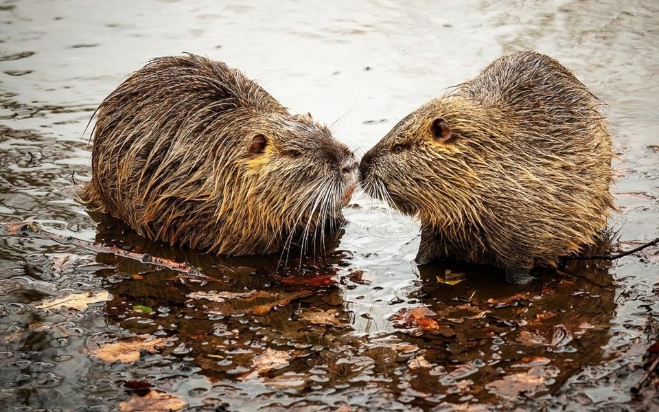

```{r setup, include=FALSE}
knitr::opts_chunk$set(echo = TRUE, cache=TRUE)
```


Welcome to the lab for the Autoregressive Time Series lecture! Below are three exercises to practice and think about things from the lecture. Feel free to start with whatever piques your interest most! (Though note that each question increases in difficulty.) For the submission on WebCampus, simply turn in a Word document with your answers to the questions below. You do not have to complete them all! Just turn in what you are able to get through during the lab period.

You can find the code [here](AR_Lab.R) if you don't want to copy and paste.

Please feel free to ask questions!

## Exercise 1 -- exploring ACF and PACF plots

Let's use the dataset on Lake Washington phytoplankton that we used during lecture.You may need to install the "MARSS" package if you have not yet done so.

```{r lake washington download, echo = T, eval = F}
library("MARSS")

# load the data from the "MARSS" package
data(lakeWAplankton, package = "MARSS")

# if you do not have the "MARSS" package installed, install it in your console:
# install.packages("MARSS")
```

We will subset part of the data as follows and then turn it into a time series object.
```{r lake washington ts object, echo = T, eval = F}
phyto <- lakeWAplanktonTrans #Give it a name to keep the original data structure in tact
phyto <- phyto[phyto[,"Year"] > 1975,] #Subset to years greater than 1975 (missing data in early years)

# Note that our data is monthly!
head(phyto)

#Turn into time series object
phyto.ts <- ts(phyto, start = c(1976,1), freq = 12)
```

Finally we can create an ACF and PACF plot with the time series as follows:
```{r lake washington acf and pacf, echo = T, eval = F}
#Plot the ACF
acf(phyto.ts[,"Cryptomonas"], na.action = na.pass, las = 1)
#Plot the PCF
pacf(phyto.ts[,"Cryptomonas"], na.action = na.pass, las = 1)
```

#### Questions
1. Look at the ACF plot. At what lags do we see autocorrelation in our data? What measurement of time does each lag step refer to in this plot?
2. Look at the PACF plot. At what lags do you see partial-autocorrelation? What might these lags be telling us about our data? Can you think of a biological explanation?

## Exercise 2 -- simple AR model



<br>
In lecture, we looked at the ACF for a beavers body temperature and found that there was autocorrelation. Build a simple linear regression AR model to model beaver body temperature based on previous temperature. You can also include in their activity, "activ", at the current time of measurement or prior time if you would like!

First, load the beaver dataset. It is built into R.
```{r beaver, echo = T, eval = F}
# load the data
data(beavers)
```

There are two beavers to choose from. Feel free to create ACF and PACF plots to inform how you make yoru model. Have fun and don't forget indexing!

#### Questions

1. Show a screenshot of your code to make the model.
2. What predictor variables did you decide to include? Did you create an AR(1) model, AR(2) model, or so on? Why?

## Exercise 3 -- AR model example in JAGS

For our jags example we will be working with an NDVI timeseries. You can find the data [here](portal_timeseries.csv).
<br>
For this exercise you will be writing an AR model into jags. We will provide most of the code, you will just have to write the likelihood! For now go ahead and write your likelihood following this model, if you have time and the desire you can totally play around with other models (but you will have to adapt priors yourself!). 

$$NDVI_{t} \sim Normal(\beta_0 + \beta_1NDVI_{t-1}+\beta_2Rain_{t-1}, \sigma)$$
To do this follow the code bellow, and alter the jags code in the `cat()` section. The rest of the model is specified with priors already! 

```{r jags, echo = T, eval = F}
#Exercise 3----

##Building Jags Model----

###Data Management and Exploration----

library(jagsUI)

data <-  read.csv('./Data/portal_timeseries.csv') #Read in the data, will need to edit to wherever you have it stored

head(data)

plot.ts(data$NDVI) #Plot the time series

#Plot AC plots, anything interesting? :)
acf(data$NDVI)
pacf(data$NDVI) 

#For secret (forecasting) reasons we're going to cut the last 10 observations out
oos <- data[-(1:(nrow(data)-10)),] #Take the last 100 rows of the data frame and save it as a new dataframe
data.training <- data[(1:(nrow(data)-10)),] #Take out the last 100 rows and the rest of the data is what we will use to make our model

###Build our jags model!----

filename <-  "NDVI_Model.txt"

cat("

model{

#Likelihood 

for(t in 2:time){ #Loop through the number of observations, we have to start at t=2 because at t=1 there is no t-1 data to pull from!
  ####*******WRITE YOUR LIKELIHOOD HERE*******####
}

#Priors
b0 ~ dnorm(0,0.1) #intercept term - dnorm uses mu and precision (1/var). So prec of 0.1 is a var of 10
b1 ~ dnorm(0,0.1) #slope term for previous month's NDVI
b2 ~ dnorm(0,0.1) #slope term for previous month's RAIN

sd ~ dnorm(0,0.1)T(0,) #We're truncating the prior to be positive

#Derived terms
perc <- pow(sd,-2) #compute precision from stdv. 1/var

}
",
file = filename)


###Package Data for Jags----

datalist <- list(time = nrow(data.training), NDVI = data.training$NDVI, rain = data.training$rain)

#Specify initial values
#   Each chain needs it's own initial value for the parameters 
#   So we'll create a function to generate initial values for us

inits <- function(){
  vals <- list(
    b0 = runif(1,-10,10),
    b1 = runif(1,-10,10), 
    b2 = runif(1,-10,10),
    sd = runif(1,1,10)
  )
  return(vals)
}

inits() #testing
datalist

#Specify what parameters we're interested in (what do we obtain a joint posterior dist for)
#   What are our free params
params <- c("b0", "b1", "b2","sd")

###Run jags----

nc <- 3 #number of chains
niter <- 10000 #Number of iterations, includes burnin
nb <- 2500 #burnin
thin <- 5 #thining 

#Inits should be function itself, not just one run of it
#N.adapt is the tuning parameter 
mod <- jags(data = datalist, inits = inits, parameters.to.save = params, 
            model.file = filename,
            n.chains = nc, n.adapt=1000, n.iter = niter, n.burnin=nb, n.thin=thin,
            parallel=F)

###Visualize posteriors and assess convergence----
mod #Summary of the model
plot(mod) #Plot trace plots and posterior distributions of our parameters

sims <-  mod$sims.list #Pull out each iteration parameter estimates

```

#### Questions:

1. Show a screenshot of your code for the likelihood
2. Did your model converge? How can you tell? 
3. Does there seem to be evidence of an effect of the AR term? Why or why not?

Now just for fun if you're feeling up to it, work through this code on how we would use the above model to forecast the last 10 datapoints we held out. 

```{r forecast, echo = T, eval = F}
#~~~~~~~~~~~~~~~~~~~~~~~~~~~~~~~~~~~~
#If you feel up to it, let's forecast
#~~~~~~~~~~~~~~~~~~~~~~~~~~~~~~~~~~~~


#We're going to try and see how well we can forecast those last 10 samples we kept out!

#Step 1: Rebuild the likelikehood

Predictions <- matrix(NA, length(sims$b0), nrow(oos)) #Create a blank matrix to store our predictions
dim(Predictions) # nrow = # of iterations, ncol = years we're making predictions for (withheld data)

#We have to keep parameter estimates together for each iteration so we need a double for loop

for(p in 1:length(sims$b0)){ #Loops through the number of iterations
  NDVI <- data$NDVI[1] #give it a value to start at
  for(t in 1:nrow(oos)){
    NDVI <- sims$b0[p]+sims$b1[p]*NDVI+sims$b2[p]*oos$rain[t] #Copy the process from what you did in the model
    Predictions[p,t] <- NDVI
  }
}

#Take some summary statistics from our predictions to plot
Mean <- apply(Predictions,2, mean)
UCI <- apply(Predictions,2,quantile, prob = .975)
LCI <- apply(Predictions,2,quantile, prob = .025)

#Now let's plot our forecast
par(mfrow = c(1,1))
plot(Mean, type = 'l', ylim = c(0.1,0.4))
lines(UCI, lty = 2, col = 'steelblue')
lines(LCI, lty = 2, col = 'steelblue')
points(oos$NDVI, col = 'red') #Actual data

#Then you can do calculate things like RMSE to get a number on how far our predictions are to the observed data
```

And now you've successfully made a forecast based on your AR(1) model! 

#### Bonus Question:

1. Think about why the error of our forecast might get bigger over the time we're predicting, why might this be?