```{r setup, include=FALSE}
knitr::opts_chunk$set(echo = TRUE)
```

Abundance and density of an animal population is integral to their conservation and management. These parameters can be difficult to estimate when individuals cannot be observed perfectly.

Spatially Explicit Capture-Recapture models "estimate the density and size of a spatially distributed animal population sampled with an array of detectors, such as traps, or by searching polygons or transects."

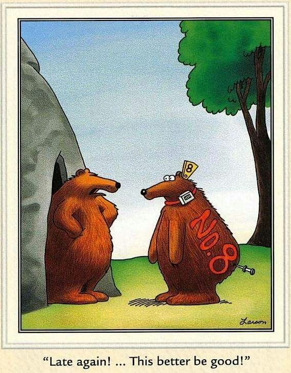

# Capture-Recapture (CR)

A century old technique that is the primary way for researchers and managers to estimate population size and demographic processes. CR uses individual-level detection data, in the form of presence and absence.

**Examples of CR:**

(video of ants!)

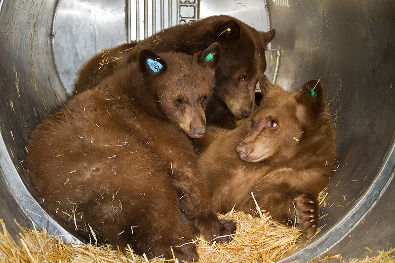

<p float="left">

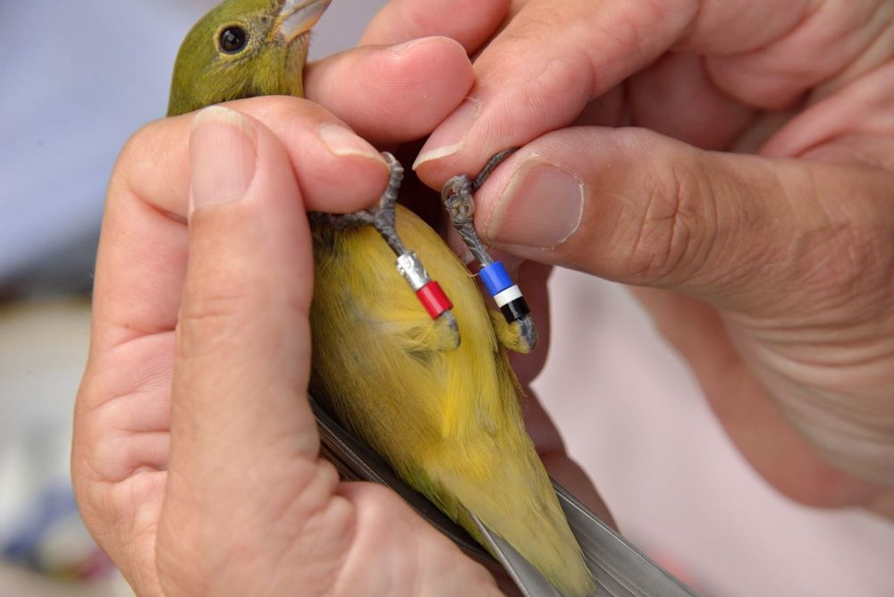 

</p>

**Population abundance estimate:**

The Lincoln-Peterson Method is used to estimate populations with 2 capture occasions. $$
\hat{N}=\frac{nK}{k}
$$ Where:

$\hat{N}$=population abundance estimate

$n$= animals marked on the first occasion

$K$= animals encountered on the second occasion

$k$= marked animals on the second occasion

**Survival and detection probability estimates:** 

Individual encounter events ($y_{ik}$) are Bernoulli trials

$$
y_{ik}\sim Bernoulli(p_{ik})
$$

-   Cormack-Jolly-Sebers (CJS) models are used to estimate survival and detection probabilities.

### Assumptions of Capture-Recapture:

1)  Each individual has an equal chance of being captured

2)  Marking does not influence an individual's chance of being recaptured

3)  Births and immigration do not occur between the marking and recapture efforts

4)  Marks are not lost between capture and recapture

### Capture-Recapture Inadequacies:

-   Does not admit the spatial structure of the ecological processes that give rise to the encounter history data, nor the spatial aspect of data collection

-   The parameter $N$ is unrelated to any notion of the sample area, resulting in arbitrary guesses as area

-   Does not provide information relating to movement, space usage, resource selection, etc.

-   Too simple!

-   Movement estimates are based off of the trapping grid

    -   Researchers have suggested that the grid should be four times that of an individual's home range in order to avoid positive bias of the estimates of density. This can be problematic with large mammals whose home ranges will become extremely large with the suggested grid size.

**What if we were trying to estimate the population of a sensitive species? Would this be acceptable?**


# Spatially Explicit Capture-Recapture (SCR or SECR)

A new "revolutionary" way to study animal populations. SECR overcomes the edge effects that occur in CR models. SECR allows us to define a point process and its state space, which allows an accurate density estimate, giving context to the population size.

**Examples of detectors:**

-   Live traps

    -   Sherman
    -   Pitfall
    -   Culvert
    -   Mist net

-   Sticky traps/snags that collect hair

-   Cameras

-   Scat sampling

-   Polygon or transect surveys

-   Acoustics

<p float="left">

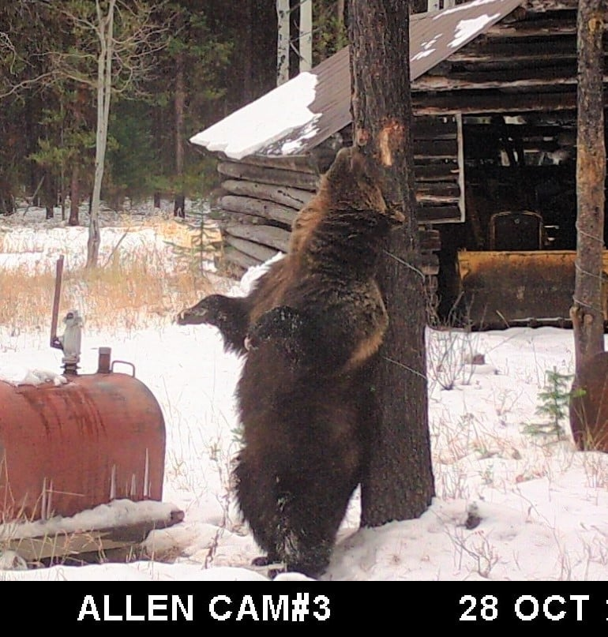 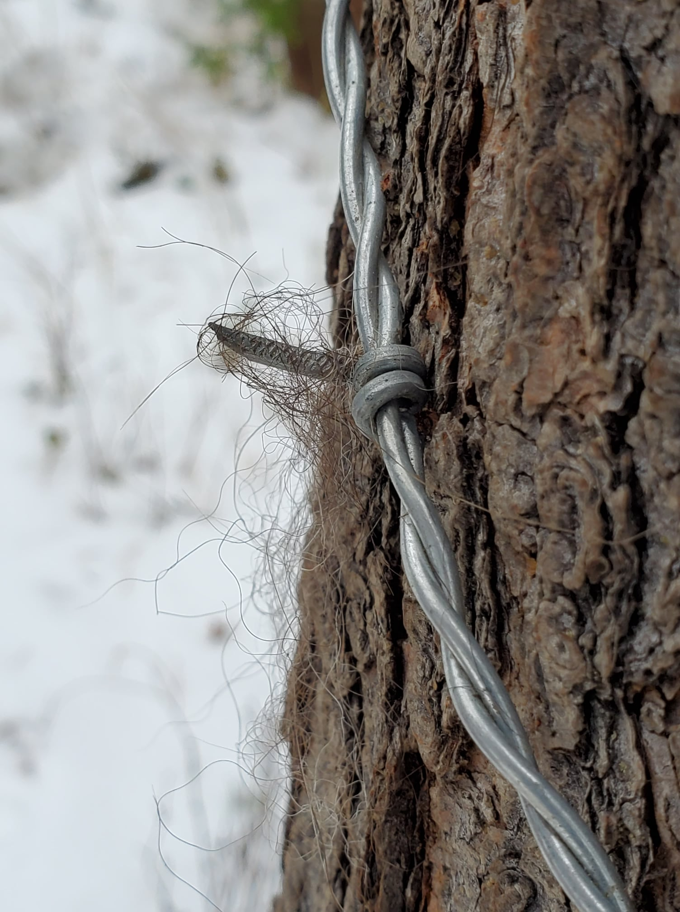

</p>

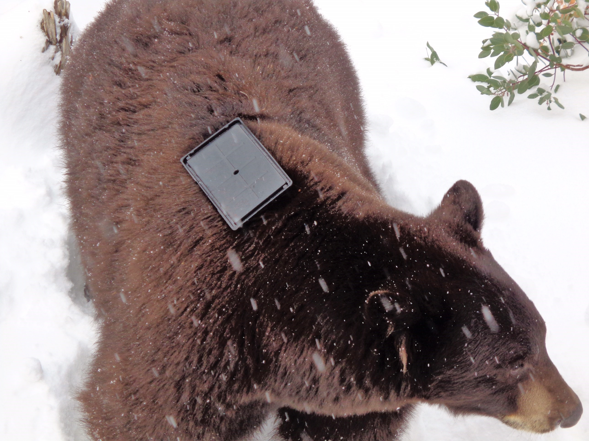

**Influence of trap type on detection**
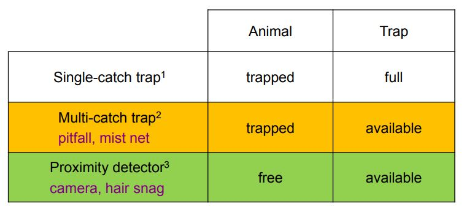

SECR models can be used anytime animal recaptures are recorded but using a grid design is the most common

<p float="left">

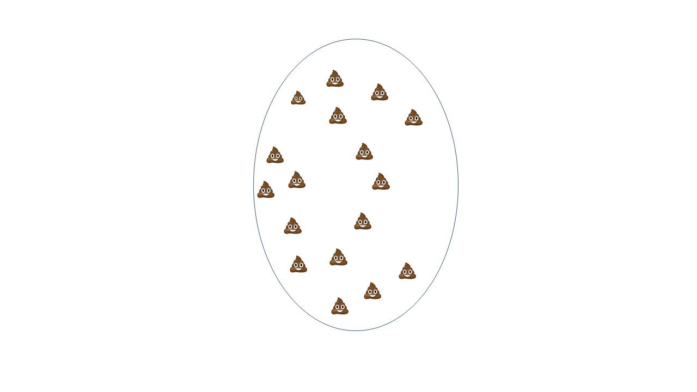 

</p>

### Assumptions of Spatial Capture-Recapture:

1)  Demographic closure: there is no recruitment or mortality in the sampled population

2)  Geographic closure: there is no emigration or immigration from the state-space. However, SECR allows for "temporary" movements around the state-space

3)  Activity centers are randomly disbursed

4)  Detection is a function of distance: the encounter probability declines as a function of distance from an individual's activity center

5)  Independence of encounters among individuals

6)  Independence of encounters of the same individual

## SECR Models:

SECR models are a combination of ***state*** and ***observation*** models

-   ***observation model***: spatially explicit model for encounter history data

      - Elements of SECR data collection:
      
         -   $i$ individuals

         -   $j$ traps

         -   $k$ occasions

-   ***state model***: spatially explicit model for the distribution of individuals ($s$:  activity centers!)

    - Point process: SECR requires us to describe the possible location of activity centers, $s$. Since these are unknown, we assign a prior distribution (typically uniform)

**Choosing a prior distribution for $s$:**

- **Homogenous point process (HPP):** activity centers are distributed independent of one another and uniformly in the plane

- **Inhomogenous point process (IPP):** local point density depends on habitat covariates

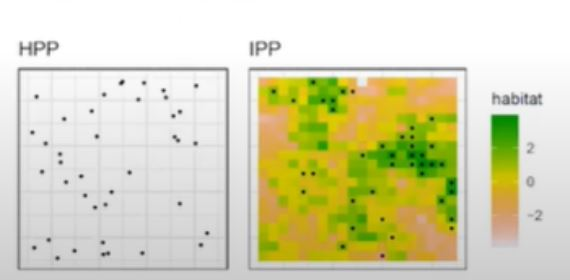

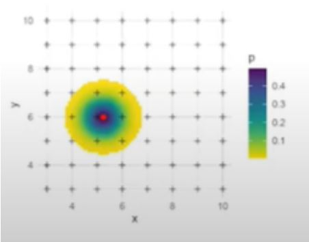 


<p float="left">
 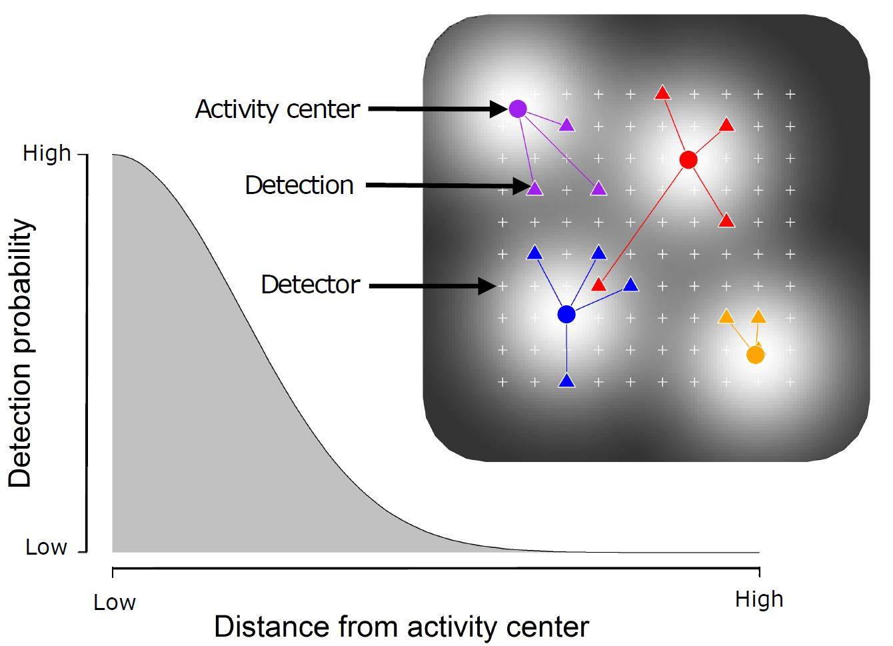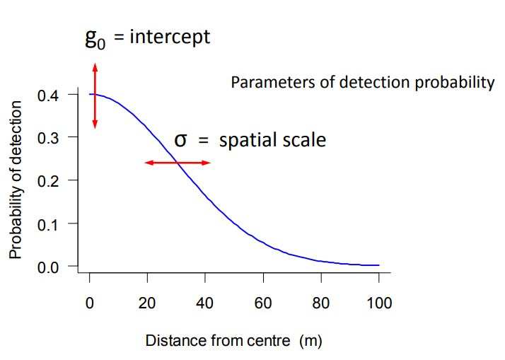
</p>


## **Basic SECR model:**

Capture probability is a function of the distance between the activity center, $s_{i}$ and the traps, $x_{j}$ $$
y_{ijk}|s_{i}\sim Bernoulli(p||x_{j}-s_{i}||)
$$

Activity centers are uniformly distributed (in the 2D plane) $$
s_{i}\sim Uniform(S)
$$

## Working with SECR data

A simple example!

Snowshoe hare capture by Burham and Cushwa:

-   Live trapping grid north of Fairbanks, AK in 1972

-   10 x 10 grid with traps placed 200 ft (61m) apart 

-   Traps were set for 9 consecutive days in early winter. They were baited after the 3rd day so this example dismisses the first 3 days 


```{r, message=FALSE}
library(secr)
```

Primary data:

1)  Encounter data, containing a record of which animals were encountered at which trap and on what occasion

2)  Trap deployment data, containing the spatial coordinates of each trap

```{r}
capture.history<-read.table("hareCH6capt.txt",col.names = c("Session","ID","Occasion","Detector"))
head(capture.history)
trap.data<-read.table("hareCH6trap.txt",col.names = c("Detector","x","y"))
head(trap.data) ##note that the x,y information is given in meter distances, do NOT use latitude/longitude
```

Create a capture history object to work with (*observation model*)

```{r}
hare.secr<-read.capthist("hareCH6capt.txt","hareCH6trap.txt",detector = "single")
```

Let's take a look at the object!

```{r}
summary(hare.secr)
```

```{r,echo=FALSE}
par(mar = c(1,1,3,1))
```

```{r}
plot(hare.secr, tracks = TRUE) 
```

We can look at a histogram of successive movements

```{r}
movements <- unlist(moves(hare.secr))
```

```{r, echo=FALSE}
par(mar = c(3.2,4,1,1), mgp = c(2.1,0.6,0))  
```

```{r}
hist(movements, breaks = seq(-61/2, 500,61), xlab = "Movement", main = "") #another illustration that majority of movements are within 100m

```

Next, secr can give us a quick and biased estimate of sigma, ignoring the issue of movements being truncated by the edge of the grid

```{r}
initialsigma <- RPSV(hare.secr, CC = TRUE)
cat("Quick and biased estimate of sigma =", initialsigma, "m\n") #our spatial scale parameter that determines how rapidly capture probability declines with distance AKA our state model 

```


Now we can fit a VERY simple SECR model!

```{r, warning=FALSE}
fit <- secr.fit (hare.secr, buffer = 4 * initialsigma, trace = FALSE) 
```
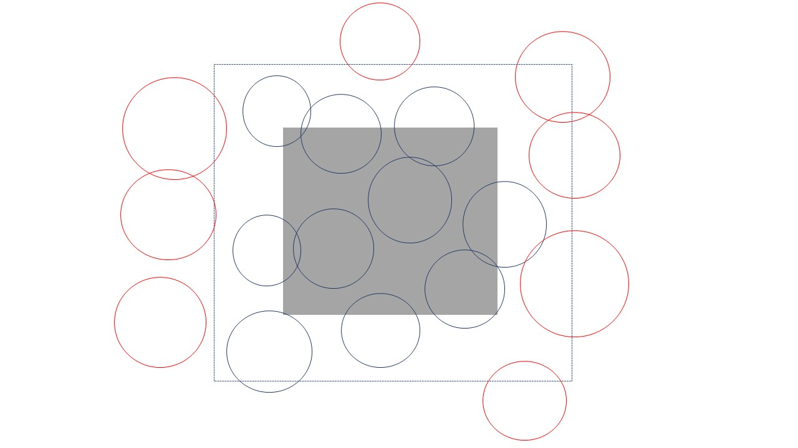

```{r}
esa.plot(fit)
abline(v = 4 * initialsigma, lty = 2, col = 'red')    
#The theory of SECR tells us that buffer width is not critical as long as it is wide enough that animals with activity centers close to the edge of the buffer have effectively zero chance of appearing in our sample. 

#We can check this with the function esa.plot and see that the estimated density has easily reached a plateau at the chosen buffer width (dashed red line)

```

```{r}
print(fit)

#The printed report gives us the following useful information:
#      function call and time stamp
#      summary of the data
#      model description (with log likelihood and AIC)
#      estimates of the coefficients
#      estimates of covariance matrix of coefficients
#      estimates of the real parameters

```

Estimated density is 1.47 hares per hectare, 95% CI between 1.14-1.89. The detection function is jointly determined by $g_{0}$, the intercept of the detection probability, and $\sigma$, the spatial scale.

```{r, echo=FALSE}
 par(mar = c(4,4,1,1)) 
```

```{r}
plot(fit, limits = TRUE) 

```


**Now we can add a detection function to the model!**

  - There are 20 detection functions included in the package, some are used only for acoustic data, some do not decline monotonically, etc.
  
  - Let's look at half-normal and negative exponential
  
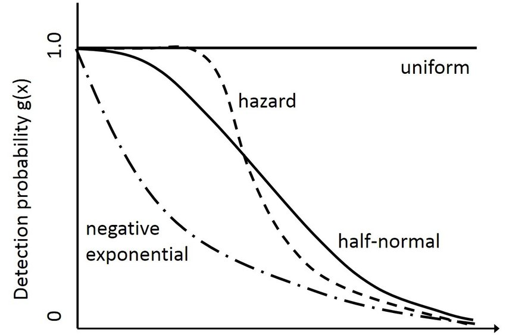

```{r, warning=FALSE}


fit.halfnormal <- secr.fit (hare.secr, buffer = 4 * initialsigma, detectfn = 'HN', trace = FALSE)
fit.negative.exponential <- secr.fit (hare.secr, buffer = 4 * initialsigma, detectfn = 'EX', trace = FALSE)
fits <- secrlist(HN = fit.halfnormal, EX = fit.negative.exponential)#compare the models
predict(fits)
AIC(fits)
```

**How can we make the model more accurately reflect our population?** There are "model" arguments within the secr.fit function to account for learned responses, spatial variation, group trends, etc:


## Another example, this time with horned lizards!

In this example we look at polygon and transect detectors

```{r, warning=FALSE}
library(gstat)
lizard<-hornedlizardCH
head(lizard)
par(mar=c(1,1,2,1))
plot(hornedlizardCH, tracks = TRUE, varycol = FALSE, lab1cap = TRUE, laboffset = 8,
     border = 10, title ='')

```

Fit and plot a basic model:

```{r, warning=FALSE}
FTHL.fit <- secr.fit(hornedlizardCH, buffer = 80, trace = FALSE)
predict(FTHL.fit)
plot(FTHL.fit, xv = 0:80, xlab = "Distance (m)", ylab = 'p', main="Probability of detection")
```

Cue data for animals with 1 occasion :

```{r}
datadir <- system.file("extdata", package = "secr")
examplefile1 <- paste0(datadir, '/polygonexample1.txt')
polyexample1 <- read.traps(file = examplefile1, detector = 'polygon')
polygonCH <- sim.capthist(polyexample1, popn = list(D = 1, buffer = 200),
                          detectfn = 'HHN', detectpar = list(lambda0 = 5, sigma = 50),
                          noccasions = 1, seed = 123)
par(mar = c(1,2,3,2))
plot(polygonCH, tracks = TRUE, varycol = FALSE, lab1cap = TRUE, laboffset = 15,
     title = paste("Simulated 'polygon' data", "D = 1, lambda0 = 5, sigma = 50"))

```

```{r}
#cuesim.fit <- secr.fit(polygonCH, buffer = 200, trace = FALSE) #Takes a long time to run! 
#predict(cuesim.fit)
```

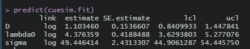

Convert the polygon data into raster representation

```{r}
discreteCH <- discretize (polygonCH, spacing = 20)
par(mar = c(1,2,3,2))
plot(discreteCH, varycol = FALSE, tracks = TRUE)

discrete.fit <- secr.fit(discreteCH, buffer = 200, detectfn = 'HHN', trace = FALSE)
predict(discrete.fit)
```

Polygon concavity:

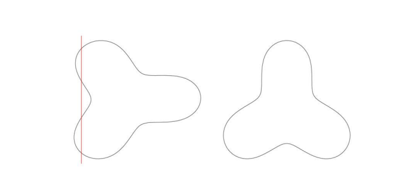

```{r}
examplefile2 <- paste0(datadir, '/polygonexample2.txt') #this txt file is within secr package
polyexample2 <- read.traps(file = examplefile2, detector = 'polygon')
par(mfrow = c(1,2), mar = c(2,1,1,1))
plot(polyexample2)
text(polyexample2$x, polyexample2$y, 1:nrow(polyexample2), cex = 0.7)
newpoly <- make.poly (list(p1 = polyexample2[11:23,],
                           p2 = polyexample2[c(1:11, 23:27),]))

plot(newpoly, label = TRUE)
```

**A taste of what is to come: our group project will be taking NDOW's 20+ year dataset of CR and (hopefully!) applying it to a SECR framework.**


Nevada's bear population is has a wide estimate (400-700 bears). Our CR model says 452 bears as of 2018 within a designated study area. We have 452 bears "in the study area" but beyond those boundaries there are more. So we may have up to 700 bears. Not a very confident-sounding statement for an animal that is highly politicized and the public is constantly asking for scientific data to back up management.

***References:***

*Efford, M.G. (2010). SECR: spatially explicit capture-recapture in R. Dunedin: Department of Zoology, University of Otago.*

*Efford, M.G. (2019). A tutorial on fitting spatially explicit capture-recapture models in secr. Dunedin: Department of Zoology, University of Otago.*

*Efford, M.G. (2021). Polygon and transect detectors in secr 4.4. Dunedin: Department of Zoology, University of Otago.*

*Otis, D.L, Burnham, K.P., White, G.C., and Anderson, D.R. (1978) Statistical inference from capture data on closed animal populations. Wildlife Monographs No. 62.*

*Royle, A.J. Andrew. et al. Spatial Capture-Recapture. Boston: Elsevier, 2013. Print.*

*Royle, A.J. (2016) Spatial Capture-Recapture Modeling.* <https://www.youtube.com/watch?v=4HKFimATq9E&t=1s>

*Royle, A.J. (2020) Introduction to Spatial Capture-Recapture.* <https://www.youtube.com/watch?v=yRRDi07FtPg>
