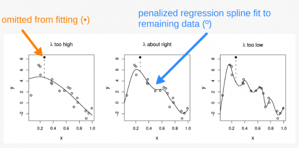
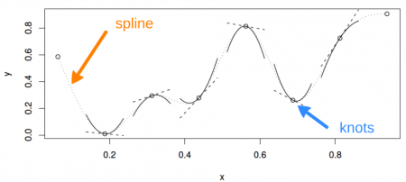

```{r setup, include=FALSE}
knitr::opts_chunk$set(echo = TRUE, cache=T)
```

[click here](GAM_Code_Demo_2025.R) for the R script to follow along        

[click here](ISIT.csv) for the data for this demo


## Introduction to the Code Demo
This code demo comes from the [Quebec Centre for Biodiversity Science](https://r.qcbs.ca/workshop08/book-en/index.html). The data can be downloaded [here](https://r.qcbs.ca/workshop08/pres-en/data/ISIT.csv).

```{r, results='hide', message=FALSE}
#install.packages("mgcv")

library(ggplot2)
library(mgcv)
```

Data comes from an ocean bioluminescence dataset. The dataset is
comprised of bioluminescence levels (Sources) in relation to depth,
seasons, and different stations.

```{r}
isit <- read.csv("ISIT.csv")
#focusing on Season 2 to start
isit2 <- subset(isit, Season == 2)
head(isit2)
```

Before we even look at what this data looks like, let's try to fit a
model to it based on some understanding of how bioluminesce may work. I
hypothesize that Bioluminescence (Sources) will change significantly
with Depth (SampleDepth) since more organisms would use bioluminesce in
deeper, darker water. We can try fitting a linear regression based on
this idea to start off with. Notice that we can do this with the "gam()"
function in "mgcv," and it will work the same way as if we were using
"lm()".

```{r}
linear_model <- gam(Sources ~ SampleDepth, data = isit2)
summary(linear_model)
```

We did it! We've created a model which has a high R-squared, and a
significant p-value! Okay we can stop here, right?

But wait, how does it look?

```{r}
data_plot <- ggplot(data = isit2, aes(y = Sources, x = SampleDepth)) +
    geom_point() + geom_line(aes(y = fitted(linear_model)), colour = "red",
    linewidth = 1.2) + theme_bw()
data_plot
```

\
We are violating the assumptions of the linear model:\

-   There is a strong non-linear relationship between Sources and
    SampleDepth.\
-   The error is not normally distributed.\
-   The variance of the error is not homoscedastic.\
-   The errors are not independent of each other.

So our data is "curvy" but our linear model is not.

# General Additive Models (GAMs)

## Why should we use a GAM?

There are ways that you could expand this linear model to fit a more
curvy dataset by using a polynomial regression. However, the fit of the
model would be explicitly determined by the modeler's decisions and
could become difficult to work with.

A big advantage of using an additive model like a GAM is that the
fitting method usually uses maximum likelihood to automatically
determine the optimal shape of the curved fit of non-linear responses
for us.

## What are GAMs?

GAMs are effectively a nonparametric form of regression where instead of
the linear function, 
$$
Y_i \sim B_0 + \beta_1x_i + \epsilon_i
$$ 
our function becomes, 

$$
Y_i \sim f(x_i) + \epsilon_i
$$ where y is locally predicted by a smooth function of the x variable.
Instead of having a fixed coefficient for our explanatory variables, the
smooth function is non-linear and local, allowing for the magnitude
(coefficient) of our explanatory variable to vary over its range,
depending on the relationship between the variable and the response.

## How is "curviness" controlled by mgcv?



The "curviness" of our function is controlled using a penalized
regression determined automatically in mgcv. The default method for this
in mgcv is generalized cross-validation (GCV). The GCV method creates a
"GCV score" which gets used for smoothness selection; the goal of which
is to minimize prediction error. However, this method can suffer from
"under-smoothing" and cause a fit that is too wiggly, or over-fit,
especially with small sample sizes.

## REML

We are using the Restricted Maximum Likelihood (REML) method instead in
our model. REML has been shown to be much more robust to
under-smoothing, providing less biased estimates of variance components.
Other methods are detailed in ?gam.

```{r}
?mgcv::gam
```

## The smooth term and splining

Additionally, the "basis" bs() argument has a number of options for how
the smooth function works which are detailed in the smooth.terms help
page in mgcv. The default for this argument is 'tp' for a thin plate
spline. The most commonly used options for this argument are 'tp', 'cr'
(cubic regression spline), and 'ps' (P-spline).



```{r}
?smooth.terms
```


### Now let's get back to our analysis of the bioluminescence dataset.

Let's fit it as a GAM to see how that affects the way our model fits.
The formula is really simple!

```{r}
gam_model <- gam(Sources ~ s(SampleDepth), bs = 'tp', method = "REML", data = isit2) #s() is the smooth term

```

Let's look at it on the graph and compare it to our linear model that we created, too.

```{r}
data_plot <- data_plot + geom_line(aes(y = fitted(gam_model)),
    colour = "blue", linewidth = 1.2)
data_plot
```

Our GAM model is now fitting the data much better than the linear model.

You can also plot it within the mgcv package

```{r}
plot(gam_model)
```

We can compare our linear model and our GAM with AIC and see that
there's a big difference.

```{r}
linear_model <- gam(Sources ~ SampleDepth, data = isit2)
smooth_model <- gam(Sources ~ s(SampleDepth), data = isit2)
AIC(linear_model, smooth_model)
```

## GAMs with multiple predictor terms

What if we want to use linear AND smoothed terms in our model?\
Let's look at our dataset again.

```{r}
head(isit)
```

Instead of subsetting by Season, lets treat Season as a factorial
covariate.

```{r}
isit$Season <- as.factor(isit$Season)
levels(isit$Season)
```

Now lets add Season to our previous gam model as a categorical variable
with two levels.

```{r}
basic_model <- gam(Sources ~ Season + s(SampleDepth), data = isit,
    method = "REML") # notice the s() for SampleDepth, but not for Season
basic_summary <- summary(basic_model)
```

Instead of showing the full summary, I'll simplify things by showing the
linear effects and smooth effects separately. Here is the linear effects table.

```{r}
basic_summary$p.table
```

And here is the smooth effects table.

```{r}
basic_summary$s.table
```

The most important thing to look at in this table is the EDF or Effective Degrees of Freedom. This is essentially an indicator of how non-linear the relationship is between the smooth term and the dependent variable. Additionally, the p-value is an indicator of whether the parameter has a "true effect" on the model by testing the null hypothesis that the smooth term is equal to zero, or not contributing. However, the p-value is an estimate, and can be biased if you don't use the "REML" method because it is directly affected by both the smoothing parameter (lambda) and the basis dimension (kappa).\
- an EDF of ~1 means that the relationship is effectively linear.\
- a larger EDF means that the relationship is more "curvy" or non-linear.\
- a significant p-value means that the parameter is significantly contributing to the model.


## GAM with multiple linear and smoothed terms

We can add a second linear term

```{r}
two_term_model <- gam(Sources ~ Season + s(SampleDepth) + RelativeDepth,
    data = isit, method = "REML")
two_term_summary <- summary(two_term_model)
```

Notice that now we have added another term to the p.table by adding a
linear covariate.

```{r}
two_term_summary$p.table
```

```{r}
two_term_summary$s.table
```

```{r}
par(mfrow = c(2, 2))
plot(two_term_model, all.terms = TRUE)
```

## GAM with Multiple Smooth Terms

```{r}
two_smooth_model <- gam(Sources ~ Season + s(SampleDepth) + s(RelativeDepth),
    data = isit, method = "REML")
two_smooth_summary <- summary(two_smooth_model)
```

```{r}
two_smooth_summary$p.table
```

Now we've added another term to the s table.

```{r}
two_smooth_summary$s.table
```

```{r}
par(mfrow = c(2, 2))
plot(two_smooth_model, page = 1, all.terms = TRUE)
```

```{r}
AIC(basic_model, two_term_model, two_smooth_model)
```

## Exercise

Add one more smooth and one more linear predictor to the model. Interpret the results using the p.table and s.table.

## GAM with interaction terms

We can have interactions between two smooth variables or between a
smoothed variable and a linear variable.

### Interaction between a smoothed variable and a factor variable

First, we'll create a model with an interaction between one smooth and
one non-smooth factor variable to see if the effect of Sample Depth
varies by season. We'll use the syntax `s(x1, by= x2)`.

```{r}
factor_interact <- gam(Sources ~ Season + s(SampleDepth, by = Season), data = isit, method = "REML")

summary(factor_interact)$s.table
```

```{r}
par(mfrow = c(1, 2))
plot(factor_interact)
```

\
First chart shows effect of sample depth in season 1, second chart shows
effect of sample depth in season 2. There's an increase in
bioluminescence between 1000 and 2000 feet in season 2, but not in
season 1.

We can also visualize the interaction in 3D using `vis.gam()`

```{r, message=FALSE}
vis.gam(factor_interact, theta = 120, n.grid = 50, lwd = 0.4)
```

### Interaction between two smoothed variables

Now, we can include an interaction between two smoothed terms using the
syntax `s(x1, x2)`.

```{r}
smooth_interact <- gam(Sources ~ Season + s(SampleDepth, RelativeDepth),
    data = isit, method = "REML")
summary(smooth_interact)$s.table
```

It's harder to visualize these interactions. When we plot it, we get a
gradient between the two continuous smooth functions.

```{r}
plot(smooth_interact, page = 1, scheme = 2)
```

This is easier to see in 3D:

```{r, message=FALSE}
vis.gam(smooth_interact, view = c("SampleDepth", "RelativeDepth"),
    theta = 50, n.grid = 50, lwd = 0.4)
```

We can see that bioluminescenese increases more sharply with sample
depth at higher relative depths than at lower ones.

Once again, we can compare our models with AIC.

```{r}
AIC(two_smooth_model, factor_interact, smooth_interact)
```

## Model Validation

Even though GAMs are able to fit non-linear relationships, we still need
to check other assumptions of linear models, like normality of residuals
and homoscedasticity. 

Let's look at our smooth interaction model again.

```{r}
smooth_interact <- gam(Sources ~ Season + s(SampleDepth, RelativeDepth),
    data = isit, method = "REML")

summary(smooth_interact)$s.table
```

As a reminder, EDF is the effective degrees of freedom in the model, a measure of the amount of wiggliness. The maximum degrees of freedom is set using the *k* term, which we can manually adjust. A larger *k* allows for more wiggliness. 

Here are three versions of our basic SampleDepth model with three
different values for *k*.

```{r}
par(mfrow=c(1, 3))
plot(gam(Sources ~ s(SampleDepth, k=4), bs = 'tp', method = "REML", data = isit2))
title(main="k=4")
plot(gam(Sources ~ s(SampleDepth, k=6), bs = 'tp', method = "REML", data = isit2))
title(main="k=6")
plot(gam(Sources ~ s(SampleDepth, k=10), bs = 'tp', method = "REML", data = isit2))
title(main="k=10")
```

## K Check

`mgcv` has a built in function for testing if the model was using the
correct *k* value.

```{r}
k.check(smooth_interact)
```

This table includes four columns: *k*, the EDF, the k-index, and the p-value. The k-index is a ratio of residual error that should be greater than 1. The p value is for the test, not the model term, and we want it to be high. We also want the k to be a good amount higher than the EDF so that we are not overly restricting the model. Here, the EDF is very close to *k*, the k-index is less than 1, and the p value is under 0.05. All of these measures indicate that the *k* is too low in the model.

The usual practice to respond to an improper *k* is to double it and refit the model.

We can refit the model with a *k* of 60 and then do the `k.check` again.

```{r}
smooth_interact_k60 <- gam(Sources ~ Season + s(SampleDepth,
    RelativeDepth, k = 60), data = isit, method = "REML")
k.check(smooth_interact_k60)
```

Now the EDF is much smaller than *k*, which means we aren't overly
constraining its wiggliness. We also now have a k-index greater than 1 and a high p-value.

## Normal Residuals Check

The next test we should perform on our model is whether it actually
follows a normal distribution. (Kevin probably would have done this at
the beginning, but this is the order from the code demo we found.)

We can use `gam.check()` to plot our residuals.

```{r}
par(mfrow = c(2, 2))
gam.check(smooth_interact_k60)
```

`gam.check()` also gives us the k test output and tells us how to
interpret it!

We can see from our residuals plots that the variance is heteroscedastic
and that we have some strong outliers. We can address this by
incorporating non-normal distributions into our model.

We so far have been creating Gaussian additive
models, which are the simplest form. But we can generalize them for
other distributions, just like with GLMs.

We need a probability function which allows the variance to increase with the mean. So gaussian distribution is probably no longer what we are looking for. We can search the help documentation for other distribution families utilizing the following line of code:

```{r}
'?'(family.mgcv)
```


# Challenge:
Using the help documentation that we've provided above, and the code below, we want you to recreate our smooth model with a Tweedie distribution that allows variance to increase with the mean. Notice the default family is specified by *family=gaussian()*. We want you to change this part of the model to the Tweedie family and use the *link =* argument within the Tweedie family to test different "links" for this family and find one that you like for fitting our data. Separately, change the k to 100. Interpret the summary table, then do a k-check and a gam.check on the new model and interpret the results. Are we now meeting the assumptions set by our model?


```{r}
smooth_interact_k100 <- gam(Sources ~ Season + s(SampleDepth, RelativeDepth, k = 60), family=gaussian(), data = isit, method = "REML")
summary(smooth_interact_k100)
```

