```{r setup, include=FALSE}
knitr::opts_chunk$set(echo = TRUE, cache=T)
```

[click here](GaussianProcessLabDemo.R) for the R code.

# Read Me :)

Information and introductory figures were acquired from:
https://distill.pub/2019/visual-exploration-gaussian-processes/
Highly recommend reading over this guide and play around with interactive figures. 

# What is Gaussian Process?

A Gaussian Process (GP) is a probabilistic machine learning method that uses prior knowledge to make predictions and quantify uncertainty. A linear model in a Bayesian framework will create a posterior distribution across the set of infinite possible linear functions, while the GP will fit an infinite number of differing non-linear functions (flexible). GP models an unknown function that best fits a set of data points (regression), not as a single fixed line, but as a distribution over infinitely many possible functions that could explain the data. The GP assigns a probability to each potential function, and the mean of this distribution represents the most probable function. This approach not only provides a prediction but also a confidence measure for each estimate. 

<center>

**Gaussian Process No Points**  

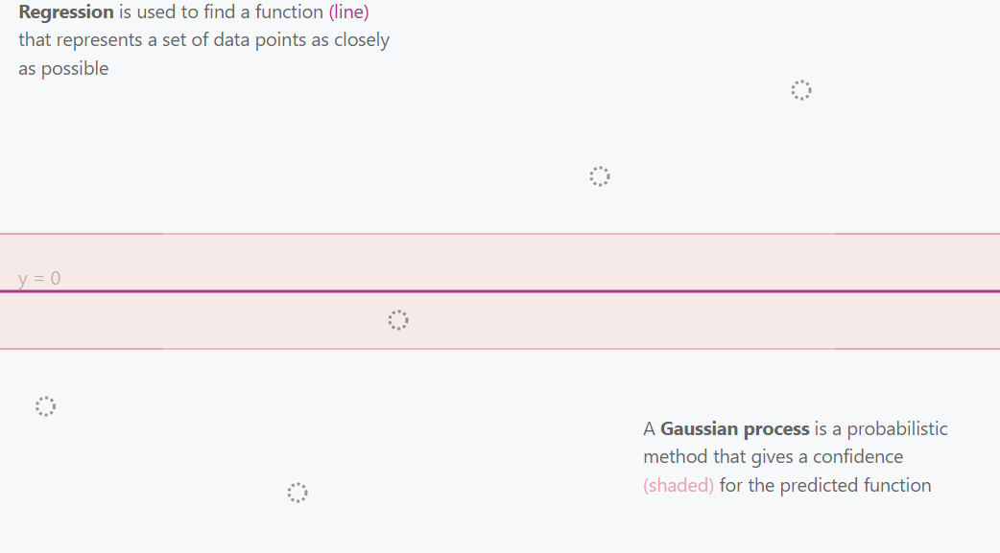{width=50%}

</center>

<br><br>

<center>

**Gaussian Process 2 Points**

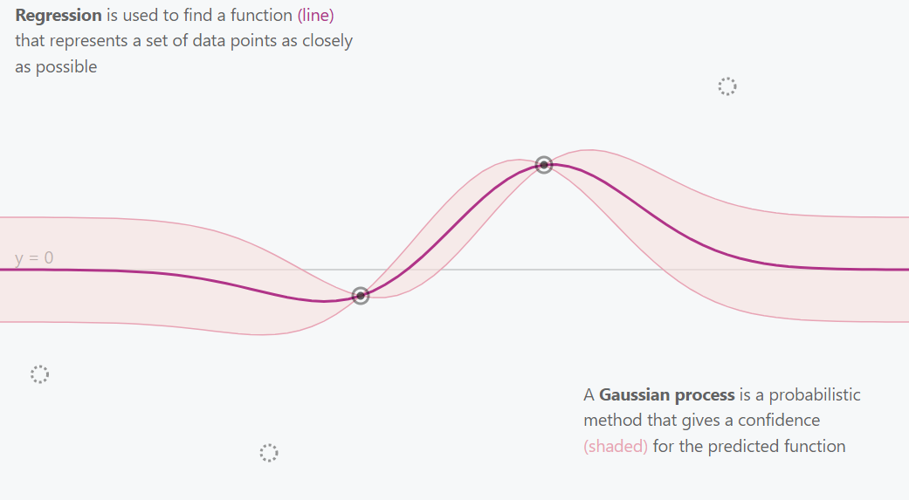{width=50%}

</center>

<br><br>

<center>

**Gaussian Process 3 Points**

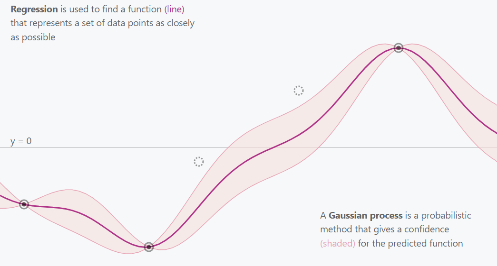{width=50%}

</center>

<br><br>

<center>

**Gaussian Process All Points**

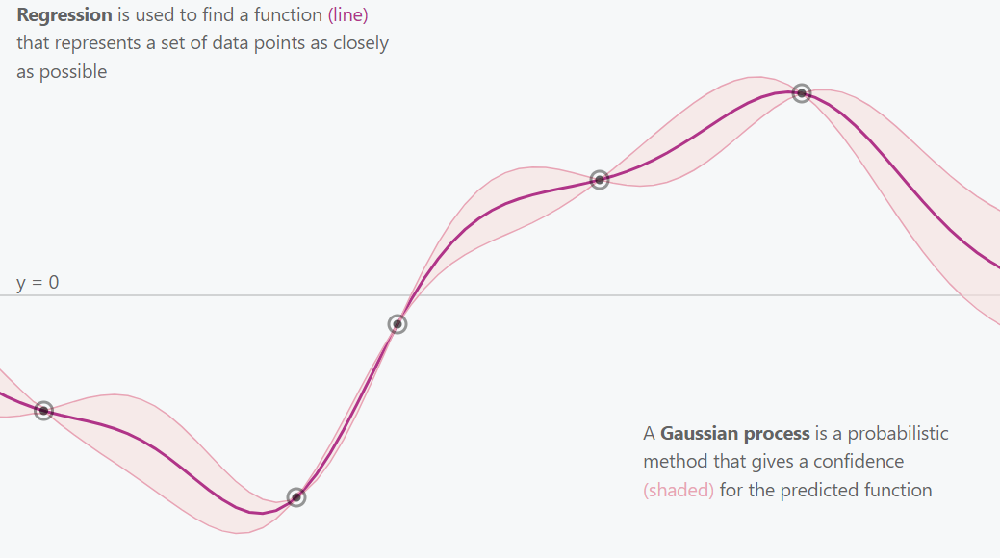{width=50%}

</center>

This is essentially what a Gaussian Process does. It explores and estimates the best fitting function for the provided data (points) while incorporating uncertainty (confidence intervals). 

# How does the Gaussian Proceess (GP) work?

The Gaussian distribution (often referred to as the normal distribution) is the basic building block of Gaussian processes. At its simplest, the Gaussian distribution describes a single random variable using a mean (μ) and a variance (σ²). A multivariate Gaussian distribution generalizes this idea to multiple random variables, each of which is normally distributed, and together they have a joint Gaussian distribution. This distribution is fully described by:

- A mean vector (μ) - gives the expected value for each variable (or point in the function).

- A covariance matrix (Σ) — defines how the variables vary together.

<center>

**Random Variables Following a Gaussian Distribution Equation**

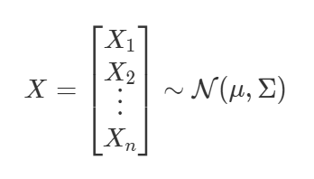{width=30%}

</center>

The equation for having each random variables follow a Gaussian distribution. We say X follows a normal distribution. μ describes the mean of the distribution. The covariance matrix Σ describes the shape of the distribution.

Below are some examples of how the covariance matrix looks and how the values change with differing levels of covariance and variance. The variances for each random variable are on the diagonal of the covariance matrix (var), while the other values show the covariance between them (cov). 

<center>

**Covariance Matrix Math and Position**

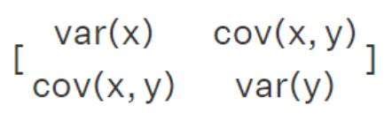{width=23%}

</center>

<br><br>

<center>

**Covariance Matrix No Correlation with Little Variance**

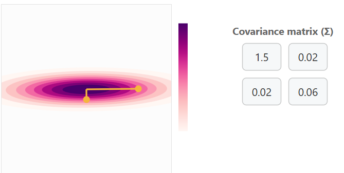{width=50%}

</center>

<br><br>

You can think of this as a point cloud for two variables along a y and x axis. The yellow points with bars are handles for adjusting the covariance matrix. 

<br><br>

<center>

**Covariance Matrix with Positive Correlation with some variance**

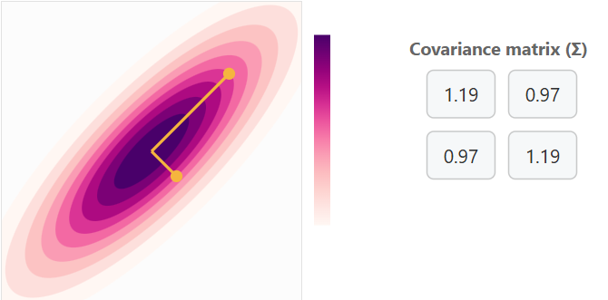{width=50%}

</center>

<br><br>

<center>

**Covariance Matrix with Positive Correlation with a lot of variance**

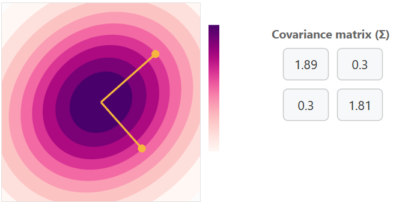{width=50%}

</center>

<br><br>

<center>

**Covariance Matrix with Negative Correlation with some variance**

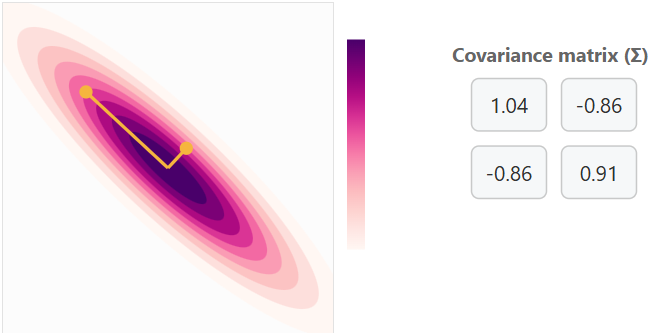{width=50%}

</center>

<br><br>

Increasing variance for x will cause horizontal expansion while increasing variance for y will cause vertical expansion. The correlation between x and y is what determines the trend of the data cloud (covariance matrix). No correlation will result in no trend (circle) or a trend in a single axis (horizontal/vertical flat line). 

# Marginalization and conditioning

Marginalization and conditioning are two fundamental operations that make Gaussian Processes (GPs) both mathematically elegant and practically powerful.

- **Marginalization** allows us to focus on a subset of variables from a multivariate Gaussian distribution by integrating out the others. In simple terms, we can ignore parts of the distribution that aren’t of current interest while still preserving a valid Gaussian form.

- **Conditioning**, on the other hand, lets us update our understanding of one variable given information about another. After observing the normal distribution of the marginalized data we can update our understanding for the next set of marginalized data.

In the context of Gaussian Processes, conditioning (training) is what enables learning: once we observe data points, the GP conditions on these observations to update its mean and covariance functions, yielding predictions for new points along with their associated uncertainty.

# Kernels

To define a Gaussian Process (GP), we must specify its mean function μ and covariance function Σ. In most GP applications, we assume μ=0 for simplicity.

The more interesting component is the covariance matrix Σ, which determines the shape and smoothness of the functions drawn from the GP. This matrix is constructed by evaluating a kernel function (also called the covariance function) on every pair of input points. The kernel measures the similarity between points and its entries describe how strongly the corresponding function values are correlated. The choice of kernel therefore defines the class of functions the GP can represent.

Common kernels include:

- **Radial Basis Function (RBF):** produces a smooth stationary spline function.

<center>

**RBF Kernel Visual**

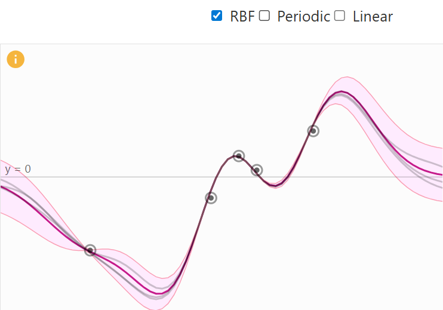{width=50%}

</center>

- **Periodic Kernel:** generating repeating patterns with period p.

<center>

**Periodic Kernel Visual**

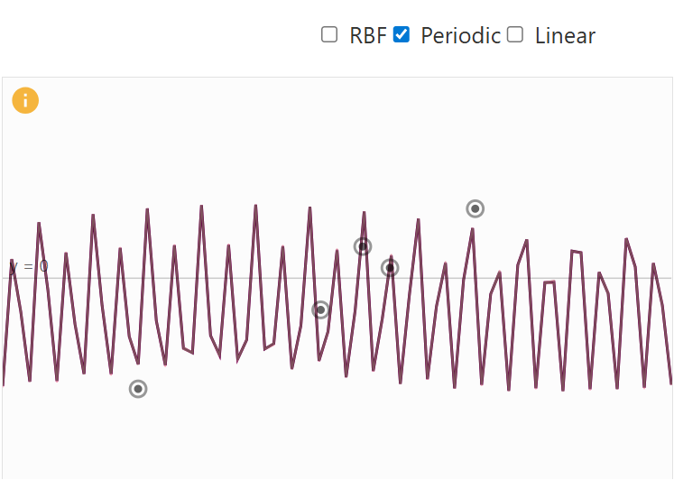{width=50%}

</center>

- **Linear Kernel:** allowing functions with global linear trends.

<center>

**Linear Kernel Visual**

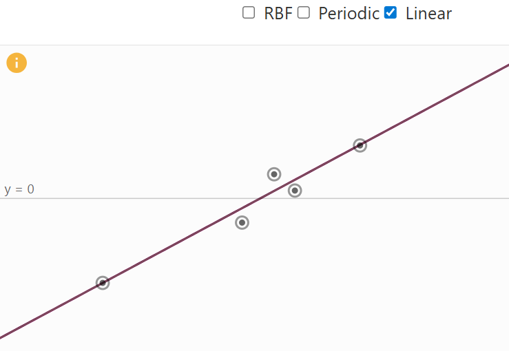{width=50%}

</center>

A big benefit that kernels provide is that they can be combined together, resulting in a more specialized kernel. The decision which kernel to use is highly dependent on prior knowledge about the data, e.g. if certain characteristics are expected. Examples for this would be stationary nature, or global trends and patterns. For example, if we add a periodic and a linear kernel, the global trend of the linear kernel is incorporated into the combined kernel. The result is a periodic function that follows a linear trend (see figure below). 

<center>

**Linear + Periodic Kernel Visual**

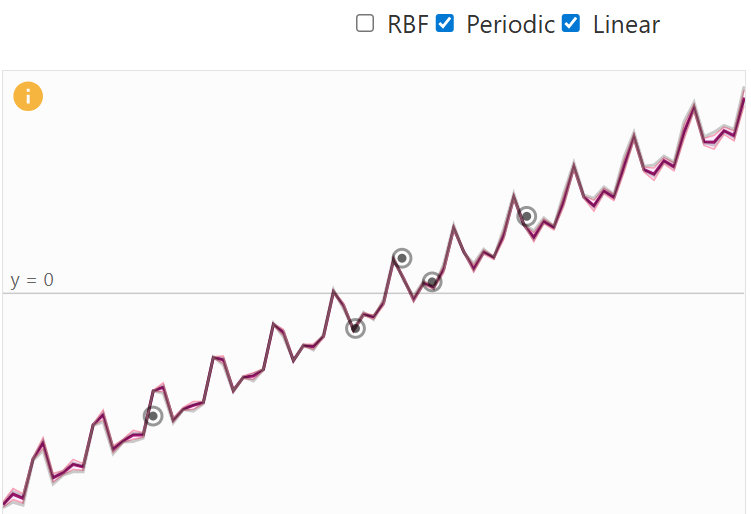{width=50%}

</center>

# Prior Distribution

When no data have yet been observed, the GP defines a prior distribution over functions — a collection of possible smooth curves drawn according to the chosen kernel. Each kernel has a set of parameters to place priors on. For example the RBF kernel has a variance (deviation from mean) and length scale parameter (how correlation changes with distance between points). Choosing an appropriate kernel with associated priors is important and should considered carefully.

**RBF kernel with low length scale prior**

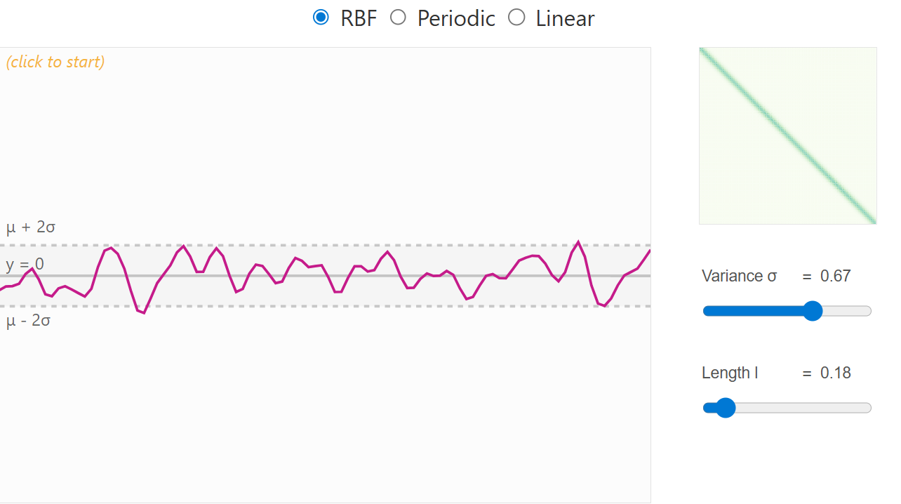{width=50%}

</center>

<br><br>

**RBF kernel with high length scale prior**

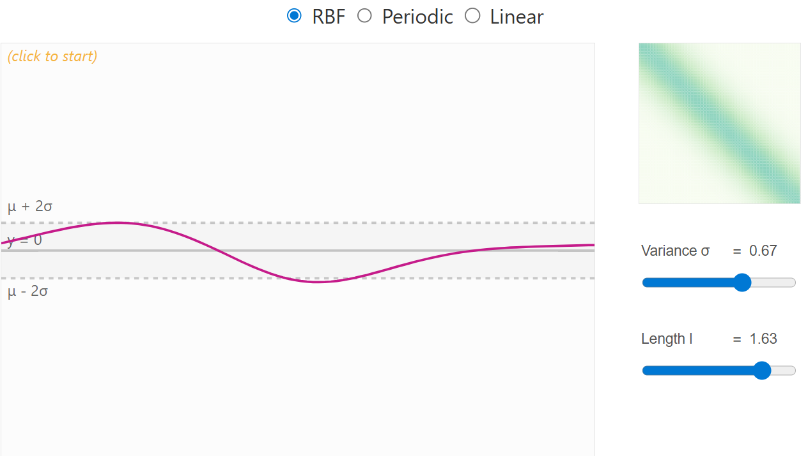{width=50%}

</center>

<br><br>

# Posterior Distribution

Once we observe training data, the Gaussian Process updates its beliefs about what the underlying function might look like. This updated belief is called the posterior distribution. It represents our new understanding of the function after taking the observed data into account. To produce this it follows these steps:

1. We first **combine** the training points (the data we’ve seen) and the test points (the places where we want predictions) into one joint distribution. 

2. The next step is to update our understanding by **conditioning** on the newly added points.

3. Add an **error** term for each of the points to allow more flexible and realistic outcomes.

By performing these steps in an iterative process produces the posterior distribution which we can use to make predictions. From this distribution, we can extract two important things for each test point: the mean and variance. Together, these give us both a prediction and a measure of confidence. 

# Benefits of Gaussian Process

1. **Non-parametric Flexibility**  
   - *GPs model functions, not parameters:* Unlike linear or polynomial regression, which assumes a specific functional form, GPs define a distribution over functions.  
   - *Benefit:* They can naturally adapt to complex, non-linear relationships in the data without pre-specifying a fixed model.

2. **Quantified Uncertainty**  
   - *Predictive distributions:* For any input, a GP gives a mean prediction and a variance (uncertainty). 
   - *Benefit:* This allows you to know not only what the model predicts but also how confident it is. 

3. **Bayesian Framework**  
   - *GPs are fully Bayesian:* You can incorporate prior knowledge about the function via the mean function or the kernel.  
   - *Benefit:* They naturally update beliefs as more data are observed, giving principled uncertainty estimates.

4. **Kernel (Covariance) Flexibility**  
   - *Covariance function choice:* You can encode smoothness, periodicity, trends, or other assumptions via the kernel
   - *Benefit:* GPs can model a wide range of behaviors just by changing kernels or combining them.

5. **Small Data Efficiency**  
   - *Works well with limited data:* Unlike deep learning, which needs huge datasets, GPs can produce accurate predictions with relatively small data sets.  
   - *Benefit:* Ideal when data collection is expensive or limited.

6. **Interpretable Predictions**  
   - *Smooth functions with uncertainty:* The predictions are smooth and come with credible intervals.  
   - *Benefit:* This is easier to interpret than black-box models like deep neural networks.

7. **Automatic Complexity Control**  
   - *Occam’s Razor built-in:* The marginal likelihood automatically balances model fit and complexity.  
   - *Benefit:* GPs avoid overfitting more naturally than many flexible parametric models.

# Packages
```{r 1}
library(rstan)
library(cmdstanr)
library(posterior)
library(bayesplot)
library(ggplot2)
library(loo)
library(latex2exp)
library(brms)
```

# Load in the data
```{r 2}
# GP data
GP_data <- read.csv("GP_data.csv")
names(GP_data) <- c("x", "year", "births", "UE.rate", "MH.income")
```

# Visualize the data
```{r 3}
# Visualize the births per year
mean_births <- mean(GP_data$births)
plot(
  GP_data$year,
  GP_data$births,
  type = "b",
  pch = 16,
  col = "blue",
  lwd = 2,
  xlab = "Year",
  ylab = "Total Births",
  main = "Total Births per Year with Mean Line"
)
abline(
  h = mean_births,
  col = "red",
  lwd = 2,
  lty = 2
)
legend(
  "topleft",
  legend = c("Total births", "Mean births"),
  col = c("blue", "red"),
  lwd = c(2, 2),
  lty = c(1, 2),
  pch = c(16, NA),
  bty = "n"
)
# Visualize UN rates
mean_UN <- mean(GP_data$UE.rate)
plot(
  GP_data$year,
  GP_data$UE.rate,
  type = "b",
  pch = 16,
  col = "blue",
  lwd = 2,
  xlab = "Year",
  ylab = "Average UN rate",
  main = "Average Unemployment Rates per Year"
)
abline(
  h = mean_UN,
  col = "red",
  lwd = 2,
  lty = 2
)
legend(
  "topleft",
  legend = c("Average UN rates", "Mean UN rate"),
  col = c("blue", "red"),
  lwd = c(2, 2),
  lty = c(1, 2),
  pch = c(16, NA),
  bty = "n"
)
# Visualize Median Household income
mean_MH <- mean(GP_data$MH.income)
plot(
  GP_data$year,
  GP_data$MH.income,
  type = "b",
  pch = 16,
  col = "blue",
  lwd = 2,
  xlab = "Year",
  ylab = "Median Household Income",
  main = "Median Household Income per Year"
)
abline(
  h = mean_MH,
  col = "red",
  lwd = 2,
  lty = 2
)
legend(
  "topleft",
  legend = c("Median Household Income", "Mean MH"),
  col = c("blue", "red"),
  lwd = c(2, 2),
  lty = c(1, 2),
  pch = c(16, NA),
  bty = "n"
)
```

# Fit GP model
```{r 4}
#### Prepare data for models ####
# Ensure numeric columns
GP_data$year <- as.numeric(GP_data$year)
GP_data$births <- as.numeric(GP_data$births)
GP_data$UE.rate <- as.numeric(GP_data$UE.rate)
GP_data$MH.income <- as.numeric(GP_data$MH.income)
# Scale births for numeric stability
GP_data$births_scaled <- as.numeric(scale(GP_data$births))
GP_data$year_scaled <- as.numeric(scale(GP_data$year))
GP_data$UE_scaled <- as.numeric(scale(GP_data$UE.rate))
GP_data$MH_scaled <- as.numeric(scale(GP_data$MH.income))
                             
   
#### Check for colinearity ####
corDF <- data.frame(UE_rate = GP_data$UE.rate, MH_income = GP_data$MH.income, Year = GP_data$year)
cor(corDF)


#### Set priors for model ####
# See what brms would give
get_prior(births_scaled ~ gp(year_scaled + MH_scaled),
          data = GP_data, family = gaussian())
# How to set your own priors
priors <- c(
  prior(normal(0, 5), class = "sdgp"),       # marginal SD of GP
  prior(exponential(1), class = "lscale"),   # length-scale
  prior(exponential(1), class = "sigma"),
  prior(normal(0, 10), class = "Intercept")
)


#### Specify the different models
# Gaussian Process Model
GP_model <- brm(
  births_scaled ~ gp(year_scaled, MH_scaled), #cov = exp_quad,
  data = GP_data,
  family = gaussian(),
  #prior = priors,
  chains = 4,
  cores = 4,
  iter = 2000
)
# Bayesian GLM model
BRMS_glm <- brm(
  births_scaled ~ year_scaled + MH_scaled,
  data = GP_data,
  family = gaussian(),
  chains = 4,
  cores = 4,
  iter = 2000
)
# GAM with splines
BRMS_gam <- brm(
  births_scaled ~ s(year_scaled) + s(MH_scaled),
  data = GP_data,
  family = gaussian(),
  chains = 4,
  cores = 4,
  iter = 2000
)


#### Loo Model Comparison ####
# Get loo scores
loo_gp  <- loo(GP_model)
loo_glm <- loo(BRMS_glm)
loo_gam <- loo(BRMS_gam)
# Loo table
print(loo_compare(loo_gp, loo_glm, loo_gam))


#### Model summaries ####
summary(GP_model)
summary(BRMS_glm)
summary(BRMS_gam)
```

# GP model evaluation
```{r, 5}
#### Trace plots ####
plot(GP_model)
mcmc_plot(GP_model, type = "trace")


#### Posterior draws ####
pp_check(GP_model, ndraws = 50)


#### Prior predictive check ####
# Fit prior predictive model
prior_mod <- brm(
  births_scaled ~ gp(year_scaled, MH_scaled),
  data = GP_data,
  family = gaussian(),
  prior = priors,
  sample_prior = "only",
  chains = 4,
  iter = 2000
)
# Prior predictive check
pp_check(prior_mod)


#### Coefficient effect plots and model fit plot ####
conditional_effects(GP_model)
conditional_effects(BRMS_glm)
conditional_effects(BRMS_gam)


#### Get and look at stan code ####
GP_stan <- stancode(GP_model)
GP_stan
# Write out file
#write_stan_file(GP_stan, basename = "GP_stan.stan")
```

# Lab Exercise

Try creating some different Gaussian Process models with differing predictors and kernel in BRMS. Valid kernels in this package are: 'exp_quad', 'matern52', 'matern32', 'exponential'. Feel free to try your own priors or allow the default ones. How does changing the kernel impact the model and why does it have an impact? Is there a difference in the number of parameters you need to put priors on with the change in kernel for the GP models. After creating a couple different GP models, which one performs the best (loo score, diagnostics, etc)? 

