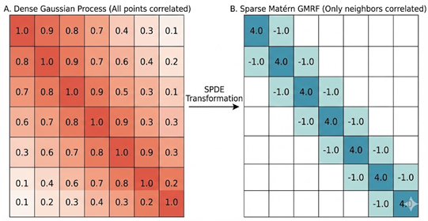
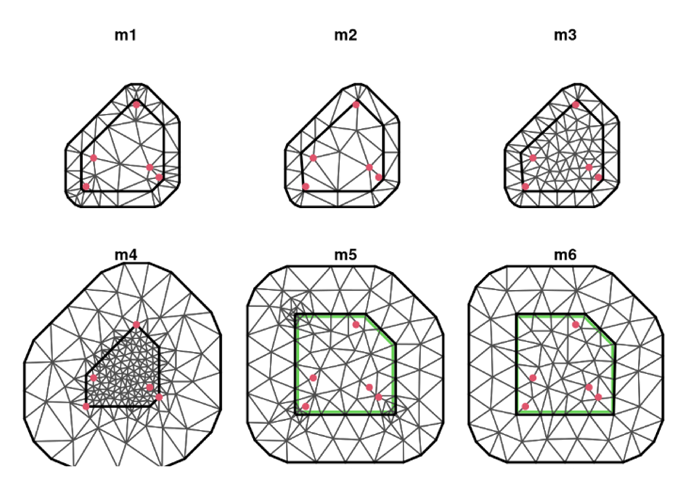

```{r setup, include=FALSE}
knitr::opts_chunk$set(echo = TRUE, warning = FALSE, message = FALSE)
```


[Click here for code](INLA_demo.R)

## Introduction

First things first, let's download R-INLA (this takes awhile) using the code below, or by visiting the R-INLA download site: https://www.r-inla.org/download-install

Note: Mac users likely need to go to the R-INLA website. It is important to make sure your R and R Studio are updated before downloading, as INLA can sometimes be cranky.

```{r packages, eval=FALSE}
##For PC users
install.packages("INLA",
                 repos=c(getOption("repos"),
                 INLA="https://inla.r-inla-download.org/R/stable"), 
                 dep=TRUE)
```


```{r load_packages, message=FALSE}
# Core packages required for this tutorial

library(dplyr)
library(geoR)
library(sf)
library(leaflet)
library(viridis)
library(terra)
library(geodata)
library(INLA)
library(geostats)
library(fmesher)
library(inlabru)
```

## What is INLA?

Integrated Nested Laplace Approximation; it was developed around 2010 as a new method for approximating Bayesian inference. The main advantage is it is much faster at large Bayesian models than STAN (minutes to hours vs days) and has an intuitive interface (like brms).

### Helpful Sources: 
Bayesian Inference with INLA (Book): https://becarioprecario.bitbucket.io/inla-gitbook/index.html  
Advanced Spatial Modeling with Stochastic Partial Differential Equations Using R and INLA (Book):  https://becarioprecario.bitbucket.io/spde-gitbook/ch-nonstationarity.html#sec:exvarcov 
INLA Google Group (where experts answer questions): https://groups.google.com/g/r-inla-discussion-group/ 


### Common Applications for INLA (in geostatistics)

INLA is particularly powerful for:

- **Disease mapping**: Modeling disease risk with spatial correlation
- **Environmental monitoring**: Interpolating pollution, temperature, or precipitation
- **Ecology**: Species distribution, occupancy, or density modeling with spatial dependence
- **Agriculture**: Yield prediction with spatial patterns


### Why is INLA faster?
INLA doesn't do MCMC and doesn't need to explore all of parameter space. Any random effects (like random intercepts/slopes of groups) are all assumed to be normally distributed (an assumption made in most Maximum likelihood analyses), which allows a mathematical shortcut to estimate them (Latent Gaussian Fields).

"While Stan is like a surveyor trying to map a mountain by walking over every square foot of it (stochastic sampling), INLA is like a satellite that takes a few precise photos and uses trigonometry to calculate the mountain's shape (deterministic approximation)."


### Other Key Advantages of INLA
- User interface is simple (like lme4 or brms), without specifying complex models in STAN
- INLA handles a wide range of models:
       Occupancy, Count data, Random effects
       GAMS and GLMM's
       Zero-inflated and hurdle models
       Heirarchical Models
       Spatial Autocorrelation (using a Mesh; no hierarchical groupings necessary)
       Temporal Autocorrelation
       Survival Analyses
- Complex Models: Use GAM's as fixed effects with a typical group-based random effect and Spatial Autocorrelation random effect
- Easy Model Selection: Provides DIC, WAIC, LOOIC, etc.
- Users can set priors (flexible)


### Using INLA to model Spatial Autocorrelation
Today, we are using INLA to model Spatial Autocorrelation with a (Latent) Gaussian Process, one of INLA's most widely used functions. Remember, a typical Gaussian Process allows one point to be related to every other point (a covariance matrix that has correlation between all points), and this correlation between points is often defined by distance. This "dense" matrix takes a long time to solve with lots of data points. 
 
 
 


In a "Latent Gaussian Process", INLA creates a "sparse" approximation of the Gaussian Process covariance matrix. It approximates this using a "matern covariance function" that has the added benefit of having a "range" (distance) and "smoothness" (standard deviation) function which can control the correlation (or even be modeled with covariates). To transform between the continuous Gaussian Process, INLA uses Spatial Differential Equations (SPDE), using a "mesh" over the entire study site to turn this into a discrete (point based) field (called a Gaussian Markov Random Field).


### More Detailed Information 
INLA spatial SPDE models are a lot like "Kriging" which assumes that points closer in space are more similar. This is basically like Bayesian Kriging (both even use the Matern covariance function).

Kernels are the function/equation fit onto the Gaussian process (e.g. Matern Covariance Function). "Hyperparameters" are settings/numbers that define these Kernels processes, which are then used to model the patterns in the covariance structure (e.g for spatial random effects), and are not assumed to be normally distributed.

Latent Gaussian Models assume a "Markov" relationship—basically a variable only depends on its neighbor. It also assumes that random effects follow a Gaussian distribution (something most maximum likelihood methods also assume).


## Gambia Malaria Prevalence Example

R-INLA includes the Gambia dataset, which contains malaria prevalence data from a survey of villages in Gambia (Africa). We will use this dataset to demonstrate spatial modeling and introduce R-INLA.

```{r load_gambia}
# Load the Gambia dataset (included with INLA)
data(gambia)

# Explore the data structure
str(gambia)
head(gambia)

# Quick summary statistics:
cat("\nNumber of observations:", nrow(gambia), "\n")
cat("Number of villages:", length(unique(gambia$x)), "\n")
cat("Malaria prevalence:", mean(gambia$pos) * 100, "%\n")
```

### Understanding the Dataset

The Gambia dataset includes:

use ?gambia for more information, but essentially

- `pos`: presence (1) or absence (0) of malaria in blood sample taken from the child
- `age`: age of the child in days
- `netuse`: indicator variable denoting whether (1) or not (0) the child slees under a bed-net
- `treated`: indicator variable denoting whether (1) or not (0) the bed-net is treated
- `green`: aatellite-derived measure of greenness (vegetation index) in the immediate vicinity of the village
- `phc`: presence (1) or absence (0) of a health center in the village
- `x`, `y`: x and y coordinates of the village (UTM)

```{r explore_gambia}

# Map of malaria prevelance by village
village_prev <- gambia %>%
  group_by(x, y) %>%
  summarise(total = n(),
    positive = sum(pos),
    prev = positive / total
  )

```

### Why Spatial Modeling Matters Here

Notice that villages close to each other tend to have similar malaria prevalence. This spatial correlation could be due to:
- Shared environmental conditions (mosquito breeding sites)
- Similar elevation and drainage patterns

Lets get a different map to understand the distribution of malaria in the region and how m
Here, we will use the leaflet package, which creates an interactive map

```{r leaflet_map}
#### Step 1: convert UTM to WGS84 ####

# Gambia is in UTM zone 28N (32628)
village_sf <- st_as_sf(village_prev, 
                       coords = c("x", "y"), 
                       crs = 32628)  # UTM Zone 28N

# Projecting coordinates to WGS84
village_latlong <- st_transform(village_sf, crs = 4326)

##### Step 2: Extract coordinates ####
coords_latlong <- st_coordinates(village_latlong)
village_prev$lon <- coords_latlong[, 1]
village_prev$lat <- coords_latlong[, 2]

#### Step 3: Create color palette ####
pal <- colorNumeric(palette = viridis(100), 
                    domain = village_prev$prevalence)

#### Step 4: Create leaflet map ####
#?leaflet
# If you are curious about the different leaflet tiles, check out: https://leaflet-extras.github.io/leaflet-providers/preview/

leaflet(village_prev) %>%
  addTiles() %>%  # this is where you would change your background map
  addCircleMarkers(
    lng = ~lon,
    lat = ~lat,
    radius = 8,
    color = ~pal(prev),
    fillColor = ~pal(prev),
    fillOpacity = 0.8,
    stroke = TRUE,
    weight = 1,
    popup = ~paste0("Prevalence: ", round(prev * 100, 1), "%")
  ) %>%
  addLegend(
    position = "topright",
    pal = pal,
    values = ~prev,
    title = "Malaria<br>Prevalence",
    labFormat = labelFormat(transform = function(x) round(x * 100, 0),
                           suffix = "%")
  ) %>%
  addScaleBar(position = "bottomleft")

```

Now we can see how malaria prevalence is distributed by village

What are some things you notice on the map about the distribution?


## Next Steps

In subsequent sections, we'll cover:

- Import a Raster for covariates
- Building a mesh for spatial modeling 
- Defining SPDE models with appropriate priors
- Fitting a model to our Gambia example
- Making predictions and creating spatial maps
- Model validation and comparison


### Transforming the Coordinates to Lat/Long
Note: we use lat/long throughout this example so we can use leaflet to plot the results (leaflet does not use UTM). Normally INLA functions best using UTM's.

### Fixed Effects: Elevation from package 'geodata'
In this demo, we model elevation as a fixed effect, so here we get an elevation raster with function geodata::elevation_30s(), and mask it to only include data for The Gambia region using the country code "GMB". The 'geodata' package has functions for downloading different types of geographic data. The 'terra' package has functions to aid working with rasters.


## Building Your First INLA Model

Let's fit a spatial model to the Gambia data step by step.


### Step 1: Create a Spatial Mesh

## What is a Mesh and why do we need it?

A triangular mesh placed over the study region is used to approximate continuous spatial processes, allowing for fast computation. This is used to create the spatial random effect for INLA.  


## More Mesh Details:
A good mesh is needed to produce accurate results; default settings in INLA usually handle this well, but basic knowledge is useful.

A mesh can be created inside a study region border or from just sample points 

Mesh can include "barriers" (e.g. physical barriers like rivers, islands in an ocean, mountains, walls, etc that block spatial autocorrelation). These can be created by simply putting a "hole" in your study site (say for a Lake), or more correctly by building a "barrier model" (a non-stationary model that creates a specified pattern on the covariance matrix). The latter avoids problems with "Neumann boundary conditions" (Krainski 2021; 5.2.1.3). 
    


## What makes a good Mesh?
"A good mesh needs to have triangles as regular as possible in size and shape and ones without too small of interior angles"

Basically: The triangles are all relatively similar-looking; ones outside the study sight are better being slightly larger (faster computation). Areas with different smaller triangles or with small angles are bad.

Buffer around the edge: If the mesh only covers the data points, the predictions at the edge will be poor.


### Examples of BAD meshes



*M1: Problems: Several triangles have small inner angles and large triangles inside as well. (Created using only study points).
*M2: Sets a "cutoff" so that data points (red dots) with distances less than the cutoff are considered a single vertex (gets rid of smaller inner triangles).
*M3: Maximum edge has been reduced, getting rid of the large interior triangles
*M4: Inner triangle are too small; outer ones are huge
*M5: Built using an outer boundary (not pts and no convex hull extension); weird triangles in corners of inside study area
*M6: Pretty!


### A few final thoughts: 
If the actual process you are modeling (e.g. occupancy) changes a lot within the triangle, the linear approximation will smooth it out. Mesh density should be at a scale that captures the spatial features (e.g. if 2 mountains are 1 km apart with a valley in between, you want a minimum distance of mesh pts perhaps at 250-500m).

The more nodes in a mesh, the longer it takes run a model! If you have 500,000 nodes, it may take hours! (Sometimes starting with a large-scale mesh (<25000 pts) for preliminary models is useful)

INLA will give you more accurate distance calculations if you create the mesh in UTMs, converted to kilometers. In Lat/Long 1 unit of horizontal is not the same as vertical. Doing computations in meters (vs kilometers) results in very large values that can cause "unstable numerical results" (hence why kilometers is better) (Krainski 2021; 5.2.1.2).

**Here we only converted to lat/long for visualization **

### Useful arguments for creating Mesh:
**max edge**: longest length a triangle leg can be
**cutoff**: minimum length a triangle can be (often max.edge/5)
**offset**: how far the Mesh extends outside study site
```{r create_mesh}
# Extract unique village coordinates
coords_utm <- unique(gambia[, c("x", "y")])

# Check the scale of your data to use in creating the mesh
range(coords_utm$x)  
range(coords_utm$y)
# creating the mesh
mesh <- inla.mesh.2d(loc = coords_utm,
                     max.edge = c(10000, 50000),  # 10km inner, 50km outer
                     cutoff = 5000,                # 5km minimum distance
                     offset = c(10000, 30000))     # Extensions

# Visualize the mesh
plot(mesh, main = "Spatial Mesh for Gambia Data (UTM)")
points(coords_utm$x, coords_utm$y, pch = 19, col = "red", cex = 0.5)
##IF THIS DOESN"T PLOT: paste these commands into the consule and run it

# Check mesh size
mesh$n

# What makes a good mesh?

```

```{r overlaying elevation raster on leaflet map}
# We can get the elevation raster for Gambia using the geodata package
# for a 1km resolution, we can use elevation_30s

r <- elevation_30s(country = "GMB", path = tempdir())
r <- terra::project(r, "EPSG:32628")
pal <- colorNumeric("viridis", values(r),
                    na.color = "transparent"
)
# map elevation raster
leaflet() %>%
  addProviderTiles(providers$CartoDB.Positron) %>%
  addRasterImage(r, colors = pal, opacity = 0.5) %>%
  addLegend("bottomright",
            pal = pal, values = values(r),
            title = "Altitude (m)"
  ) %>%
  addScaleBar(position = c("bottomleft"))
#What makes a good mesh? Can you include barriers?
###
```


```{r adding_to_dataframe}

# extract elevation for all observations and add "alt" to dataframe
village_prev["alt"] <- 
  terra::extract(r, village_prev[, c("x", "y")], 
                 list=T, ID=F, method="bilinear")
head(village_prev)


```

### Step 2: Building the SPDE model on the Mesh: 
**This step defines how the spatial correlation behaves.**


**inla.spde2.matern**: takes the mesh and transforms it into a precision matrix.

Note: You can model covariates on the autocorrelation here! This is called a "non-stationary field", and is modeled by the **range** (how far the autocorrelation extends) and **marginal standard deviation** (how much the variation of the autocorrelation changes). These in practice are modeled with **kappa** (B.kappa in INLA) and **tau** (B.tau in INLA; technically these are design matrices for range and the marginal stdev). A lower κ means a longer correlation range, and lower tau means more variation. (Note, these values need to be provided for every mesh node, so you need a raster covering the entire mesh of these covariates.)


```{r define_spde}
# What is this step doing? Why is it important?
##

spde <- inla.spde2.matern(mesh = mesh, alpha = 2, constr = TRUE)
#alpha = 2 is the smoothing parameter (default choice)


# Create index for spatial field...a list object INLA needs to run
spatial.field <- inla.spde.make.index(name = "spatial.field", n.spde = spde$n.spde)

##Code for adding covariate to a mesh

##slope_on_mesh <- eval_spatial( my_raster , mesh$loc[,1:2])
##spde.slope <- inla.spde2.matern(mesh, alpha = 2,          ##                B.tau = cbind(0, 1, slope_on_mesh, 0, 0), 
##                B.kappa = cbind(0, 0, 0, 1,slope_on_mesh))
#indexs.slope <- inla.spde.make.index("s", spde.slope$n.spde)

```

### Step 3: Create the Projection Matrix
**This step links your data to the mesh nodes**.

The inla.spde.make.A function in the R-INLA package is used to construct the design matrix (often referred to as the **A matrix**) that links the continuous spatial process approximated by the **mesh** to the actual **observation locations** (or prediction locations). 


```{r Create Projection Matrix A}

A <- inla.spde.make.A(mesh = mesh, 
                      loc = as.matrix(village_prev[, c("x", "y")]))

dim(A)

ra <- terra::aggregate(r, fact = 4, fun = mean) # reduce the number of raster cells, factor 4 combines 4x4 cells of raster into one cell
dp <- terra::as.points(ra) # take aggregated raster and turn into vector of points so it is easier to get coordinates from them

# then use the crds() function to get coordinates and put everything into a matrix
dp <- as.matrix(cbind(crds(dp)[,1], crds(dp)[,2], values(dp)))
colnames(dp) <- c("x", "y", "alt")
head(dp)
```


### Step 4: Prepare the Data Stack

Stacking is getting all the elements of the model together, similar to how we 'compile' models for STAN. If we want to make predictions, we make 2 stacks (one tagged as "est" the other as "pred"), then make a "full" stack from these combined.

```{r data_stack}
# Prepare covariates

# Create the data stack
stk.e <- inla.stack(
  tag = "est", # lets INLA know this is our estimation stack
  data = list(y = village_prev$positive, numtrials = village_prev$total), 
  A = list(1, A), # A, projection matrix
  effects = list(data.frame(b0 = 1, 
                            altitude = village_prev$alt), 
                 s = spatial.field)
)

dim(dp)
coop <- dp[, c("x", "y")] # prediction coordinates from the raster

# make the prediction matrix
Ap <- inla.spde.make.A(mesh = mesh, loc = coop)


```

```{r estimation stack}
#estimation stack
stk.e <- inla.stack(
  tag = "est", # lets INLA know this is our estimation stack
  data = list(y = village_prev$positive, numtrials = village_prev$total), 
  A = list(1, A), # A, projection matrix
  effects = list(data.frame(b0 = 1, 
                            altitude = village_prev$alt), s = spatial.field)
)
```

```{r prediction stack}
# prediction stack
stk.p <- inla.stack(
  tag = "pred", # tag it for prediction, so INLA knows
  data = list(y = NA, numtrials = NA),
  A = list(1, Ap), # Ap, prediction matrix
  effects = list(data.frame(b0 = 1, 
                            altitude = dp[, 3]),
                 s = spatial.field
  )
)

```

### Stack the data stack and prediction stack into 1 full stack
```{r full combined stack}
stk.full <- inla.stack(stk.e, stk.p)  # assembles the data for INLA, similar to how we compile a STAN model
```

### Model Formula
```{r model formula}
formula <- y ~ 0 + b0 + altitude + f(spatial.field, model = spde) 
#s is the name we gave the spatial model; spde is the object name with the model

```

### INLA Call
```{r inla_call}
res <- inla(formula,
            family = "binomial",
            Ntrials = numtrials,
            control.family = list(link = "logit"),
            control.compute=list(return.marginals.predictor=TRUE, waic=TRUE),
            data = inla.stack.data(stk.full),
            control.predictor = list(
              compute = TRUE, # this computes the posteriors of the predictions
              link = 1,
              A = inla.stack.A(stk.full)
            )
)

summary(res)

```

## Step 5: Visualize predictions

```{r }

index <- inla.stack.index(stack = stk.full, tag = "pred")$data

prev_mean <- res$summary.fitted.values[index, "mean"]
prev_ll <- res$summary.fitted.values[index, "0.025quant"]
prev_ul <- res$summary.fitted.values[index, "0.975quant"]

```

Leaflet can only handle lat/long values and our current predictions are in UTM. Lets go ahead and project them! 


```{r convert}
# Convert UTM coordinates to lat/long for leaflet
coop_sf <- st_as_sf(data.frame(x = coop[, 1], y = coop[, 2]), 
                    coords = c("x", "y"), 
                    crs = 32628)  # UTM Zone 28N
coop_latlong <- st_transform(coop_sf, crs = 4326)
coop_coords <- st_coordinates(coop_latlong)

pal <- colorNumeric("viridis", c(0, 1), na.color = "transparent")
```


```{r mapping}
leaflet() %>%
  addProviderTiles(providers$CartoDB.Positron) %>%
  addCircles(
    lng = coop_coords[, 1],  # Use converted longitude
    lat = coop_coords[, 2],  # Use converted latitude
    color = pal(prev_mean),
    fillColor = pal(prev_mean),
    fillOpacity = 0.7
  ) %>%
  addLegend("bottomright",
            pal = pal, values = prev_mean,
            title = "Prev."
  ) %>%
  addScaleBar(position = c("bottomleft"))

```

Above, our predictions are shown as points, but we can make them into a raster.

```{r rasterizing prediction}
### Rasterize the Prediction ----
r_prev_mean <- terra::rasterize(
  x = coop, y = ra, values = prev_mean,
  fun = mean
)

pal <- colorNumeric("viridis", c(0, 1), na.color = "transparent")

leaflet() %>%
  addProviderTiles(providers$CartoDB.Positron) %>%
  addRasterImage(r_prev_mean, colors = pal, opacity = 0.5) %>%
  addLegend("bottomright",
            pal = pal,
            values = values(r_prev_mean), title = "Prev."
  ) %>%
  addScaleBar(position = c("bottomleft"))
```


## Step 6: Interpret the Results

```{r interpret}
# Transform spatial hyperparameters to interpretable scale
# Range: distance at which correlation drops to ~0.1
# Variance: magnitude of spatial variation

spde.result <- inla.spde2.result(res, "spatial.field", spde)

# Posterior mean of range (in coordinate units)
range.mean <- inla.emarginal(function(x) sqrt(8)/exp(x), 
                              spde.result$marginals.log.kappa[[1]])

# Posterior mean of variance
var.mean <- inla.emarginal(function(x) 1/exp(x),
                            spde.result$marginals.log.tau[[1]])

cat("\nSpatial Range (posterior mean):", round(range.mean, 3), "units\n")
cat("Spatial Variance (posterior mean):", round(var.mean, 3), "\n")


```


This spatial field captures unexplained variation in malaria risk across space after accounting for age, bednet use, and vegetation.

## Activity 

To better understand how INLA works, we are going to work together on using a different covariate and how it compares to our elevation model.
INLA can only predict if we have a raster, so let's start there. Use help(package="geodata") and click on worldclim_country. Under "var" we can see which parameters are available to extract as a raster and use in our model.

```{r extracting raster}
#help(package="geodata")

gdata <- worldclim_country(country = "GMB",
                               var="prec", # other options are tmin, tmax, tavg, prec, wind, and bio
                               path = tempdir(),
                               version=2.1,
                               mask = TRUE)
# a quick google tells us that malaria is most present during and immediately after the rainy season, from June-October,
## so lets subset our data!

my_raster <- mean(subset(x=gdata, subset=c(6,7,8,9,10))) #subsetting June-October and taking the mean 
my_raster <- terra::project(my_raster, "EPSG:32628")
# Now extract using UTM coordinates
village_prev["prec"] <- 
  terra::extract(my_raster, village_prev[, c("x", "y")],  # Use x, y instead of lon, lat
                 list = TRUE, ID = FALSE, method = "bilinear")
head(village_prev)
pal <- colorNumeric("viridis", values(my_raster),
                    na.color = "transparent"
)
# map my_raster
leaflet() %>%
  addProviderTiles(providers$CartoDB.Positron) %>%
  addRasterImage(my_raster, colors = pal, opacity = 0.5) %>%
  addLegend("bottomright",
            pal = pal, values = values(my_raster),
            title = "Precip (mm)" # change to the units for your variable
  ) %>%
  addScaleBar(position = c("bottomleft"))


```
```{r extracting measurements}
# extract measurement for all observations and add this variable to dataframe
village_prev["prec"] <- # change this to reflect the variable you chose
  terra::extract(my_raster, village_prev[, c("lon", "lat")],
                 list=T, ID=F, method="bilinear")
head(village_prev)

```

# NOTE: looking at other covariates means changing not just the model formula, but also the **INLA stack!!**

as a reminder, this was our inla stack:

```{r inla prediction stack}
# stk.p <- inla.stack(
#   tag = "pred", # tag it for prediction, so INLA knows
#   data = list(y = NA, numtrials = NA),
#   A = list(1, Ap),
#   effects = list(data.frame(b0 = 1, 
#                             altitude = raster.coord[,3]),
#                  s = spatial.field
#   )
# )

```

So we just need to add our new covariate to the "effects" in our stack

```{r new prediction stack}
# First, extract precipitation for the prediction grid points
prec_raster <- terra::aggregate(my_raster, fact = 4, fun = mean)
dp_prec <- terra::extract(prec_raster, dp[, c("x", "y")], method = "bilinear")
dp <- cbind(dp, prec = dp_prec[, 1])

# Estimation stack (uses village data - this part was correct)
stk.e1 <- inla.stack(
  tag = "est",
  data = list(y = village_prev$positive, numtrials = village_prev$total), 
  A = list(1, A),
  effects = list(data.frame(b0 = 1, 
                            altitude = village_prev$alt,
                            precip = village_prev$prec), 
                 s = spatial.field)
)

# Prediction stack (now uses dp data - this was the problem)
stk.p1 <- inla.stack(
  tag = "pred",
  data = list(y = NA, numtrials = NA),
  A = list(1, Ap),
  effects = list(data.frame(b0 = 1, 
                            altitude = dp[, "alt"],
                            precip = dp[, "prec"]),
                 s = spatial.field)
)

# Combine stacks
stk.full1 <- inla.stack(stk.e1, stk.p1)
```

Now that you have your stacks set up, follow our earlier example and try to map your predictions.

## Questions

1. How do the two models compare? Is one better than the other (WAIC)?

2. What happens to your model predictions if you change the mesh size?


