```{r setup, include=FALSE}
knitr::opts_chunk$set(echo = TRUE, cache = TRUE)
```

```{r, echo=FALSE}
# setwd("C:/Documents and Settings/jod51/Downloads/IPM_lab")
```


**_NOTE: The following examples are borrowed from Schaub and Kery (2022)_**

Click here to follow along in R: [IPM_labcode.R](IPM_labcode.R)

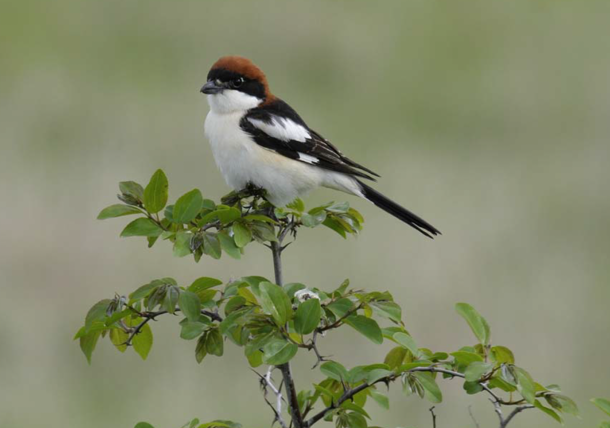{width=50%}

__A male woodchat shrike (_Lanius senator_)__ 

# The Three-Step Approach to IPMs

Step 1. Develop a model that links demographic rates to population sizes
Step 2. Formulate the likelihood for each available data set (submodel) separately
Step 3. Formulate the joint likelihood and analyze it for inference 

### Step 1: Development of a Model that Links Demographic Data with Population Size 

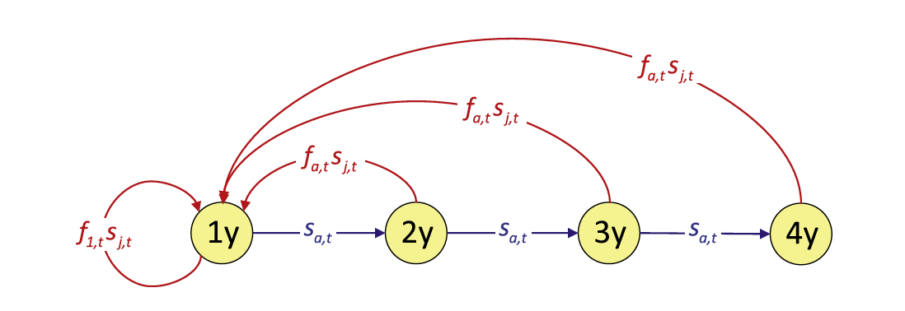
__Woodchat shrike life-cycle graph__ 


For this example, we will use a woodchat shrike data set. The species is monogamous, and demographic rates are similar among the sexes, so we construct a female-based model. We assume a prebreeding “census” and include
two age classes, 1-year-old (“1y”) and older (“ad”) individuals. Here, we write down the population equations:


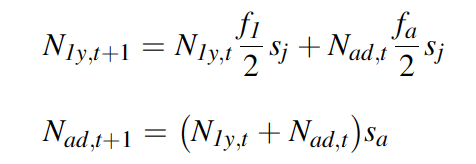

We want our IPM to include both demographic stochasticity and environmental stochasticity/variability. Because environmental stochasticity is just a possibly confusing name for “temporal variability,” we can include it by
letting the demographic parameters vary over time. We denote this by adding an index _t_ for time for all parameters.

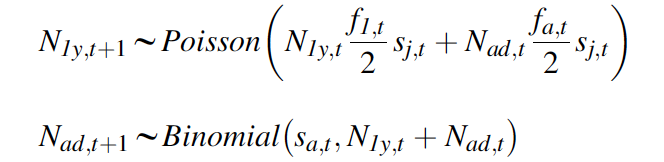

### Step 2: Formulation of the Likelihood for Each Available Data Set Seperately

The choice of likelihood for each component data set requires a good knowledge of the range of sensible statistical models. To see some examples, [view](https://kevintshoemaker.github.io/NRES-746/IPM_lecture.html) the lecture portion of this topic.

IPMs necessarily include data that contain information about population size and its change over time. We will always have a model that links these measures of population size to the demographic rates in our population model. 

__State-space models__ are well suited for this purpose because they describe an imperfectly observed state that evolves over time. Generally, the state process equations are exactly equivalent to the population model defined in the first step of this approach toward building
the IPM. 

A model that describes the initial conditions of the population in the first year is needed. In a Bayesian analysis, we estimate these quantities and
therefore place priors on them. Here we use a prior that gives equal support to a wide range of possible values. For the woodchat shrikes, the observed population count in year 1 was 91, and thus we choose discrete uniform priors (_DU_) between 1 and 300 for each age class.

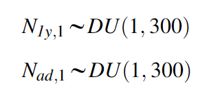

The state-space model also contains the observation equations that link the observed population counts with the true, latent population abundance. This submodel should ideally reflect the sampling design that produced these counts. In our IPM, we assume that a single survey in each year produced our shrike counts (_C~t~_) and that they are subject to both imperfect detection and possible double-counting, and hence we model them using a normal distribution:


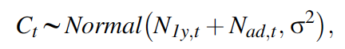


In our example, we assume that birds cannot be aged. The sum of the numbers of the two age classes is treated as the observed random variable.


The likelihood of the state-space model (_L~SS~_) is the product of the three likelihoods for the initial state, the state process, and the observation process:

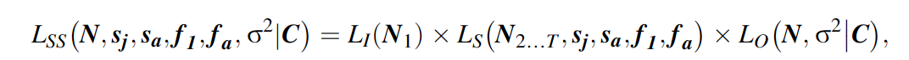


where _L~I~_ is the likelihood of the population size at occasion 1, _L~s~_ is the likelihood of the state process, and _L~o~_ is the likelihood of the observation process, and bold letters denote matrices and vectors. Specifically, _N~1~_ is age-specific population size in the first year, _N~2...T~_ contains the age-specific population sizes from years 2 to _T_, and _N_ is the age-specific population size for the complete time series, i.e., from 1 to _T_.


Our second data set is the capture-recapture data, for which we adopt a _Cormack-Jolly-Seber model_. We model the age-specific survival probabilities with uncorrelated temporal random effects and define

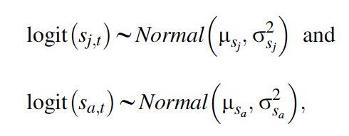

where $\mu$~sj~ and $\mu$~sa~ are the means, and $\sigma^2$~sj~ and $\sigma^2$~sa~ are the temporal variances, of juvenile and adult survival probabilities, respectively, on the logit scale. We assume recapture probability to be constant over time (p~t~ = $\bar{p}$), and for faster computation, we will work with the multinomial likelihood for the data summarized in the m-array (_m_). Written symbolically, the likelihood for the capture-recapture data set is

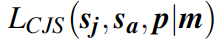

Our third data set is the _productivity data_, for which we here adopt a _Poisson regression_, again with uncorrelated random time effects for the parameters of both age classes:

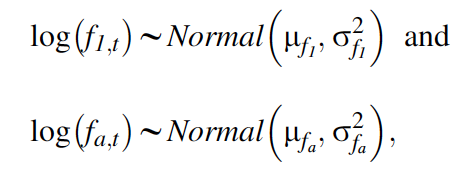

where $\mu$~f1~ and $\mu$~fa~ are the means, and $\sigma^2$~f1~ and $\sigma^2$~fa~ are the temporal variances, of productivity of first-year and older females, respectively, on the log scale. The likelihood of this Poisson regression model is written symbolically as

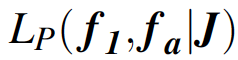

Here, **_J_** are the productivity data that also include the categorical variable indicating the age class of the mother.


### Step 3: Formulation of the Joint Likelihood

The third and final step is the formulation of a joint likelihood - this forms the likelihood for the full IPM. The joint likelihood for the IPM is simply the product of the likelihoods for each individual data set just discussed:

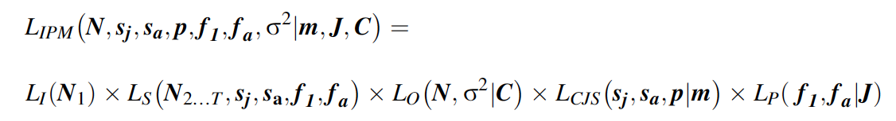

_s~j~_ - juvenile survival

_s~a~_ - adult survival

_f~1~_ - productivity of 1-year old females

_f~a~_ - productivity of adult females ( > 1 year old)


Inference for the IPM is based on this joint likelihood. we clearly see that information among different data sets is shared: the likelihood component of the state-space model contains some parameters that also appear in the likelihoods for the capture-recapture and productivity data (i.e., __*s~j~*__, __*s~a~*__, __*f~1~*__ and __*f~a~*__).

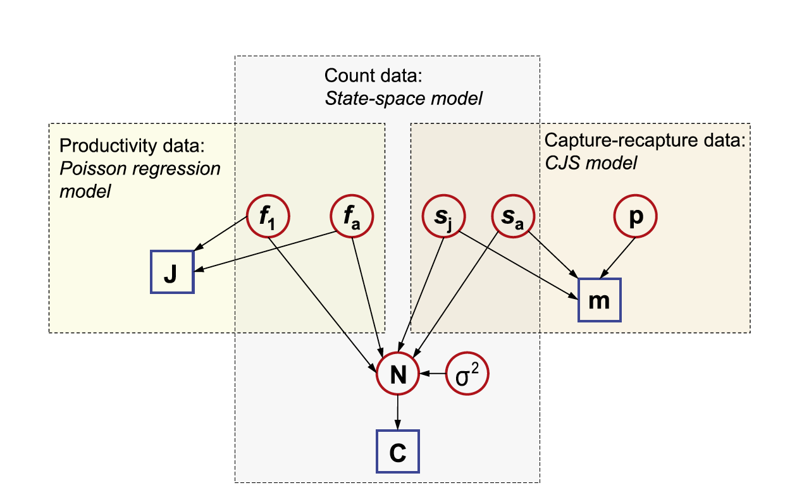

In the above _directed acyclic graph (DAG)_ ,all known quantities (typically data) are represented as squares, while all unknown quantities (estimated parameters, missing data, predictions, etc.) are shown as circles. Arrows link
nodes and indicate dependencies among different quantities in the model. Quantities that appear in multiple boxes are informed by more than one data set. For instance,you can see that information about juvenile survival originates from the capture-recapture data and the population count data.

In JAGS, we will not need to write the joint likelihood explicitly as a single
“ugly” expression. Rather, the program allows us to define the joint likelihood in a hierarchical manner by specifying “local” relationships between all the nodes in the DAG of an IPM. The integration occurs by giving the same name to quantities that appear in different parts of the separate likelihood statements for the individual data sets combined in the IPM. 

# Let's Code this IPM!!


```{r, eval=FALSE}
library(IPMbook)
library(jagsUI)


# Load Data 
data(woodchat5)
str(woodchat5)
```

```{r, eval=FALSE}
marr <- marrayAge(woodchat5$ch, woodchat5$age)
```

```{r, eval=FALSE}
# Bundle data and produce data overview
jags.data <- list(marr.j=marr[,,1], marr.a=marr[,,2], n.occasions=dim(marr)[2],
rel.j=rowSums(marr[,,1]), rel.a=rowSums(marr[,,2]), J=woodchat5$repro[,1],
year=woodchat5$repro[,2], age=woodchat5$repro[,3], C=woodchat5$count, pNinit=dUnif(1, 300))
str(jags.data)
```

```{r, eval=FALSE}
# Write JAGS model file
cat(file="model4.txt", "
model {
# Priors and linear models
for (t in 1:(n.occasions-1)){
logit.sj[t] ~ dnorm(mu.sj, tau.sj)
sj[t] <- ilogit(logit.sj[t]) # Back-transformation from logit scale
logit.sa[t] ~ dnorm(mu.sa, tau.sa)
sa[t] <- ilogit(logit.sa[t]) # Back-transformation from logit scale
p[t] <- mean.p
}

for (t in 1:n.occasions){
log.f[1,t] ~ dnorm(mu.f[1], tau.f[1])
f[1,t] <- exp(log.f[1,t]) # Back-transformation from log scale
log.f[2,t] ~ dnorm(mu.f[2], tau.f[2])
f[2,t] <- exp(log.f[2,t]) # Back-transformation from log scale
}
mean.sj ~ dunif(0, 1)
mu.sj <- logit(mean.sj) # Logit transformation
mean.sa ~ dunif(0, 1)
mu.sa <- logit(mean.sa) # Logit transformation
sigma.sj ~ dunif(0, 3)
tau.sj <- pow(sigma.sj, -2)
sigma.sa ~ dunif(0, 3)
tau.sa <- pow(sigma.sa, -2)
for (j in 1:2){
mean.f[j] ~ dunif(0, 10)
mu.f[j] <- log(mean.f[j]) # Log transformation
sigma.f[j] ~ dunif(0, 3)
tau.f[j] <- pow(sigma.f[j], -2)
}
mean.p ~ dunif(0, 1)
sigma ~ dunif(0.5, 100)
tau <- pow(sigma, -2)
# Population count data (state-space model)
# Model for initial stage-spec. population sizes: discrete uniform priors
N[1,1] ~ dcat(pNinit)
N[2,1] ~ dcat(pNinit)
# Process model over time: our model of population dynamics
for (t in 1:(n.occasions-1)){
N[1,t+1] ~ dpois(N[1,t] * f[1,t] / 2 * sj[t] + N[2,t] * f[2,t] / 2 * sj[t])
N[2,t+1] ~ dbin(sa[t], N[1,t] + N[2,t])
}
# Observation model
for (t in 1:n.occasions){
C[t] ~ dnorm(N[1,t] + N[2,t], tau)
}
# Productivity data (Poisson regression model)
for (i in 1:length(J)){
J[i] ~ dpois(f[age[i],year[i]])
}
# Capture-recapture data (CJS model with multinomial likelihood)
# Define the multinomial likelihood
for (t in 1:(n.occasions-1)){
marr.j[t,1:n.occasions] ~ dmulti(pr.j[t,], rel.j[t])
marr.a[t,1:n.occasions] ~ dmulti(pr.a[t,], rel.a[t])
}
# Define the cell probabilities of the m-arrays
for (t in 1:(n.occasions-1)){
# Main diagonal
q[t] <- 1 - p[t] # Probability of non-recapture
pr.j[t,t] <- sj[t] * p[t]
pr.a[t,t] <- sa[t] * p[t]
# Above main diagonal
for (j in (t+1):(n.occasions-1)){
pr.j[t,j] <- sj[t] * prod(sa[(t+1):j]) * prod(q[t:(j-1)]) * p[j]
pr.a[t,j] <- prod(sa[t:j]) * prod(q[t:(j-1)]) * p[j]
} #j
# Below main diagonal
for (j in 1:(t-1)){
pr.j[t,j] <- 0
pr.a[t,j] <- 0
} #j
} #t

# Last column: probability of non-recapture
for (t in 1:(n.occasions-1)){
pr.j[t,n.occasions] <- 1-sum(pr.j[t,1:(n.occasions-1)])
pr.a[t,n.occasions] <- 1-sum(pr.a[t,1:(n.occasions-1)])
}
# Derived parameters
# Annual population growth rate (added 0.001 to avoid possible division by 0)
for (t in 1:(n.occasions-1)){
ann.growth.rate[t] <- (N[1,t+1] + N[2,t+1]) / (N[1,t] + N[2,t] + 0.001)
}
# Total population size
for (t in 1:n.occasions){
Ntot[t] <- N[1,t] + N[2,t]
}
}
")

# Initial values
inits <- function(){list(mean.sj=runif(1, 0, 0.5))}
# Parameters monitored
parameters <- c("mean.sj", "mean.sa", "mean.f", "mean.p", "sigma.sj", "sigma.sa", "sigma.f",
"sigma", "sj", "sa", "f", "N", "ann.growth.rate", "Ntot")
# MCMC settings
ni <- 12000; nb <- 2000; nc <- 3; nt <- 2; na <- 1000
# Call JAGS (ART 1 min), check convergence and summarize posteriors
out4 <- jags(jags.data, inits, parameters, "model4.txt", n.iter=ni, n.burnin=nb, n.chains=nc,
n.thin=nt, n.adapt=na, parallel=TRUE)
#traceplot(out4) # Warning: there are a lot of estimated parameters
print(out4, 3)
```


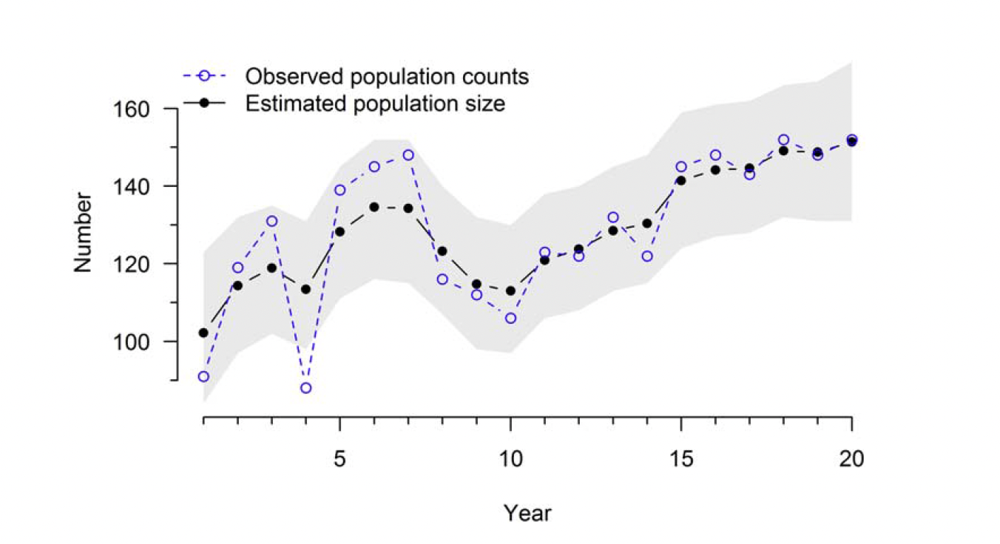


Note: The model produced parameter estimates that look good, however, this is not yet a confirmation that they will also be accurate. To determine whether a model produces “good” (e.g., unbiased, or precise) estimates, we need simulations with many replicates (see Schaub and Kery, 2022).


## Questions for lab

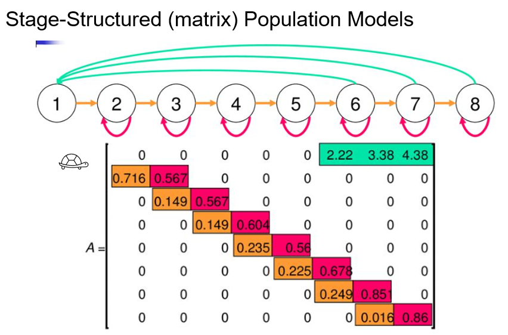

1) Understanding the population model for your species is central for developing a successful IPM. Here, in this lab we walked through an example life cycle graph and Leslie age-structured matrix for the woodchat shrike. In lecture, we saw the life cycle graph and Lefkovitch stage-structured matrix for the desert tortoise. On the paper provided, please draw a rough example of what a life cycle graph and population matrix would look like for your study species. (If you do not work with plants or animals, feel free to pick an organism that you would like to study!) Identify the flow of survival, recruitment, and fecundity.

2) Using your life cycle graph, draw a potential matrix population model. Remember: a populaiton matrix must have the same number of rows as it does columns. Feel free to estimate rates or simply use symbology to represent probabilities. 

3) Identify the population model in the woodchat shrike code provided. Notice that it is represented by a series of formulas using time steps, population size, and survival. How would you provide the population of your study species in JAGS code?

4) For you species chosen above, identify a survey that you have participated in (or are aware of). Give an example of what parameter this would provide to an IPM. What vital rate does this parameter act upon? 

5) After running the lab code, explain the relationship between the lines of observed population counts versus estimated population size.

6) Attempt to plot the estimated population size further in time.


## Resources for learning about IPMs

Textbook: _Integrated Population Models_ by Michael Schaub and Marc Kery (2022)

Paper: _Integrated population models: a novel analysis framework for deeper insights into population dynamics_ by Michael Schaub & Fitsum Abadi (2011) [view](https://link.springer.com/article/10.1007/s10336-010-0632-7)

Paper: _Integrated population models: Model assumptions and inference_ by Riecke et al. (2019)  [view](https://besjournals.onlinelibrary.wiley.com/doi/full/10.1111/2041-210X.13195)


