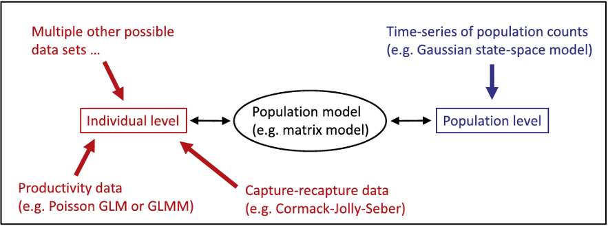
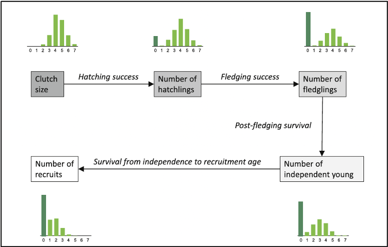
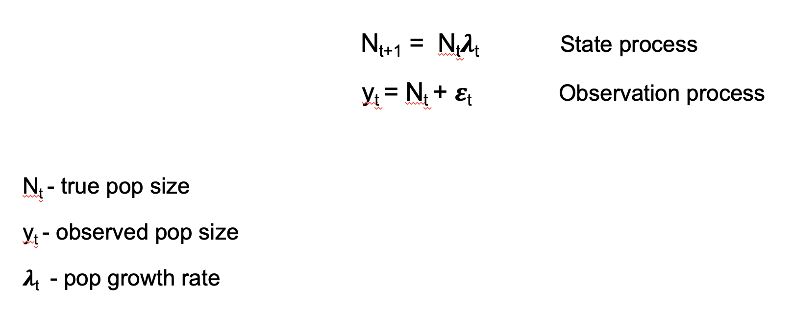
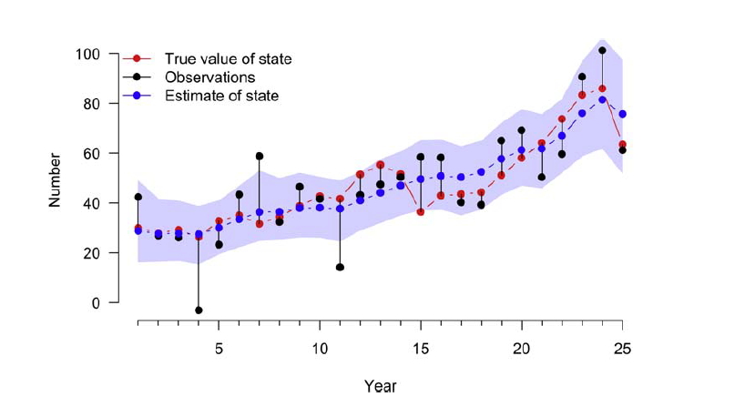

```{r setup, include=FALSE}
knitr::opts_chunk$set(echo = TRUE, cache = TRUE)
```


Click here to follow along in R: [IPM_lecture.R](IPM_lecture.R)

## Introduction 

#### What are IPMs

- Integrated population models (IPMs) represent the single, unified analysis of population count data and demographic data.
- A statistical method that combines two or more datasets to explore underlying processes and relationships.
- An IPM forms joint likelihood between these data sets through with the shared parameter(s) among likelihoods of each data sets.

#### The Population Part

The goal of population models is to understand the interactions that lead to changes in population size and structure. Population dynamics is the summation of all losses and gains in a population through recruitment, survival, emigration, and immigration. So if population growth rates are changing, there is a change in one of these demographic rates.

The size of a population (N) can be expressed by the following equation: N =S+R+I-E where population size in year t is given by the population size surviving the year before (S), plus the number of new individuals resulting from local recruitment (R) and immigration (I), minus the number of individuals lost as a result of death and emigration (E).

#### The Integrated Part

An integrated analysis in general is a joint analysis of several datasets on different quantities.Inference is based on the joint likelihood. A key element is that one or several parameters are common in several components of the likelihood but collected independently.

Previous analysis method analyzed these data separately

In IPMS: In these models, all available data are analyzed within a single model; the single data likelihoods are used to create the joint likelihood upon which inference is based.

#### Stage-Structured (Matrix) Population Models

Most IPMs are based on stage-structured models.Defining the life-cycle graph and demographic rates for your study species a crucial part in the development of a stage-structured population model and for construction of an IPM


#### Advantages of IPMs

1) More precise parameter estimates

2) Incorporates all sources of uncertainty (process variability and sampling processes)

3) Allows estimation of more demographic quantities (with caution; [Riecke et al. 2019](https://besjournals.onlinelibrary.wiley.com/doi/full/10.1111/2041-210X.13195))


### IPM Components (submodels)



Count data (population level)
- Population size surveys
 
Demographic data (individual level)
- Survival surveys 
- Productivity surveys 

_This tutorial will briefly review very simplified versions of some (but definitely not all!) potential submodels that are typically included in an IPM._ 

**_NOTE: The following examples are borrowed from Schaub and Kery (2022)_**

## Productivity 

Reproduction is a key process of any population model. Population models typically require the number of offspring per female and year, which we call “productivity”. 

In this example, we show some of the subprocess that make up productivity for birds, but this will not cover all facets of productivity which may look different for different taxa. 

Importantly, productivity can be assessed at different stages of the annual cycle. 





In this example, we will focus on nest survival and brood size. 

### Nest Survival Models

The primary goal of nest survival models is the estimation of nest success, which is the probability that at least one fledgling is produced by a nest.

#### Two possible components of nest success: 

1) Incubation 
2) Nestling phase

#### Data collected for a nest survival study include:

- Date of visit
- Nest status (alive, inactive) 
- Optional: age of nest
- And more


#### Data for each nest i are summarized as:

_f~i~_ - date when the nest is first detected

_j~i~_ - last date the nest was observed as alive

_k~i~_ - day when the nest was visited for the last time

_x~i~_ - whether the nest was alive during the last  visit (fail = 0, success = 1)


#### Analysis details: 

- Active nests must be visited repeatedly 

- Time intervals between visits do not need to be identical

- Estimation of daily survival starts on the day when the nest is discovered
 
- The exact date of failure is unknown, unless the nest is observed daily 

- Date of failure can be estimated from the model, based on daily survival probabilities


In this example, we have nest data on 181 wrynecks from 2002 to 2006 and analyzed by Geiser et al. (2008). Note that dates are recorded such that day 1 is May 16. 


First, explore the data

```{r}
library(IPMbook); library(jagsUI)
data(wryneck)
str(wryneck)

```

```{r}
tail(wryneck)
```
As a reading example, nest 177 was detected on day 53 when the
nestlings were 1 day old, and it was checked for the last time with nestlings seen alive on day 56. Then, it was checked
again on day 60 when the brood was found to have failed (hence, _x_ = 0).


Next, we'll create daily encounter histories for each nest

```{r}
# Identify failed broods
fail <- which(wryneck$x==0)
# Create encounter histories
y <- matrix(NA, nrow=length(wryneck$f), ncol=max(wryneck$k))
for (i in 1:length(wryneck$f)){
y[i,wryneck$f[i]] <- 1
y[i,wryneck$j[i]] <- 1
}
for (i in 1:length(fail)){
y[fail[i],wryneck$k[fail[i]]] <- 0
}
```

View encounter histories of two broods 176 and 177:

```{r}
y[176,]
```

```{r}
y[177,]
```
In the encounter history of brood 176 there are NA before the nest was detected and after the nestlings fledged, i.e., the
nest was successful. In the model (below) we will define the likelihood in a loop only between the first and last visit and
thus NAs outside this loop will not be estimated, nor will they provide any information about daily survival. For nest 177
there are NAs between the last visit when the nest was alive and the visit when the failure was detected, so there is uncertainty
about the exact date when the nest failed. The data required to fit the model are these encounter histories, the dates
of the first and last visits to each nest, the number of nests and the number of days a brood requires from hatching to
fledging (T), which is assumed to be a constant, and is needed to scale daily survival to total nest survival.

We fit a nest survival model where the daily nest survival is a linear function of nestling age. Often daily nest survival
increases with nestling age, for instance because nestlings become less sensitive to food shortage, severe weather, or
predators. The data bundle contains the age covariables as well as the other needed data and information.

```{r}
# Bundle data
jags.data <- with(wryneck, list(y=y, f=f, k=k, n.nest=nrow(y), T=21, age=age))
str(jags.data)
```


The likelihood of the nest survival model is similar to that of the Corack-Jolly-Seber model, except that here we assume
perfect detection and hence have no observation submodel. As always, the model also has the priors and linear models
section where we define our linear models for the primary parameters and the chosen priors. At the end of the code, we
compute nest success as a derived parameter that is a function of daily survival and duration T.

```{r}
# Write JAGS model file
cat(file="model13.txt", "
model {
# Priors and linear models
for (i in 1:n.nest){
for (t in f[i]:(k[i]-1)){
phi[i,t] <- phia[age[i] + t - f[i]]
} #t
} #i
for (a in 1:T){
phia[a] <- ilogit(alpha + beta * a)
}
alpha ~ dnorm(0, 0.001)
beta ~ dnorm(0, 0.001)
# Likelihood
for (i in 1:n.nest){
for (t in (f[i]+1):k[i]){
y[i,t] ~ dbern(phi[i,t-1] * y[i,t-1])
} #t
} #i
# Derived parameter: nest success
nu <- prod(phia[1:T])
}
")
# Initial values
inits <- function(){list(alpha=runif(1, 4, 5), beta=runif(1, 0, 0.1))}
# Parameters monitored
parameters <- c("phia", "nu", "alpha", "beta")
# MCMC settings
ni <- 3000; nb <- 1000; nc <- 3; nt <- 1; na <- 1000
# Call JAGS from R (ART 1 min) and check convergence
out16 <- jags(jags.data, inits, parameters, "model13.txt", n.iter=ni, n.burnin=nb, n.chains=nc,
n.thin=nt, n.adapt=na, parallel=TRUE)
#traceplot(out16) # Not shown
print(out16, 3)
```

As expected, there is a slight but clear increase with nestling age in the daily nest survival probabilities. The
coefficient of age (beta) is positive indicating that nest failure becomes less likely as nestlings get closer to fledging.
Overall success during the nestling stage is estimated at 0.73, which means that about three of four nests with hatched
young produce at least one fledgling.
This model offers great flexibility in modeling all sorts of covariate effects. For example, we can include year effects if
the data were collected in different years, and the yearly parameters can be treated as either fixed or random. Individual
random effects could also be included, e.g., if some nest boxes were repeatedly occupied and we may want to account for
possible nonindependence due to location or parent ID. Daily nest survival could also be modeled as a function of temporalor spatial covariates (e.g., territory quality).


### Poisson Models for Brood Size

We will look at two model options for brood size (but there are many other options):

- Fit a Poisson GLM to the frequency data
- Fit a Poisson GLM to aggregated data 

Note: we can fit these two completely separate models inside the same JAGS model statement. 

First, we will simulate a brood size data set for illustration:

```{r}
# Choose constants in simulation
nbrood <- 1000 # Number of broods with young counted
brood.mean <- 1.5 # Average brood size
sd.brood <- 0.3 # log-linear brood random effect
# Draw Poisson random numbers
set.seed(24)
expNyoung <- exp(log(brood.mean) + rnorm(nbrood, 0, sd.brood))
C <- rpois(nbrood, expNyoung)
table(C)
```


We call the count of young "C". When fitting two models to the same data set in a single JAGS model statement we need to make a copy of that data set. 

```{r}
# Data bundle
jags.data <- list(C1=C, sumC1=sum(C), C1copy=C, nbrood=nbrood)
str(jags.data)

```


```{r}
library(jagsUI)

# Write JAGS model file
cat(file="model8.txt", "
model {
# Priors and linear models
rho1 ~ dunif(0, 5) # Mean brood size in model 1
rho2 ~ dunif(0, 5) # Mean brood size in model 2
rho3 ~ dunif(0, 5) # Mean brood size in model 3
tau.rho3 <- pow(sd.rho3, -2)
sd.rho3 ~ dunif(0, 3) # Brood-level overdispersion in model 3
# Likelihoods for three separate models
# Model 1: Poisson GLM for disaggregated data
for (i in 1:nbrood){
C1[i] ~ dpois(rho1)
}
# Model 2: Poisson GLM for aggregated data
sumC1 ~ dpois(rho2 * nbrood)
# Model 3: Poisson GLMM for aggregated data with brood-level overdispersion
for (i in 1:nbrood){
C1copy[i] ~ dpois(pois.mean[i])
log(pois.mean[i]) <- logmean[i]
logmean[i] ~ dnorm(log(rho3), tau.rho3)
}
}
")
# Initial values
inits <- function(){list(rho1=runif(1, 0.5, 2.5), rho2=runif(1, 0.5, 2.5),
rho3=runif(1, 0.5, 2.5))}
# Parameters monitored
parameters <- c("rho1", "rho2", "rho3", "sd.rho3")
# MCMC settings
ni <- 60000; nb <- 10000; nc <- 3; nt <- 10; na <- 1000
# Call JAGS from R (ART 3 min), check convergence and summarize posteriors
out11 <- jags(jags.data, inits, parameters, "model8.txt", n.iter=ni, n.burnin=nb, n.chains=nc,
n.thin=nt, n.adapt=na, parallel=TRUE)
#traceplot(out11) # Not shown
print(out11, 3)


```


Some other models for brood size include:

- Zero-inflated normal or Poisson
- Poisson with truncation 
- Poisson with censoring 
- Poisson log-normal model GLMM (for a brood effect)

## Survival Models

### Cormack-Jolly-Seber Model for Capture-Recapture Data

First, simulate a data set

```{r}
# Choose values for data simulation
nmarked <- 10 # Number of marked individuals at each occasion
nyears <- 11 # Number of years
phi <- 0.8 # Constant apparent survival probability
p <- 0.4 # Constant recapture probability
```

An individual first caught on the last year of the study has no opportunity of being recaptured during the study. Such individuals do not carry any information about survival and can be discarded from the analysis. So in our simulation,
we choose first-capture occasions only up to the penultimate year.

```{r}
# Determine occasion when an individual first captured and marked
f <- rep(1:(nyears-1), each=nmarked)
nind <- length(f) # Total number of marked individuals
# State or ecological process
z <- array(NA, dim=c(nind, nyears)) # Empty alive/dead matrix
# Initial conditions: all individuals alive at f(i)
for (i in 1:nind){
z[i,f[i]] <- 1
}
set.seed(1) # Initialize the RNGs in R
# Propagate alive/dead process forwards via transition rule:
# Alive individuals survive with probability phi
for (i in 1:nind){
for (t in (f[i]+1):nyears){
z[i,t] <- rbinom(1, 1, z[i,t-1] * phi)
} #t
} #i
head(z); tail(z) # look at start and end of z
```

```{r}
# Observation process: simulate observations
y <- array(0, dim=c(nind, nyears))
for (i in 1:nind){
y[i,f[i]] <- 1
for(t in (f[i]+1):nyears){
y[i,t] <- rbinom(1, 1, z[i,t] * p)
} #t
} #i
```


```{r}
head(y) # Complete simulated capture-recapture data set 
for (i in 1:10){ # Look at true and observed states of first 10 individuals
print(rbind("True state (z)" = z[i,], "Observed state (y)" = y[i,]))
browser()
}
```


We can now fit the simplest possible CJS model in JAGS for illustration. For the data bundle, we need to
provide the capture-recapture data matrix, its dimensions and the vector f that indicates the marking occasion for each
individual.

```{r}
# Data bundle
jags.data <- list(y=y, f=f, nind=nind, nyears=ncol(y))
str(jags.data)
```

We develop the SSM to fit the CJS model to the data. The likelihood of the model is written in the most general way,
that is, apparent survival and recapture are defined as two matrices with elements indexed by i and t. Hence, both parameters
could vary among individuals and over time. To fit a model with constant rates, we specify a linear model where
we assign the same two constants (phi.const and p.const) to each element in the two parameter matrices and then place
priors on these parameters.

```{r}
# Write JAGS model file
cat(file="model14.txt", "
model {
# Priors and linear models
phi.const ~ dunif(0, 1) # Vague prior for constant phi
p.const ~ dunif(0, 1) # Vague prior for constant p
for (i in 1:nind){ # Loop over individuals
for (t in f[i]:(nyears-1)){ # Loop over time intervals/occasions
phi[i,t] <- phi.const # Here we model pattern in phi ...
p[i,t] <- p.const # ... and p
} #t
} #i
# Likelihood
for (i in 1:nind){
# Define latent state at first capture
z[i,f[i]] <- 1
for (t in (f[i]+1):nyears){
# State process
z[i,t] ~ dbern(z[i,t-1] * phi[i,t-1])
# Observation process
y[i,t] ~ dbern(z[i,t] * p[i,t-1])
} #t
} #i
}
")

# Initial values
inits <- function(){list(z=zInit(y))}

# Parameters monitored
parameters <- c("phi.const", "p.const") # Could also add "z"
# MCMC settings
ni <- 3000; nb <- 1000; nc <- 3; nt <- 1; na <- 1000
# Call JAGS from R (ART < 1 min) and check convergence
out17 <- jags(jags.data, inits, parameters, "model14.txt", n.iter=ni, n.burnin=nb, n.chains=nc,
n.thin=nt, n.adapt=na, parallel=TRUE)
#traceplot(out17) # Not shown
print(out17, 3)

```

We must provide initial values for the latent states z
that do not contradict either the model or the data because otherwise JAGS will crash. The function zInit in the IPMbook
package generates such initial values for single-state capture-recapture data.


This model requires some homogeneity assumptions. For example, in our model we assume that survival and recapture
is identical for all individuals and occasions. In life encounter data some behaviors of the marked individuals can lead to
the violation of the homogeneity assumptions. For instance, when some individuals are not really part of the marked
population, but are mere transients, i.e., appear only during one occasion and then are gone. Their apparent survival is
effectively zero. Another problematic type of behavior may affect capture. Depending on the sampling protocol, some
individuals may become trap-happy or trap-shy after an earlier capture, i.e., their capture probability changes after they are
captured once or more times.

Survival and recapture can both be modeled as a function of covariates or with random effects by appropriate specification
of linear models.


## State-Space Model for Population Counts

State-space models are used to analyze time-series data where the true state (e.g., population size) of a system is believed to be unobservable, but can be indirectly observed through noisy measurements. 


State-space models use an observed time series of counts (or other observed responses) and decompose them into:
1) Process variation 
2) Observation error 


Example using the exponential population model:


Stochasticity is included in the model by making two distributional assumptions about the population growth rate and the observation errors


First, simulate a data set of population sizes and observations

```{r}

# Chose constants
nyears <- 25            # Number of years
N1 <- 30                # Initial population size, t=1 
mu.lam <- 1.02          # Mean annual population growth rate
sig2.lam <- 0.02        # Process (temporal) variation of the growth rate
sig2.y <- 400           # Variance of the observation error

# Simulate true system state
N <- numeric(nyears)
N[1] <- N1                     # Set initial abundance
set.seed(1)
lambda <- rnorm(nyears-1, mu.lam,sqrt(sig2.lam))   # Draw random lambdas
for(t in 1:(nyears-1)){     
  N[t+1] <- N[t]*lambda[t]     # Propagate population size forward
}

# Simulate observations
eps <- rnorm(nyears,0,sqrt(sig2.y))   # Draw random residuals 
y <- N + eps                   # Add residual error to value of true state


```

Fit the data-generating model in JAGS

```{r}
library(IPMbook); library(jagsUI)
# Data bundle
jags.data <- list(y=y, T=length(y))
str(jags.data)


```


```{r}

# Write JAGS model file
cat(file="model1.txt", "
model {
# Priors and linear models
mu.lam ~ dunif(0, 10) # Prior for mean growth rate
sig.lam ~ dunif(0, 1) # Prior for sd of growth rate
sig2.lam <- pow(sig.lam, 2)
tau.lam <- pow(sig.lam, -2)
sig.y ~ dunif(0.1, 100) # Prior for sd of observation process
sig2.y <- pow(sig.y, 2)
tau.y <- pow(sig.y, -2)
# Likelihood
# Model for the initial population size: uniform priors
N[1] ~ dunif(0, 500)
# Process model over time: our model of population dynamics
for (t in 1:(T-1)){
lambda[t] ~ dnorm(mu.lam, tau.lam)
N[t+1] <- N[t] * lambda[t]
}
# Observation process
for (t in 1:T){
y[t] ~ dnorm(N[t], tau.y)
}
}
")
# Initial values
inits <- function(){list(sig.lam=runif(1, 0, 1))}
# Parameters monitored
parameters <- c("lambda", "mu.lam", "sig2.y", "sig2.lam", "sig.y", "sig.lam", "N")
# MCMC settings
ni <- 200000; nb <- 10000; nc <- 3; nt <- 100; na <- 5000
# Call JAGS from R (ART <1 min), check convergence and summarize posteriors
out1 <- jags(jags.data, inits, parameters, "model1.txt", n.iter=ni, n.burnin=nb, n.chains=nc,
n.thin=nt, n.adapt=na, parallel=TRUE)
#traceplot(out1) # Not shown
print(out1, 3)
```

We see in the figure below, the estimates do a pretty good job recovering the input values, i.e., the true states.
Note that the credible interval refers to the true state and not to the observations so we don’t need to worry about a
number of counts that lie outside the blue band.



#### Building IPMS

Now that you've learned about matrix models and seen multiple examples of the sub-models that create in IPM in the JAGS language, how do you bring them together?

- First Step: Develop a (matrix) model that links population sizes and specify your known demographic rates. This was your Leslie matrix.
- Second Step: Formulate the likelihood for each available data set (submodel) separately.
- Third Step: The joint likelihood of all datasets combined must be created. This is the likelihood on which inference is based.

That will be most of our lab on Monday!


## Resources for learning about IPMs

Paper: _Integrated population models: a novel analysis framework for deeper insights into population dynamics_ by Michael Schaub & Fitsum Abadi (2011) [view](https://link.springer.com/article/10.1007/s10336-010-0632-7)

Paper: _Integrated population models: Model assumptions and inference_ by Riecke et al. (2019)  [view](https://besjournals.onlinelibrary.wiley.com/doi/full/10.1111/2041-210X.13195)

Textbook: _Integrated Population Models_ by Michael Schaub and Marc Kery (2022)


