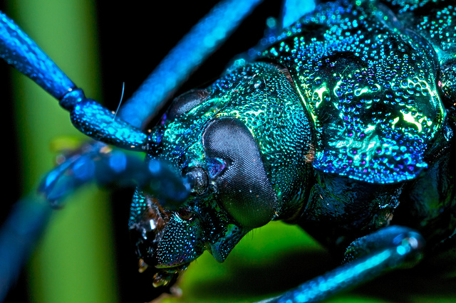

```{r setup, include=FALSE, message=FALSE}
knitr::opts_chunk$set(echo = TRUE, cache = TRUE, fig.align = FALSE)
```

```{r,include=FALSE, message=FALSE}
library('png')
library('grid')
```

# Occupancy Models

### Overview of Occupancy Modeling

Occupancy models are used to help estimate true occupancy of a species, also known as the latent state (*z*). They can assist with accounting for imperfect detection of organisms in a study, and help us determine the true occupancy and the detection probabilities of the species at the site. Because detecting wildlife species is not done with 100% accuracy, we can use occupancy models to help us determine the proportion of times that we don't detect the species and either the species is truly not there or the species is there, and we just did not detect it. Therefore, occupancy models can help us determine the uncertainty in our detection.

Some of the questions we can ask with occupancy models include:\

-   Where does the species occur (i.e. species distribution)?\

-   What influences where a species is found?\

    -   The different elements of a habitat that can influence the presence or absence of a species (i.e. climate, predation, resource availability, etc.)\
    -   Different landscape characteristics that may have an influence on species distribution.\
    -   These can be included in our model in the form of covariates.\

To estimate species occupancy in an area, researchers must:\

-   Do surveys to determine presence or absence of the species.\
-   Determine the proportion of sites that are in fact occupied by the species even if the species was not detected.\

Detectability of a wildlife species can be influenced by many different random effects, such as:\

-   Survey characteristics:\

    -   The observer: some observers may be better at spotting individuals of a species that are particularly camouflaged to their environments\

    -   The weather: adverse weather conditions such as rain or snow can impact visibility during a study, and therefore impact detection probability\

-   Site characteristics: sites with heavy cover or dense forests may decrease detection probability and make it harder for observers to identify the species\

    -   Example: Sitka black-tailed deer that live in the boreal forests in southeast Alaska may be harder to spot than mule deer living in more open ecosystems in Nevada\

It is important to recognize that detection probability can be influenced by either survey characteristics or site characteristics, but occupancy probability can only be influenced by site characteristics.

Being able to quantify the uncertainty in our detections and estimate true occupancy probability and state can help us better inform studies and management that rely on data from these models.

We can also introduce a time component to Occupancy Models; this will allow us to determine species presence or absence in an area over time, and potentially species trends in that territory over time.

### Assumptions of Occupancy Models

Assumptions include:\

-   The area being studied is closed to changes in species occupancy between sampling times.\

-   The surveys and the units are independent (i.e. whether or not a species was previously identified at a site has no impact on the current survey detection at that site).\

-   There are no false detections (where an observer believed that they saw the species in question when in reality it was a different species).\

-   The probability of detection of a species, given the species was present, is constant across sites.\

    -   This assumption can be violated as long as the heterogeneous probability of detection across sites is described and modeled by the correct covariates.\

-   The probability of occupancy of the species is constant across sites.\

    -   This assumption can be violated as long as the heterogeneous probability of occupancy across sites is described and modeled by the correct covariates.\

### Breaking Down the Model

Occupancy models can be explained with a model statement containing 2 Bernoulli distributions and 2 deterministic functions. We use Binomial distributions with only one trial (called a Bernoulli distribution) for modeling occupancy because we are interested in random effects that would impact our ability to detect a species. A Bernoulli distribution is a stochastic process that can account for these random effects.

An occupancy model can be written as follows:

$$
y_{i}|z_{i} \sim Bernoulli(p*z_{i}) \\
z_{i} \sim Bernoulli(\psi) \\
logit(p)=\alpha_0+\alpha_1*covariate_1 \\
logit(\psi)=\beta_0+\beta_1*covariate_1
$$

The variables represent:\

*y: the data at site i\
*p: detection probability\
*z: true occupancy state at site i\
*$\psi$: occupancy probability\
$\alpha$: the parameters to estimate for the detection probability p\
$\beta$: the parameters to estimate for the occupancy probability $\psi$\

Occupancy models are hierarchical. We can see the latent state variable *z*, which is the state that we are interested in learning about, present in both the data model and the latent process model. Therefore, we have to know something about the data and the detection probability in order to infer occupancy state and occupancy probability for the species in the territory. The noise of the observation state has to be modeled on top of the latent state. It is also hierarchical because we can see the same variable (*z*) represented in 2 statements (the stochastic functions).

In addition, occupancy models are an extension of basic linear regressions with a link function. We can see the logit link functions present in the model, linking the deterministic and stochastic processes for detection and occupancy probabilities.

### Why is Estimating Species Occupancy Important?

There are many reasons that we would want to estimate the occupancy of a species in an area. Some of these may include:\

-   In species thought to be extinct or endangered or in some way limited, what area do they occupy?\

    -   We can use a single species, multiple season model to determine their occupancy trajectory over time.\

-   What types of habitat is a species using most?\

    -   If we want to determine where a species is most likely to reside and we determine that occupancy and detection probabilities are consistently high in certain habitats, maybe we would want to focus our conservation efforts in this habitat type in order to conserve the species rather than spread efforts out over areas that are consistently low in detection and occupancy probability for the species.  

-   What is the true occupancy of a species in an area?\

One example of using occupancy models to help determine species occupancy in certain areas and therefore management strategies was discussed in the National Park Service Fact Sheet published in 2005 looking at occupancy of terrestrial salamanders from the species *Desmognathus imitator* in the Great Smoky Mountains National Park. They conducted this study to learn more about salamander occupancy in this territory, as long-term, large-scale studies had not been done on terrestrial salamanders in this area. They used separate disturbed sites and undisturbed sites in this study. They found that detectability of the salamanders increased in undisturbed sites relative to disturbed sites, and therefore discovered that occupancy and detection of the species would be highest in undisturbed areas. They can use this information going forward to help make decisions on where to focus conservation efforts for these salamanders and where to conduct species surveys.

### Other Similar Models

Occupancy models are also similar to some mark-recapture models, including Cormack-Jolly-Seber (CJS) Models. CJS Models are open population models consisting of 2 Bernoulli distributions, similar to that of Occupancy Models. CJS Models are more often used to estimate survival of individuals in a species using mark-recapture data and open population models (where individuals can enter or leave a population due to births,deaths,emigration,etc.), while Occupancy Models are more often used to determine the presence of a species in an area without necessarily marking as many individuals as possible. Presence and absence, or detection and non-detection, data is generally used with Occupancy Modeling. Occupancy Models provide a way to estimate species occupancy in a territory without requiring extensive efforts to mark and recapture or resight individuals of the species, and therefore it can be both less expensive and less invasive while being just as effective depending on the study.

If individuals are easily recognizable, the model to choose will depend on your research question and goals. If you are trying to follow individuals through time in an area, CJS Modeling may be a better fit. If you have limited funding and are trying to determine presence or absence of a species in a territory, Occupancy Modeling will be a better fit.

Both models have latent *z* state variables as well as detection probability *p* variables. There are, however, some notable differences between the 2 models. CJS models use $\psi$ as the probability that an animal alive at time *t* will survive until time *t+1*, while $\psi$ in Occupancy Models indicates the true occupancy probability of the species.

## Explanation of Scenarios

We can further break the model down into several scenarios that may help us make sense of this model statement. Let's consider the scenario where we observe the species. In this scenario, there are no possible alternatives. If we saw the species, then it was truly there. Therefore, your data (*y*) and true occupancy state (*z*) would both be equal to 1 because we know that the species is in fact there.

However, when we do not observe the species, there are two possible outcomes. The first outcome is that we did not see the species and it was truly not there. In this scenario, the data (*y*) and true occupancy (*z*) of this individual is 0. In the second outcome, we did not observe the species, however it was truly there. In this case, our data (*y*) would be equal to 0 and our detection probability (*p*) would decrease because we did not observe the species, but our true occupancy (*z*) would be equal to 1 since the species was actually there.

```{r ,cache=TRUE, echo=FALSE, message=FALSE}
library(grid)
img <- readPNG("Occ Options.png")
 grid.raster(img)
```

<!--  -->

The problem that occurs when we do not observe the species is that we do not know which of the two possible outcomes is true. If we did not see the species, we cannot know if it was truly there or truly not there because we did not observe it. This is where occupancy modeling can be helpful; we can use occupancy models to help us determine our detection probability and estimate our latent variable z, which is our true occupancy, and our occupancy probability $\psi$. By using this approach, we can estimate the probability that the site is actually occupied given we do not observe the individual.

## Types of Occupancy Models

Occupancy models can be modeled for single species, multiple species, single season, and multiple seasons.

### Simple Occupancy Models

When we use a simple occupancy model, we assume that the detection probability among sites and occasions is the same. We also use the model for the detection of one species. We can create extensions of this simple model to incorporate different detection probabilities at different sites (where *p* has a subscript i to incorporate sites), add additional species to monitor, and add time and replicate surveys into the model among others.

Below is an example of a simple occupancy model, which we saw above:

1.  Single Species, Single Season, homogeneous detection probability $$
    y_{i}|z_{i} \sim Bernoulli(p*z_{i}) \\
    z_{i} \sim Bernoulli(\psi) \\
    logit(p)=\alpha_0+\alpha_1*covariate_1 \\
    logit(\psi)=\beta_0+\beta_1*covariate_1
    $$

### General Occupancy Models

General occupancy models are an extension of simple occupancy models and can allow us to incorporate those aspects mentioned above, such as heterogeneous detection probability, monitoring of multiple species, and replicate surveys.

Below are some examples of expanding the simple occupancy model, where every model contains a heterogeneous detection probability:

1.  Single Species, Single Season $$
    y_{i}|z_{i} \sim Bernoulli(p_{i}*z_{i}) \\
    z_{i} \sim Bernoulli(\psi_{i}) \\
    logit(p_{i})=\alpha_0+\alpha_1*covariate_1 \\
    logit(\psi_{i})=\beta_0+\beta_1*covariate_1
    $$

2.  Single Species, Multiple Seasons $$
    y_{i,j}|z_{i,j} \sim Bernoulli(p_{i,j}*z_{i,j}) \\
    z_{i,j} \sim Bernoulli(\psi_{i,j}) \\
    logit(p_{i,j})=\alpha_0+\alpha_1*covariate_1 \\
    logit(\psi_{i,j})=\beta_0+\beta_1*covariate_1
    $$

3.  Multiple Species, Single Season $$
    y_{i,s}|z_{i,s} \sim Bernoulli(p_{i,s}*z_{i,s}) \\
    z_{i,s} \sim Bernoulli(\psi_{i,s}) \\
    logit(p_{i,s})=\alpha_0+\alpha_1*covariate_1 \\
    logit(\psi_{i,s})=\beta_0+\beta_1*covariate_1
    $$

4.  Multiple Species, Multiple Seasons $$
    y_{i,j,s}|z_{i,j,s} \sim Bernoulli(p_{i,j,s}*z_{i,j,s}) \\
    z_{i,j,s} \sim Bernoulli(\psi_{i,j,s}) \\
    logit(p_{i,j,s})=\alpha_0+\alpha_1*covariate_1 \\
    logit(\psi_{i,j,s})=\beta_0+\beta_1*covariate_1
    $$

# Example: Single Species - Single Season Occupancy Analysis using "Unmarked" package in R.

<center>



</center>

### Background

For this exercise, we will be estimating occupancy of the endangered Alpine longhorn beetle (*Rosalia longicorn*). Due to this species population status, it is important that researchers identify and understand what habitats these species inhabit, as well as where they breed and lay their eggs. It is known that *R. alpina* congregate during the breeding season, often preferentially laying their eggs in dead beech trees. However, many individuals of the species lay their eggs in temporary firewood piles left within or near the forest. Given the developmental period for *R. alpina* larvae is 3-4 years, individuals laid in firewood piles often perish before reaching maturity.

In the summer of 2009, researchers surveyed sites known to inhabit *R. alpina* in Switzerland during their breeding season. 27 firewood piles were surveyed a maximum of six times and number of *R. alpina* found in each pile were recorded. In addition, the covariates location of pile (in forest or on edge), date surveyed and time surveyed (minutes after noon) were recorded.

## Analysis using "Unmarked"

1)  Load in the data set and required packages

```{r, cache=TRUE}
library(terra)
library(unmarked)
bluebugs = read.csv("bluebug.csv")
tail(bluebugs, n = 6L)
```

2)  Since the detection data is in the form of count data, we need to change those values to 0 and 1's.

```{r}
y = bluebugs[,4:9]
y[y>1] = 1

tail(y)

```

3)  Next, we want to gather our covariate data. We will need to standardize the date and time data.

```{r}
# Extract the data for the date covariate.
dates <- as.matrix(bluebugs[ ,10:15])

# Extract the data for minutes after noon. 
mins <- as.matrix(bluebugs[ ,16:21])

# Extract data for woodpile location (0: within the forest, 1: on the edge of the forest)
siteCovs = bluebugs[,c("forest_edge")]

# Save site data as a data frame. 
site = data.frame(siteCovs)

# Standardize the dates 
mean.date = mean(dates, na.rm = TRUE)
sd.date = sd(dates[!is.na(dates)])
DATES = (dates-mean.date)/sd.date

DATES[is.na(DATES)] = 0

#Standardize the minutes, same procedure as dates
mean.mins = mean(mins, na.rm = TRUE)
sd.mins = sd(mins[!is.na(mins)])
MINS = (mins - mean.mins)/sd.mins
MINS[is.na(MINS)] = 0
```

4)  Assigning covariates. The Unmarked package requires a list of covariates.

```{r}
dates = as.matrix(DATES)
mins = as.matrix(MINS)
dates.x = (dates)^2
mins.x = (mins)^2
obs = list(date = dates, mins = mins, dates.2 = dates.x, mins.2 = mins.x)
```

5)  In order to run the model, you have to generate an appropriate data frame for fitting the model. This can be done using the unmarkedFrameOccu() function for singles-season site occupancy, assigning covariates related to site and covariates that are related to observations.

```{r}
wt = unmarkedFrameOccu(y = y, siteCovs = site, obsCovs = obs)
summary(wt)
```

6)  Once you have an appropriately "framed" object for unmarked modeling, you can then use the occu() function to run the occupancy model. Unmarked requires a double right-hand side formula which serves as your model statement and your data.

```{r}
######################
###
### Examples
###
######################

#
# No observation covariates, site covariates 
#

# occu(~ 1 ~ siteCovs, data = wt)

#
# Observation covariates, no site covariates  
#

# occu(~ observation covariates ~ 1, data = wt)

#
# Observation covariates and site covariates 
#

# occu(~ observation covariates ~ site covariates, data = wt)


```

7)  For this model, we are interested in whether location of sites have an effect on *R. alpina* occupancy and whether date and time of day has effects on detection probability. Therefore, our model formula will include both our site covariates and our observation covariates.

```{r}
fm2 = occu(~date+dates.2+mins+mins.2~siteCovs,data = wt)
summary(fm2)
```

Now that we have our log-odds of occupancy as well of detection, we can convert them to probabilities using the backTransform() function. For sites within the forest or on the forest edge:

```{r}
backTransform(linearComb(fm2, coefficients = c(1,0),"state")) #Occupancy probability of sites within the forest.
backTransform(linearComb(fm2, coefficients = c(1,1),"state")) #Occupancy probability of sites on the forest edge.
```

These results indicate that sites within the forest are significantly more likely to be occupied than sites located on the forest edge.

Doing the same for observation covariates.

```{r}
backTransform(linearComb(fm2, coefficients = c(1, mean(dates), 0, 0, 0),"det")) #Probability set at mean date
backTransform(linearComb(fm2, coefficients = c(1, 0, mean(dates.x), 0, 0),"det")) #Probability set at mean quadratic date
backTransform(linearComb(fm2, coefficients = c(1, 0, 0, mean(mins), 0),"det"))     #Probability set at mean minutes after noon.
backTransform(linearComb(fm2, coefficients = c(1, 0, 0, 0, mean(mins.x)),"det"))  #Probability set at mean minutes after noon (quadratic)

```

We can estimate true site occupancy using the following ranef function.

```{r}
sum(bup(ranef(fm2), stat="mode"))     # Sum of posterior modes
```

One thing we are interested in is investigating whether sites within the forest are more likely to be occupied by *R. Alpina* than sites on the edge of the forest. We can visualize these relationships with the following code:

```{r}
# Plotting habitat occupancy probability
newdata1 <- data.frame(siteCovs=c("Edge", "Interior"),date = 0,dates.2 = 0,mins = 0,mins.2 = 0) #Make simulated data for the predict function 
Epsi <- predict(fm2, type="state", newdata=newdata1)
with(Epsi, {
  plot(1:2, Predicted, xaxt="n", xlim=c(0.5, 2.5),ylim = c(0,1),
       xlab="Habitat",
       ylab=expression(paste("Probability of occurrence (", psi, ")")),
       cex.lab=1.2,
       pch=16, cex=1.5, main = "Probability of Occupancy for Each Habitat")
  axis(1, 1:2, c('Interior', 'Edge'))
  arrows(1:2, lower, 1:2, upper, angle=90, code=3, length=0.05)
})


```

We also want to see if there are optimal survey conditions that may make our detection probability higher. We can do this by plotting the predicted estimates from our model in relation to the observation covariate estimates.

```{r, results='asis', fig.height=10}
# Plot detection as a function of date and minutes afternoon using estimates produced by the model.
par(mfrow=c(2, 1), mar = c(5,5,5,5))

tdates = seq(0,60, length = 30) # Set up date data 
tdatess = (tdates - mean.date)/sd.date # Standardize date data
tdatesss = tdatess^2 # set up your date quadratic

newdata2 <- data.frame(date=tdatess, dates.2 = tdatesss, mins = 0, mins.2 = 0) # Make data.frame out of data generated above

Ep <- predict(fm2, type="det", newdata=newdata2, appendData=TRUE) #Use predict function to generated predictions for new data based off model estimates
Ep$dateOrig = seq(0,60, length = 30) # Set up x-axis dates
with(Ep,{plot(dateOrig, Predicted, type="l", lwd=2, ylim=c(0,1), #Plot the predicted values against dates 
     xlab="Date (1 = July 1)",
     ylab=expression(paste("Detection probability (", italic(p), ")")), main = "Detection Probability by Date")
lines(dateOrig,lower, col=gray(0.7))     # add confidence intervals
lines(dateOrig,upper, col=gray(0.7))})


# Minutes
tmins = seq(180, 540, length.out = 30) # set up minute data 
tminss = (tmins - mean.mins)/sd.mins # standardize minute data
tminsss = tminss^2 # make minutes quadratic
newdata3 = data.frame(date=0, dates.2 = 0, mins = tminss, mins.2 = tminsss) # make data.frame out of minutes data generated above
 
Ep1 <- predict(fm2, type="det", newdata=newdata3, appendData=TRUE) # use predict function to predict values for new data using the model
Ep1$minOrig = seq(180, 540, length.out = 30) # Set up minutes vector for x-axis
with(Ep1,{plot(minOrig, Predicted, type="l", lwd=2, ylim=c(0,1), # Plot predicted values and minutes after noon. 
              xlab="Minutes After Noon",
              ylab=expression(paste("Detection probability (", italic(p), ")")), main = "Detection Probability by Minutes After Noon")
  lines(minOrig,lower, col=gray(0.7)) # Add confidence intervals
  lines(minOrig,upper, col=gray(0.7))})


```

# Example: Single Species - Single Season Occupancy Analysis using "JAGS" in R.

For this example, we will use a Bayesian framework to estimate and make inference on parameters. For this exercise, we will use the same blue bug data set as the "Unmarked" example above.

1)  Begin by setting up the data like we did for the unmarked package.

```{r}
#Load required packages
library('jagsUI')
library('runjags')
library('coda')
library('MCMCvis')

#Import data
data = read.csv("bluebug.csv")

#Save as a matrix 
y = as.matrix(data[,4:9])

# You need to make sure the data (in this case count data) is in binary format(0,1)
# 0 represents not detected, 1 represents detection
y[y>1] = 1

tail(y)

#Gather Covariate data, edge will be 1 if it was on the edge and 0 if it is in the forest
edge <- data$forest_edge
#Get dates from data set.
dates <- as.matrix(data[,10:15])
#Get hours from data set. 
mins <- as.matrix(data[,16:21])


# Standardize the covariates

# Standardize the dates by minusing mean from each date value and dividing by the standard deviation 
mean.date = mean(dates, na.rm = TRUE)
sd.date = sd(dates[!is.na(dates)])
DATES = (dates-mean.date)/sd.date

DATES[is.na(DATES)] = 0

#Standardize hour, same procedure as dates
mean.mins = mean(mins, na.rm = TRUE)
sd.mins = sd(mins[!is.na(mins)])
MINS = (mins - mean.mins)/sd.mins
MINS[is.na(MINS)] = 0
```

2)  Now we need to make a text file for our JAGS model.

```{r}
cat(
  "
  model {
  
  #######################
  # Likelihood
  # Estimating true state
  #######################
  
  for(i in 1:R){            # Make a for- loop that loops through the number of sites surveyed
  z[i] ~ dbern(psi[i])                # The latent state z, whether animal was actually there or not is distributed by a bernoulli distribution 
  psi[i] <- 1/(1 + exp(-lpsi.lim[i]))          # Calculate logit psi, probability of site i occupancy, on the logit scale  
  lpsi.lim[i] <- min(999, max(-999,lpsi[i]))   # Truncate values on logit scale to prevent numeric overflow and underflow
  lpsi[i] <- alpha0.psi + alpha1.psi * edge[i]  # linear estimation of psi with different probability dependent on site (in woods, edge of woods)
  
  # Modeling the observations
  for(j in 1:T){              # For loop iterating through number of surveys
  y[i,j] ~ dbern(mu.p[i,j])         #detected or not detected at site i and survey j
  mu.p[i,j] <- z[i] * p[i,j]           #Calculate probability of detection which = zi (whether site is occupied or not) * p (probability of detection at site i and survey j)
  p[i,j] <- 1/(1 + exp(-lp.lim[i,j]))          # Calculation of detection probability at site i and survey j on the logit scale
  lp.lim[i,j] <- min(999, max(-999, lp[i,j]))     # Truncate values to provent over/underflow
  lp[i,j] <- beta0.p + beta1.p*DATES[i,j] +           # Calculate detection probability as linear 
             beta2.p * pow(DATES[i,j],2) + 
             beta3.p * MINS[i,j] + beta4.p * pow(MINS[i,j],2)
             

   #Bayes P-Value
   
   Presi[i,j] <- (y[i,j] - p[i,j])^2       # Calculate the squared residual error of the observed data 
   y.new[i,j] ~ dbern(mu.p[i,j])                # Simulate observed data 
   Presi.new[i,j] <- (y.new[i,j] - p[i,j])^2  # Calculate squared residual error of simulated data 
   
  }
}
  SSEobs <- sum(Presi[,])     # Calculate the sum of squared residual errors for observed data
  SSEsim <- sum(Presi.new[,]) # Calculate the sum of squared residual error for the similuated data
  
  p.val <- step(SSEsim - SSEobs)
  
  ########################
  ###
  ### Priors
  ###
  ########################
  
  alpha0.psi ~ dnorm(0,1/2.25)
  alpha1.psi ~ dnorm(0,1/2.25)
  beta0.p ~ dnorm(0,1/2.25)
  beta1.p ~ dnorm(0,1/2.25)
  beta2.p ~ dnorm(0,1/2.25)
  beta3.p ~ dnorm(0,1/2.25)
  beta4.p ~ dnorm(0,1/2.25)
  
  occ.fs <- sum(z[])
  mean.p <- exp(beta0.p) / (1 + exp(beta0.p))
  
  }

  ", file="JagsOcc.txt"
)

```

3)  Next, we need to package our data in a form that JAGs will accept.

```{r}
# Make Data List

datalist = list(
  y = y,         # Our response data
  R = nrow(y),   # Set our for-loop iterations. We want it to loop through the number of sites (rows)
  T = ncol(y),   # We want T to represent number of surveys (number of columns)
  edge = edge,   # Set our data for site covariates
  DATES = DATES, # Set our observation covariate data
  MINS = MINS
)

```

4)  Set initial values for the model. We need to generate response data that is in 0 and 1's. We can do this using the apply() function.

```{r}
# Make initial values for the model

zst = apply(y,1,max,na.rm = TRUE) # Make a vector of zeros and ones for initial z-values
inits = function(){               # Make a function that returns a list of initial values 
  list(
    z = zst,                      # Assign initial values for z
    alpha0.psi = runif(1,-3,3),    # Make initial value for alpha0.psi (occupancy)
    beta0.p = runif(1,-3,3)       # Make initial value for beta0.p (detection)
  )
}
inits()
```

5)  We need to tell JAGs the parameters we want to get results for. For this analysis, we want all beta values for both occupancy and detection as well as occ.fs and our bayesian p-value.

```{r}
paramsave = c("alpha0.psi", "alpha1.psi", "mean.p", "occ.fs", "beta0.p", 
              "beta1.p", "beta2.p", "beta3.p", "beta4.p", "p.val", "SSEobs","SSEsim")

```

6)  Run the JAGs model!

```{r, echo=TRUE, cache=TRUE}
set.seed(2021)
out = jags(data = datalist, parameters.to.save = paramsave, inits = inits,
           model.file = "JagsOcc.txt", n.chains = 3, n.adapt = 1000,
           n.iter = 30000, n.burnin = 20000,parallel = TRUE,n.thin = 10)
```

7)  Check for convergence: trace plots!

```{r,fig.height=8, strip.white=TRUE}

outMCMC <- out$samples #Convert output to MCMC object
outMCMCtrace = MCMCtrace(outMCMC,params = c("alpha0.psi","alpha1.psi","beta0.p","beta1.p","beta2.p","beta3.p","beta4.p", "mean.p"), ISB = FALSE, pdf = F, exact = TRUE, post_zm = TRUE, type = 'trace', Rhat = TRUE, n.eff = TRUE)

```

8)  Check for convergence: density plots!

```{r}
outMCMCtrace = MCMCtrace(outMCMC,params = c("alpha0.psi","alpha1.psi","beta0.p","beta1.p","beta2.p","beta3.p","beta4.p", "mean.p"), ISB = FALSE, pdf = F, exact = TRUE, post_zm = TRUE, type = 'density', Rhat = TRUE, n.eff = TRUE, ind = TRUE)

```

9)  Check for convergence: Gelman-Rubin Diagnostics

```{r}
gelman.diag(outMCMC)
```

10) Since each parameter looks like it converged, we can make some inference on our p-value.

```{r}
plot(out$sims.list$SSEobs,out$sims.list$SSEsim,xlab="SSEobs",ylab="SSEsim")
abline(0,1,lwd = 2, col = "red")
out$mean$p.val #take the p-value out of the model summary
```

The p-value indicates that this model is not a necessarily good fit for the data. This low of a p-value indicates that our model actually is over fitted; predicting the observed data more than the simulated data. Oh well.

11) Lets look at the summary output from the model.

```{r}
out$summary[,c("mean","sd","2.5%","97.5%","Rhat")]
```

12) Lets look at an estimate of the number of woodpiles likely to be occupied by *R. alpina*. We estimate occu.fs (total sites occupied based on latent state z produced by detection probability) in our jags model by summing the estimated Z values produced by each iteration. This in turn provides us with an estimate of how many of the sites surveyed likely were occupied by *R. alpina*. To look at the posterior distribution of the number of sites occupied, all you have to do is pull it out of the model output!

```{r}
# occu.fs = 14.55
hist(out$sims.list$occ.fs, nclass = 30, col = "red", 
     xlab = "Number of Occupied Wood Piles", xlim = c(5,28), main = "Estimated Blue Bug Occupancy") # Plot out the posterior distribution of occu.fs.
abline(v = 10, lty = 2) # add an abline indicating how many piles were occupied based off surveys. 
```

We see that the posterior peaks somewhere around 14, which is also indicated by the occu.fs estimate provided in the model summary output. Perhaps the surveyors didnt survey each site enough leading to low detection. Using the samples produced in the JAGs model, we can easily compute a power statistic to determine how many surveys would be needed to improve detection and determine whether a pile is occupied.

```{r}
####################################
###
### Statistical Power of Detection
###
####################################

#Create an empty storage array for storing detection probability
# Array should have same number of rows produced in MCMC model
# Array should have the same number of columns as desired number of surveys you want to investigate
pstar = array(NA, dim = c(out$mcmc.info$n.samples,10))

# Set up x-values with same number of rows as your array (nrows of samples produced in the MCMC)
# These x-values will allow plotting of box values
x = cbind(rep(1, 3000), rep(2, 3000), rep(3, 3000), 
          rep(4, 3000), rep(5, 3000), rep(6, 3000), 
          rep(7, 3000), rep(8, 3000), rep(9, 3000), 
          rep(10, 3000))

#Set up a for-loop that will run the same amount of iterations as the samples produced in the MCMC
for (i in 1:out$mcmc.info$n.samples) { # fills in data for each row 
  for (j in 1:10){ # Fills in data for each column (i.e. number of columns)
    pstar[i,j] <- 1 - (1 - out$sims.list$mean.p[i])^j #Calculate estimated maximum detection probability for each survey using mean probability calculated in the MCMC 
  } 
}
#Plot the probability of detection for each survey, along with associated confidence intervals 
boxplot(pstar ~ x, col = "red", las = 1, ylab = "Pstar", 
        xlab = "Number of surveys", outline = FALSE, main = "Probability to Detect at least one Specimen")

#Add an abline that represents the 95% CI cutoff 
abline(h = 0.95, lty = 2, lwd = 2)
```

The results show that you would want to survey each site at least six times to be 95% confident that site was unoccupied. While there were six total surveys represented in the data, many sites have NA (which may indicated non-survey events). Therefore, to improve the accuracy of this model, we would want to make sure each site was surveyed at least six times.

We can also visualize our posterior distributions for occupancy probability in relation to our site covariates, interior or forest edge. To do this, all we have to do is pull these out of the models sims.list. We use plogis() to put these estimates on a probability scale.

```{r,results='asis'}

hist(plogis(out$sims.list$alpha0.psi), nclass = 40, col = "green", main = "Forest interior", xlab = "Occupancy probability", xlim = c(0, 1))
hist(plogis(out$sims.list$alpha0.psi+ out$sims.list$alpha1.psi), nclass = 40, col = "chocolate", main = "Forest edge", xlab = "Occupancy probability", xlim = c(0, 1))

```

Here we see that woodpiles within the interior of the forest are much more likely to be occupied than woodpiles along the forest edge.

Lastly, we want to make some inference on the effects that date and time have on detection probability. We can plot a posterior mean for both date and time as well as visualize the uncertainty around them. This is done by taking a random sample from the posterior and the regression coefficients used in the samples computation to overlay estimated uncertainty.

```{r}
# Predict effect of time of day with uncertainty
mcmc.sample = out$mcmc.info$n.samples

original.date.pred = seq(0, 60, length.out = 30)
original.mins.pred = seq(180, 540, length.out = 30)
date.pred = (original.date.pred - mean.date)/sd.date
mins.pred = (original.mins.pred - mean.mins)/sd.mins
p.pred.date = plogis(out$mean$beta0.p + out$mean$beta1.p * date.pred + out$mean$beta2.p * date.pred^2 )
p.pred.mins = plogis(out$mean$beta0.p + out$mean$beta3.p * mins.pred + out$mean$beta4.p * mins.pred^2 )

array.p.pred.mins <- array.p.pred.date <- array(NA, dim = c(length(mins.pred), mcmc.sample))
for (i in 1:mcmc.sample){
  array.p.pred.date[,i] = plogis(out$sims.list$beta0.p[i] + out$sims.list$beta1.p[i] * date.pred + out$sims.list$beta2.p[i] * date.pred^2)
  array.p.pred.mins[,i] = plogis(out$sims.list$beta0.p[i] + out$sims.list$beta3.p[i] * mins.pred + out$sims.list$beta4.p[i] * mins.pred^2)
}

# Plot for a subsample of MCMC draws
sub.set <- sort(sample(1:mcmc.sample, size = 200))

plot(original.date.pred, p.pred.date, main = "", ylab = "Detection probability", xlab = "Date (1 = 1 July)", ylim = c(0, 1), type = "l", lwd = 3, frame.plot = FALSE)
for (i in sub.set){
  lines(original.date.pred, array.p.pred.date[,i], type = "l", lwd = 1, col = "gray")
}
lines(original.date.pred, p.pred.date, type = "l", lwd = 3, col = "blue")

plot(original.mins.pred, p.pred.mins, main = "", ylab = "Detection probability", xlab = "Time of day (mins after noon)", ylim = c(0, 1), type = "l", lwd = 3, frame.plot = FALSE)
for (i in sub.set){
  lines(original.mins.pred, array.p.pred.mins[,i], type = "l", lwd = 1, col = "gray")
}
lines(original.mins.pred, p.pred.mins, type = "l", lwd = 3, col = "blue")

```

The uncertainty around the dates matches that of the credible intervals provide in the model output summary, further indicating that the we cannot make much inference on the effect that date has on detection probability. However, the uncertainty for time mirrors the mean posterior indicating that we can make some inference on the effect time of day has on detection probability. Detection probability is highest around the 340 minutes after noon (5:40 p.m.).

# Model Comparison

## Model Differences: Frequentist and Bayesian

Bayesian (JAGS):\

-   We use priors to inform our parameter estimates before analysis.\

    -   We use the prior probability distributions and the likelihood of the data to inform our posterior distributions for our parameter estimates.\

-   Posterior distributions for parameters.\

    -   The posterior mean is usually taken as the point estimate for the parameter value.\

-   Credible intervals: because we have distributions for our parameter estimates, we can make a different inference for credible intervals than confidence intervals.\

    -   "We can be 95% certain that the true parameter value lies within this 95% credible interval (degree of belief)."\

-   Based on Bayes' Rule of Probability.\

-   The probability of the hypothesis given the data.\

Frequentist (Unmarked package):

-   Confidence intervals: because the parameters we are trying to estimate our fixed point that exist, we have to interpret these differently than Bayesian credible intervals.\

    -   "If I take a sample from the population an infinity number of times, then the 95% confidence interval will encompass the true parameter value 95% of the time."\

-   The probability of the data given the hypothesis.\

    -   Given you are living in the null universe, how much do you expect to observe the data that you observed?\

## Parameter Estimates

```{r, echo=FALSE, results='asis' }
bsum = out$summary[c("alpha0.psi", 'alpha1.psi',"beta0.p","beta1.p","beta2.p",
                     "beta3.p","beta4.p"),c("mean","sd")]
unmean = data.frame(fm2@estimates@estimates$state@estimates)
unmeandet = data.frame(fm2@estimates@estimates$det@estimates)

unmean$sd = c(1.777057,1.864301)
unmeandet$sd = c(0.6943537,0.3754207,0.4601874,0.3987585,0.3052380)

colnames(unmean) = c("Estimates","SD")
colnames(unmeandet) = c("Estimates","SD")

h = rbind(unmean, unmeandet)
rownames(h) = c("alpha0.psi","alpha1.psi","beta0.p","beta1.p","beta2.p","beta3.p","beta4.p")
colnames(bsum)=c("Estimates","SD")

tb = cbind(h,bsum)


e.tab = tb %>% 
  kbl(caption = "Parameter Estimates for Each Model") %>% 
  kable_classic(full_width = TRUE, html_font = "Cambria") %>% 
  add_header_above(c("","Unmarked" = 2, "Jags" = 2 )) %>%
  kable_styling(latex_options = "scale_up")
print(e.tab)
```

Both the Unmarked and Jags occupancy models produced similar parameter estimates. Many of the parameter estimates produced by the Jags model are closer to zero than those produced using Unmarked. This may be due to the uniformative priors set in the Jags model.

## Occupied Sites

```{r}
sum(bup(ranef(fm2), stat="mode")) # Unmarked Sites Occupied Estimate 
round(mean(out$sims.list$occ.fs),0) # Jags Sites Occupied Estimate 
```

The estimate of sites occupied produced from the unmarked analysis indicate that 6 more sites were occupied by *R. alpina* and went undetected, while the Jags analysis indicates that 4 more sites were occupied by *R. alpina* but went undetected.

# Conclusions

Occupancy models can be particularly important in estimating the species occupancy in an area, and helping us learn more about the species. For example, the goal of this study was to determine the impact of site location on *R. alpina* occupancy and the effect of date and time on detection probability of the species. In this model, the site characteristic was site location, while the survey characteristics were time and date of the survey. Remember, detection probability can be impacted by both site and survey/observation characteristics, however occupancy probability can only be impacted by site characteristics.

After running an occupancy model to estimate occupancy of blue bugs in the unmarked package, we learned that:\

-   Site location did have a large impact on occupancy of *R. alpina*; sites on the forest edge were much less likely to be occupied than sites near the interior of the habitat.\

-   The time of day at which researchers survey the area may have an impact on detection probability, but date does not seem to impact detection probability.\

-   Six additional sites were occupied by *R. alpina* and went undetected.\

After rerunning an occupancy model to estimate occupancy of blue bugs using Bayesian methods and JAGs, we learned that:\

-   The p-value indicated underdispersion of data, where the sum of squared residual error in the observed data was greater than that of the simulated data. This indicates that the model may not be a good fit for the data. However, it is important to note that the sample size in this dataset was extremely small, which may have had a large impact on model performance and the interpretation of the results in both models. There are a few ways to overcome this:\

    -   Conduct more surveys to increase sample size\
    -   Set more informative priors for the data from past studies/sources\
    -   Among others...!

-   We found that we should survey each site 6 times in order to be 95% confident that the site was unoccupied by *R. alpina*\

-   We found that the sites in the interior of the habitat are much more likely to be occupied by *R. alpina* than those along the edge of the habitat.\

-   We found that detection probability is highest around 5:40pm. Therefore, in order to maximize detection, we should survey each site around this time.\

-   We learned that date did not seem to have a large impact on detection probability.\

-   Four additional sites were occupied by *R. alpina* and went undetected.\

Though there were some differences in results between both models, the overall messages (that time of day impacts *R. alpina* detection probability and proximity to forest edge impacts *R. alpina* occupancy) provide insights into detection and occupancy of *R. alpina* at these sites. These are important aspects of *R. alpina* occupancy that can be used to better inform survey strategies to maximize detection as well as management of the species in this area (for example, attempting to protect wood piles in the area, particularly in the interior of the habitat since these are most likely to be occupied by the species). This is of particular importance given the endangered status of these Alpine longhorn beetles.

# Resources

Bailey, Larissa and Michael Adams. *USGS: Occupancy Models to Study Wildlife*, NPS Fact Sheet. 2005. <https://www.nps.gov/olym/learn/nature/upload/OccupancyModelFactSheet.pdf>.

Ellison, Aaron M. *Bayesian Inference in Ecology.* Ecology Letters, (2004) **7**: 509-520.

Hooten, Mevin B. and Trevor J. Hefley. *Bringing Bayesian Models to Life.* Ch. 23. 2019.

Kery, Marc and Michael Schaub. *Bayesian Population Analysis Using WinBUGS: A Hierarchical Perspective.* 2012.
