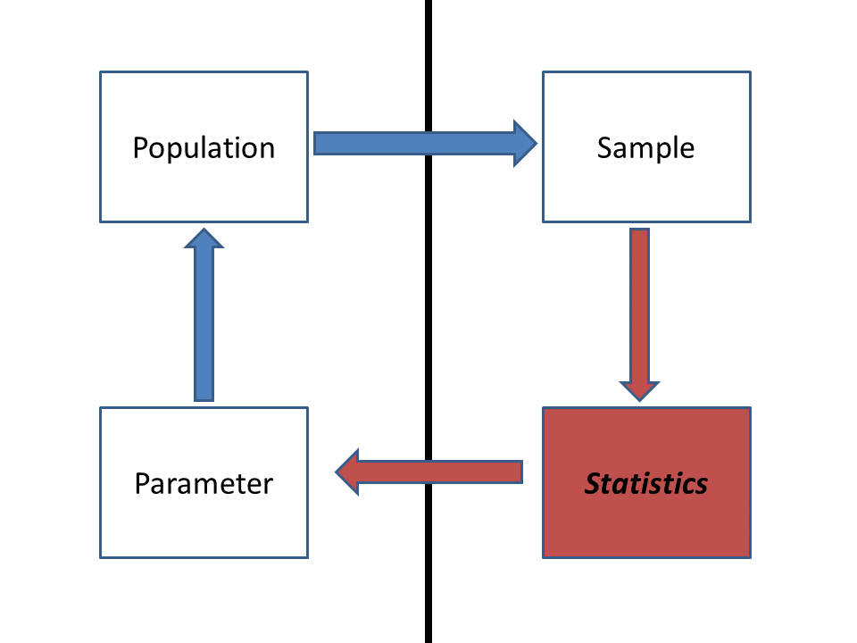

```{r setup, include=FALSE}

knitr::opts_chunk$set(echo = TRUE, cache = TRUE)

```

```{r echo=FALSE}

#  NRES 746, Lecture 1                          
#   University of Nevada, Reno                        
#   Bespoke algorithms for inference   

```


**NOTE:** if you'd like to follow along with the R-based demo in class, [click here](LECTURE1.R) for an R-script that contains all of the code blocks in this lecture.   

## Brute force, do-it-yourself statistics: a brief demonstration

### Standard z-test

Here is a made-up data set. 

{width=30%}

Let's imagine we're testing whether the mean body mass of farm-raised Atlantic salmon fed on a new plant-based diet has a lower body mass than the 'typical' farm-raised fish raised on a conventional diet after one year of growth.

Assume we know the following: 

First, we know that body mass under one year of the conventional diet closely follows a normal distribution with mean of 4.5 kg and standard deviation of 0.9 kg.

$Y_{null} \sim Normal(\mu=4.5,\: \sigma=0.9) $

Second, we measured the body mass of 10 individuals raised on the plant-based diet after one year, and the measurements were as follows:

```
Ind 1  Ind 2  Ind 3  Ind 4  Ind 5  Ind 6  Ind 7  Ind 8  Ind 9 Ind 10 
3.14   3.27   2.56   3.77   3.34   4.32   3.84   2.19   5.24   3.09 
```

Finally, our (alternative) hypothesis is that the fish raised on the new diet will have lower body mass than fish raised on the conventional diet. 

Let's read this information into R:

```{r}

# SALMON EXAMPLE (made-up!) ------------------

pop_mean = 4.5
pop_sd = 0.9

mysample = c(3.14,3.27,2.56,3.77,3.34,4.32,3.84,2.19,5.24,3.09)

myN <- length(mysample)     # determine sample size   

mysamplemean = mean(mysample)     # note the equal sign as alternative assignment operator

## visualize the population of conventional-raised salmon  -------------------

curve(dnorm(x,pop_mean,pop_sd),0,10,
      xlab="Body mass (kg)",ylab="Probability density",lwd=2)

### now overlay this on the observed data  --------------------

hist(mysample,freq=F,
     xlab="Body mass (kg)",ylab="Probability density",main="",
     xlim=c(0,10))
curve(dnorm(x,pop_mean,pop_sd),0,10,
      col="red",lwd=2,add=T)
abline(v=mysamplemean,col="blue",lwd=3)

```

You probably recognize this as the sort of problem you could address with a z-test; we are assuming for now that the samples are independently drawn from a normally distributed population with known spread (standard deviation). 

In the z-test, we test whether our sample could plausibly have been drawn from the **null distribution** (representing fish raised on conventional diet). If we didn't know the population standard deviation we would use a t-test instead of a z-test. 

We can run a z-test in R easily using the 'BSDA' package, using one line of code!  

```{r}

# Perform "canned" z-test  ----------------------------

library(BSDA)
z.test(x=mysample,mu=pop_mean, sigma.x=pop_sd,alternative = "less")

```

...and we conclude that our sample mean is smaller than we could ever reasonably expect to observe under the null hypothesis. This leads us to conclude that the sample was NOT drawn from the null distribution, and that fish raised on the new diet generally have lower body mass than fish raised on a conventional diet. 

Here's an alternative z-test performed using base R:

```{r}

# alternative z-test in base R (no packages)  -----------------------

pop_se = pop_sd/sqrt(myN)   # standard deviation for sample means drawn from the null population

curve(dnorm(x,pop_mean,pop_se),0,10,     # visualize the sampling distribution under null hypothesis
      xlab="Body mass (kg)",ylab="Probability density")     # versus the observed sample mean
abline(v=mysamplemean,col="blue",lwd=3)

p.val = pnorm(mysamplemean,pop_mean,pop_se)    # note that neither pop_mean or pop_se are random variables- they are known with certainty. Therefore we can use a normal distribution (the known data distribution under the null hypothesis, as specified above) to define the sampling error. 
p.val     # this is the same as the p value from the z-test above...

```

### Brute-force z-test

But imagine that we didn't know about the z-test, or standard errors of the mean, but we had a basic intuition about the problem we need to solve. 

Let's build a solution to the same problem from the ground up, using our statistical intuition and some base R! 

Of course this is *totally unnecessary* in this case, but you may run into problems with no simple, "canned" solution. 

First, restate the problem: we want to know if the mass of 10 salmon raised on the new diet is lower on average than the mass of 10 random salmon raised on the conventional diet. Fish raised on the conventional diet have a mass of 4.5 kg on average, with among-individual standard deviation of 0.9 kg.   

Then simulate some data under the assumed null hypothesis. 

Recall the difference between a "population" and a "sample" in statistics:

{width=50%}

Ultimately, we want to make inference about a **population**, but all we have to go on is the **sample**. So we compute **statistics** from our sample and use probabilistic reasoning to infer the extent to which our sample says something meaningful about the population-level **parameters**. Because we didn't observe the whole population (the sample typically represents only a small fraction of the total population), there's often substantial uncertainty about how well the sample statistic actually represents the population of interest- this is called **sampling uncertainty**. 

Here, the *population* we are referring to is farm-raised Atlantic salmon raised on the new vegetarian diet. The population *parameter* we are interested in is the mean body mass of these salmon after one year (or alternatively, the difference in mass relative to fish raised on the standard diet). The *sample* refers to all salmon measured as part of this study. Finally, the *statistic* is the observed mean body mass of all individuals in our sample.     

Let's start by simulating a *population* under the null hypothesis (no treatment effect):  

```{r}

# ALTERNATIVE ALGORITHMIC Z-TEST! ----------------------

## Simulate the STATISTICAL POPULATION under the null hypothesis -----------------

lots <- 1000000  # large number filling in for infinity 

null_population <- rnorm(n=lots,mean=pop_mean,sd=pop_sd)    # the statistical "population" of interest (under null model w no 'treatment' effect)

```

Then we can draw a **sample** from the null distribution:

```{r}

## Draw a SAMPLE from the null population ----------------

null_sample <- sample(null_population,size=myN)    # use R's native "sample()" function to sample randomly from the null distribution

round(null_sample,2)
null_statistic <- mean(null_sample)  
null_statistic    # here is one sample mean that we can generate under the null hypothesis

```

Try it! What did you get? It may differ quite a bit from what I got! That is because the statistic (sample mean) is a random variable- because it is computed from the null data distribution, which is itself a (Gaussian) random variable. 

This null sample mean represents the mean of 10 fish sampled under a *null hypothesis* where there is no underlying difference in body mass between the conventional diet and the new diet. Of course, under the null hypothesis, the fish we measured were also drawn from the null distribution- just like the random sample we just drew. 

The fact that this sample mean is not equal to 4.5 (the known mean of the population the sample was plucked out of) represents **sampling error**.     

Our goal is to determine the extent to which the observed sample mean (the mean body mass of the fish we actually measured) is *inconsistent* with the known population mean. This is what the **p-value** tells us.

Now that we understand the study and research questions, we can write an algorithm to accomplish our goal!

Here, we repeat the (random) sampling process many times (using a "FOR" loop), where each iteration of the loop draws and stores a different random sample of body masses under the null hypothesis:   

```{r}

## Repeat this process using a FOR loop ----------------------

null_replicates <- 1000                 # set the number of replicate samples to generate  (yet another number intended to approximate infinity!)
null_statistics <- numeric(null_replicates)       # initialize a storage vector for sample means under the null hypothesis

for(i in 1:null_replicates){            # for each replicate... 
  null_sample <- sample(null_population,size=myN)      # draw a random sample of body masses assuming no treatment effect       
  null_statistics[i] <- mean(null_sample)           # compute and store the sampling distribution produced under the null hypothesis
}

hist(null_statistics,xlim=c(0,10))       # plot out the sampling distribution using base R plotting
abline(v=mysamplemean,col="green",lwd=3)     # overlay the observed sample statistic  

```

Now, all we need to do to compute a p-value is to compare our simulated sampling distribution with the observed statistic:

```{r}

## Generate a p-value  --------------------------

more_extreme <- length(which(null_statistics<=mysamplemean))       # how many of these sampling errors equal or exceed the "extremeness" of the observed statistic?
p_value <- more_extreme/null_replicates       # compute a p-value! 
p_value    

```

NOTE: technically this p-value is not the true p-value, but instead is a random variable that will approach the true p-value as the number of replicate samples goes to infinity. In this case, we CAN compute the true p-value more exactly using mathematics. While this won't always be the case, it's generally a good idea to use mathematical solutions where available, and to embrace approximate answers when closed-form mathematical solutions are not available. 

Now, for convenience, let's collapse this all into a *function* for conducting our brute-force z-test.

Here is the pseudocode:

Function inputs:   

* d: the observed data (or a stand-in for the observed data), which is assumed to be a random sample from an unknown population      
* mu: the known population mean under the null hypothesis     
* sigma: the known population std deviation under the null hypothesis      
    
Suggested algorithm:     

* compute the sample mean (statistic of interest- call it Xbar)    
* compute the observed sample size (N; the number of data observations)    
* do the following thousands of times (the number of reps should 'stand in' for infinity):    
    - simulate N random samples from the null distribution  
    - compute the sample mean (statistic of interest, assuming null hypothesis is true)
    - store the result     
* determine how many of the simulated sample means were more extreme than the observed sample mean     
* compute the p-value (fraction of simulated sample means that provide at least as much support for the alternative hypothesis than the observed sample mean)   

Function returns:      

* a named list with 3 list elements:     
    - nulldist = the simulated distribution of sample means under the null hypothesis (a vector with thousands of elements)     
    - p = the p-value (a single number)     
    - Xbar = the sample mean (a single number)    

Now let's write the function in R!    

```{r eval=FALSE}

# Develop a function that wraps up all the above steps into one! ------------------

ztest_bruteforce <- function(d, mu, sigma){
  return_list <- list() # bundle results to return using a list object
  return_list$Xbar <- mean(d)  # Compute the sample statistic
  N <- length(d)   # compute sample size
  reps <- 1000       # stand-in for infinity [compute lots of replicate samples under the null hypothesis] 
  return_list$nulldist <- numeric(reps)       # initialize a storage structure for sampling distribution
  for(i in 1:reps){            # for each replicate... 
    return_list$nulldist[i] <- mean(rnorm(N,mu,sigma))           # Simulate random sample and generate sampling distribution
  }
  return_list$p_value <- sum(return_list$nulldist<=return_list$Xbar)/reps   # how many of these are more extreme than the sample statistic?
  return(return_list)
}

ztest <- ztest_bruteforce(d = mysample, mu=4.5, sigma=0.9 )   # try to run the new function

ztest$p_value     # get the p_value

hist(ztest$nulldist,xlim=range(c(ztest$Xbar,ztest$nulldist)))       # plot out all the samples under the null hypothesis as a histogram
abline(v=ztest$Xbar,col="green",lwd=3)     # indicate the observed sample statistic. 

```

#### Take-home message
The value of the brute-force approach to statistics is the flexibility. If we fully understand the problem we want to solve, we can build an algorithm to help solve it. 

We always need to be aware of the assumptions we are making, but when we build custom algorithms, we can easily "relax" these assumptions as needed. Only make the assumptions you are comfortable making. And when you write our own simulation routines, you are forced to code those assumptions explicitly!

For example:

### permutation t-test

What if we don't want to make any assumptions about the process that generated the data? By the central limit theorem, the distribution of the sum of many i.i.d. random variables will be normally distributed- that's why we find bell shaped distributions so commonly in the real world!. However, many data-generating processes **don't** result in a normal distribution and we shouldn't blindly assume our data behave "nicely" and follow any normality assumptions. 

A *permutation test* allows us to test hypotheses without making distributional assumptions like normality. This is a *nonparametric* (or distribution-free) test.

#### example: pygmy short-horned lizard

{width=30%}

Imagine we’re interested in testing if the expected mass of a study organism (let’s say a pygmy short-horned lizard, *Phrynosoma douglasii*) in Treatment A (e.g., cheatgrass removal treatment) differs from a control (e.g., no restoration treatment). In other words: does knowledge of treatment status contribute anything to predicting an individual’s body mass?

In this case, our alternative hypothesis is two-tailed.  

```{r}

# Nonparametric t-test (permutation test) ------------------------

## Start with a made-up data frame ---------------------

df <- data.frame(
  trtA = c(175, 168, 168, 190, 156, 181, 182, 175, 174, 179),
  Control = c(185, 169, 173, 173, 188, 186, 175, 174, 179, 180) 
)

summary(df)    # summarize! 

N <- nrow(df)     # determine sample size N   

# Get data in proper format

reshape_df <- data.frame(                # "reshape" the data frame so each observation gets its own row (standard 'tidy' format)
  Treatment = rep(factor(c("trtA","Control"),levels=c("Control","trtA")),each=N),
  Mass = c(df$trtA,df$Control),
  stringsAsFactors = T
)

plot(Mass~Treatment, data=reshape_df)    # explore/visualize the data

## Compute the observed difference between group means  -----------------

observed_dif <-  diff(with(reshape_df,tapply(Mass,Treatment,mean)))


```

Here, our goal will be to determine if the observed difference between the two group means is inconsistent with random sampling under the null hypothesis, where the p-value represents the probability that random sampling (under the null hypothesis) could result in an absolute difference as or more extreme than the observed difference. 

Let's build this permutation-test algorithm together. 

Here is some **pseudocode**:

1. Define the number of permutations to run (number of replicate samples)     
2. Define a storage vector with the same number of elements as the number of samples to generate.
3. For each replicate sample:
    a. Assign each observation to a random treatment group (trtA or Control)
    b. Compute the difference between the group means after assigning each observation to a random treatment group (treatment - control, with control serving as the benchmark for comparison)
    c. Store this value in the storage vector
4. Plot a histogram of the differences between group means under the null hypothesis (null sampling distribution under random permutations)
5. Add a vertical line to the plot to indicate the observed difference between group means
6. Compute a p-value


```{r}

## Run permutation t-test ----------------

reps <- 5000            # Number of replicates - another number representing infinity!
null_difs <- numeric(reps)   # initialize storage variable
for (i in 1:reps){			# For each replicate:		
  newGroup <- reshape_df$Treatment[sample(c(1:nrow(reshape_df)))]			   # assign each observation a random treatment group
	null_difs[i] <- mean(reshape_df$Mass[newGroup=="trtA"])	- mean(reshape_df$Mass[newGroup=="Control"])	   #  compute the difference between the group means after reshuffling the data
}
hist(null_difs)    # Plot a histogram of null differences between group A and group B under the null hypothesis (sampling errors)
abline(v=observed_dif,col="green",lwd=3)   # Add a vertical line to the plot to indicate the observed difference

```

Now we can compute a p-value, just as we did before:

```{r}

## Compute a p-value based on the permutation test -------------------

  #just like we did before (except now 2-tailed)!

p_value <- sum(abs(null_difs)>=abs(observed_dif))/reps 
p_value

```

Again, for convenience, let's package this new permutation-based t test into an R function:    

```{r eval=FALSE}

## Develop a function that performs a permutation-t-test! -----------------------

ttest_permutation <- function(dat = reshape_df, group = "Treatment", value = "Mass" ){
  to_return <- list()   # initialize object to return
  to_return$observed_dif = diff(tapply(dat[[value]],dat[[group]],mean)  )            # Compute the sample statistic
  to_return$null_difs <- numeric(reps)   # initialize storage variable
  for (i in 1:reps){			# For each replicate:		
  	to_return$null_difs[i] <- diff(tapply(dat[[value]],sample(dat[[group]]),mean)  ) 	    # compute and store sample stat after permuting the treatments
  }
  
  to_return$p_value <- sum(abs(null_difs)>=abs(observed_dif))/reps  
  return(to_return)
}

mytest <- ttest_permutation(reshape_df)   # use default values for all function arguments

mytest$p_value

hist(mytest$null_difs)    # Plot a histogram of null differences between group A and group B under the null hypothesis (sampling errors)
abline(v=mytest$observed_dif,col="green",lwd=3)   # Add a vertical line to the plot to indicate the observed difference


```

## Bootstrapping a confidence interval

What if we want to compare different predictor variables in terms of how strong the relationship is with a response variable. In this case, we might choose to use the coefficient of determination ($R^2$) as a measure of how "good" a predictor is. However, we want to be able to put a confidence interval around the $R^2$ value.

But... no standard R package provides a confidence interval for the $R^2$ value... What to do??

Getting stuck is not an option if we know how to code...

Let's use the "trees" dataset provided in base R:

```{r}

# Demonstration: bootstrapping a confidence interval! ---------------------

## use the "trees" dataset in R:
head(trees)   # use help(trees) for more information

```

Tree volume is our response variable. We want to test whether girth or height are better predictors of tree volume. 

Let's first do some exploration:

```{r}

## Data exploration  --------------------

plot(trees$Volume~trees$Height, main = 'Black Cherry Tree Height/Volume Relationship', xlab = 'Height', ylab = 'Volume', pch = 16, col ='blue')
plot(trees$Volume~trees$Girth, main = 'Black Cherry Tree Girth/Volume Relationship', xlab = 'Girth', ylab = 'Volume', pch = 16, col ='red')

```

Here's a simple function that generates coefficients of determination given a response and some predictor variables:

```{r}

## Function for returning a vector of R-squared statistics  -------------
     # Function for returning a vector of R-squared statistics from models regressing a response variable on multiple possible predictor variables
   # here we assume that all columns in the input data frame that are NOT the response variable are potential predictor variables.

Rsquared <- function(df,responsevar="Volume"){    # univariate models only- interaction and multiple regression not implemented here
  response <- df[,responsevar]       # extract the response variable
  varnames <- setdiff(names(df),responsevar)      # extract all column names that are not the response    
  rsq <- numeric(length(varnames))        # named storage vector
  names(rsq) <- varnames               
  for(i in names(rsq)){         # loop through predictors
      model <- lm(as.formula(paste0(responsevar,"~",i)),df)       # regress response on predictor
      rsq[i] <- summary(model)$r.square       # extract R-squared statistic   1-RSS/TSS
  }
  return(rsq)     
}

```


Let's first compute the $R^2$ values for all predictor variables in the trees dataset:

```{r}

# test the function to see if it works!  ----------------------

stat <- Rsquared(trees,"Volume")
stat

```

As a test to see if this function can be used for any dataset, try with the 'mtcars' dataset:

```{r}

Rsquared(mtcars,"mpg")

```

Now we can use a "bootstrapping" procedure to generate a confidence interval around these values.  

Let's first write a function to generate bootstrap samples from a data set:

```{r}

# new function to generate multiple "bootstrap" estimates of a test statistic  ----------------

boot_sample <- function(df,fun,nboot,y){

  t(replicate(nboot,fun(df[sample(1:nrow(df),replace=T),],responsevar=y) ))  #  randomly sample observations with replacement and generate statistics from the bootstrapped sample
}

```

Now we can generate a bunch of "bootstrapped" statistics to compare with the ones we calculated from the full dataset. Here, the values represent R-squared values from alternative bootstrapped samples. Each row is a different bootstrapped sample, and each column is a different predictor variable. 

```{r}

# Generate a few bootstrapped samples!  ------------------

boot <- boot_sample(trees,Rsquared,500, "Volume")       # generate test stats from lots of bootstrapped samples

summary(boot)
stat

```

Finally, we can use the quantiles of the bootstrap samples to generate formal bootstrap confidence intervals.

```{r}

# use bootstrapping to generate confidence intervals for R-squared statistic!  ----------------

boot <- boot_sample(trees,Rsquared,1000, "Volume")    # generate test statistics (Rsquared vals) for 1000 bootstrap samples
confint <- apply(boot,2,function(t)  quantile(t,c(0.025,0.5,0.975)))       # summarize the quantiles to generate confidence intervals for each predictor variable
confint


```

Again, don't feel bad if you don't understand all the code yet. But I hope you appreciate the value of being able to program your own data analysis algorithms. 

* It allows you to run analyses that you can't run any other way.      
* It allows you to 'relax' assumptions that standard analyses may make    
* It allows you to formalize your understanding of how your data were generated  
* Can you come up with any other reasons?

Plus...
* It's fun!

But with great power comes great responsibility! 


[--go to next lecture--](LECTURE2.html) 


