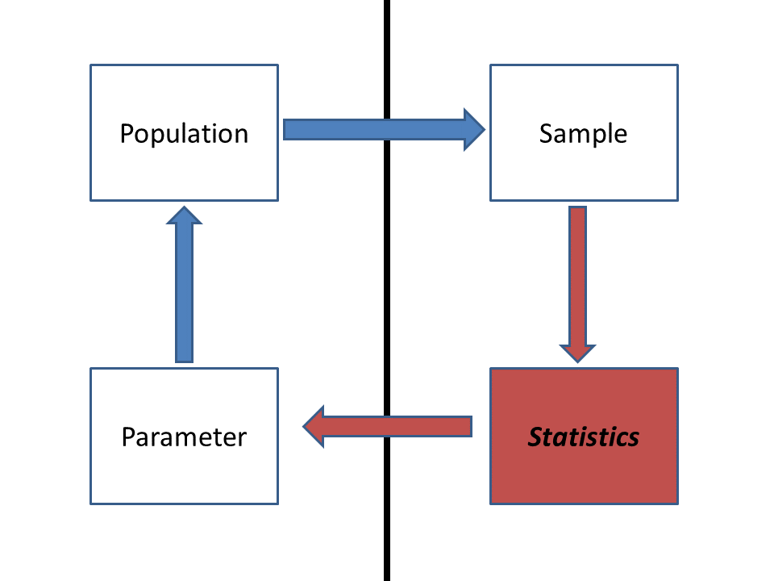

```{r setup, include=FALSE}

knitr::opts_chunk$set(echo = TRUE, cache = TRUE)

```

```{r echo=FALSE}

############################################################
####                                                    ####  
####  NRES 746, Lecture 1                               ####
####                                                    ####
####  Kevin Shoemaker                                   #### 
####  University of Nevada, Reno                        ####
####                                                    #### 
############################################################


############################################################
####  Computational algorithms vs standard statistics   ####
############################################################


```


**NOTE:** for those wishing to follow along with the R-based demo in class, [click here](LECTURE1.R) for an R-script that contains all of the code blocks in this lecture.   

## Algorithmic vs standard statistics: a brief demonstration

### Standard z-test

Here is a made-up data set. 


Let's imagine we're interested in testing whether the mean body mass of farm-raised Atlantic salmon fed on a new all-vegetarian diet has a lower body mass than the 'typical' farm-raised fish raised on a conventional diet after one year of growth.

Let's assume that we know the following information: 

First of all, we have been measuring the body mass of farm-raised salmon raised on a conventional diet for years, and we know that body mass for these individuals after one year closely follows a normal distribution with mean of 4.5 kg and standard deviation of 0.9 kg.

Secondly, we measured the body mass for 10 individuals raised on the new vegetarian diet after one year, and the measurements were as follows:

```
Ind 1  Ind 2  Ind 3  Ind 4  Ind 5  Ind 6  Ind 7  Ind 8  Ind 9 Ind 10 
3.14   3.27   2.56   3.77   3.34   4.32   3.84   2.19   5.24   3.09 
```

Finally, our alternative hypothesis is that the fish raised on the new diet will have lower body mass than fish raised on the conventional diet. 

Let's read this information into R:

```{r}

###################
# SALMON EXAMPLE (made-up!)

population.mean = 4.5
population.sd = 0.9

my.sample = c(3.14,3.27,2.56,3.77,3.34,4.32,3.84,2.19,5.24,3.09)

sample.size <- length(my.sample)     # determine sample size   

obs.samplemean = mean(my.sample)     # note the equal sign as assignment operator

## visualize the population of conventional-raised salmon

curve(dnorm(x,population.mean,population.sd),0,10,
      xlab="Body mass (kg)",ylab="Probability density")

## now overlay this on the observed data

hist(my.sample,freq=F,
     xlab="Body mass (kg)",ylab="Probability density",main="",
     xlim=c(0,10))
curve(dnorm(x,population.mean,population.sd),0,10,
      col="red",lwd=2,add=T)
abline(v=obs.samplemean,col="blue",lwd=3)

```

You may recognize this as the kind of problem that you would address using a standard z-test; we are assuming for now that the samples are independently drawn from a normally distributed population with known variance. In the z-test, we are testing whether our sample could plausibly have been drawn from the **null distribution** (fish raised on conventional diet), which in this case is a normal distribution with known mean and variance. If we did not know the population variance (the population variance was uncertain) we would use a t-test instead of a z-test. We can run a z-test in R easily using the 'BSDA' package, using just one line of code!  

```{r}

################
# Perform standard z-test
################

library(BSDA)
z.test(x=my.sample,mu=population.mean, sigma.x=population.sd,alternative = "less")

```

...and we quickly see that our sample mean is much smaller than we could ever expect to sample under the null hypothesis. Therefore we can conclude that the sample was NOT drawn from the null distribution, and that fish raised on the new diet tend to have lower body mass than other farm-raised fish raised on a conventional diet. 

Here's an alternative z-test performed using base R:

```{r}

############
# alternative z-test

std.err = population.sd/sqrt(sample.size)

curve(dnorm(x,population.mean,std.err),0,10,     # visualize the sampling distribution under null hypothesis
      xlab="Body mass (kg)",ylab="Probability density")     # versus the observed sample mean
abline(v=obs.samplemean,col="blue",lwd=3)

p.val = pnorm(obs.samplemean,population.mean,std.err)
p.val     # this is the same as the p value from the z-test above...

```

### Brute-force z-test

But imagine that we didn't know about the z-test. Let's build a solution to the same problem from the ground up, using our statistical intuition and R! Of course this is *totally unnecessary* in this case, but you will quickly run into problems with no simple, "canned" solution. That's where you might really need to develop an algorithm from scratch!

First, let's state the problem:

We want to know if the mean mass of 10 salmon raised on the new diet is less than the mean mass we would expect to observed if we sampled 10 random salmon raised on the conventional diet. 

We assume that our sample of individuals raised on the new diet is identical to other farm-raised fish- the only difference is the diet.

We also assume that every fish in our sample is independently drawn from an infinitely large theoretical population of farm-raised fish raised on the new diet. 

Let's build a simulation-based **algorithm** to generate a p-value! 

Recall the difference between a "population" and a "sample" in statistics:



Ultimately, we want to make inference about a **population**, but all we have in hand is the **sample**. So we compute one or more **statistics** from our sample and use probabilistic reasoning to infer what our sample says about the population-level **parameters** we are interested in. Because we didn't observe the whole population (the sample typically represents only a small fraction of the total population), there's often substantial uncertainty about how well the sample statistic actually represents the population of interest- this is called **sampling uncertainty**. 

Here, the *population* we are referring to is all farm-raised Atlantic salmon that are raised on the new vegetarian diet. The population *parameter* we are interested in is the mean body mass of these salmon after one year. The *sample* refers to all salmon actually measured as part of this study. Finally, the sample *statistic* is the observed mean body mass of all individuals in our sample.     

Let's start by simulating a *statistical population* under the null hypothesis (no treatment effect):  

```{r}

######################
   # ALTERNATIVE ALGORITHMIC APPROACH!
######################

#############
# Simulate the STATISTICAL POPULATION under the null hypothesis
#############

infinity <- 1000000  # large number approximating infinity 

popData_null <- rnorm(n=infinity,mean=population.mean,sd=population.sd)    # the statistical "population" of interest (under null model w no 'treatment' effect)

```

Then we can draw a **sample** from the null distribution:

```{r}

#############
# Draw a SAMPLE from that null data
#############

null.sample <- sample(popData_null,size=sample.size)    # use R's native "sample()" function to sample from the null distribution

round(null.sample,2)
null.samplemean <- mean(null.sample)  
null.samplemean    # here is one sample mean that we can generate under the null hypothesis

```

Try it! What did you get? It may differ quite a bit from what I got!

This null sample mean represents the mean of 10 fish sampled under a *null hypothesis* where there is no underlying difference in body mass between the conventional diet and the new diet. Of course, under the null hypothesis, the fish we measured were basically drawn from the null distribution- just like the random sample we just drew. The fact that this sample mean is not equal to 4.5 (the known population mean) represents **sampling error**.    

Our ultimate goal is to determine how likely it is that the observed difference between the sample mean (the mean body mass of the fish we actually measured) and the known population mean is just a meaningless artifact of sampling error! This is exactly what the **p-value** tells us!

**Q** To begin to **falsify** our null hypothesis about the population of interest, we need to determine the probability that random sampling error could produce a result at least as extreme as our observed sample statistic. Can you think of an algorithmic way to do this?

Let's generate a **sampling distribution** (distribution of sample statistics generated under the null hypothesis). 

Here, we repeat this sampling process many times (using a "FOR" loop in R), each time drawing a different random sample of body masses from our null data population.   

```{r}

#################
# Repeat this process using a FOR loop
#################

n.samples <- 1000                 # set the number of replicate samples to generate
null.samplemeans <- numeric(n.samples)       # initialize a storage vector for sample means under the null hypothesis

for(i in 1:n.samples){            # for each replicate... 
  this.nullsample <- sample(popData_null,size=sample.size)      # draw a sample of body masses assuming no treatment effect       
  null.samplemeans[i] <- mean(this.nullsample)           # compute and store the sampling distribution produced under the null hypothesis
}

hist(null.samplemeans,xlim=c(0,10))       # plot out the sampling distribution
abline(v=obs.samplemean,col="green",lwd=3)     # overlay the observed sample statistic. 

```

Now, all we need to do to compute a p-value is to compare this vector of sampling errors with the observed statistic (between-group difference):

```{r}

############
# Generate a p-value algorithmically!!
############

ordered_means <- sort(null.samplemeans)       # sort the vector of null sample means
more_extreme <- length(which(ordered_means<=obs.samplemean))       # how many of these sampling errors equal or exceed the "extremeness" of the observed statistic?
p_value <- more_extreme/n.samples       # compute a p-value! 
p_value    

```

Now, for convenience, let's collapse this all into a *function* for conducting our algorithmic t-test.

Here is the pseudocode:

Function inputs:   

* sample: the sampled data      
* pop.mean: the known population mean under the null hypothesis     
* pop.sd: the known population std deviation under the null hypothesis      
    
Function algorithm:     

* compute the sample mean    
* determine the sample size    
* do the following 1000 times:    
    - obtain a sample from the null data distribution of the same size as the observed data     
    - store the result     
* determine how many of the null samples were more extreme than the observed sample statistic     
* compute the p-value    

Function returns:      

* a list object with:     
    - null_dist: the sampling distribution under the null hypothesis     
    - p_value: the p-value!     
    - observed_mean: the sample mean    

Now let's write the function in R!    
        

```{r eval=FALSE}

#############
# Develop a function that wraps up all the above steps into one!
#############

z.test.algorithm <- function(sample, pop.mean, pop.sd){
  
  #############
  # Compute the sample statistic
  #############
  
  observed_mean <- mean(sample)
  
  sample.size <- length(sample)   # compute sample size

  #################
  # Generate SAMPLING DISTRIBUTION
  #################
  
  reps <- 1000                 # set the number of replicate samples
  null_dist <- numeric(reps)       # initialize a storage structure for sampling distribution
  
  for(i in 1:reps){            # for each replicate... 
    nullsamp <- rnorm(sample.size,pop.mean,pop.sd)      # draw a sample assuming no treatment effect       
    null_dist[i] <- mean(nullsamp)           # compute and store the sample produced under the null hypothesis
  }
  
  more.extreme <- length(which(null_dist<=observed_mean))       # how many of these are more extreme than the sample statistic?
  p_value <- more.extreme/reps
  
  to_return <- list()   # initialize object to return
  
  to_return$null_dist <- null_dist
  to_return$p_value <- p_value
  to_return$observed_mean <- observed_mean
  
  return(to_return)

}

ztest <- z.test.algorithm(sample = my.sample, pop.mean=population.mean, pop.sd=population.sd )   # try to run the new function

ztest$p_value     # get the p_value

hist(ztest$null_dist)       # plot out all the samples under the null hypothesis as a histogram
abline(v=ztest$observed_mean,col="green",lwd=3)     # indicate the observed sample statistic. 

```


#### Take-home message
The value of the algorithmic, brute-force approach to statistics is the flexibility! We have to be aware of assumptions in all of our analyses, but when we build our own computational algorithms, we can easily "relax" these assumptions! We only make the assumptions we are comfortable making. And we have to be totally explicit about our assumptions, because they are literally built into the code- we can't ignore any assumptions!


### A non-parametric t-test: permutation t-test

What if we don't want to make any assumptions about the process that generated the data? The normal distribution can arise in many different ways (according to the central limit theorem), but many data-generating processes **don't** result in a normal distribution!

We might be able to imagine which of the many alternative distributions makes the most sense for our data. But many times we can't do this with any level of certainty. What can we do in this case? A *permutation test* provides one answer.

This is a *nonparametric* test, meaning it does not make any assumptions about how the population parameter of interest is distributed.


#### example: pygmy short-horned lizard


Let’s imagine we’re interested in testing whether the expected mass of a study organism (let’s say a pygmy short-horned lizard, *Phrynosoma douglasii*) in Treatment A (e.g., habitat restoration treatment) differs from Treatment B (e.g., no habitat restoration). In other words: does knowledge of an individuals treatment status contribute anything to understanding and/or predicting an individual’s mass?

In this case, our alternative hypothesis is two-tailed: the treatment means are different, but treatment A mean could be larger or smaller than treatment B mean. 

```{r}

#############
# Start with a made-up data frame!
#############

df <- data.frame(
  A = c(175, 168, 168, 190, 156, 181, 182, 175, 174, 179),
  B = c(185, 169, 173, 173, 188, 186, 175, 174, 179, 180) 
)

summary(df)    # summarize! 

sample.size <- length(df$A)     # determine sample size    

#######
# Get data in proper format

reshape_df <- data.frame(                # "reshape" the data frame so each observation gets its own row (standard 'tidy' format)
  Treatment = rep(c("A","B"),each=sample.size),
  Mass = c(df$A,df$B),
  stringsAsFactors = T
)


########
# Alternative (commented out)- using the 'tidyverse'

# library(tidyr)
# reshape_df <- pivot_longer(df,everything(),names_to = "Treatment",values_to="Mass")


plot(Mass~Treatment, data=reshape_df)    # explore/visualize the data

#######
# Compute the observed difference between group means

observed_dif <- mean(reshape_df$Mass[reshape_df$Treatment=="A"])	- mean(reshape_df$Mass[reshape_df$Treatment=="B"])


```

Here, our goal will be to determine if the observed difference between the two group means could plausibly result from random sampling under the null hypothesis. This time, we want to generate a p-value that represents the probability that random sampling (under the null hypothesis) could result in a difference as or more extreme than the observed difference. 

Let's build this permutation-test algorithm together. 

Here is some **pseudocode**:

1. Define the number of permutations to run (number of replicate samples to generate)     
2. Define a storage vector with the same number of elements as the number of samples to generate.
3. For each replicate sample:
    a. Assign each observation to a random treatment group (A or B)
    b. Compute the difference between the group means after assigning each observation to a random treatment group
    c. Store this value in the storage vector
4. Plot a histogram of the differences between group means under the null hypothesis (null sampling distribution)
5. Add a vertical line to the plot to indicate the observed difference between group means
6. Compute a p-value


```{r}

##################
# NON-PARAMETRIC T-TEST -- PERMUTATION TEST
##################

reps <- 5000            # Define the number of permutations to run (number of replicates)
null_difs <- numeric(reps)   # initialize storage variable
for (i in 1:reps){			# For each replicate:		
  newGroup <- reshape_df$Treatment[sample(c(1:nrow(reshape_df)))]			   # randomly shuffle the observed data with respect to treatment group
	dif <- mean(reshape_df$Mass[newGroup=="A"])	- mean(reshape_df$Mass[newGroup=="B"])	   #  compute the difference between the group means after reshuffling the data
	null_difs[i] <- dif	    # store this value in a vector
}
hist(null_difs)    # Plot a histogram of null differences between group A and group B under the null hypothesis (sampling errors)
abline(v=observed_dif,col="green",lwd=3)   # Add a vertical line to the plot to indicate the observed difference

```

Now we can compute a p-value, just as we did before:

```{r}

########
# Compute a p-value based on the permutation test, just like we did before (except now 2-tailed)!
########

more_extreme <- length(which(abs(null_difs)>=abs(observed_dif)))
p_value <- more_extreme/reps  
p_value

```


Again, for convenience, let's package this new permutation-based t test into an R function:    

```{r eval=FALSE}

#############
# Develop a function that performs a permutation-t-test!
#############

t.test.permutation <- function(dat = reshape_df, group = "Treatment", value = "Mass" ){
  
  #############
  # Compute the sample statistic
  #############
  
  indexA <- which(dat[,group]=="A")     # rows representing treatment A
  indexB <- which(dat[,group]=="B")     # rows representing treatment B
  observed_dif <- mean(dat[indexA,value]) - mean(dat[indexB,value])
  
  reps <- 5000            # Define the number of permutations to run (number of replicates)
  null_difs <- numeric(reps)   # initialize storage variable
  for (i in 1:reps){			# For each replicate:		
    newGroup <- reshape_df$Treatment[sample(c(1:nrow(reshape_df)))]			   # randomly shuffle the observed data with respect to treatment group
  	dif <- mean(reshape_df$Mass[newGroup=="A"])	- mean(reshape_df$Mass[newGroup=="B"])	   #  compute the difference between the group means after reshuffling the data
  	null_difs[i] <- dif	    # store this value in a vector
  }
  
  more_extreme <- length(which(abs(null_difs)>=abs(observed_dif)))
  p_value <- more_extreme/reps  
  
  to_return <- list()   # initialize object to return
  
  to_return$null_difs <- null_difs
  to_return$p_value <- p_value
  to_return$observed_dif <- observed_dif
  
  return(to_return)
  
}

my.ttest <- t.test.permutation()   # use default values for all function arguments

my.ttest$p_value

hist(my.ttest$null_difs)    # Plot a histogram of null differences between group A and group B under the null hypothesis (sampling errors)
abline(v=my.ttest$observed_dif,col="green",lwd=3)   # Add a vertical line to the plot to indicate the observed difference


```


## Bootstrapping a confidence interval

Let's imagine we want to compare different predictor variables in terms of how strong the relationship is with a response variable. In this case, we will use the coefficient of determination ($R^2$) as a measure of how good a predictor is. However, we want to be able to say that one predictor is definitively *better* than another one -- for that, we would like a confidence interval around the $R^2$ value.

But... none of the standard R packages provides a confidence interval for the $R^2$ value... What do do???

With an algorithmic approach to statistics, getting stuck is not an option. We can just write some code!

Let's use the "trees" dataset provided in base R:

```{r}

##############
# Demonstration: bootstrapping a confidence interval!

## use the "trees" dataset in R:

head(trees)   # use help(trees) for more information

```

Tree volume is our response variable. We want to test whether girth or height are better predictors of tree volume. 

Let's first do some basic data exploration:

```{r}

#########
# Basic data exploration

plot(trees$Volume~trees$Height, main = 'Black Cherry Tree Height/Volume Relationship', xlab = 'Height', ylab = 'Volume', pch = 16, col ='blue')
plot(trees$Volume~trees$Girth, main = 'Black Cherry Tree Girth/Volume Relationship', xlab = 'Girth', ylab = 'Volume', pch = 16, col ='red')

```

Let's write a simple function that generates coefficients of determination given a response and some predictor variables:

```{r}

#########
# Function for returning a vector of R-squared statistics from models regressing a response variable on multiple possible predictor variables
   # here we assume that all columns in the input data frame that are NOT the response variable are potential predictor variables.

Rsquared <- function(df,responsevar="Volume"){    # univariate models only- interaction and multiple regression not implemented here
  response <- df[,responsevar]       # extract the response variable
  names <- names(df)                  
  rsq <- numeric(length(names))        # named storage vector
  names(rsq) <- names(df)               
  rsq <- rsq[names(rsq)!=responsevar]           # assume that all columns that are not the response variable are possible predictor variables
  for(i in names(rsq)){         # loop through predictors
      predictor <- df[,i]                  # extract this predictor
      model <- lm(response~predictor)       # regress response on predictor
      rsq[i] <- summary(model)$r.square       # extract R-squared statistic
  }
  return(rsq)     
}

```


Let's first compute the $R^2$ values for all predictor variables:

```{r}

#########
# test the function to see if it works!

stat <- Rsquared(trees,"Volume")
stat

```


Now we can use a "bootstrapping" procedure to generate a confidence interval around these values, to see how certain we can be about the strength of the linear relationship between the response and the predictor variable in general (the population-level *parameter*) on the basis of the computed R-squared value (a sample *statistic*)  

Let's first write a function to generate bootstrap samples from a data set:

```{r}

############
# new function to generate "bootstrap" samples from a data frame

boot_sample <- function(df,statfunc,n_samples,responsevar="Volume"){
  indices <- c(1:nrow(df))
  output <- matrix(NA,nrow=n_samples,ncol=ncol(df)-1)        # storage object- to store a single bootstrapped sample from the original data
  
  for(i in 1:n_samples){              # for each bootstrap replicate:
    boot_rows <- sample(indices,size=nrow(df),replace=T)         # randomly sample observations with replacement
    newdf <- df[boot_rows,]                       # dataframe of bootstrapped observations
    output[i,] <- statfunc(newdf,responsevar)                 # generate statistics from the bootstrapped sample  (e.g., compute Rsquared after regressing y on all possible x variables)
  }
  return(output)
}

```

Now we can generate a bunch of "bootstrapped" statistics to compare with the ones we calculated from the full dataset. Here, the values represent R-squared values from alternative bootstrapped samples. Each row is a different bootstrapped sample, and each column is a different predictor variable. 

```{r}

##########
# Generate a few bootstrapped samples!

boot <- boot_sample(df=trees,statfunc=Rsquared,n_samples=10)       # generate test stats from lots of bootstrapped samples
colnames(boot) <- names(stat)         # name the columns to recall which predictor variables they represent

boot
stat

```

Finally, we can use the quantiles of the bootstrap samples to generate bootstrap confidence intervals.

```{r}

#############
# use bootstrapping to generate confidence intervals for R-squared statistic!

boot <- boot_sample(df=trees,statfunc=Rsquared,n_samples=1000)   # generate test statistics (Rsquared vals) for 1000 bootstrap samples
confint <- apply(boot,2,function(t)  quantile(t,c(0.025,0.5,0.975)))       # summarize the quantiles to generate confidence intervals for each predictor variable
colnames(confint) <- names(stat)
t(confint)


```

Again, don't feel bad if you don't understand all the code yet. At this point, I just want you to understand the value of being able to program your own data analysis algorithms. 

* It allows you to run custom analyses that you can't run any other way.      
* It allows you to 'relax' assumptions that standard analyses may make    
* It allows you to formalize your understanding of how your data were generated, and use this understanding to make the most of your data      
* It's fun!     


[--go to next lecture--](LECTURE2.html) 


