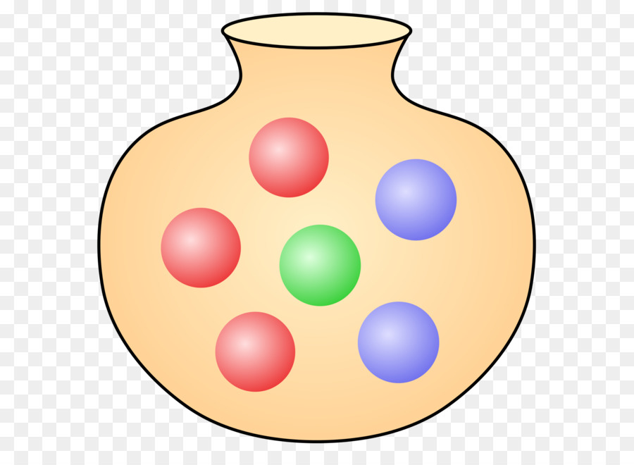
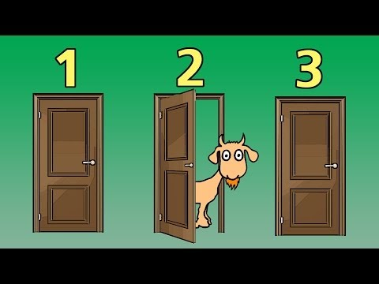

```{r setup, include=FALSE}

knitr::opts_chunk$set(echo = TRUE, cache = TRUE)

```

```{r echo=FALSE}

#  NRES 746, Lecture 2  ---------------------------           
##  University of Nevada, Reno     
##  Working with Probabilities                   

```


**NOTE:** if you'd like to follow along with the R-based demo in class, [click here](LECTURE2.R) for the companion R-script for this lecture.   

In the last class, we reviewed basic programming in R, using iteration (e.g., "for()", "while()") and random sampling (e.g., using the 'sample()' function in R) to build custom analyses using intuition. 

We began this way because the ability to understand, use, and build algorithms is fundamental to modern data analysis.

Also fundamental to modern data analysis is an ability to work with probabilities and probability distributions. This is a high-level review, and is not new for many of you, but I want to ensure that we are working with solid foundations before we venture into more advanced topics.

## Probability

In probability theory, we start by defining the **sample space**, often referenced as $\Omega$. This is the set of all possible outcomes of a random trial (or **experiment**). 

We then define an **event** as a subset of the sample space- events are what we will ultimately assign a probability to. 

For example, if the sample space consists of all possible tosses of two fair coins, then the sample space $\Omega$ is the set {HH,HT,TH,TT}, and possible events could be "all heads" {HH} or "at least one head" {HT,HH,TH}.

**Disjoint** events are mutually exclusive: if event A occurs then event B cannot also occur. 

Finally, a **probability** is a number between 0 and 1 that corresponds to any measurable event. 

A **probability space** combines the whole trio: sample space, event space, and probability measure:$\{\Omega,F,P\}$. You'll see this a lot more if you do any further courses or readings on probability theory. 

When the sample space (and events within this space) is mapped onto the real number line, $\mathbb{R}$, then we call this mapping a **random variable** (often denoted with a capital letter, like X). Think of this as a placeholder for any possible numeric outcome of a random trial - like a coin that could come up heads (e.g, 0) or tails (e.g., 1). Note that the exact assignment here is arbitrary- we could have assigned a "1" to heads. But all that really matters is that the sample space ("Heads", "Tails") is now mapped onto the real number line in some way. 

For a coin flip, we often define a random variable X that can take one of the numeric values from the set {0,1}. For example, if the coin comes up tails we assign a "1" and a heads is assigned the value "0". For a fair coin, either event (0 or 1) is equally likely- so both events are assigned a probability of 0.5.

A **probability distribution** is a function that maps all outcomes of a random trial (experiment) to a corresponding probability measure.  

### Axioms of probability

Now it's time to introduce Kolmogorov's axioms of probability. Pretty much all of probability theory can be derived deductively from this set of axioms.

1. The probability of an event is a non-negative real number [read: all probabilities are non-negative!]

$$P(E) \in \mathbb{R}, P(E) \ge 0 \; \forall E \in F$$, where F is the 'event space'

2. The probability that an event from the full sample space will occur is 1 [read: probability distributions must sum to 1]

$$P(\Omega)=1$$

3. The probability of any one of several disjoint events occurring is equal to the sum of their individual probabilities [read: if an event comprises a set of disjoint elements, you can add the probabilities of these disjoint components together to compute the probability of this event]

$$P(\bigcup_{i=1}^{\infty}E_i) = \sum_{i=1}^{\infty} P(E_i)$$

### Classic Urn Example 

Consider an urn filled with blue, red, and green spheres. To make the example more concrete, assume the following:

  * red: 104
  * blue: 55
  * green: 30
  
{width=30%}


```{r}

# Classic Urn Example ------------------------

Urn_summary <- c(
  red=104,
  blue=55,
  green=30
)

set.seed(1001)
Urn_contents <- sample(rep(names(Urn_summary),times=Urn_summary))

table(Urn_contents)   # verify that the contents are what you expect!

```
We will assign the number 1 to blue, 2 to green, and 3 to red. 

What is the probability of drawing a blue sphere from the urn?

$$P(X=1)$$ 

(read: what is the probability of drawing a blue sphere (event X=1) from the urn (sample space $\Omega$ of possible colors))

To compute this, we can enumerate the total size of the *sample space* (number of balls in the urn) by summing them up [following the third axiom of probability, since each ball represents a disjoint element of the sample space]. 

Assuming each ball is equally likely to be picked (uniform probability measure- that is the probability measure is spread evenly across all 'atoms' of the sample space), the probability of any event can be computed as:

$$\frac{1}{\left\lVert {\Omega}\right\rVert}\cdot\left\lVert {X=1}\right\rVert$$, where $\left\lVert {F}\right\rVert$ is the number of disjoint elements in the event F.

In plain English, this means we enumerate the number of blue balls and divide by the total number of balls in the urn.

```{r}

P_blue <- sum(Urn_contents=="blue")/length(Urn_contents) # probability of drawing a blue sphere
P_blue

```

Let's generate a vector of probabilities for drawing each type of sphere...

```{r}

Prob <- table(Urn_contents)/length(Urn_contents)    # probability of drawing each type of sphere
Prob

```
**Q:** is this a probability distribution? How can you tell?

What is the probability of drawing a blue **OR** a red sphere?

```{r}

as.numeric( Prob["blue"] + Prob["red"] )     # probability of drawing a blue or red sphere

```

What is the probability of drawing a blue **OR** a red sphere **OR** a green sphere?

```{r}

as.numeric( Prob["blue"] + Prob["red"] + Prob["green"] )      # P(blue OR green)

```

**Q**: What would it mean if this didn't sum to 1?

What is the probability of drawing a blue **AND THEN** a red sphere? With replacement? Without replacement?

**NOTE:** in the next examples, assume that objects are replaced and that the urn is re-randomized before any subsequent draws! That is, we are "*sampling with replacement*"

```{r}

# Question: What is the probability of drawing a blue **AND THEN** a red sphere? 

#[your command here]    # P(blue AND THEN red)

```


```{r echo=FALSE, eval=FALSE}

as.numeric( Prob["blue"] * Prob["red"] )    # P(blue AND THEN red)

```

What is the probability of drawing a blue and a red sphere in two consecutive draws (but in no particular order)?

```{r}

#### Question: What is the probability of drawing a blue and a red sphere in two consecutive draws (but in no particular order)? 

#[your command here]    # P(blue AND THEN red)

```

```{r echo=FALSE, eval=FALSE}
as.numeric( (Prob["blue"] * Prob["red"]) + (Prob["red"] * Prob["blue"]) )    # P(blue then red OR red then blue)

# alternative:

# (Prob["blue"]+Prob["red"])^2-Prob["blue"]^2-Prob["red"]^2


```

### Another urn example

Now consider an urn filled with blue & red objects of two different types: spheres & cubes. To make the example more concrete, assume the following:

* red sphere: 39       
* blue sphere: 76         
* red cube: 101     
* blue cube: 25     

```{r}

# Urn example #2: color and shape --------------------------

Urn_summary <- matrix(NA,2,2,dimnames = list(Color=c("red","blue"),Shape=c("sphere","cube") ))
Urn_summary["red","sphere"] <- 39   # contents of new urn
Urn_summary["blue","sphere"] <- 76
Urn_summary["red","cube"] <- 101   
Urn_summary["blue","cube"] <- 25
Urn_summary

Prob = Urn_summary/sum(Urn_summary)

```
Compute **marginal probabilities** for shape and color. 

```{r}

Prob_Shape <- colSums(Urn_summary)/sum(Urn_summary)  # marginal probabilities of shape
Prob_Shape

Prob_Color <- rowSums(Urn_summary)/sum(Urn_summary)    # marginal probabilities of color
Prob_Color

```
#### Joint probability (intersection of events)

What is the *joint probability* of drawing an object that is both blue AND a cube?  $Prob(blue\bigcap cube)$

```{r}

as.numeric( Prob_Color["blue"] * Prob_Shape["cube"])      # joint probability of drawing a blue object that is a cube

## NOTE: if the above answer is not correct, please correct it! 

```

**Q**: Is this correct? If not, why?

**Q**: Under what circumstances would this be correct?

What is the correct answer?

```{r echo=FALSE}

Prob["blue","cube"]        # or... is this the probability of drawing a blue cube?  

## alternatively:

# Prob_Color["blue"]*(Prob["blue","cube"]/Prob_Color["blue"])

```

#### Union of 2 events

What is the probability of drawing an object that is blue **OR** a cube?   $Prob(blue\bigcup cube)$

```{r}

as.numeric( Prob_Color["blue"] + Prob_Shape["cube"])        # probability of drawing something blue or something cube-shaped...

## NOTE: if the above answer is not correct, please correct it!  


```

**Q**: Is this correct? If not, why? How would you compute the correct answer??  

**Q**: What is the correct answer?

```{r echo=FALSE}

as.numeric( Prob_Color["blue"] + Prob_Shape["cube"] - Prob["blue","cube"]   )     # not disjoint

```

#### Conditional probability

What is the **conditional probability** of drawing a blue object (event = blue), given that it is a cube (event = cube)?    $Prob(blue|cube)$

This can be expressed as:  $$Prob(blue|cube) = Prob(blue,cube) / Prob(cube)$$

With conditional probabilities, we can think of zooming in such that our sample space now comprises only those objects that are cubes. Mathematically, dividing by the probability of an event is the same thing as conditioning on an event (removing all outcomes from the event space except for those that belong to the event). Can you prove this? 

```{r}

Prob["blue","cube"] / Prob_Shape["cube"]   # probability of drawing a blue object, given it is a cube

```

#### Joint probability (correct formula)

Now we can express the correct *joint probability* of drawing a blue cube in terms of conditional probabilities!  $blue \bigcap cube$

This is the proper way of computing joint probabilities (intersections of 2 events) when you can't assume the events are independent!

$Prob(blue\bigcap cube) = Prob(cube|blue) * Prob(blue)$

Does this now give us the correct answer?

```{r}

as.numeric( (Prob["blue","cube"] / Prob_Shape["cube"]) * Prob_Shape["cube"])   # probability of drawing a blue cube... using conditional probabilities

Prob["blue","cube"]   # check answer to make sure it's right

```

#### Independence (correct definition)

Also, what does it mean for the probability of the event [object is cube] to be independent from the event [object is blue]? 

In this case, independence just means that the probability of blue is the same regardless of whether or not an object is a cube. Alternatively, the probability of cube is the same regardless of whether or not an object is blue.In this case, the conditional probability $Prob(cube|blue)$ is the same as the marginal probability of being a cube ($Prob(cube)$).

In general, two events are independent if their conditional probabilities are equal to their marginal probabilities. 

Looking at the formula for joint probabilities above, how could you modify this for two independent events? 

Does it make sense why the joint probability of independent events is simply the product of their marginal probabilities?  [this fact is central to nearly all statistical analysis!!]

#### Unconditional, or marginal, probability

What is the unconditional probability of drawing a blue item, regardless of shape?

Here we use the **law of total probability**, which is just a restatement of the third axiom: the total or unconditional probability of an event is the sum of all the experimental outcomes that comprise the event. In this case, the unconditional probability of drawing a blue item can be expressed:

$Prob(blue|cube)\cdot Prob(cube) + Prob(blue|not cube) \cdot Prob(not cube)$  

This is the sum of all ways you can possibly be blue!

```{r}

# unconditional probability of drawing a blue item.  Seems too complicated, but this method of computing unconditional probabilities will prove useful as we get into Bayesian statistics!
uncond_prob_blue <- (Prob["blue","cube"] /  Prob_Shape["cube"]) * Prob_Shape["cube"] + 
              (Prob["blue","sphere"] / Prob_Shape["sphere"]) * Prob_Shape["sphere"]       

as.numeric(uncond_prob_blue)

```

Unconditional probability is also known as *marginal probability* because it can be computed by taking the sum across rows (for column margins) or across columns (for row margins):

```{r}

Prob_Shape <- colSums(Urn_summary)/sum(Urn_summary)  # marginal probabilities of shape
Prob_Shape

Prob_Color <- rowSums(Urn_summary)/sum(Urn_summary)    # marginal probabilities of color
Prob_Color

Prob_Color["blue"]      # marginal probability of drawing a blue object (across all possible shapes)

```

**Q**: What does it mean if the conditional probability of drawing a blue item (e.g., given it is a cube) is equal to the unconditional probability of drawing a blue item?

### Medical Testing Example

Pretty much any text or lecture on conditional probability will start with this kind of example- and there's a good reason for that! It is both a striking result and practically important. And quite non-intuitive for most people!

Suppose the infection rate (prevalence) for a rare disease is one in a million:

```{r}

# Medical example (positive predictive value) --------------------------

Prob_Disease <- c(0.000001, 0.999999)     # marginal probability of disease vs no disease
names(Prob_Disease) <- c("yes","no")                # make it a named vector!
Prob_Disease

```

Suppose there is a test that never gives a false negative result (if you've got it you will test positive) but occasionally gives a false positive result (if you don't have it, you still might test positive for the disease). Let's suppose the false positive rate is 1%. 

Medical professionals (and even more so, their patients!) often want to know the probability that a positive-testing patient actually has the disease. This quantity is known as the *Positive Predictive Value* or PPV. How can we compute this?

Stated another way, we want to know the *conditional probability* of having the disease, given the test came out positive:

$Prob(Disease|+test)$   

What do we know already?  

First of all, we know the *conditional probability* of having a _positive_ test result given the patient _has the disease_:

$Prob(+test|Disease) = 1$  

Secondly, we know the *conditional probability* of having a _positive_ test result given the patient _doesn't have the disease_

$Prob(+test|no Disease) = 0.01$

Third, we know the *unconditional probability* (marginal probability) of having the disease

$Prob(Disease) = 0.000001$   

What is the *unconditional probability* of having a _positive_ test result? 

$Prob(+test)$  

This is the probability of testing positive, regardless of whether or not you have the disease. How to compute this? Well, we can either test positive and have the disease or we can test positive and not have the disease. If we add up both of those disjoint possibilities (applying the third axiom of probability, or the **law of total probability**), we get the unconditional probability of testing positive. Here we are *marginalizing across* disease status. 

$Prob(+test\bigcap Disease) + Prob(+test\bigcap no Disease)$   

$Prob(+test|Disease)*Prob(Disease) + Prob(+test|no Disease)*Prob(no Disease)$


```{r}

## compute the unconditional probability of testing positive

as.numeric( 1*Prob_Disease["yes"] + 0.01*Prob_Disease["no"] )    # Prob(+test|Disease)*Prob(Disease) + Prob(+test|no Disease)*Prob(no Disease)

```
Now, let's use basic probability rules to compute the PPV!  

Let's summarize the scenario. So now we have:

$Prob(+test|Disease) = 1$      
$Prob(Disease) = 0.000001$      
$Prob(+test) = 0.01000099$      

How can we use these components to compute what we want: $PPV = Prob(Disease|+test)$? 

**Q**: What is the the *joint probability* of testing positive and being infected?

**Q**: How do you go from there (JOINT prob of testing positive AND having the disease) to the CONDITIONAL probability of having the disease given a positive test result?

**Q**: What's the PPV??

**Q**: So should you be worried if you get a positive test result in this case?

Re-structure your PPV equation so that you consider the positive test result to be the "Data" and the positive disease status to be the "Hypothesis"   

Can you guess the name of this rule of probability, which is at the core of **Bayesian statistics**?

[In class- discussion of 'natural frequency' interpretation of the same medical result problem]

[In class- geometric interpretation of Bayes Rule]

### Frequentism vs. Bayesianism (an aside)

#### What is Frequentist statistics?
Under this paradigm, truth is hidden behind a veil of sampling variability. If we had perfect knowledge (infinite sample size) we would know the answers we seek. The only thing that prevents us from having 100% certainty is that we can't observe everything- instead we must rely on a small sample from the population of interest. The unknowable truth is fixed- it is absolutely NOT a random variable. However, we can account for sampling variability by conceiving of our sample data as one of many possible samples we could have sampled. We can then treat our sample, and any statistics derived from our sample, as a random variable. In this way, we can account for sampling error, and thereby quantify the uncertainty and reliability of our results. For example, we may reject a "no-effect" null hypothesis if our data are inconsistent with random sampling variability under this null hypothesis (this is the ubiquitous p-value!).      

#### What is Bayesianism
Bayesian analytical methods allow us to describe our uncertainty about parameters of interest using probability distributions- that is, the truth value of a hypothesis can be modeled as a random variable! For example, if we fit a linear regression model, Bayesian statistics can tell us the degree to which we believe that a regression coefficient (e.g., $\beta_{1}$) is greater than zero because the coefficient itself has a probability distribution associated with it (called the "posterior distribution"). In Bayesian statistics, probability is interpreted as a _degree of belief_ about the truth (e.g., the true value of a regression coefficient, or the degree of believe to place on a particular hypothesis). That said, Bayesian analyses require specifying a *prior probability* on all statements of truth (what we know before we collect any data). This can raise some issues: for example, what if you don't have any prior knowledge about the truth? 

### Which paradigm is better?
We will not delve into the long-standing debate between the Bayesian and frequentist paradigms, but I encourage you to read more about this: for example, in the excellent volume "The Nature of Scientific Evidence" edited by Taper and Lele. 

The pragmatic analyst admits that they are both useful in different context, and uses both paradigms freely!! 

However, the central concept in this class is **Likelihood**, defined as: $Prob(data|model)$. The likelihood concept is central to both Bayesian and Frequentist statistics!

{width=60%,height=60%}

**Q**: Can you write out the sun-exploding problem in terms of Bayes Rule? Can you solve it... approximately?

[In class: Bayesian updating by multiplying the prior odds by the Bayes Factor]

If there is time:

## Let's make a deal (the Monty Hall problem)!

This is another classic but fun example for introducing Bayes rule... 

The setup: you are in a game show, called *Let's Make a Deal*! There are three doors in front of you. One hides a fancy prize and the other two hide goats. 

{width=60%}  

You pick door 1. Before you see what’s behind door 1, the host, Monty Hall, opens door 2 to reveal a goat. Now you have two choices: 

**Choice "STAY"**: stick with your original choice of door 1        
**Choice "SWITCH"**: switch to door 3 (you wouldn't switch to door 2 of course. You don't like goats, and you can't keep it even if you did) 

Should you switch? 

NOTE: no matter which door you choose at first, Monty will always open one of the other doors, and will never open the door with the prize (he knows where the prize is, after all). 

Here's a photo of Monty, just so you know who you're dealing with:    

{width=25%}

Given the new info, we now know the prize isn't behind door 2. We want to know $Prob(door1|info)$ and $Prob(door3|info)$. Let's focus on the first one- the **posterior** probability of the prize being behind door 1, given the new information we now have (Monty opened door 2).

Let's say our hypothesis is that the prize is behind door 1 -- we can call this the "stay" hypothesis, because if we believed this were the case, we had better keep door 1 as our choice and not switch to door 3! 

As for the **priors** (knowledge about which door the prize is behind at the beginning of the game), let's assign a _discrete uniform distribution_ (equal probability mass assigned to each of a discrete set of possibilities). So the **prior** probability of the prize being behind door 1 is $\frac{1}{3}$.     

$Prob(door1) = 1/3$    

The new data/intel we have ($info$) is that Monty opened door 2 to reveal a goat. Let's apply Bayes rule!!

$Prob(Hypothesis|Data) = \frac{Prob(Data|Hypothesis) \cdot Prob(Hypothesis)}{Prob(Data)}$

The first component of the numerator above, $Prob(Data|Hypothesis)$ is known as the **likelihood**. 

So... what is the likelihood of the data (Monty opened door 2) under the "stay" hypothesis (the hypothesis that the prize is behind door 1, which we originally chose), $Prob(info|door1)$?   

The second component of the numerator, $Prob(Hypothesis)$, is known as the **prior**. We already know this is equal to 1/3.

The denominator in Bayes theorem -- in this case, $Prob(info)$ -- is known as the **unconditional probability of the data**, or the **normalizing constant** (meaning it ensures that the posterior distribution is a true probability distribution). 

One way to get the unconditional probability of the data is to sum up the (mututally exclusive) joint data probabilities across all possible models:

$Prob(info) = Prob(info,door1) + Prob(info,door2) + Prob(info,door3)$

--or--

$Prob(info) = Prob(info|door1)\cdot Prob(door1) + Prob(info|door2)\cdot Prob(door2) + Prob(info|door3)\cdot Prob(door3)$    

In plain English: either A (Monty opened door 2 and prize is behind door 1) is true *or* B (Monty opened door 2 and prize is behind door 2) is true *or* C (Monty opened door 2 and prize is behind door 3) is true -- and these possibilities are mutually exclusive). 

One of these possibilities is patently false *a priori*! 

So what's our degree of belief about the prize being behind door 1 (the "stay" hypothesis)?

What's our degree of belief about door 3 (the "switch" hypothesis)?

What should we do if we want to maximize our probability of winning the game??

Does this probability calculus convince you?  Another way to convince yourself would be to simply simulate this result to convince ourselves that switching is the right move. Here is an R function for doing this:

```{r}

# Monty Hall simulation code --------------
#   (code by Corey Chivers 2012)
 
monty<-function(strat='stay',N=1000,print_games=TRUE){
  doors<-1:3 #initialize the doors behind one of which is a good prize
  win<-0 #to keep track of number of wins
  
  for(i in 1:N){
    prize<-floor(runif(1,1,4)) #randomize which door has the good prize
    guess<-floor(runif(1,1,4)) #guess a door at random
    
    ## Reveal one of the doors you didn't pick which has a bum prize
    if(prize!=guess)
      reveal<-doors[-c(prize,guess)]
    else
      reveal<-sample(doors[-c(prize,guess)],1)
    
    ## Stay with your initial guess or switch
    if(strat=='switch')
      select<-doors[-c(reveal,guess)]
    if(strat=='stay')
      select<-guess
    if(strat=='random')
      select<-sample(doors[-reveal],1)
    
    ## Count up your wins
    if(select==prize){
      win<-win+1
      outcome<-'Winner!'
    }else
      outcome<-'Loser!'
    
    if(print_games)
      cat(paste('Guess: ',guess,
          '\nRevealed: ',reveal,
          '\nSelection: ',select,
          '\nPrize door: ',prize,
          '\n',outcome,'\n\n',sep=''))
  }
  cat(paste('Using the ',strat,' strategy, your win percentage was ',win/N*100,'%\n',sep='')) #Print the win percentage of your strategy
}

```

Now we can test out the different strategies.

```{r}

# run the monty hall code!

monty(strat="stay",print_games=FALSE)

```

And try a different strategy...

```{r}

# run the monty hall code!

monty(strat="switch",print_games=FALSE)

```

What if we had more prior information – say, there was a strong smell of goat coming from door 3? The priors would be different ( $Prob(1) > Prob(3)$ ). The likelihoods would remain exactly the same, but the posterior for door 1 would be greater than 1/3. How strong would the odor have to be to convince you to stay rather than switch?  

That’s one benefit of the Bayesian approach – you can integrate all the available information! Think about the XKCD comic above... Does it make sense that the Bayesian approach might have less of a tendency to produce "ridiculous" answers?


## Probability distributions

### Discrete vs. continuous

In *discrete distributions*, each potential outcome has a real probability of being sampled (like the probability of flipping a coin 10 times and getting 4 heads). For example, let's consider the Poisson distribution:

$$P_{(X=x)} = \frac{e^{-\lambda}\lambda^x}{x!}$$


```{r}

# Probability distributions in R  ---------------------

mean <- 5
rpois(10,mean)    # the random numbers are integers with no decimal component

## Discrete -------------------------

             # plot a discrete distribution!
xvals <- seq(0,15,1)
probs <- dpois(xvals,lambda=mean)
names(probs) <- xvals
               
barplot(probs,ylab="Probability",main="Poisson distribution (discrete)")

barplot(cumsum(probs),ylab="Cumulative Probability",main="Poisson distribution (discrete)")   # cumulative distribution

sum(probs)   # just to make sure it sums to 1!  Does it??? 

```

In *continuous random variables*, we use a *probability density function*, $f(x)$ to describe the shape of a probability distribution, not a probability mass function as we do for discrete random variables. 

This is because the probability of getting any specific value in a continuous distribution is technically zero (since every draw is unique if we consider infinite decimal points). 

The sum (or integral) of any probability distribution across its full sample space must be 1 (there is only 100% of probability to go around). However, in a continuous distribution, there are an infinite number of possible values of x within any interval no matter how tiny it is. Therefore we have to talk about the slightly abstract concept of *probability density*. 

The height of the graph of a probability density function represents probability density, not probability per se -- we need to think of probability itself as the area of the curve, not its height! The height itself has no area- its probability is zero. If we make it a thin rectangle, then it becomes a probability.

In this context, a probability *mass* can only be associated with one or more intervals within the support for the distribution. That is, $Prob(x = 5) = 0$, but $Prob(4 < x < 6)$ or $Prob(x > 5)$ may be associated with non-zero probabilities.

More formally, to compute probabilities from a probability density function, we need to use integration. For example, to determine the probability of a continuous random variable taking values between a and b, we can compute:

$$P_X(a\le x \le b) =\int_a^b f(x)dx$$

Let's consider the beta distribution: 

$$f(x) = \frac{x^{\alpha-1}(1-x)^{\beta-1}}{B(\alpha,\beta)}$$
where $B(\alpha,\beta)=\frac{\Gamma(\alpha)\Gamma(\beta)}{\Gamma(\alpha+\beta)}$

```{r}

## Continuous  --------------------

alpha = 0.5
beta = 0.5

rbeta(10,alpha,beta)

curve(dbeta(x,alpha,beta))   # probability density

curve(pbeta(x,alpha,beta))   # cumulative distribution

integrate(f=dbeta,lower=0,upper=1,shape1=alpha,shape2=beta)    # just to make sure it integrates to 1!!

```

#### Some other probability distribution terms:

**Moments** – these are the expected value of a random variable taken to a specific power. Moments are important for describing the shape and behavior of random variables. For a bounded probability distribution (the moments of a R.V. are not always finite!), the collection of all the moments (of all orders, from 0 to $\infty$) uniquely determines the shape of the distribution. A **central moment** replaces the random variable X with $X-\mu$, where $\mu = \mathop{\mathbb{E}}_X = \int x \cdot f(x)dx$. 

* The zeroth central moment ($\int \left ( x-\mu  \right )^{0}f(x)dx$) is the total probability (i.e. it must equal one!),  
* The first central moment ($\int \left ( x-\mu  \right )^{1}f(x)dx$) is $\mu - \mu = 0$. (the first moment is the expected value $\mu$)  
* The second central moment ($\int \left ( x-\mu  \right )^{2}f(x)dx$) is the variance.    
* The third central moment ($\int \left ( \left (x-\mu   \right )/\sigma  \right )^{3}f(x)dx$) is the skewness.     

* The fourth central moment is the kurtosis (degree to which a distribution is pointy ("peaked") or flattened. 

The normal (Gaussian) distribution is fully described by its first two moments- this is one of the many special properties of the normal distribution that makes it so useful in statistics. 

**Parameters** – the values in the probability distribution function, describing the exact location and shape of the distribution. *Parametric statistics* require assuming that the data or summary statistics derived from them follow a particular probability distribution (often a normal distribution!), while *nonparametric stats* do not require these assumptions.

### Some probability distributions 

The textbook goes through all the distributions we will be using regularly in this course. Pay particular attention to the type of data-generating process described by each distribution. The key to using these distributions to represent your data is to figure out which statistical process best matches your data -- e.g., if I am counting independent, random events occurring in a fixed window of time or space (like sampling barnacles in quadrats on an intertidal bench)? Then I might choose to assume the data follow a Poisson distribution (discrete distributions like Poisson often used for modeling count data).

#### Binomial

The Binomial distribution is a discrete distribution with a defined lower bound of zero and an upper bound in the natural numbers representing the number of 'trials'. This distribution measures the total number of 'successes' k in a fixed number of independent trials, N, each of which has a probability of success, p. The probability mass function is:

$${N \choose k}p^k(1-p)^{N-k}$$

```{r}

## Binomial -----------------

size <- 10
prob <- 0.3
rbinom(10,size,prob)

xvals <- seq(0,size,1)
probs <- dbinom(xvals,size,prob)
names(probs) <- xvals
               
barplot(probs,ylab="Probability",main="Binomial distribution")

barplot(cumsum(probs),ylab="Cumulative Probability",main="Binomial distribution")   # cumulative distribution

sum(probs)   # just to make sure it sums to 1!  Does it???

```


#### Normal (Gaussian)

This is the classic bell shaped curve, and surely the most important and widely used distribution in statistics. Because of the central limit theorem (CLT), many summary statistics of our data (including maximum likelihood estimators!) are asymptotically normally distributed (as sample size gets bigger, the estimator is more and more indistinguishable from Gaussian). The probability density function for the normal distribution is most commonly represented as:

$$\frac{1}{\sigma \sqrt{2 \pi}}e^{\frac{-(x-\mu)^2}{2\sigma^2}}$$

One of the many remarkable facts about the normal distribution is that its first moment $\mu$ and second central moment $\sigma^2$ are the only parameters of this distribution- meaning the normal distribution is fully determined by its first two moments. 

Also, the normal distribution has the maximum entropy of all possible distributions with the same first two moments. It is also the only distribution we will work with where the variance (second central moment) is not a function of the mean.


```{r}

## Gaussian (Normal) ---------------

mean = 7.1
stdev = 1.9

rnorm(10,mean,stdev)

curve(dnorm(x,mean,stdev),0,15)   # probability density

curve(pnorm(x,mean,stdev),0,15)   # cumulative distribution

integrate(f=dnorm,lower=-Inf,upper=Inf,mean=mean,sd=stdev)    # just to make sure it integrates to 1!!

```


#### Exercise:

Research and visualize the following distributions: Geometric, Gamma, Exponential, Lognormal, Negative Binomial. 


[--go to next lecture--](LECTURE3.html) 


