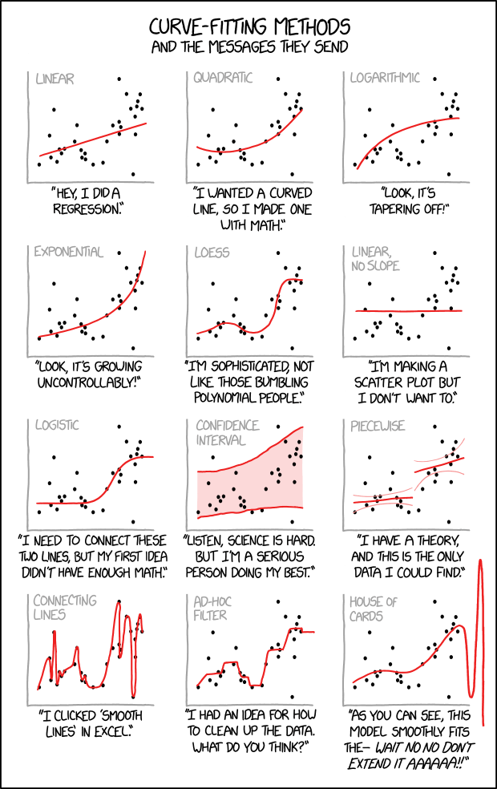

```{r setup, include=FALSE}
knitr::opts_chunk$set(echo = TRUE, cache = TRUE)
```

```{r echo=FALSE}

############################################################
####                                                    ####  
####  NRES 746, Lecture 4                               ####
####                                                    ####
####  Kevin Shoemaker                                   #### 
####  University of Nevada, Reno                        ####
####                                                    #### 
############################################################


############################################################
####  Likelihood                                        ####
####     Assessing the probability of the data          ####
####     under a known data-generating model            ####
############################################################


```


For those wishing to follow along with the R-based demo in class, [click here](LECTURE4.R) for the companion R-script for this lecture.   

In the last class (and lab), we talked about simulating data from models. This is often called *forward simulation* modeling (or prediction)- that is, we take a model and use it to predict emergent patterns. The process flow goes something like this:

$Model \rightarrow Predicted \space Data$

In this lecture, we will talk about *inference* using **maximum likelihood**. Inference is in some ways the opposite process; we are using the data to say something about the model. 

$Real \space Data \rightarrow Model$

In many ways, these two processes -- *forward simulation* and *inference* -- are interrelated. Simulation can help us to make better inferences from real data (e.g., goodness of fit tests, approximate likelihood), and inference from real data can help us to make better predictions!

First let's see how simulation from models can help us to make inferences from observed data. This leads directly into the concept of maximum likelihood.

## Using data simulation to make inferences

Let's use the built-in "mtcars" data for this example: (note: some code borrowed from [here](http://stats.stackexchange.com/questions/142443/simple-non-linear-regression-problem))

```{r}

###############
# Demo: using data simulation to make inferences

data(mtcars)    # use the 'mtcars' data set as an example 

# ?mtcars

plot(mpg~disp, data = mtcars, las = 1, pch = 16, xlab = "Displacement (cu. in.)", ylab = "Miles/Gallon")   # visualize the relationship

```


Looks nonlinear, with relatively constant variance across parameter space. So let's see if we can build a model that could possibly produce these data!!

Since this looks a little like an exponential decline, let's first build a function that can generate data that follows that deterministic function:

$mpg = N\left \{  intercept\cdot e^{slope\cdot displacement} ,Variance\right \}$

Or, if we package the parameters simply as params a, b, and c:

$mpg = N\left \{  a\cdot e^{b\cdot displacement} ,c\right \}$

What's the *deterministic component* here? 

Take a minute to visualize the negative exponential functional relationship - e.g., using the "curve()" function in R. 

```{r}

#########
# try an exponential model

Deterministic_component <- function(xvals,a,b){
  yexp <- a*exp(b*xvals)        # deterministic exponential decline (assuming b is negative)
  return(yexp)
}

DataGenerator_exp <- function(xvals,params){
  yexp <- Deterministic_component(xvals,params$a,params$b)  # get signal
  yvals <- rnorm(length(yexp),yexp,sqrt(params$c))     # add noise (normally distributed)
  return(yvals)
}

```

Let's test this function to see if it does what we want:

```{r}


###########
# generate data under an assumed process model

xvals=mtcars$disp    # xvals same as data (there is no random component here- we can't really "sample" x values)
params <- list()  
params$a=30             # set model parameters arbitrarily (eyeballing to the data) (see Bolker book)
params$b=-0.005   # = 1/200
params$c=5

yvals <- DataGenerator_exp(xvals,params)

plot(yvals~xvals)      # plot the simulated data


```


Okay, looks reasonable. Now, let's write a function to generate multiple replicate datasets from a known model and make boxplots describing the plausible data produced by the model across measured parameter space.

```{r}

##########
# assess goodness-of-fit of a known data-generating model

PlotRangeOfPlausibleData <- function(xvals,params,reps=100){ 
  samplesize <- length(xvals)
  results <- array(0,dim=c(samplesize,reps))   # storage array for results
  for(i in 1:reps){
    yvals <- DataGenerator_exp(xvals,params)
    results[,i] <- yvals
  }
      # now make a boxplot of the results
  boxplot(lapply(1:nrow(results), function(i) results[i,]),at=xvals, xaxt="n",main="Plausible data under this model",ylab="mpg",xlab="Displacement",boxwex=6)
  cleanseq <- (seq(0,max(round(xvals/100)),length=(max(round(xvals/100)))+1))*100
  axis(1,at=cleanseq,labels = cleanseq)    # label the x axis properly
  
}

```


Let's try it out!

```{r}

reps <- 1000    # number of replicate datasets to generate

PlotRangeOfPlausibleData(xvals,params,reps)    # run the function to visualize the range of data that could be produced under this model

```


Now we can overlay the data and see how well we did!

```{r}

############
# finally, overlay the real data to evaluate goodness of fit!

real_yvals <- mtcars$mpg
PlotRangeOfPlausibleData(xvals,params,reps)
points(xvals,real_yvals,pch=20,cex=3,col="green")

```


Okay, not very good yet. Let's see if we can improve the fit by _changing the parameters_. Let's increase the intercept and reduce the slope:

```{r}

##########
# now change the parameters and see if the data fit to the model

params$a=40       # was 30
params$b=-0.001   # was 0.005

    
PlotRangeOfPlausibleData(xvals,params,reps)
points(xvals,real_yvals,pch=20,cex=3,col="green")    # overlay the real data

```


Oops- we overshot!! Let's find something in the middle!

```{r}

#######
# try again- select a new set of parameters

params$a=35       # was 40
params$b=-0.0029   # was 0.001
params$c=0.95
    
PlotRangeOfPlausibleData(xvals,params,reps)
points(xvals,real_yvals,pch=20,cex=3,col="green")    # overlay the real data

```


Keep trying. See if you can find a model that could plausibly generate most of these data!

Q: Why did you NOT just increase the "noise" parameter until the data were consistent with the model?

So, we have used simulation, along with trial and error, to infer the most **likely** parameter values for our model! 

A _likelihood function_, very generally, is a *function* that has 2 input arguments:
+ the **data**
+ a **hypothesized data-generating model**
The likelihood function takes these inputs and produces a single output:
+ the *data likelihood*


The data likelihood is a single number representing the relative plausibility that *this* model could have produced *these* data. 

The higher the relative plausibility of generating the data, the higher the value the likelihood function returns. 

**Q:**  What is the likelihood function we have used in this example?


## Computing data *likelihood* more rigorously 

First of all, what does "data likelihood" really mean, in a formal sense?      

$\mathcal{L_{model}}  (obs.data) \equiv  Prob(obs.data|Model)$

### Definition, in plain English!

The likelihood of a fully-specified model with a set of parameters $\theta$, given some observed data, is equal to the *probability* of observing these data, given the defined model with those specific parameter values. In this way, likelihood is a quantitative measure of *model fit*. Higher likelihoods correspond to a higher probability of the model producing the observed data (the data "fit" the model well). 

But remember, we use likelihood as a *relative* rather than an *absolute* metric. Therefore, the model with the highest likelihood (out of a set of candidate models) doesn't necessarily mean the model would pass a basic goodness-of-fit test!

### Worked example

Let's go through an example (let's stick with the cars example for now).  

For simplicity, let's consider _only the first observation_:

```{r}

#############
# Work with likelihood!

obs.data <- mtcars[1,c("mpg","disp")]    # for simplicity, consider only the first observation
obs.data

```

Remember, we are considering the following data generating model:

$mpg = N\left \{  a\cdot e^{b\cdot displacement} ,c\right \}$

To compute likelihood we also need to specify all parameter values. That is, we need a *fully specified (parameterized) data generating model*.  

Let's use the parameters we selected in our trial-and-error exercise above. What is the expected value of our single observation under this data generating model.

```{r}

############
# "best fit" parameters from above
############

params <- list()    # set up empty list to store parameters
params$a=35            # fill the list with the "best fit" parameter set from above (this is still just an educated guess)   
params$b= -0.0029   
params$c=0.95

params

expected_val <- Deterministic_component(obs.data$disp,params$a,params$b)   
expected_val      # expected mpg for the first observation in the "mtcars" dataset

```


Okay we now know our expected (mean) value for mpg for a car with displacement of 160 cubic inches. We also know the observed mpg for a car with a displacement of 160 cubic inches: it was 21 mpgs. Since we also know the variance of the residual error, we have a fully specified data generating model (deterministic component and stochastic component with all parameters fully specified!) we can compute the probability of sampling a car with 21 mpgs under our model, given it has a cubic displacement of 160 cubic inches.

Recall that when we are trying to compute the probability of getting any particular number out of a random number generator with known distribution, we can use the "d*x*" version of the probability distribution function in R (e.g., "dnorm()", "dunif()", "dpois()"):


```{r}

###########
# Visualize the likelihood of this single observation. 

mean = expected_val   # expected (mean) value for this observation, given the "known" data generating model
stdev = sqrt(params$c)    # standard deviation

curve(dnorm(x,mean,stdev),10,30,xlab="possible vals for mpg under the specified model",ylab="probability density")   # probability of all plausible mpg values under the data generating model.  
abline(v=obs.data$mpg,col="red",lwd=2)    # overlay the observed data

```


Now it is straightforward to compute the likelihood. We just need to know the probability density where the red line (observed data) intersects with the normal density curve (above). For this we can use the "dnorm()" function (probability density, normal distribution):  

```{r}

###########
# compute the likelihood of the first observation

likelihood = dnorm(obs.data$mpg,mean,stdev)
likelihood

```
**Q**: how could you increase the likelihood of obtaining the observed observation??

Now let's consider a second observation as well!

```{r}

###########
# Visualize the likelihood of two observations. 

obs.data <- mtcars[c(1,3),c("mpg","disp")]
obs.data

par(mfrow=c(1,2))  # set up graphics!

for(i in 1:nrow(obs.data)){
  curve(dnorm(x,Deterministic_component(obs.data$disp[i],params$a,params$b),sqrt(params$c)),10,30,xlab="mpg",ylab="probability density")   # probability density
  abline(v=obs.data$mpg[i],col="red",lwd=2)
}

```


What is the likelihood of observing both of these data points???

$Prob(obs.data_{1}|Model])\cdot Prob(obs.data_{2}|Model])$

```{r}

##########
# compute the likelihood of observing BOTH data points

Likelihood <- dnorm(obs.data$mpg[1],Deterministic_component(obs.data$disp[1],params$a,params$b),sqrt(params$c)) *
              dnorm(obs.data$mpg[2],Deterministic_component(obs.data$disp[2],params$a,params$b),sqrt(params$c))  
Likelihood

```


Let's consider four observations:

```{r}

##############
# and now... four observations!

obs.data <- mtcars[c(1,3,4,5),c("mpg","disp")]
obs.data

par(mfrow=c(2,2))  # set up graphics!

for(i in 1:nrow(obs.data)){
  curve(dnorm(x,Deterministic_component(obs.data$disp[i],params$a,params$b),sqrt(params$c)),10,30,xlab="mpg",ylab="probability density")   # probability density
  abline(v=obs.data$mpg[i],col="red",lwd=2)
}


```


What is the combined likelihood of all of these four data points, assuming each observation is independent...

```{r}

##########
# compute the likelihood of observing all four data points

Likelihood <- 1     # initialize the likelihood
for(i in 1:nrow(obs.data)){
  Likelihood <- Likelihood * dnorm(obs.data$mpg[i],Deterministic_component(obs.data$disp[i],params$a,params$b),sqrt(params$c))
}
Likelihood

```

Alternatively, we can use the "prod" function in R:

```{r}

# Alternatively, we can use the "prod" function in R

Likelihood <- prod(dnorm(obs.data$mpg,Deterministic_component(obs.data$disp,params$a,params$b),sqrt(params$c)))
Likelihood

```


Okay, so it should be fairly obvious how we might get the likelihood of the entire dataset. Assuming independence of observations of course!

```{r}

##########
# Finally, compute the likelihood of ALL data points in the entire data set, using the "prod()" function

full.data <- mtcars[,c("mpg","disp")]
Likelihood <- prod(dnorm(full.data$mpg,Deterministic_component(full.data$disp,params$a,params$b),sqrt(params$c)))
Likelihood

```

You may notice that that's a pretty small number. When you multiply lots of really small numbers together, we get much smaller numbers. This can be very undesirable, especially when you run into overflow/underflow errors (meaning the number is beyond the range that can be represented in computer memory). For this reason, and because we generally like sums rather than products, we generally _log-transform_ likelihoods. As you recall,

$log(a\cdot b\cdot c)=log(a)+log(b)+log(c)$

Log transformations just make it easier to work with likelihoods! 

In fact, the probability density functions in R make it extra easy for us to work with log likelihoods, using the 'log=TRUE' option!

```{r}

##########
# Compute the log-likelihood (much easier to work with!)

Log.Likelihood <- sum(dnorm(full.data$mpg,Deterministic_component(full.data$disp,params$a,params$b),sqrt(params$c),log=TRUE)) 
Log.Likelihood  
exp(Log.Likelihood)   # we can convert back to likelihood if we want...

```

## Maximum Likelihood Estimation (MLE)
Maximum likelihood estimation is a general, flexible method for drawing *inference* about models from data.

The basic idea is simple: given a data generating model and a set of 'free parameters', search for the set of parameters that maximizes the likelihood of the observed data!

Like any function, a *likelihood function* has inputs and outputs. 

The **inputs** are:
+ A vector of **free parameters**, which are the parameters we are trying to estimate!    
+ An observed data set (response and predictors) for which we want to compute the likelihood!        
+ [optional] Any additional fixed parameters you want!        

The **algorithm** is:
+ A data generating model, often constructed by combining one or more deterministic and stochastic components. Log-likelihood is computed by adding together the log-likelihoods of all independent observations.        

The **output** is:    
+ The log-likelihood of the dataset, given the model     


NOTE: instead of log-likelihood, we often use the *negative log-likelihood* (it is more common to identify the minimum rather than the maximum of an *objective function*- this is the default for the native optimization function in R, "optim()")

**Q**: What are the free parameters in the mtcars example?

It is important to note that the likelihood function, when evaluated for every point in *parameter space* (likelihood *surface*) essentially contains all the information in the data that can be used to make inference about the model. The problem then becomes, how can we search for the maximum-likelihood estimate (MLE) and characterize the likelihood surface around the MLE? We will discuss the mechanics of this in the [next lecture (optimization)](LECTURE5.html).
 
The steps of a typical MLE analysis are as follows:

1. Build a *likelihood function* for the specified model, bundling all free parameters together into one vector argument (given a known data-generating model and a bundled set of parameter values, return the likelihood of any dataset)
2. Use *numerical optimization algorithms* to find the set of parameters that maximize the likelihood function
3. Use the shape of the likelihood function to make inference about parameter uncertainty (e.g., confidence intervals)

Okay, let's build our first *likelihood function*? We basically already have this for the cars example:

```{r}

##########
# Example likelihood function!

# Arguments:
#   params: bundled vector of free parameters for the known data-generating model
#   df: a data frame that holds the observed data
#   yvar: the name of the response variable (ancillary)
#   xvar: the name of the predictor variable (ancillary)

LogLikFunction <- function(params,df,yvar,xvar){
  LogLik <- sum(dnorm(df[,yvar],Deterministic_component(df[,xvar],params['a'],params['b']),sqrt(params['c']),log=TRUE))
  return(LogLik)
}
LogLikFunction(unlist(params),df=mtcars,yvar="mpg",xvar="disp")

```

Now that we have a likelihood function, we need to search parameter space for the parameter set that maximizes the log-likelihood of the observed data. Luckily, there are lots of *computational algorithms* that can do this. We will look at this in detail in the optimization lecture. For now, we just need to know that these fancy algorithms exist, and that they can be harnessed using the 'optim()' function in R.

The "optim()" function wants (1) a likelihood function, (2) a set of free parameters, along with *starting values* for these parameters, (3) any other ancillary variables that the likelihood function requires, and (4) parameters specifying aspects of the optimization algorithm (e.g., which numerical algorithm to use). 

Let's find the MLE for the three parameters in the cars example!!

```{r}

############
# Use numerical optimization methods to identify the maximum likelihood estimate (and the likelihood at the MLE)

MLE <- optim(fn=LogLikFunction,par=unlist(params),df=mtcars,yvar="mpg",xvar="disp",control=list(fnscale=-1))  # note, the control param is set so that "optim" maximizes rather than minimizes the Log-likelihood. 

```

Now, we can get the MLEs for the three parameters (the parameter values that maximize the likelihood function):

```{r}

MLE$par   # maximum likelihood parameter estimates

```

We can also get the log likelihood for the best model (the maximum log-likelihood value, achieved by using the above parameter values as inputs to the likelihood function)

```{r}

MLE$value   # log likelihood for the best model

```

Let's look at goodness-of-fit for the best model!

```{r}

##############
# visualize goodness-of-fit for the best model

bestParams <- as.list(MLE$par)   # extract the MLE parameter vals

xvals <- mtcars$disp
yvals <- mtcars$mpg
PlotRangeOfPlausibleData(xvals,bestParams,1000)
points(xvals,yvals,pch=20,cex=3,col="green")

```

Now this isn't such a bad looking model (not perfect though)! 

Using this same strategy, we can fit countless models to data. We just performed a non-linear regression. But we could just as well have fit any number of alternative model formulations (different deterministic functions and "noise" distributions). Maximum Likelihood is a powerful and flexible framework. We will have plenty of more opportunities to work with likelihood functions, both in a frequentist and a Bayesian context.

### Aside: generating initial values

Note that the 'optim' function requires specification of initial values for every free parameter in your model. In general, it is not critical that the initial values fit the data very well. However, we need to put serious thought into our initial values. Using values that are too far away from the best-fit parameter estimates can cause our optimization algorithms to fail! The strategy I recommend for setting initial values is:

* If possible, use general understanding of the meaning of the parameters to "eyeball" an approximate value for each parameter           
* Write a data-generation function and compare the data generated by this function against the observed data. If the fit is "close-ish" then you should be able to use these values for your initial values (really it doesn't need to be that close! If not, continue to tweak the parameters until you find something that is "close-ish".        

## Estimating parameter uncertainty

We have now identified the parameter values that maximize the likelihood function. These are now our "best" estimates of the parameter values (MLE). But we usually want to know something about how certain we are about our estimate, often in the form of confidence intervals. 

Fortunately, likelihood theory offers us a strategy for estimating confidence intervals around our parameter estimates. The idea is that the *shape* of the likelihood function around the MLE tells us something about the plausibility of these parameter values.

For instance, let's plot out the shape of the likelihood function across a **slice** of parameter space (vary one parameter and hold all others constant). In this case, let's look at the "decay rate" term (the 'b' parameter). We can vary that parameter over a range of possible values and see how the likelihood changes over that parameter space. Let's hold the other parameters at their maximum likelihood values:

```{r}

##############
# Visualize a "slice" of the likelihood function

upperval <- -1/1000
lowerval <- -1/200
allvals <- seq(lowerval,upperval,length=1000)
likelihood_slice <- numeric(1000)   # set up storage vector! 
newParams <- bestParams 
for(i in c(1:length(allvals))){
  newParams$b <- allvals[i]
  likelihood_slice[i] <- exp(LogLikFunction(unlist(newParams),mtcars,"mpg","disp"))    # get the data likelihood across slice of parameter space
}

plot(allvals,likelihood_slice,type="l",main="Likelihood Slice",xlab="Parameter Slice for \'b\'",ylab="Likelihood")

```

Again, we generally want to work with log-likelihoods. And here we have an even better reason to use log-likelihoods. This reason: the "rule of 2", and (more formally) the **likelihood ratio test**. 

For now, suffice it to say that all parameter values within ~2 log-likelihood units of the best-fit parameter value are *plausible*. Therefore, a *reasonable* confidence interval (approximate 95% conf int) can be obtained by identifying the set of possible parameter values for which the log-likelihood of the data is within two of the maximum log-likelihood value...

Let's plot out the log-likelihood slice:

```{r}

#################
# Work with log-likelihood instead...

upperval <- -1/1000
lowerval <- -1/200
allvals <- seq(lowerval,upperval,length=1000)
loglikelihood_slice <- numeric(1000)   # set up storage vector! 
newParams <- bestParams 
for(i in c(1:length(allvals))){
  newParams$b <- allvals[i]
  loglikelihood_slice[i] <- LogLikFunction(unlist(newParams),mtcars,"mpg","disp")    # get the data likelihood across slice of parameter space
}

plot(allvals,loglikelihood_slice,type="l",main="Log Likelihood Slice",xlab="Parameter Slice for \'b\'",ylab="Log-Likelihood")

```


Let's "zoom in" to a smaller slice of parameter space so we can more clearly see the "plausible" values:

```{r}

###########
# zoom in closer to the MLE

upperval <- -1/550
lowerval <- -1/350
allvals <- seq(lowerval,upperval,length=1000)
loglikelihood_slice <- numeric(1000)   # set up storage vector! 
newParams <- bestParams 
for(i in c(1:length(allvals))){
  newParams$b <- allvals[i]
  loglikelihood_slice[i] <- LogLikFunction(unlist(newParams),mtcars,"mpg","disp")    # get the data likelihood across slice of parameter space
}

plot(allvals,loglikelihood_slice,type="l",main="Log Likelihood Slice",xlab="Parameter Slice for \'b\'",ylab="Log-Likelihood")

```


What region of this space falls within 2 log-likelihood units of the best value?

```{r}

##############
# what parameter values are within 2 log likelihood units of the best value?

bestVal <- bestParams$b
bestVal


plot(allvals,loglikelihood_slice,type="l",main="Log Likelihood Slice",xlab="Parameter Slice for \'b\'",ylab="Log-Likelihood")
abline(v=bestVal,lwd=3,col="blue")
abline(h=(MLE$value-2))

```


So what is our 95% confidence interval in this case??  (remember this is *very approximate*!)

```{r}

##############
# Generate an approximate 95% confidence interval for the "b" parameter

reasonable_parameter_values <- allvals[loglikelihood_slice>=(MLE$value-2)]
min(reasonable_parameter_values)
max(reasonable_parameter_values)
plot(allvals,loglikelihood_slice,type="l",main="Log Likelihood slice",xlab="Parameter Slice for \'b\'",ylab="Log-Likelihood")
abline(v=bestVal,lwd=3,col="blue")
abline(h=(MLE$value-2),lty=2)
abline(v=min(reasonable_parameter_values),lwd=1,col="blue")
abline(v=max(reasonable_parameter_values),lwd=1,col="blue")

```


#### Key point!

From the Bolker book:

* The geometry of the likelihood surface -- where it peaks and how the distribution falls off around the peak -- contains essentially all the information you need to estimate parameters and confidence intervals. 


### Estimating parameter uncertainty in multiple dimensions: the Likelihood Profile

If we have more than one *free parameter* in our model, it seems strange to fix any parameter at a particular value, as we did in computing the "likelihood slice" above. It makes more sense to allow all the parameters to vary. For the purpose of visualization, let's assume for now that we only have two free parameters in our model: 'a' and 'b'. We will assume for now that the variance parameter is known for certain.   

Let's try to visualize the likelihood surface in two dimensions!

```{r}

###############
# A better confidence interval, using the likelihood "profile"


##########
# first, visualize the likelihood surface in 2 dimensions

upperval_b <- -1/800
lowerval_b <- -1/300

upperval_a <- 50
lowerval_a <- 5

allvals_a <- seq(lowerval_a,upperval_a,length=500)
allvals_b <- seq(lowerval_b,upperval_b,length=500)

loglikelihood_surface <- matrix(0,nrow=500,ncol=500)   # set up storage matrix! 

newParams <- bestParams 
for(i in 1:length(allvals_a)){  # loop through possible a params
  newParams$a <- allvals_a[i]
  for(j in 1:length(allvals_b)){    # loop through possible b params
    newParams$b <- allvals_b[j]
    loglikelihood_surface[i,j] <- LogLikFunction(unlist(newParams),mtcars,"mpg","disp")    # get the data likelihood across slice of parameter space
  }
}

image(x=allvals_a,y=allvals_b,z=loglikelihood_surface,zlim=c(-100,-75),col=topo.colors(12))

```

Now let's add a contour line to indicate the *95% bivariate confidence region*

```{r}

##########
# add a contour line, assuming deviances follow a chi-squared distribution

conf95 <- qchisq(0.95,2)/2  # this evaluates to around 3. Since we are varying freely across 2 dimensions, we use chisq with 2 degrees of freedom
image(x=allvals_a,y=allvals_b,z=loglikelihood_surface,zlim=c(-100,-75),col=topo.colors(12))
contour(x=allvals_a,y=allvals_b,z=loglikelihood_surface,levels=(MLE$value-conf95),add=TRUE,lwd=3,col=gray(0.3))

```


So, what is the "**profile likelihood**" confidence interval for the a parameter?

By "profile likelihood" confidence interval, we mean this: we have a parameter of interest, and one or more free parameters that we also have some uncertainty about. For every value of the parameter of interest, we find the highest likelihood value across all possible values of all the other uncertain parameters (parameter of interest is a sequence of fixed points across its range, other parameter(s) are free to vary. This way we can define a likelihood surface that accounts for our uncertainty about the other parameters, and therefore we get a more honest description of the uncertainty we have about the parameter of interest.   

```{r}

#############
# visualize likelihood profile!

              ### A parameter
profile_A <- apply(loglikelihood_surface,1,max)
reasonable_parameter_values_A <- allvals_a[profile_A >=(MLE$value-qchisq(0.95,1)/2)]
min(reasonable_parameter_values_A)
max(reasonable_parameter_values_A)
plot(allvals_a,profile_A,type="l",main="Log Likelihood profile",xlab="Parameter \'a\'",ylab="Log-Likelihood")
abline(v=MLE$par["a"],lwd=3,col="blue")
abline(v=min(reasonable_parameter_values_A),lwd=1,col="blue")
abline(v=max(reasonable_parameter_values_A),lwd=1,col="blue")

```


And the b parameter?

```{r}

############
# profile for the b parameter... 

profile_B <- apply(loglikelihood_surface,2,max)
reasonable_parameter_values_B <- allvals_b[profile_B >=(MLE$value-qchisq(0.95,1)/2)]
min(reasonable_parameter_values_B)
max(reasonable_parameter_values_B)
plot(allvals_b,profile_B,type="l",main="Log Likelihood profile",xlab="Parameter \'b\'",ylab="Log-Likelihood")
abline(v=MLE$par["b"],lwd=3,col="blue")
abline(v=min(reasonable_parameter_values_B),lwd=1,col="blue")
abline(v=max(reasonable_parameter_values_B),lwd=1,col="blue")

```

So,what happens if we compare the profile likelihood confidence interval with the "slice" method we used earlier??

```{r}

#################
# Compare profile and slice intervals

par(mfrow=c(1,2))
reasonable_parameter_values <- allvals[loglikelihood_slice>=(MLE$value-2)]
plot(allvals,loglikelihood_slice,type="l",main="Log Likelihood slice",xlab="Parameter \'b\'",ylab="Log-Likelihood",xlim=c(-0.0035,-0.0013))
abline(v=bestVal,lwd=3,col="blue")
abline(h=(MLE$value-2),lty=2)
abline(v=min(reasonable_parameter_values),lwd=1,col="blue")
abline(v=max(reasonable_parameter_values),lwd=1,col="blue")


profile_B <- apply(loglikelihood_surface,2,max)
reasonable_parameter_values_B <- allvals_b[profile_B >=(MLE$value-2)]
plot(allvals_b,profile_B,type="l",main="Log Likelihood profile",xlab="Parameter \'b\'",ylab="Log-Likelihood",xlim=c(-0.0035,-0.0013))
abline(v=MLE$par["b"],lwd=3,col="blue")
abline(h=(MLE$value-2),lty=2)
abline(v=min(reasonable_parameter_values_B),lwd=1,col="blue")
abline(v=max(reasonable_parameter_values_B),lwd=1,col="blue")

```

**Does it make sense why there is a difference (i.e., why the profile-likelihood CI is wider than the slice CI)??**

In R and other software packages you may have worked with, you will have the option to estimate the confidence interval using the 'profile likelihood' method. Now you know what that means!

**Are there any other ways of getting a confidence interval from a likelihood surface?       
+ Evaluate the shape of the likelihood surface at the MLE using mathematical approximation: use the second derivatives of -LogLik evaluated at the MLE to estimate the standard errors of all parameters (formally, use the "Hessian" matrix!).       

NOTE: the profile method can easily detect asymmetries in the likelihood surface. Commonly used approximations are often not able to detect these asymmetries. 

#### Exercise 3.1

Develop a *likelihood function* for the following scenario: you visit three known-occupied wetland sites ten times and for each site you record the number of times a particular frog species is detected within a 5-minute period. Assuming that all sites are occupied continuously, compute the likelihood of these data: [3, 2 and 6 detections for sites 1, 2, and 3 respectively] for a given detection probability $p$. Assume that all sites have the same (unknown) detection probability. Using this likelihood function, answer the following questions: 

1. What is the maximum likelihood estimate (MLE) for the p parameter? 
2. Using the "rule of 2", determine the approximate 95% confidence interval for the p parameter.


```{r}

###### Practice exercise: develop a likelihood function for estimating the probability of detection of a rare frog species

ncaps <- c(3,2,6)   # number of times out of 10 that a frog is detected at 3 known-occupided wetland sites

#### construct a likelihood function


#### find the MLE using 'optim()' in R


#### find the approximate 95% confidence interval using the "rule of 2"


```


### The likelihood ratio test (LRT)

Q: In what ways is the likelihood surface *shape* likely to change if you were to collect more data?

Steeper gradients (slopes) in the likelihood surface near the maximum likelihood estimate correspond to narrower confidence intervals. But how can we determine the cutoff for where the edge of the confidence interval is?  

#### Definition: Likelihood Ratio
The *likelihood Ratio* is defined as:

$\frac{\mathcal{L}_{r}}{\widehat{\mathcal{L}}}$

Where $\widehat{\mathcal{L}}$ is the likelihood at the global maximum likelihood estimate and $\mathcal{L} _{r}$ is the Likelihood of a model for which some parameters have been 'fixed' (determined *a priori* and therefore no longer 'free parameters' to be estimated.

#### Likelihood Ratio Test

Twice the negative log likelihood ratio, $-2*ln(\frac{\mathcal{L} _{r}}{\widehat{\mathcal{L}}})$, sometimes known as the *deviance*, is an important test statistic with a known sampling distribution!

##### Distribution of the Likelihood Ratio (frequentist!)
For some reason (which we will not dwell on) the sampling distribution of the deviance (test statistic) under the null hypothesis (H0: the reduced model is in fact the true model) is *approximately* $\chi^2$ ("chi-squared") distributed with *r* degrees of freedom, where *r* is the number of dimensions by which the full model has been reduced (number of parameters "fixed").  

*r* is equal to the number of free parameters that have been eliminated (fixed) with respect to the full model. That is, if our full model has three free parameters and we fix the value of two of these parameters to build a reduced model, *r* is equal to 2. 

We can use this property to estimate the statistical significance of any difference in log-likelihood between a full model and a restricted model.  

Here is a visualization of the chi-squared distribution with 2 degrees of freedom:

```{r}

###############
# demo: likelihood ratio test

curve(dchisq(x,2),0,10,ylab="probability density",xlab="x", main="Chi-Squared distribution, df=2")

```

What is the 95% quantile of this distribution?

```{r}

curve(dchisq(x,2),0,10,ylab="probability density",xlab="x", main="Chi-Squared distribution, df=2")
abline(v=qchisq(0.95,2),col="red",lwd=2)

```

What about 1 df?

```{r}

curve(dchisq(x,1),0,5,ylab="probability density",xlab="x", main="Chi-Squared distribution, df=1")
abline(v=qchisq(0.95,1),col="red",lwd=2)

```

Okay, so now we know that the quantity defined as $-2*ln(\frac{\mathcal{L} _{r}}{\widehat{\mathcal{L}}})$, should be distributed according to the above probability distribution under the null hypothesis of the reduced model being true (the deviance between the full and reduced model is simply a result of random chance). How does this relate to confidence intervals?

Remember this is a frequentist test. So we are imagining multiple alternative universes where we are collecting data and determining a maximum likelihood estimate. Even though the data generating process is the same each time, each dataset we collect will yield a slightly different likelihood surface. Now imagine we *fix* the value of one of our parameters at the **true** parameter value and collect thousands of datasets, each time maximizing the likelihood with respect to all the other parameters. The *deviance* between the restricted model (with one parameter set at its *true* value) and the full model (where the focal parameter is also a free parameter) should be approximately chi-squared distributed (with degrees of freedom of 1 if only one parameter differs between the true model and the "extra parameter" model)! 

Moreover, the true parameter value can be expected to fall outside the 95% quantile of the chi-squared distribution (df=1; critical value= 3.84) for only 5% of replicate sample data sets. That is, 95% of the time, the deviance between the true parameter and the MLE for that parameter should be below $\chi^2_{crit, df=1} = 3.84$

It follows that we can define the 95% confidence interval for a parameter as the region around the MLE such that $-2*ln(\frac{\mathcal{L} _{r}}{\widehat{\mathcal{L}}})$ is within $\chi^2_{crit, df=1}$   

So, if we want to determine a range in parameter space that can plausibly contain the true parameter value, we can select the range of parameter space for which $-2*ln(\frac{\mathcal{L} _{r}}{\widehat{\mathcal{L}}})$ is less than or equal to 3.84. 

$-2*ln(\frac{\mathcal{L} _{r}}{\widehat{\mathcal{L}}}) \leq - 3.84$  
$-2*[ln(\mathcal{L} _{r}) - ln{\widehat{\mathcal{L}}})] \leq - 3.84$  
$[ln(\mathcal{L} _{r}) - ln{\widehat{\mathcal{L}}})] \leq  1.92$  
  

So, now what do you think about the 'rule of 2'? Is it close enough??


#### Other questions
- is the likelihood surface a *probability distribution*?





[--go to next lecture--](LECTURE5.html) 

