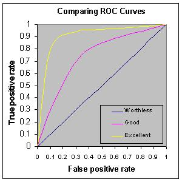

```{r setup, include=FALSE}
knitr::opts_chunk$set(echo = TRUE, cache = TRUE)
```

In this course so far, we have constructed data-generating models and fitted these models to observed data using likelihood-based methods (ML and Bayesian inference). We also have explored a range of methods to account for *structural uncertainty* (which of a set of candidate models could plausibly have generated our observed data). 

But even after we have fitted a model to data, even after we have compared a suite of plausible models and selected the best one, are we really sure that the model is *good*? 

What does it even mean to say that the model is good?

Usually, we mean one or more of the following:

1. **Goodness-of-fit**: The data could easily/reasonably have been generated under the best-fit model.
2. **Predictive ability**: The model performs well at predicting observed responses that were not used to train the model. 
3. **Generality**: The model performs well at extrapolating responses for data that are qualitatively different from those in the training set.

## Goodness-of-fit
We have already looked at a variety of methods for evaluating goodness-of-fit. In general, you can use data simulation (virtual ecology) to evaluate whether your fitted model is capable of generating the observed data. 

For example, we can overlay the observed data on a cloud of points representing the range of data sets possibly produced under the fitted model. 
Or, we can use a "plug-in" prediction bounds as a substitute for the cloud of data sets possibly produced under the model.

Let's return to the Myxomatosis dataset!

```{r}
library(emdbook)

MyxDat <- MyxoTiter_sum
Myx <- subset(MyxDat,grade==1)  #Data set from grade 1 of myxo data
head(Myx)
```


Now let's use ML to fit the Ricker model with a gamma error distribution.

```{r}

Ricker <- function(a,b,predvar) a*predvar*exp(-b*predvar)
  
NegLogLik_func <- function(params,data){
  expected <- Ricker(params[1],params[2],data$day)
  -sum(dgamma(data$titer,shape=params[3],scale=expected/params[3],log = T))
}

init.params <- c(a=1,b=0.2,shape=50)
NegLogLik_func(init.params,data=Myx)

MaxLik <- optim(par=init.params, fn=NegLogLik_func, data=Myx)

MaxLik
  
```

How might we evaluate goodness-of-fit in this case??

### Plug-in prediction bounds

The simplest way is just to plot the expected value along with "plug-in" bounds around that prediction, to represent the range of data likely to be produced under the model. We have done this before!

```{r}
plot(Myx$titer~Myx$day,xlim=c(0,10),ylim=c(0,15))
expected <- Ricker(MaxLik$par['a'],MaxLik$par['b'],1:10)
points(1:10,expected,type="l",col="green")

upper <- qgamma(0.975,shape=MaxLik$par['shape'],scale=expected/MaxLik$par['shape'])
lower <- qgamma(0.025,shape=MaxLik$par['shape'],scale=expected/MaxLik$par['shape'])

points(1:10,upper,type="l",col="red",lty=2)
points(1:10,lower,type="l",col="red",lty=2)
```

This gives us a simple and useful way to visualize goodness-of-fit.

### Simulated datasets!

Alternatively, we could generate simulated data sets under the best-fit model:

```{r}
plot(Myx$titer~Myx$day,xlim=c(0,10),ylim=c(0,15),type="n")
expected <- Ricker(MaxLik$par['a'],MaxLik$par['b'],1:10)
points(1:10,expected,type="l",col="green")

uniquedays <- sort(unique(Myx$day))
expected <- Ricker(MaxLik$par['a'],MaxLik$par['b'],uniquedays)
simdata <- array(0,dim=c(1000,length(uniquedays)))
for(i in 1:1000){
  simdata[i,] <- rgamma(length(uniquedays),shape=MaxLik$par['shape'],scale=expected/MaxLik$par['shape'])
}

upper <- apply(simdata,2,function(t) quantile(t,0.975))
lower <- apply(simdata,2,function(t) quantile(t,0.025))

points(uniquedays,upper,type="l",col="red",lty=2)
points(uniquedays,lower,type="l",col="red",lty=2)

boxplot(x=as.list(as.data.frame(simdata)),at=uniquedays,add=T,boxwex=0.25,xaxt="n",range=0,col="red")
points(Myx$day,Myx$titer,cex=1.5,pch=20)
```

Using simulated data, we can go further- we can compare the simulated data vs the observed data more quantitatively. For example, we can compute the root mean squared error (RMSE) for the simulated datasets and compare that with the root mean squared error for the observed data. 

```{r}
expected <- Ricker(MaxLik$par['a'],MaxLik$par['b'],Myx$day)
simdata <- array(0,dim=c(1000,length(Myx$day)))
for(i in 1:1000){
  simdata[i,] <- rgamma(length(Myx$day),shape=MaxLik$par['shape'],scale=expected/MaxLik$par['shape'])
}
 
rmse_observed <- sqrt(mean((Myx$titer-expected)^2))
rmse_simulated <- apply(simdata,1,function(t) mean((t-expected)^2))

hist(rmse_simulated,freq=F)
abline(v=rmse_observed,col="green",lwd=3)

```

So, is this a good model?


Of course, the goodness-of-fit tests you can run with simulated data are limited only by your imagination! Be dangerous!


NOTE: the above methods *do not account for parameter uncertainty*. This model is the maximum likelihood model- that is, the point estimates are assumed to represent the true model!!

If we wanted to account for parameter uncertainty in the ML framework, we could (for example) use profile likelihood CIs to estimate parameter bounds and we could plug-in bounds that incorporate parameter uncertainty.


### Bayesian!

Accounting for parameter uncertainty is simple in a Bayesian framework... 

In general, a posterior predictive check involves generating new data under the fitted model and comparing with the observed data. 

First we need to fit the model in JAGS.

Note that we can write the predictions directly into the JAGS code

```{r}

library(R2jags)
library(lattice)

cat("
model {
  
  #############
  # LIKELIHOOD
  ############
  for(obs in 1:n.observations){
    expected[obs] <- a*day[obs]*exp(-b*day[obs])  # Ricker
    titer[obs] ~ dgamma(shape,shape/expected[obs])
    titer.sim[obs] ~ dgamma(shape,shape/expected[obs])    # simulate new data (accounting for parameter uncertainty!)
    
  }
  
  #############
  # PRIORS
  ############
  shape ~ dgamma(0.001,0.001)
  a ~ dunif(0,10)
  b ~ dunif(0,10)

  #############
  # SIMULATED DATA FOR VISUALIZATION
  #############

  for(day2 in 1:10){
    expected.new[day2] <- a*day2*exp(-b*day2)  # Ricker
    titer.new[day2] ~ dgamma(shape,shape/expected.new[day2])
  }


  #############
  # DERIVED QUANTITIES
  #############
  for(obs in 1:n.observations){
    SE_obs[obs] <- pow(titer[obs]-expected[obs],2)      
    SE_sim[obs] <- pow(titer.sim[obs]-expected[obs],2)
  }

  RMSE_obs <- sqrt(mean(SE_obs[]))
  RMSE_sim <- sqrt(mean(SE_sim[]))
}
", file="BUGSmod_ricker1.txt")

```

Let's run the model!

```{r}
myx.data.for.bugs <- list(
  titer = Myx$titer,
  day = Myx$day,
  n.observations = length(Myx$titer)
)

init.vals.for.bugs <- function(){
  list(
    shape=runif(1,20,100),
    a=runif(1,0.5,1.5),
    b=runif(1,0.1,0.3)
  )
}

params.to.store <- c("shape","a","b","RMSE_obs","RMSE_sim","titer.new")    # specify the parameters we want to get the posteriors for

jags.fit <- jags(data=myx.data.for.bugs,inits=init.vals.for.bugs,parameters.to.save=params.to.store,n.iter=50000,model.file="BUGSmod_ricker1.txt",n.chains = 3,n.burnin = 5000,n.thin = 20 )

jags.fit.mcmc <- as.mcmc(jags.fit)

posterior <- as.data.frame(jags.fit$BUGSoutput$sims.list)

```

Assuming convergence, let's move on to the goodness-of-fit part! First, let's visualize the observed data against the cloud of data that could be produced under this model!

```{r}

plot(Myx$titer~Myx$day,xlim=c(0,10),ylim=c(0,15),type="n")
expected <- Ricker(mean(posterior$a),mean(posterior$b),1:10)
points(1:10,expected,type="l",col="red")

boxplot(x=as.list(posterior[,7:16]),at=1:10,add=T,boxwex=0.25,xaxt="n",range=0,border="red")
points(Myx$day,Myx$titer,cex=1.5,pch=20)


```


Looks pretty good so far! Let's look at another posterior predictive check...

```{r}

plot(posterior$RMSE_sim~posterior$RMSE_obs, main="posterior predictive check")
abline(0,1,col="red",lwd=2)
p.value=length(which(as.vector(jags.fit.mcmc[,"RMSE_sim"][[1]])>as.vector(jags.fit.mcmc[,"RMSE_obs"][[1]])))/length(as.vector(jags.fit.mcmc[,"RMSE_sim"][[1]]))
p.value
```


Okay, the fit seems more or less reasonable! 


## Predictive ability

In many cases, goodness-of-fit is not ultimately what we are most interested in. What we really want to know is whether the model does a good job at predicting the response variable. 

One way to do this would be for us to focus on an R-squared or pseudo-R2 statistic:

$R^2 = 1-\frac{SS_{res}}{SS_{tot}}$        

$PseudoR^2 = 1-(\frac{logLik_{mod}}{logLik_{null}})$

Let's compute these metrics for the fitted data:

```{r}

SS_res <- sum((Myx$titer-Ricker(MaxLik$par["a"],MaxLik$par["b"],Myx$day))^2)
SS_tot <- sum((Myx$titer-mean(Myx$titer))^2)
Rsquared <- 1-SS_res/SS_tot

cat("R-squared = ", Rsquared, "\n")

NegLogLik_null <- function(params){
  -sum(dgamma(Myx$titer,shape=params[2],scale=params[1]/params[2],log = T))
}

init.params <- c(mean=7,shape=50)

MaxLik_null <- optim(par=init.params, fn=NegLogLik_null)

McFadden <- 1-(MaxLik$value/MaxLik_null$value)
cat("McFadden's R-squared = ", McFadden) 
```

Another way to evaluate model skill, or performance, is to use root mean squared error:

$RMSE = sqrt(mean(residuals^2))$

RMSE gives a good indicator of the mean error rate, which is often useful and interpretable in an absolute way. For example, the modeled temperature is usually within 1.3 degrees C of the true temperature... 

```{r}
RMSE = sqrt(mean((Myx$titer-Ricker(MaxLik$par["a"],MaxLik$par["b"],Myx$day))^2))
cat("RMSE = ", RMSE, "\n")
```


So is our model *good*???  

Does it really do a good job at prediction? Is the model over-fitted?

### Validation 

Let's imagine we collect some new Myxomatosis titer data, and it looks like this:

```{r}
newdata <- data.frame(
  grade = 1,
  day = c(2,3,4,5,6,7,8),
  titer = c(4.4,7.2,6.8,5.9,9.1,8.3,8.8)
)
newdata
```


First we might simply visualize the new data against the cloud of data possibly produced under the fitted model...

```{r}
plot(Myx$titer~Myx$day,xlim=c(0,10),ylim=c(0,15),type="n",xlab="days",ylab="titer")
expected <- Ricker(MaxLik$par['a'],MaxLik$par['b'],1:10)
points(1:10,expected,type="l",col="green")

expected <- Ricker(MaxLik$par['a'],MaxLik$par['b'],1:10)
simdata <- array(0,dim=c(1000,10))
for(i in 1:1000){
  simdata[i,] <- rgamma(10,shape=MaxLik$par['shape'],scale=expected/MaxLik$par['shape'])
}

upper <- apply(simdata,2,function(t) quantile(t,0.975))
lower <- apply(simdata,2,function(t) quantile(t,0.025))

points(1:10,upper,type="l",col="green",lty=2)
points(1:10,lower,type="l",col="green",lty=2)

boxplot(x=as.list(as.data.frame(simdata)),at=1:10,add=T,boxwex=0.25,xaxt="n",range=0,border="green")
points(newdata$day,newdata$titer,cex=1.5,pch=20,col="red")
points(Myx$day,Myx$titer,cex=1.5,pch=20,col="black")
legend("topleft",pch=c(20,20),col=c("black","red"),legend=c("original data","validation data"))
```


Now let's evaluate the skill of our model at predicting the new data... using our above measures of skill, or performance. 

```{r}

SS_res <- sum((newdata$titer-Ricker(MaxLik$par["a"],MaxLik$par["b"],newdata$day))^2)
SS_tot <- sum((newdata$titer-mean(newdata$titer))^2)
Rsquared_validation <- 1-SS_res/SS_tot

cat("R-squared = ", Rsquared, "\n")

expected <- Ricker(MaxLik$par["a"],MaxLik$par["b"],newdata$day)
McFadden_validation <- 1-(sum(dgamma(newdata$titer,shape=MaxLik$par["shape"],scale=expected/MaxLik$par["shape"], log = T))/sum(dgamma(newdata$titer,shape=MaxLik_null$par["shape"],scale=MaxLik_null$par["mean"]/MaxLik_null$par["shape"],log=T)))
cat("pseudo R-squared = ", McFadden_validation, "\n")

RMSE = sqrt(mean((newdata$titer-Ricker(MaxLik$par["a"],MaxLik$par["b"],newdata$day))^2))
cat("RMSE = ", RMSE, "\n")

```

The above analyses seem to indicate that the model fits the new data well, and that the model is successfully able to explain some of the variation in the new data.

### Generality/extrapolation

Imagine we collect some more new data, this time in which titers are measured from day 10 to 16. Let's see if the model does a good job now! 


```{r}
newdata <- data.frame(
  grade = 1,
  day = c(10,11,12,13,14,15,16),
  titer = c(6.8,8.0,4.5,3.1,2.7,1.2,0.04)
)
newdata
```


As before, let's first simply visualize the new data against the cloud of data possibly produced under the fitted model...

```{r}
plot(Myx$titer~Myx$day,xlim=c(0,20),ylim=c(0,15),type="n",xlab="days",ylab="titer")
expected <- Ricker(MaxLik$par['a'],MaxLik$par['b'],1:20)
points(1:20,expected,type="l",col="green")

expected <- Ricker(MaxLik$par['a'],MaxLik$par['b'],1:20)
simdata <- array(0,dim=c(1000,20))
for(i in 1:1000){
  simdata[i,] <- rgamma(20,shape=MaxLik$par['shape'],scale=expected/MaxLik$par['shape'])
}

upper <- apply(simdata,2,function(t) quantile(t,0.975))
lower <- apply(simdata,2,function(t) quantile(t,0.025))

points(1:20,upper,type="l",col="green",lty=2)
points(1:20,lower,type="l",col="green",lty=2)

boxplot(x=as.list(as.data.frame(simdata)),at=1:20,add=T,boxwex=0.25,xaxt="n",range=0,border="green")
points(newdata$day,newdata$titer,cex=1.5,pch=20,col="red")
points(Myx$day,Myx$titer,cex=1.5,pch=20,col="black")
legend("topleft",pch=c(20,20),col=c("black","red"),legend=c("original data","new data"))
```

Now let's evaluate the skill of our model at predicting the withheld data... using our favorite measures of skill, or performance. 

```{r}

SS_res <- sum((newdata$titer-Ricker(MaxLik$par["a"],MaxLik$par["b"],newdata$day))^2)
SS_tot <- sum((newdata$titer-mean(newdata$titer))^2)
Rsquared_validation <- 1-SS_res/SS_tot

cat("R-squared = ", Rsquared, "\n")

expected <- Ricker(MaxLik$par["a"],MaxLik$par["b"],newdata$day)
McFadden_validation <- 1-(sum(dgamma(newdata$titer,shape=MaxLik$par["shape"],scale=expected/MaxLik$par["shape"], log = T))/sum(dgamma(newdata$titer,shape=MaxLik_null$par["shape"],scale=MaxLik_null$par["mean"]/MaxLik_null$par["shape"],log=T)))
cat("pseudo R-squared = ", McFadden_validation, "\n")

RMSE = sqrt(mean((newdata$titer-Ricker(MaxLik$par["a"],MaxLik$par["b"],newdata$day))^2))
cat("RMSE = ", RMSE, "\n")

```

Interestingly, this example shows a couple things:    
1) The model was very poor at extrapolating.   
2) The R-squared isn't always the best measure of model performance.   
3) The McFadden pseudo-Rsquared can go below 0!   


### Cross-validation

In many cases, you will not have new data against which to test the model. Cross-validation allows us to test the model anyway. Here is some pseudocode:   

1. Partition the data into *k* partitions
2. Fit the model, leaving one data partition out at a time
    - loop through the partitions.    
    - for each iteration of the loop, fit the model to all the data EXCEPT the observations in this partition   
    - use this new fitted model to predict the response variable for all observations in this partition   
3. Compute overall model performance for the cross-validation!    


The most common forms of cross-validation are: (1) leave-one-out (jackknife) and (10-fold) 

Let's go through an example using the Myxomatosis data!

```{r}

##### 
# PARTITION THE DATA
####

n.folds <- nrow(Myx)   # jackknife

Myx$fold <- sample(c(1:n.folds),size=nrow(Myx),replace=FALSE)

init.params <- c(a=1,b=0.2,shape=50)

Myx$pred_CV <- 0
for(i in 1:n.folds){
  Myx2 <- subset(Myx,fold!=i)   # observations to use for fitting 
  newfit <- optim(par=init.params, fn=NegLogLik_func, data=Myx2)   # fit the model, leaving out this partition
  ndx <- Myx$fold == i
  Myx$pred_CV[ndx] <- Ricker(newfit$par['a'],newfit$par['b'],Myx$day[ndx])
}

Myx$pred_full <- Ricker(MaxLik$par['a'],MaxLik$par['b'],Myx$day)

Myx

```


To assess how well the model is performing, let's compute the root mean squared error for the full model vs the cross-validation:

```{r}
RMSE_full <- sqrt(mean((Myx$titer-Myx$pred_full)^2))
RMSE_CV <- sqrt(mean((Myx$titer-Myx$pred_CV)^2))
RMSE_full
RMSE_CV

```


As expected, the RMSE is higher under cross-validation. 

Is the model still okay? One way to look at this would be to assess the variance explained. 

```{r}

VarExplained_full = 1 - mean((Myx$titer-Myx$pred_full)^2)/mean((Myx$titer-mean(Myx$titer))^2)
VarExplained_CV = 1 - mean((Myx$titer-Myx$pred_CV)^2)/mean((Myx$titer-mean(Myx$titer))^2)
VarExplained_full
VarExplained_CV
```

Clearly the model performance is lower for the cross-validation, and usually will be! But this is also a more honest evaluation of model performance. 


## Example: multiple logistic regression

NOTE: example modified from [here](https://www.r-bloggers.com/how-to-perform-a-logistic-regression-in-r/)

Let's evaluate which factors were related to surviving the titanic disaster!


```{r}
titanic <- read.csv("titanic.csv",header=T)
head(titanic)
```

Our goal is to model the probability of surviving the titanic disaster as a function of covariates like sex, age, number of siblings or spouses onboard, number of parents or children, passenger fare, etc.

Let's first build a simple logistic regression model for this problem. 

```{r}
model1 <- glm(Survived ~ Sex + Age + SibSp + Parch + Fare, data=titanic, family="binomial")
summary(model1)
```


Alternatively, we could write our own likelihood function!!

```{r}
params <- c(
  int=1,
  male = -3,
  sibsp = 0,
  parch = 0,
  fare = 0.02
)

LikFunc <- function(params){
  linear <- params['int'] + 
    params['male']*as.numeric(titanic$Sex=="male") +
    params['sibsp']*titanic$SibSp +
    params['parch']*titanic$Parch +
    params['fare']*titanic$Fare
  logitlinear <-  1/(1+exp(-(linear)))
  -sum(dbinom(titanic$Survived,size=1,prob = logitlinear,log=T))
}

LikFunc(params)

MLE <- optim(fn=LikFunc,par = params)

MLE$par

```

Interesting- the results are very slightly different from the glm results...!

### Univariate relationships

Let's visualize the univariate relationships in this model! To do this, we will hold all other variables at their mean value...

```{r}

SibSp_range <- range(titanic$SibSp)
Parch_range <- range(titanic$Parch)
Fare_range <- range(titanic$Fare)
Age_range <- range(titanic$Age,na.rm = T)

```

First, let's look at fare

```{r}

### 

plot(titanic$Survived~titanic$Fare,pch=16,xlab="FARE ($)",ylab="Survived!")

predict_df <- data.frame(
  Sex = "male",
  Age = mean(titanic$Age,na.rm=T),
  SibSp = mean(titanic$SibSp),
  Parch = mean(titanic$Parch),
  Fare = seq(Fare_range[1],Fare_range[2])
)

probSurv <- predict(model1,predict_df,type="response")

lines(seq(Fare_range[1],Fare_range[2]),probSurv)


```

Next, let's look at Sex:

```{r}

### 

predict_df <- data.frame(
  Sex = c("male","female"),
  Age = mean(titanic$Age,na.rm=T),
  SibSp = mean(titanic$SibSp),
  Parch = mean(titanic$Parch),
  Fare = mean(titanic$Fare,na.rm=T)
)

tapply(titanic$Survived,titanic$Sex,mean)[2:1]

probSurv <- predict(model1,predict_df,type="response")
names(probSurv) <- c("male","female")

probSurv


```

Now, let's look at age:

```{r}

### 

plot(titanic$Survived~titanic$Age,pch=16,xlab="AGE",ylab="Survived!")

predict_df <- data.frame(
  Sex = "male",
  Age = seq(Age_range[1],Age_range[2]),
  SibSp = mean(titanic$SibSp),
  Parch = mean(titanic$Parch),
  Fare = mean(titanic$Fare,na.rm=T)
)

probSurv <- predict(model1,predict_df,type="response")

lines(seq(Age_range[1],Age_range[2]),probSurv)

```

Now, let's look at number of siblings/spouses:

```{r}

### 

plot(titanic$Survived~titanic$SibSp,pch=16,xlab="# of Siblings/spouses",ylab="Survived!")

predict_df <- data.frame(
  Sex = "male",
  Age = mean(titanic$Age,na.rm=T),
  SibSp = seq(SibSp_range[1],SibSp_range[2],0.01),
  Parch = mean(titanic$Parch),
  Fare = mean(titanic$Fare,na.rm=T)
)

probSurv <- predict(model1,predict_df,type="response")

lines(seq(SibSp_range[1],SibSp_range[2],0.01),probSurv)

```


### Performance evaluation / validation
Since we are interested in evaluating model performance, let's see how well the model predicts which people survived the titanic disaster...

First of all, we will use cross-validation to evaluate model predictive performance

BUT... since the response is binary, our model skill metrics don't really work too well!

For binary responses, the ROC curve (and area under the curve statistic) is a good way of evaluating model performance!

First let's prepare the workspace- load the packages!

```{r}
library(ROCR)
library(rms)
```

```{r echo=FALSE}
model1 <- glm(Survived ~ Sex + SibSp + Parch + Fare, data=titanic, family="binomial")

```

Then, we set the number of "folds" for cross-validation

```{r}

###################################
#################### CROSS VALIDATION CODE

n.folds = 10       # set the number of "folds"
foldVector = rep(c(1:n.folds),times=floor(length(titanic$Survived)/9))[1:length(titanic$Survived)]

```

Then, we do the cross validation, looping through each fold of the data, leaving out each fold in turn for model training.

```{r}

CV_df <- data.frame(
  CVprediction = numeric(nrow(titanic)),      # make a data frame for storage
  realprediction = 0,
  realdata = 0
)

for(i in 1:n.folds){
  fit_ndx <- which(foldVector!=i)
  validate_ndx <- which(foldVector==i)
  model <- glm(formula = Survived ~ Sex + SibSp + Parch + Fare, family = "binomial", data = titanic[fit_ndx,]) 
  CV_df$CVprediction[validate_ndx] <-  plogis(predict(model,newdata=titanic[validate_ndx,])) 
  CV_df$realprediction[validate_ndx]  <-  plogis(predict(model1,newdata=titanic[validate_ndx,]))
  CV_df$realdata[validate_ndx] <- titanic$Survived[validate_ndx]
}

CV_RMSE = sqrt(mean((CV_df$realdata - CV_df$CVprediction)^2))       # root mean squared error for holdout samples in 10-fold cross-validation
real_RMSE = sqrt(mean((CV_df$realdata - CV_df$realprediction)^2))  # root mean squared error for residuals from final model

# print RMSE statistics

cat("The RMSE for the model under cross-validation is: ", CV_RMSE, "\n")

cat("The RMSE for the model using all data for training is: ", real_RMSE, "\n")
   

```


However, RMSE doesn't have much value for binary responses like this! Here we use the ROC curve instead. 

### Aside: ROC curve and AUC

ROC is a useful *threshold-independent* metric for evaluating the performance of a binary classifier! 

What does it mean to be threshold independent? It helps to look at the data we have for evaluating model performance

```{r}
head(CV_df)
```

To effectively compare our predictions with the observation we have to pick some threshold above which we call the prediction a "1" and below which it is a zero. 

A threshold-independent classifier like ROC considers model performance across all possible thresholds. 

Here are some example ROC curves:




The ROC curve is generated by plotting the true positive rate against the false positive rate for all possible thresholds. For example, take the extremes:

Imagine the threshold is zero, so we predict all outcomes are a 1-- that is, all people are predicted to survive the titanic disaster. In this case, the true positive rate is exactly 1, and the false positive rate (the rate at which mortalities were incorrectly classified as survival) is also 1! 

Imagine the opposite case: we predict everyone died. In this case, the true positive rate is 0, as is the false positive rate (all mortalities are correctly classified!)

Now imagine a threshold of around 0.25- we call everything above this a "1". Now we HOPE that the observations with predictions above 0.25 are 
*enriched* in true positives relative to false positives. Maybe we get 80% correct classification of survivors and say 10 incorrect classification of mortalities (false positives). 

**Q** What would a perfect classifier look like?

**Q** What would a classifier look like that performed no better than random chance?

**Q** What if the classifier performed worse than random chance?

Now, let's consider the meaning of the area under the ROC curve. This is an important skill metric for a binary classifier!

Okay, back to the example! Let's plot out the ROC curves!

```{r}
par(mfrow=c(2,1))
pred <- prediction(CV_df$CVprediction,CV_df$realdata)     # for holdout samples in cross-validation
perf <- performance(pred,"tpr","fpr")
auc <- performance(pred,"auc")
plot(perf, main="Cross-validation")
text(.9,.1,paste("AUC = ",round(auc@y.values[[1]],2),sep=""))

pred <- prediction(CV_df$realprediction,CV_df$realdata)     # for final model
perf <- performance(pred,"tpr","fpr")
auc <- performance(pred,"auc")
plot(perf, main="All data")
text(.9,.1,paste("AUC = ",round(auc@y.values[[1]],2),sep=""))


```


Finally, we can use the same pseudo-R-squared metric we learned above as an alternative metric of performance

```{r}

CV_df$CVprediction[which(CV_df$CVprediction==1)] <- 0.9999       # ensure that all predictions are not exactly 0 or 1
CV_df$CVprediction[which(CV_df$CVprediction==0)] <- 0.0001
CV_df$realprediction[which(CV_df$realprediction==1)] <- 0.9999
CV_df$realprediction[which(CV_df$realprediction==0)] <- 0.0001

fit_deviance_CV <- mean(-2*(dbinom(CV_df$realdata,1,CV_df$CVprediction,log=T)-dbinom(CV_df$realdata,1,CV_df$realdata,log=T)))
fit_deviance_real <- mean(-2*(dbinom(CV_df$realdata,1,CV_df$realprediction,log=T)-dbinom(CV_df$realdata,1,CV_df$realdata,log=T)))
null_deviance <- mean(-2*(dbinom(CV_df$realdata,1,mean(CV_df$realdata),log=T)-dbinom(CV_df$realdata,1,CV_df$realdata,log=T)))
deviance_explained_CV <- (null_deviance-fit_deviance_CV)/null_deviance   # based on holdout samples
deviance_explained_real <- (null_deviance-fit_deviance_real)/null_deviance   # based on full model...

# print RMSE statistics

cat("The McFadden R2 for the model under cross-validation is: ", deviance_explained_CV, "\n")

cat("The McFadden R2 for the model using all data for training is: ", deviance_explained_real, "\n")
 


```


