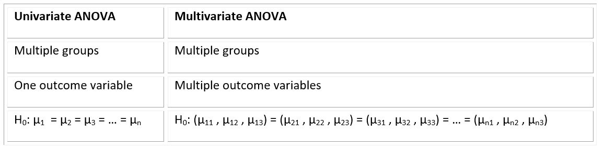
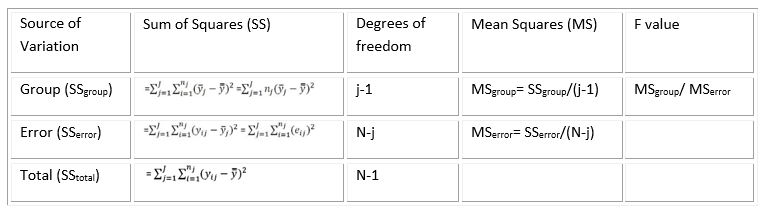

```{r setup, include=FALSE}
knitr::opts_chunk$set(echo = TRUE, cache = TRUE)
```


```{r echo=FALSE}

############################################################
####                                                    ####  
####  NRES 746, Student Led Topic                       ####
####                                                    ####
####  Maria Sole Bonarota, Mona Farnisa, Ranae Zauner   #### 
####  University of Nevada, Reno                        ####
####                                                    #### 
############################################################


############################################################
####  ANOVA/MANOVA                                      ####
############################################################


```

# MANOVA

Here is the download link for the R script for this lecture: [MANOVA script](MANOVA.R)

## Overview

1. Introduction (Sole)
    + ANOVA vs. MANOVA
    + Assumptions of MANOVA
    + Theory of ANOVA (Sum of Squares)
    + Theory of MANOVA (Sum of Squares and Cross Product Matrices)
    + One-way vs. Factorial
2. Demo 1 – One-way MANOVA (Mona)
3. Demo 2 – Factorial MANOVA (Ranae)

## Introduction 
MANOVA is an extension of ANOVA and assesses the effects of one or multiple groups on multiple dependent variables. ANOVA is widely used in life science and it allows us to determine whether the means between three or more groups are statistically different. ANOVA is the statistical analysis that we should use when we want to test a particular hypothesis, such as how different groups respond to a certain effect. 

One-way ANOVA compares the effects of one group on one dependent variable, while Two-way and Factorial ANOVA compare the effects of two and more groups and their interaction terms on one dependent variable.

**What is the purpose of ANOVA?**
To determine whether the group variable(s) can affect the outcome variable.

```{r}
library(heplots)
data(RootStock) # Dataset from an experiment comparing apple trees from from six different root stocks from 1918-1934. 

str(RootStock)
```


```{r, echo=FALSE}
####visualize groups with histograms
#create x axis length
xaxis<-seq(0, 2.5, length=100)


#crate histogram for variable weight15 = weight of tree above ground at 15 years
hist(RootStock$weight15, prob = TRUE, col = "blue",
     ylim = c(0, 3.2),
     xlim=c(0,2.5),
    )
#add mean line
abline(v=mean(RootStock$weight15),col="green",lwd=3)


#add bell curves to the plot (for each group)

#create bell curves for each group (for variable weight15= weight of tree above ground at 15 years)
curve1<-dnorm(xaxis, mean= mean(RootStock[which(RootStock$rootstock=="1"),]$weight15), sd= sd(RootStock[which(RootStock$rootstock=="1"),]$weight15))
curve2<-dnorm(xaxis, mean= mean(RootStock[which(RootStock$rootstock=="2"),]$weight15), sd= sd(RootStock[which(RootStock$rootstock=="2"),]$weight15))
curve3<-dnorm(xaxis, mean= mean(RootStock[which(RootStock$rootstock=="3"),]$weight15), sd= sd(RootStock[which(RootStock$rootstock=="3"),]$weight15))
curve4<-dnorm(xaxis, mean= mean(RootStock[which(RootStock$rootstock=="4"),]$weight15), sd= sd(RootStock[which(RootStock$rootstock=="4"),]$weight15))
curve5<-dnorm(xaxis, mean= mean(RootStock[which(RootStock$rootstock=="5"),]$weight15), sd= sd(RootStock[which(RootStock$rootstock=="5"),]$weight15))
curve6<-dnorm(xaxis, mean= mean(RootStock[which(RootStock$rootstock=="6"),]$weight15), sd= sd(RootStock[which(RootStock$rootstock=="6"),]$weight15))


lines(xaxis, curve1, col = 1, lwd = 2)
text(x=mean(RootStock[which(RootStock$rootstock=="1"),]$weight15), y=3, "Group1", col=1)#label curve


lines(xaxis, curve2, col = 2, lwd = 2)
text(x=mean(RootStock[which(RootStock$rootstock=="2"),]$weight15), y=3, "Group2", col=2)


lines(xaxis, curve3, col = 3, lwd = 2)
text(x=mean(RootStock[which(RootStock$rootstock=="3"),]$weight15), y=2.8, "Group3", col=3)


lines(xaxis, curve4, col = 4, lwd = 2)
text(x=mean(RootStock[which(RootStock$rootstock=="4"),]$weight15), y=2.8, "Group4", col=4)


lines(xaxis, curve5, col = 5, lwd = 2)
text(x=mean(RootStock[which(RootStock$rootstock=="5"),]$weight15), y=2.6, "Group5", col=5)


lines(xaxis, curve6, col = 6, lwd = 2)
text(x=mean(RootStock[which(RootStock$rootstock=="6"),]$weight15), y=2.6, "Group6", col=6)


text(x=2, y=2, "Is tree weight\ninfluenced by rootstock?", col=10)#this is the final figure


```

*Figure 1: Histogram variable RootStock$weight15 illustrating bell curves for trees from each root stock.*

* Examples of using one-way ANOVA in plant science:
    + Does tree species affect the survival to fire disturbance?
    + Does crop variety affect the final yield?
    + Does the soil type affect root development?
    + Does irrigation scheduling affect fruit weight?

* Examples of using two-way ANOVA in plant science:
    + Do tree species and fire duration affect the survival to fire disturbance?
    + Do variety and water regime affect crop yield?
    + Do soil type and microbiome affect root development?
    + Do irrigation scheduling and water quality affect fruit weight?

* Examples of using factorial ANOVA in plant science:
    + Do tree species, tree age, and fire duration affect the survival to fire disturbance?
    + Do variety, air temperature, and water regime affect crop yield?
    + Do soil type, soil temperature, and microbiome affect root development?
    + Do irrigation scheduling, irrigation type, and water quality affect fruit weight?

However, ANOVA can only assess one dependent variable at a time. This can be a problem because it can prevent the researcher from detecting effects and interaction terms that might actually exist.

MANOVA allows us to test multiple dependent variables at a time, providing a solution to this limitation from ANOVA. So, while in ANOVA we compare the means of more than two groups, in MANOVA we compare vectors of means between more than two groups (see Table 1).



*Table 1: A table comparing differences between univariate and multivariate ANOVA.*

* **Advantages of using MANOVA are:** 
    + Assess the influence of independent variables on the relationships between dependent variables;
    + Limits the joint error rate, meaning that when performing multiple ANOVAs on each dependent variable, the joint probability of rejecting a true null hypothesis (Type I error) increases with each additional test. When using MANOVA the error rate equals the significance level.


## Data assumptions
* As in ANOVA, data have to meet the following assumptions in MANOVA:
    + ***Independent observations:*** MANOVA assumes that each observation is randomly and independently sampled from the population. This assumption is met when the probability sampling method is used to collect data. Examples of probability sampling methods are: simple, stratified, clustered or systematic random sampling.
    
    + ***Multivariate normality for each group under comparison:*** this assumption is met when >20 observation per each factor*outcome variable are collected (Multivariate Central Limit Theorem). If the sample number is <20, we have to check the normality of the residuals of the data for each outcome variable. However, MANOVA is robust against slight violations of this assumption.
    
    + ***Equal variance and covariance matrices between groups:*** the most common way to check for this assumption is using Box’s M test. We usually use a significance level of 0.001 to determine whether or not the population covariance matrices are equal. If the p-value is higher than 0.001, the assumption is met. MANOVA is robust against slight variation of this assumption.
    
    + ***No multivariate outliers:*** calculate Mahalanobis distance can be for each observation, which represents the distance between two points in a multivariate space. Is the p-value associated with the Mahalanobis distance for one observation is less than 0.001, we declare that that observation is an outlier.

## How does it work?
To understand how MANOVA assesses differences between groups, we will start by explaining how ANOVA works. ANOVA works by dividing the total deviation for each observation (observed value / overall mean) into the between groups deviation (group mean – overall mean) and the within groups deviation (also called error deviation, observed value – group mean). If these two are equal, the group means are equal. If they differ, the group means are not equal (see Figure 2).

```{r, echo=FALSE}
#create histogram for variable weight15
hist(RootStock$weight15, prob = TRUE, col = "white",
     ylim = c(0, 3.2),
     xlim=c(0,2.5),
)
#add mean line
abline(v=mean(RootStock$weight15),col="blue",lwd=3)

#add bell curves to the plot (for each group)
#add distance from mean

lines(xaxis, curve1, col = 1, lwd = 2)
text(x=mean(RootStock[which(RootStock$rootstock=="1"),]$weight15), y=3, "Group1", col=1)#label curve
abline(v=mean(RootStock[which(RootStock$rootstock=="1"),]$weight15),col=1,lwd=1)
points(x=mean(RootStock[which(RootStock$rootstock=="1"),]$weight15), max(curve1), col=1,lwd=3)
xline=c(mean(RootStock[which(RootStock$rootstock=="1"),]$weight15),mean(RootStock$weight15))
yline=c(max(curve1), max(curve1))
lines(x=xline, y=yline,col=1, lty=5)

lines(xaxis, curve2, col = 2, lwd = 2)
text(x=mean(RootStock[which(RootStock$rootstock=="2"),]$weight15), y=3, "Group2", col=2)
abline(v=mean(RootStock[which(RootStock$rootstock=="2"),]$weight15),col=2,lwd=1)
points(x=mean(RootStock[which(RootStock$rootstock=="2"),]$weight15), max(curve2), col=2,lwd=3)
xline=c(mean(RootStock[which(RootStock$rootstock=="2"),]$weight15),mean(RootStock$weight15))
yline=c(max(curve2), max(curve2))
lines(x=xline, y=yline,col=2, lty=5)

text(x=2, y=2, "Is the difference from the overall\nmean statistically significant?", col=1)

```

*Figure 2: Histogram for tree weights illustrating mean differences for trees from root stock 1 and root stock 2.*

```{r, echo=FALSE}
#### Actual visualization of SS
RootStock$rootstock<-as.factor(RootStock$rootstock)

#boxplot with single data points
boxplot(weight15~rootstock,data=RootStock,xlab="Rootstock", ylab="Tree Weight")
stripchart(RootStock$weight15~RootStock$rootstock, 
           vertical=TRUE,
           method='jitter',
           pch=21, col='blue',
           bg='red',
           add=TRUE)

#add overall mean
abline(h=mean(RootStock$weight15),col=2,lwd=3)


#add total deviation = deviation of single observation from overall mean


yline=c(0.8,mean(RootStock$weight15))
xline=c(0.9, 0.9)
points(y=0.8,x= 0.9, col=5,lwd=10)
lines(x=xline, y=yline,col=5, lwd=7)


yline=c(1.5,mean(RootStock$weight15))
xline=c(1.9,1.9)
points(y=1.5,x= 1.9, col=5,lwd=10)
lines(x=xline, y=yline,col=5, lwd=7)

text(x=6, y=1.6, "Total Deviation", col=5)

# add group deviation

yline=c(mean(RootStock[which(RootStock$rootstock=="1"),]$weight15),mean(RootStock$weight15))
xline=c(1, 1)
points(y=mean(RootStock[which(RootStock$rootstock=="1"),]$weight15),x= 1, col=2,lwd=5)
lines(x=xline, y=yline,col="blue", lwd=7)


yline=c(mean(RootStock[which(RootStock$rootstock=="2"),]$weight15),mean(RootStock$weight15))
xline=c(2, 2)
points(y=mean(RootStock[which(RootStock$rootstock=="2"),]$weight15),x= 2, col=2,lwd=5)
lines(x=xline, y=yline,col="blue", lwd=7)


text(x=6, y=1.55, "Group Deviation", col="blue")

#add error deviation = deviation of single observation from group mean

yline=c(0.8,mean(RootStock[which(RootStock$rootstock=="1"),]$weight15))
xline=c(1, 1)
points(y=0.8,x= 0.9, col=5,lwd=10)
lines(x=xline, y=yline,col="dodgerblue", lwd=7)


yline=c(1.5,mean(RootStock[which(RootStock$rootstock=="2"),]$weight15))
xline=c(2,2)
points(y=1.5,x= 1.9, col=5,lwd=10)
lines(x=xline, y=yline,col="dodgerblue", lwd=7)

text(x=6, y=1.5, "Error Deviation", col="dodgerblue")


```

*Figure 3: A boxplot showing total deviation, error deviation, and group deviation of tree weight.*



*Table 2: A table showing calculations for an ANOVA table.*


The F-value is calculated as variation between sample means and variation within samples. To calculate the p-value associate with the F-statistics, we use the F Distribution Calculator ([F Distribution Calculator - Statology](https://www.statology.org/f-distribution-calculator/)). 

The F distribution has two parameters, which can be called “degrees of freedom 1 and 2” or “degrees of freedom numerator and denominator”. The F table ([F Table - F distribution table](f-table.com)) shows the F statistics correspondent to the cutoff threshold, below which we fail to reject the null hypothesis, and above which we can reject the null hypothesis. 

The P-value associate with an F-value represents the area of the F distribution after the F-value. The higher the F-value, the more variance is explained by groups rather than by error deviation and the lower the p-value will be. If the p-value is lower than the cutoff threshold we set (alpha value), then we are able to reject the null hypothesis.


```{r, echo=FALSE}
#### illustrate f distribution 


plot(df(xaxis,3,100))

abline(v=80)

```

*Figure 4: Illustration of the F-distribution.*


## ANOVA vs MANOVA - vectors!
A key difference between ANOVA and MANOVA tests is in how Sum of Squares are calculated (called Sum of Squares and Cross Product Matrices in MANOVA). In short, MANOVA uses a vector of means for the response variables to calculate the Sum of Squares calculations instead of a single mean of one response variable in an ANOVA test. 

In MANOVA, the sum of squares is calculated by multiplying vectors of means (one mean per outcome variable), which implies that the Sum of Squares are matrices.

Total sum of squares in MANOVA is called T, or “Sum of Squares and Cross Product Matrices”.

SSgroup is called H, or “Hypothesis Sum of Squares and Cross Product Matrices”.

SSerror is called E, or “Error Sum of Squares and Cross Product Matrices”.

### MANOVA test statistics
Because we are now working with matrices and not single values, we have to group response variables differently. We can do this by calculating 4 statistics which convert matrices into a scalar value.The significance of effects in MANOVA can be tested using the following test statistics:

#### Wilk’s lambda:

Wilks Lambda is the ratio of the determinant of the error sums of squares and cross products matrix E to the determinant of the total sum of squares and cross products matrix T= H + E. That is:

 
 
The null hypothesis of equality of treatment mean vectors is rejected if the ratio of generalized variance (Wilk’s lambda statistic) Λ* is too small (i.e. H is large relative to E). In short, This statistic represents the proportion of variation NOT explained by the model. 

The Wilk’s lambda test is considered between liberal and conservative. Wilk’s lambda is often used as the default test statistic. 


#### Pillai’s Trace:

Pillai's trace is formulated by multiplying H by the inverse of the total sum of squares and cross products matrix T = H + E. Large value of the test statistics means H is relatively large to E, which leads to the rejection of the null hypothesis.

 

This test statistic is considered to be very robust and has a greater tolerance for non-normal data. Type II errors are more likely with Pillai’s Trace. When assumptions are violated and cannot be remedied or the experimental design is unbalanced, Pillai’s trace can be used.


#### Hotelling-Lawley trace:

The inverse of E is multiplied by H (sum of squares and sum of cross product matrices of treatments) and the trace of the resultant matrix is taken. For Larger H in comparison to E, means large value of the test statistics, large value of Hotelling-Lawley trace, leads to the rejection of the null hypothesis. 


Hotelling-Lawley trace is analogous to an F-test and is equivalent to Hotelling’s T-squared divided by the differences between number of groups and sample size. It is considered a liberal test, as Type I errors are more likely. It is generally used in a controlled experimental setting where MANOVA assumptions are met very well. 


#### Roy’s Largest Root: 

H is multiplied by the inverse of E, and from the result and matrix the largest eigen value is obtained. Roy’s root will be large if H is substantially large compare to E, which leads to the rejection of the null hypothesis.

Also known as Roy’s largest eigenvalue, this statistic is most powerful in cases where one variable strongly distinguishes one group from all other groups. If all test statistics are significant, we can reject the null hypothesis and perform a post-hoc analysis to determine specific differences between groups.


## MANOVA examples in R

### One-Way MANOVA example in R

### References ###
Data: Mona Farnisa. Hemp Phenotyping Study, 2021. University of Nevada, Reno. 

Code: Tabachnick, Barbara, and Linda.S. Fidell. 2012. Using Multivarite Statistics. 6th ed. Pearson.

# Packages
```{r}
library(tidyverse)
library(tibble)
library(ggpubr)
library(rstatix)
library(car)
library(broom)
library(mvtnorm)
library(dplyr)
library(tidyr)
library(purrr)
library(psych)
library(magrittr)
```


```{r, echo=FALSE, eval=FALSE}
# Load and clean data
Phenotype_2021_Simple <- read.csv("Phenotype.csv")

Phenotype_2021_Simple$Height_cm <- Phenotype_2021_Simple$Height..cm.
Phenotype_2021_Simple$Stem_Diameter_mm <- Phenotype_2021_Simple$Stem.Caliper..mm.
Phenotype_2021_Simple$True_Leaves <- Phenotype_2021_Simple$True.Leaves
Phenotype_2021_Simple$Lateral_Nodes <- Phenotype_2021_Simple$Lateral.Branching.Nodes
Phenotype_2021_Simple$Variety <- as.factor(Phenotype_2021_Simple$Variety)

phenotype2 <- Phenotype_2021_Simple %>%
  select(Height_cm, Stem_Diameter_mm, True_Leaves, Lateral_Nodes, Variety) %>%
  add_column(id = 1:nrow(Phenotype_2021_Simple), .before = 1)

# Select columns of interest
phenotype2.5 <- phenotype2 %>% filter(Variety != "Trophy Wife S2")
phenotype2.5 <- phenotype2.5 %>%
  select(id, Height_cm, True_Leaves, Variety)
head(phenotype2.5)

write.csv(phenotype2.5,"phenotype_data.csv")
```

```{r}
# Load cleaned data

phenotype2.5 <- read.csv("phenotype_data.csv")
phenotype2.5$X <- NULL
```

 
```{r}
# Visualize dataset with boxplots
ggboxplot(phenotype2.5, x = "Variety", y = c("Height_cm", "True_Leaves"), 
  merge = TRUE, palette = "ggplot2")
```


```{r}
# Get Summary Statistics
phenotype2.5 %>%
  group_by(Variety) %>%
  get_summary_stats(Height_cm, True_Leaves, type = "mean_sd")

```

#### Checking Assumptions ####
Adequate sample size: the n in each cell > the number of outcome variables.

Absense of univariate or multivariate outliers.

Multivariate normality. 

Absence of multicollinearity. 

Linearity between all outcome variables for each group.

Homogeneity of variances. 

Homogeneity of variance-covariance matrices. 

### Check sample size assumption ###
```{r}
# n in each group should be greater than number of outcome variables 
phenotype2.5 %>%
  group_by(Variety) %>%
  summarise(N = n())
```

### Identify univariate outliers ###
If outliers exist, they can be left in the data and compared in MANOVA result with and without outlier. 
```{r}
phenotype2.5 %>% 
  group_by(Variety) %>%
  identify_outliers(Height_cm)
# no outliers!

phenotype2.5 %>% 
  group_by(Variety) %>%
  identify_outliers(True_Leaves)
# no outliers!
```

### Detect multivariate outliers with mahalnobis distance ###

Returns the squared Mahalanobis distance of all rows in x

```{r}
phenotype2.5 %>%
  group_by(Variety) %>%
  mahalanobis_distance(-id) %>%
  filter(is.outlier == TRUE) %>%
  as.data.frame()
# no outliers!
```

### Univariate normality assumption with shapiro-wilks test ###

For sample sizer larger than 50, QQ-plots are recommended over Shapiro-Wilks, which becomes more sensitive to larger sample sizes
```{r}
phenotype2.5 %>%
  group_by(Variety) %>%
  shapiro_test(Height_cm, True_Leaves) %>%
  arrange(variable)
# p-value > 0.05, so data is normally distributed, except for Auto CBD-True Leaves. 
# However, MANOVA is fairly robust to deviations from normality so we will continue
```

### Test multivariate normality assumption ###

mshapiro_test() in rstatix package can be used to perform the Shapiro-Wilk test for multivariate normality.

```{r}
# phenotype2.5 %>%
#   select(Height_cm, True_Leaves) %>%
#   mshapiro_test()


mshapiro_test(phenotype2.5[,2:3])
# p-value greater than 0.05, assumption met!

```


### Check multicolinearity between the variables ###

The dependent (outcome) variables cannot be too correlated to each other. 

No correlation should be above r = 0.90 [Tabachnick and Fidell (2012)}.

Correlations that are too low can also be a problem

For more than 2 variables cor_mat() can be used
```{r}
phenotype2.5 %>% cor_test(Height_cm, True_Leaves)
# Pearson correlation = 0.37
# p-value < 0.05, so no multicolinearity! 
```


### Check linearity Assumption ###

Create a ggplot lm scatterplot by group to visually assess linearity between variables among groups

MANOVAs are best conducted when the dependent variables used in the analysis are highly 
negatively correlated and are also acceptable if the dependent variables are found to be correlated around .60, either positive or negative.

```{r}
check.linearity <- ggplot(phenotype2.5, aes(x=Height_cm, y=True_Leaves, color=Variety))+
  geom_point(size = 4)+
  theme_classic()+
  geom_smooth(method=lm, se=FALSE) + 
  ylab('True Leaves' ) +
  xlab('Height (cm)') + 
  labs(color = 'Hemp Variety')  #rename legend title
check.linearity
```

### Check homogeneity of covariances with Box's M-test in rstatix package ###
Box-M test is the equivalent of a multivariate homogeneity of variance. 

This test is highly sensitive and significance for this test is determined at alpha = 0.001.
```{r}
box_m(phenotype2.5[, c("Height_cm", "True_Leaves")], phenotype2.5$Variety)
# p-value < 0.001, so assumption not met
```
With a balanced design of groups with similar n, violating homogeneity of variances-covariances matrices is not a problem and analysis can be continued!

However, an unbalanced design will present problems. 


### Check homogeneity of variance assumption with Levene's test ###

The Levene’s test can be used to test the equality of variances between groups. 

Non-significant values of Levene’s test indicate equal variance between groups.
```{r}
phenotype2.5 %>% 
  gather(key = "variable", value = "value", Height_cm, True_Leaves) %>%
  group_by(variable) %>%
  levene_test(value ~ Variety)
# p-value < 0.05, so no homogeneity of variances!
# True Leaves p-value is 0.05, we will accept, but use Pillais test because it is robust against violations of assumptions
```


### MANOVA ###
4 test statistics to use (Pillai, Wilks, Hotelling-Lawley, Roy)

Pillai test is more robust against violations of assumptions and recommended for unbalanced design.

Wilk's lambda is default in R
```{r}
model <- lm(cbind(Height_cm, True_Leaves) ~ Variety, phenotype2.5)
Manova(model, test.statistic = "Pillai")
# Statistically significant difference between Variety on the combined 
# dependent variables (Height and True Leaves), F(4, 54) = 10.546, p < 0.0001.
```


### Post-hoc tests for statistically significant MANOVA ###

Do a one-way ANOVA for each dependent variable.

anova_test() when normality and homogeneity of variances is met

welch_anova_test() when homogeneity of variance is violated 

kruskal_test() non-parametric alternative 
```{r}
grouped.data <- phenotype2.5 %>%
  gather(key = "variable", value = "value", Height_cm, True_Leaves) %>%
  group_by(variable)
grouped.data %>% welch_anova_test(value ~ Variety)
# Statistically significant univariate welch_anova difference in Height (F(2, 16.2) = 27.2, p < 0.0001)
# and True Leaves (F(2, 16.7) = 69.9, p < 0.0001 ) between hemp varieties. 
```


### Compute multiple pairwise comparisons to determine which groups are different ###

If homogeneity of variance assumption is met use tukey_hsd()

If assumption of homogeneity of variance violated use Games-Howell post-hoc test. 
```{r, eval=FALSE,eval=FALSE}
pwc <- phenotype2.5 %>%
  gather(key = "variables", value = "value", Height_cm, True_Leaves) %>%
  group_by(variables) %>%
  games_howell_test(value ~ Variety) %>%
  select(-estimate, -conf.low, -conf.high) # Remove details
pwc
```
```{r}
pwc_alt_code <- phenotype2.5 %>%
  gather(key = "variables", value = "value", Height_cm, True_Leaves) %>%
  group_by(variables) %>%
  games_howell_test(value ~ Variety) # %>%
  # select(-estimate, -conf.low, -conf.high) # Remove details
pwc_alt_code$estimate <- NULL
pwc_alt_code$conf.low <- NULL
pwc_alt_code$conf.high <- NULL
pwc_alt_code

```

### Results ### 
```{r}
# Visualize Results: box plots with p-values
pwc_alt_code <- pwc_alt_code %>% add_xy_position(x = "Variety")
test.label <- create_test_label(
  description = "MANOVA", statistic.text = quote(italic("F")),
  statistic = 10.546, p= "<0.0001", parameter = "4,54",
  type = "expression", detailed = TRUE
)
ggboxplot(
  phenotype2.5, x = "Variety", y = c("Height_cm", "True_Leaves"), 
  merge = TRUE, palette = "ggplot2"
) + 
  stat_pvalue_manual(
    pwc_alt_code, hide.ns = FALSE, tip.length = 0, 
    step.increase = 0.3, step.group.by = "variables",
    color = "variables"
  ) +
  labs(
    subtitle = test.label,
    caption = get_pwc_label(pwc_alt_code, type = "expression")
  )

```

A one-way MANOVA to determine effect of 3 different hemp varieties (Auto CBD, Berry Blossom, Matterhorn CBG) on Height and True Leaves. 


A statistically significant difference between varieties on the combined dependent variables F(4, 54) = 10.546, p < 0.0001.

Univariate ANOVAs, using a Bonferroni adjusted alpha level of 0.025, showed a statistically significant difference in Height (F(2, 16.2) = 27.2, p < 0.0001) and True Leaves (F(2, 16.7) = 69.9, p < 0.0001). 

All pairwise comparisons between groups were significant except for Height and True Leaves between Berry Blossom and Matterhorn CBG using the Games-Howell pairwise comparison. 


### Factorial MANOVA example in R
A factorial MANOVA is used when a researcher wishes to investigate whether two or more grouping variables affect two or more outcome variables. 

For this example, we will use the Soils dataset from the cars package. Details: 

"Soil characteristics were measured on samples from three types of contours (Top, Slope, and Depression) and at four depths (0-10cm, 10-30cm, 30-60cm, and 60-90cm). The area was divided into 4 blocks, in a randomized block design."

```{r}
# load packages
library("car")
library("MASS")

#Load the data
soils <- Soils

# Make variables factors 
Contour <- factor(soils$Contour)
Depth <- factor(soils$Depth)

head(soils)
```

We will focus on three outcome variables (pH, Density, Conductivity) and two independent variables (contour (top, slope, and depression), depth (0-10 cm, 10-30 cm, 30-60cm, and 60-90 cm)). And test the following: 

*Null hypotheses being tested:* 

1. The joint mean of the outcome variables (pH, Density, and COnductivity) ARE NOT significantly different among the categories of the grouping variables.

2. The joint mean of the outcome variables (pH, Density, and Conductivity) ARE NOT significantly different for combinations of the contrours*Depth interaction. 

*Note: Assumptions should always be verified as was done in the one-way MANOVA example. For brevity, this will be skipped here.*

#### Create a model and determine Sum of Squares type:

**Three types of sum of squares** 

\setlength{\leftskip}{2cm}
1. Type I SS: Also called Sequential Sum of Squares, will assign variation in sequential order to grouping variables.

2. Type II SS: Here, variation assigned to each variable takes into account the other grouping variable(s). Type II is used when there is **no** significant interaction term.

3. Type III SS: Also called the partial sums of squares, like Type II, order of the variables is not considered. It is different from Type II in that it is used when there is a significant interaction term.
\setlength{\leftskip}{0pt}

```{r}
# Create a model, have to bind the 3 outcome variables using cbind().

soils.mod <- lm(cbind(pH, Dens, Conduc) ~ Contour + Depth + Contour*Depth -1, data = soils) # Note: -1 removes the intercept effect
summary(soils.mod)

```

The summary of this model shows contour and depth have significant effects on our outcome variables, but interaction terms are not (all greater than 0.05). When running a MANOVA, the type of Sum of Squares we wish to estimate must be specified. 

***In our case, so we can use the type II sum of squares to test our null hypotheses as we do not have a significant interaction term.***

As discussed previously, Wilk's lambda is considered between liberal and conservative and often used as the default test statistic. Because there is no obvious reason to use another test statistic at this point, let's use Wilk's lambda. 

*Note: [This article](https://towardsdatascience.com/anovas-three-types-of-estimating-sums-of-squares-don-t-make-the-wrong-choice-91107c77a27a) gives a great summary of ANOVA Sum of Squares types.*

#### Run the MANOVA
```{r}
# Note: Manova() is brought to you by the car package

Manova(soils.mod, multivariate=T, type= c("II"), test=("Wilks"))
# Manova(soils.mod, multivariate=T, type= c("II"), test=("Pillai"))
# Manova(soils.mod, multivariate=T, type= c("II"), test=("Hotelling-Lawley"))
# Manova(soils.mod, multivariate=T, type= c("II"), test=("Roy"))

### If we did have an interaction term we would use type III 

manova(soils.mod, multivariate=T, type= c("III"), test=("wilks"))
# manova(soils.mod, multivariate=T, type= c("III"), test=("Pillai"))
# manova(soils.mod, multivariate=T, type= c("III"), test=("Hotelling-Lawley"))
# manova(soils.mod, multivariate=T, type= c("III"), test=("Roy"))
```
Each test statistic shows the interaction between contour and depth are not significant. 
Can reject our first null, but not the second one. 

### Partial Eta-Squared Values for a factorial MANOVA
Partial eta-squared explains the portion of total variation from a specific grouping variable excluding all other grouping variables. This is commonly used as a measure of effect size.

In our example, each group variable(Contour and Depth) will have their own partial eta-squared values. 

```{r}
library("heplots")
etasq(Anova(soils.mod),anova=TRUE)

etasq(soils.mod,test="Wilks") # Using Wilks to be consistent with above
# etasq(soils.mod,test="Hotelling")
# etasq(soils.mod,test="Roy")
# etasq(soils.mod,test="Pillai")
```

We can say that 78.9% of the variance of our outcome variables is due to the differences in the contour of the soil, and 68% due to the depth.

## Other variations of ANOVA
***ANCOVA/MANCOVA*** - Analysis of Covariance - an extension of ANOVA which can be used to control for covariates, or to study combinations of categorical and continuous variables. 

***Repeated Measures ANOVA*** - useful when using pre- and post-treatment data, or differences over two or more time periods. 

***Mixed-Model ANOVA (within-between ANOVA)*** - Used when examining differences in a response between/among treatments and over time (pre and post treatment, for example) 

***Bayesian ANOVA*** - Instead of traditional hypothesis testing in which an F statistic and p-value are used to reject/not reject a null hypothesis, a Bayesian ANOVA can provide support for an alternative hypothesis.


## Resources we found helpful 
Bobbitt, Z. (2021, August 3). The Complete Guide: How To Check Manova Assumptions. Statology. Retrieved November 14, 2021, from https://www.statology.org/manova-assumptions/. 

Buttigieg PL, Ramette A (2014) A Guide to Statistical Analysis in Microbial Ecology: a community-focused, living review of multivariate data analyses. FEMS Microbiol Ecol. 90: 543–550.

Cleophas T.J., Zwinderman A.H. (2018) Bayesian Analysis of Variance (Anova). In: Modern Bayesian Statistics in Clinical Research. Springer, Cham. https://doi-org.unr.idm.oclc.org/10.1007/978-3-319-92747-3_8

Korstanje, J. (2019, November 29). ANOVA's three types of estimating sums of squares: Don't make the wrong choice! Medium. Retrieved November 14, 2021, from https://towardsdatascience.com/anovas-three-types-of-estimating-sums-of-squares-don-t-make-the-wrong-choice-91107c77a27a. 

RenaissanceWoman. (2018, February 14). Multivariate Statistical Analysis Part 2: MANOVA (with R Demonstration) [Video]. YouTube. https://www.youtube.com/watch?v=SK6Tg3na3mo

Sarhad Journal of Agriculture, Vol.37, Iss. 4, Pages 1250-1259

Wang, Yifan. (2016). Using Multivariate Analysis for Pharmaceutical Drug Product Development. 10.13140/RG.2.2.23379.78881. 


