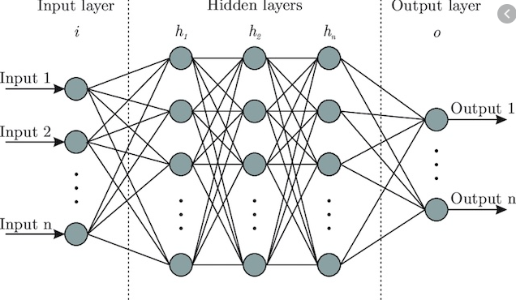
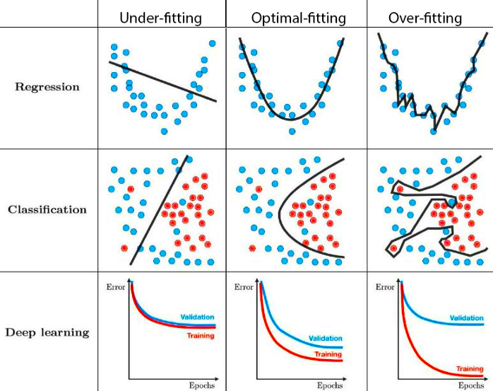
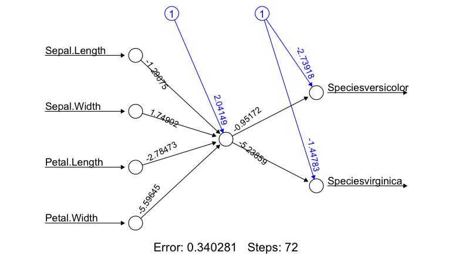
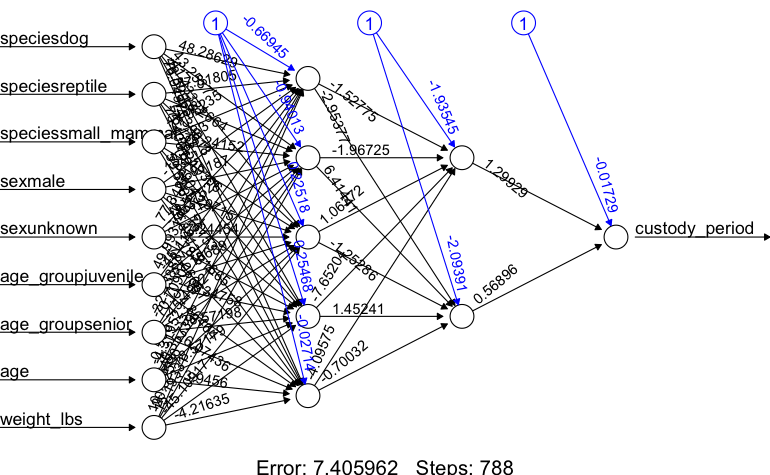
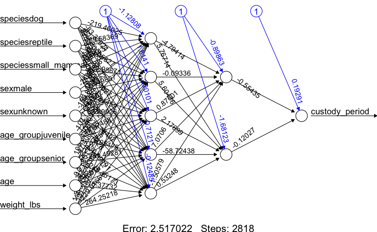

# Neural Network Introduction

"A neural network is the second best way to solve any problem. The best way is to actually understand the problem." - *Unknown*


### What are they?
A neural network is a parallel, distributed information processing structure consisting of processing elements (nodes) interconnected together with unidirectional signal channels. Each node has a single output connection which branches into as many collateral connections as desired. The node's output signal can be of any mathematical value (can later be converted to non-numerical values). All of the processing that goes on within each node must depend only upon the values of the received input signals arriving at the node via incoming connections and upon values stored in the node's local memory (Hecht-Nielsen 1992).

### Theory behind them
Neural networks are a subset of machine learning that are an amalgamation of modern computer science and cognitive psychology. The data processing and analysis is based on the same process that your brains' neurons undergo to process information. Your neurons require a certain amount of activation energy in order to fire and send information beyond the neuron and along to the axon, synapses, to other neurons and so on, an input requirement known as action potential.   

### History of neural networks
- 1943: A couple of old-timey neurophysiologists named McCulloch & Pitts developed the first neural network with electrical circuitry to try to recreate the connections and processing of information within the brain
- 1949: Donald Webb proposed that neural pathways become stronger with more frequent use
- 1958: Frank Rosenblatt publishes a paper with the **Perceptron** concept as an answer for fly's fight or flight response to stimuli (this was a huge breakthrough)


- 1959: First application of neural networks from Stanford lab used to filter out noise in phone lines (still used to this day)
- 1969: Start of the AI "dark ages" where the Perceptron idea was killed by MIT (wrongly) followed by the cold war which made people overly-terrified of technology
- 1986: People got over this intellectual blockade and resumed research in AI and more specifically neural networks. This was catalyzed by the re-discovery of an older theory called **Backpropogation** which made neural networks much more applicable for larger, more diverse datasets.
- 2006: The development of the deep neural network (DNN), most common models created to date.

### What led to the development and use of them?
Originally, scientists were simply interested if they could recreate how the human brain works; they really didn't have any desire to make this concept much more than a concept. After WWII and Alan Turing's creation of what would become the modern day computer, scientists that were able to get their hands on this technology could turn it loose on whatever they could imagine including early neural networks. For the next few decades, the theory of artificial intelligence and neural networks developed faster than technology could to support it until modern computer processors and parallel computing caught up with the all of the theory (Moore's law). Now the opposite seems to be true and computing power is allowing for a lot more applications of neural networks and the sky is the limit for real-world applications.


# Components and applications


Neural networks are currently the fastest growing research topic (Google scholar) as well as one of the most well-funded research areas. Most of *Nature's* most cited papers are based on neural network research (Lek et al. 2016). They are capable of filling in analytical gaps where other statistical methods simply fall short. While they process information the same way our brains do, they are capable of finding patters that we simply are not capable of. 

### Main types of neural networks
1. Artificial neural network (ANN)
2. Convolutional neural network (CNN)
3. Recurrent neural network (RNN)

### Components and function of neural networks
Neural networks vary A LOT in structure, but most of them have relatively similar components and building blocks.



#### Nodes
A node is simply a container for a value with one or more weighted input connections, with the exception of the input layer which has yet to be passed beyond the first input layer.

#### Input layer
The input layer consist of whatever data you are choosing to help predict your desired result. These come in many varieties and number of input layers, but each input node always represents a single floating point value. For the network we will be generating in R, it requires all of our values be between 0 and 1 (requires scaling)

#### Hidden layer(s)
Hidden layer(s) consist of a series of nodes that are used to take in a weighted sum from a combination of nodes from the previous layer and pass those values along to the following layer. This is the black box area of neural networks; they can be very extensive and have many different kinds of layers performing different computational tasks. This is also where the term deep learning comes from, any ANN with multiple hidden layers is considered a deep learning model.

#### Output layer
This is our result. For classification-type models (i.e. what do object does the given input describe?), it will generate a value ranging from 0-1. In an ideal world, it would either be 0 or 1 each time, but it usually varies and whichever value it is closest to is the generated prediction. For numerical outputs, we have to rescale to get usable output variables.

#### Weights
A value that will change an input value to a node from the previous layer depending upon its significance. Weights are multiplied by the input value at your node.

#### Bias value
Bias value is added to the above multiplication of the weight and input at the node. You can think of this bias value as the equivalent of a y-intercept in a linear model.

# Assumptions and steps for building one

### Assumptions
- There really are none. You can pass any data into a neural network, it just needs to be structured first depending upon the model syntax; in our case all values need to be between 0-1.
- They do tend to perform better when your desired output layer of your training dataset follows a uniform distribution.
- Relationships are not always linear (they seldom are), the more input data and input nodes you throw into a model the less often it is

### Data structure
- Every model framework is slightly different (no way we are making our own)
- One consistent rule is that the data needs to be numeric
  - Easy to work around
- Understand your neural network application and create a training dataset with proper resolution
- To properly train and test your model, it is recommended to take your data source and break it up 80/20 for training and testing data

### Training the model
- Here we use a technique called **Backpropogation** (or something similar) to develop our model weights and bias values. 
- Backpropogation works with something commonly referred to as a cost or loss function in combination with another concept called **gradient descent**
  - Similar to how MCMC works to make these random guesses or jumps for posterior values
- Your model will start at your output layer with the ground-truthed training data you have provided and work backwards toward the input layer developing the weights and biases along the way
- Each "step" in your backpropogation, the algorithm will alter the weights and biases to reflect an individual data point (i.e. increase weights for a certain true value and decrease all others)
- I could spend hours talking about this so I'll provide a couple links to YouTube videos on this process that are very helpful

### Forward pass or inference
Once we have successfully trained a properly fitted model, we then have to implement it. In many data science cases this is relatively straightforward, however if being implemented in real-time this can be a very difficult and critical step to retrieve useful data. This process is usually referred to as your forward pass or **inference** step. You may see models referred to as "forward feeding" and this simply means that data is moving from your input to your output layer.

# Issues with neural networks
While neural networks are incredibly powerful and useful tools, they come with their caveats.

### Overfitting
This is one area of similarity that neural networks share with other models. Overfitting is a very common issue encountered while training a neural network, however it is rather easily avoidable if properly monitored and input parameters are adjusted accordingly.
- Don't train model for excessive amount of steps/epochs
- Play around with your learning rate: simply models don't require a slow learning rate
- If all else fails, try different backpropogation methods



### A lot of unknowns
- With very simply models, it can be relatively easy to decipher what the model is thinking. 
- Once you work up to larger models all hope is lost of trying to figure out what the computer is learning.
- Currently not a very accepted method of analysis in a lot of fields

### Collecting sufficient training data can be arduous
- Depending upon what datasets you work with, collecting and formatting training data can be very tedious (i.e. image annotation for CNNs)
- Sometimes you are simply given bad data and this is very problematic

# Let's do some coding
Let's start with a simple example from the iris dataset (sorry)

### Load packages
```{r libraries,message=FALSE}
library(dplyr)
library(neuralnet)
library(stringr)
library(LaplacesDemon)
```
### Load and visualize data
```{r}
head(iris)
summary(iris$Species) #this is our output layer, or what we are predicting
```

Here we see that our output layer represents a perfectly uniform distribution so this is as idea as we can get as far as training is concerned.

### Format the data
```{r}
cleanedIris <- model.matrix(~ Sepal.Length + Sepal.Width + Petal.Length + Petal.Width + Species,data=iris)
cleanedIris <- cleanedIris/max(cleanedIris)
head(cleanedIris)
```
This dataframe snippet shows the format necessary for the neuralnet() function in R. To properly process the data, all of the values need to be between 0 and 1.

### Visualize the neuralnet
```{r}
irisNN <- neuralnet(Speciesversicolor+Speciesvirginica~Sepal.Length+Sepal.Width+Petal.Length+Petal.Width,
                    cleanedIris, hidden=1,algorithm="rprop+",
                    learningrate=0.01, linear.output=F)
plot(irisNN)
```
 

While the iris dataset is painful to look at, it is very useful for generating a strong correlation and creating a simple, interpretable model. For now, lets not worry about the forward pass portion. So let's walk through this a bit.


## Let's play around with some different data


Thanks to some friends that work over at the Nevada Humane Society, I was able to get my hands on their largescale dataset (n>10000) for animal adoptions. This provided a good opportunity to create a neural network to predict residency times for incoming animals to the shelter, useful for understanding resource allocation for shelter pets. So lets look at some data.

### Importing data
```{r}
df <- read.csv('/Users/keaneflynn/Downloads/R-Program/NRES_746/NeuralNetworks/nhseData.csv')
df <- df[!duplicated(df[,c("Name", "Species")]),] 
head(df)
```

### Specific data point
```{r}
df %>% filter(Name=="Donut") #This is my pup
```

### Regrouping data
```{r}
df$Age.Group <- str_remove_all(df$Age.Group," \\(.*?\\)")
df$Age.Group <- str_replace_all(df$Age.Group,"Juvenile|Kitten|Puppy|Unweaned","juvenile")
df$Age.Group <- str_replace_all(df$Age.Group,"Adult Cat|Adult Dog|Adult|Young adult","adult")
df$Age.Group <- str_replace_all(df$Age.Group,"Senior","senior")
df$Current.Weight <- as.numeric(str_extract_all(df$Current.Weight,"\\d{0,3}.\\d{1,2}"))
df$Sex <- str_replace_all(df$Sex,"Male","male")
df$Sex <- str_replace_all(df$Sex,"Female","female")
df$Sex <- str_replace_all(df$Sex,"Unknown","unknown")
df$Species <- str_replace_all(df$Species,"Bird, Unspecified|Chicken, Domestic|Conure, Unspecified|Parakeet, Common|Parakeet, Unspecified","bird")
df$Species <- str_replace_all(df$Species,"Lizard, Unspecified|Snake, Python Unspecified|Tortoise, Unspecified|Turtle, Red-Eared Slider|Turtle, Unspecified","reptile")
df$Species <- str_replace_all(df$Species,"Chinchilla|Ferret|Guinea Pig|Hamster, Dwarf|Hamster, Unspecified|Hedgehog|Mouse, Little Pocket|Mouse, Unspecified|Rabbit, Domestic|Rat, Unspecified|Sugar Glider","small_mammal")
df$Species <- str_replace_all(df$Species,"Dog","dog")
df$Species <- str_replace_all(df$Species,"Cat","cat")
```

### Final dataframe cleansing
```{r}
df <- dplyr::rename(df, c(species = Species,
                          breed = Primary.Breed,
                          sex = Sex,
                          age = Age..Months.,
                          age_group = Age.Group,
                          weight_lbs = Current.Weight,
                          custody_period = Days.in.Custody)) %>%
  select(species,sex,age_group,age,weight_lbs,custody_period) %>% 
  na.omit()
rownames(df) <- 1:nrow(df)
df_check <- df[-c(2860,755,5856,4709,5189),] #removing some outliers that are annoying me
head(df_check)
```
Here we have a cleaner, more interpretable dataframe, where we can see the basis of our input layer and our output layer. Depending upon the dataset, adding more input layers can improve model accuracy but the hidden layers tend to have more relevance in model performance.

### Formatting the dataframe for the neuralnet() package
```{r}
formatted_df <- model.matrix(~ species + sex + age_group + age + weight_lbs + custody_period,data=df_check)
maxVal <- max(formatted_df) #variable stored to unscale our dataframe, important for later
formatted_df <- formatted_df/maxVal
head(formatted_df)
```

### Breaking up into training and testing data
Recall that we need 80% of our data for training our model and 20% for testing, so lets go ahead and break it up accordingly and randomly to avoid accidentally fitting our model to specific attributes.
```{r}
set.seed(70) #sample pseudo-randomly for replication sake
sampleSize <- round(nrow(formatted_df)*0.8) #split up dataset 80/20
rowIndex <- sample(seq(nrow(formatted_df)),size=sampleSize)
training_data <- formatted_df[rowIndex,] #what will be passed into the model training function
testing_data <-  formatted_df[-rowIndex,]
groundtruth_data <- testing_data[,11]*maxVal
```

### Train and visualize our new network for pet adoptions
```{r,fig.keep='all',warning=F}
nn <- neuralnet(custody_period~speciesdog+speciesreptile+speciessmall_mammal+sexmale+sexunknown+age_groupjuvenile+age_groupsenior+age+weight_lbs,
                training_data,
                hidden=c(5,2), learningrate=0.01,  
                linear.output=T)
nn$result.matrix
plot(nn)
```


Here we get a few interesting metrics from the network training. The primary one we are interested in is the error value, we ideally want this to be 0 however that won't happen. But we can take steps to minimize it.

### Let's test our model against our training dataset
```{r}
computedNN <- compute(nn,testing_data)$net.result #this is the forward pass or inference phase of the network
head(computedNN)
predicted_values <- computedNN * maxVal #Here we are taking the output from our neuralnet and unscaling it to make the outputs usable
head(predicted_values)
```

```{r}
plot(groundtruth_data, predicted_values, col='red', pch=1, 
     xlim = c(0,200), ylim = c(0,200), cex=0.75, 
     ylab = "predicted days in shelter", xlab = "actual days in shelter",
     main = "NHSE Custody Period Prediction")
abline(a=0,b=1) #This b=1 line shows what the data would look like in an idea scenario
sum((groundtruth_data - predicted_values)^2)/length(groundtruth_data) #Sum of squared errors normalized by length of the dataset
```
So this doesn't look terrible, but what looks wrong here? (hint: think back to one of the few "assumptions" of neural network training)

### Testing training input data  
Hopefully someone answered my question so I'm not quietly standing up here wishing I had done this with a group.
```{r}
hist(df$custody_period,breaks=50)
```

This is incredibly not uniform. So lets try to fix that a little bit. Let's pick up at a checkpoint dataframe

```{r}
df_check <- df_check %>% filter(custody_period <= 40)
hist(df_check$custody_period,breaks=50)
```

Not perfect, but nothing in life ever is, so good enough.

### Let's cycle through the model training process one more time
```{r}
formatted_df <- model.matrix(~ species + sex + age_group + age + weight_lbs + custody_period,data=df_check)
maxVal <- max(formatted_df) #variable stored to unscale our dataframe, important for later
formatted_df <- formatted_df/maxVal
head(formatted_df)
```

```{r}
set.seed(70) #sample pseudo-randomly for replication sake
sampleSize <- round(nrow(formatted_df)*0.8) #split up dataset 80/20
rowIndex <- sample(seq(nrow(formatted_df)),size=sampleSize)
training_data <- formatted_df[rowIndex,] #what will be passed into the model training function
testing_data <-  formatted_df[-rowIndex,]
groundtruth_data <- testing_data[,11]*maxVal
```

```{r}
nn <- neuralnet(custody_period~speciesdog+speciesreptile+speciessmall_mammal+sexmale+sexunknown+age_groupjuvenile+age_groupsenior+age+weight_lbs,
                training_data,
                hidden=c(5,2), learningrate=0.01,  
                linear.output=T)
#nn$result.matrix #new neural network weights and biases
plot(nn)
```


```{r}
computedNN <- compute(nn,testing_data)$net.result #this is the forward pass or inference phase of the network
predicted_values <- computedNN * maxVal #Here we are taking the output from our neuralnet and unscaling it to make the outputs usable
head(predicted_values)
```

Now that is a healthy improvement on error, so lets give it a run.
```{r}
plot(groundtruth_data, predicted_values, col='red', pch=1, 
     xlim = c(0,45), ylim = c(0,45), cex=0.75, 
     ylab = "predicted days in shelter", xlab = "actual days in shelter",
     main = "NHSE Custody Period Prediction")
abline(a=0,b=1) #This b=1 line shows what the data would look like in an idea scenario
sum((groundtruth_data - predicted_values)^2)/length(groundtruth_data) #Sum of squared errors normalized by length of the dataset
```

This numerical value shows just about an order of magnitude improvement from our last model fitting the data. The visuals of this graph are much better, but we can still see there is a cap on prediction value. We can still see that there is a much higher density of data on the lower end of the days in shelter values. 

So what can we do to resolve this?

Instead of chopping data on the tail end like we did, we can thin the data across the range of the training dataset to better achieve this uniform distribution. 

This is also a very simple model, we could have included many more variables as inputs to improve model accuracy. For example, my dog would be predicted to be out of the shelter relatively quickly based on the model criteria, however the model didn't take into account he has a heart condition.

Additionally, we could have included hidden layers with more dimensionality to try and find more subtle patterns in our data, but I don't think this would work that well without adding in additional input values (could potentially lead to overfitting).

### Let's create a mock dataset for predicting some theoretical incoming pets
Lets make a mockup of three animals: a 3 month old, male puppy roughly german shepherd sized, a 10 month old chinchilla with unknown sex, and a 1 year old female cat that weighs 8 lbs. Let's see what it says!
```{r}
speciesdog = c(1,0,0) 
speciesreptile = c(0,0,0)
speciessmall_mammal = c(0,1,0)
sexmale = c(1,0,0)
sexunknown = c(0,1,0)
age_groupjuvenile = c(1,0,1)
age_groupsenior = c(0,1,0)
age = c(3,10,12)
weight_lbs = c(15,1,8)
testPred <- data.frame(speciesdog,speciesreptile,speciessmall_mammal,
                       sexmale,sexunknown,age_groupjuvenile,age_groupsenior,
                       age,weight_lbs)
testPred <- testPred/maxVal
head(testPred) 
testRunNN <- round(compute(nn, testPred)$net.result * maxVal) #run the neural net prediction and rescaling it for usable results
testRunNN
```

Here we see the prediction: the puppy would be in the shelter for 2 days, the chinchilla for 11, and the cat for 7 days. Based on casually looking through some of the training data this seems like a reasonable response.

Success!

# Cool applications in ecology
Like I mentioned earlier, these models only get better the more data that is collected. As ecological research scales with modern remote sensing and large scale data collection, neural networks are going to become increasingly relevant in both data collection as well as interpretation. 

- Predicting trout spawning habitat (Lek et al. 1996)
- Invertebrate speciation under magnification 
- Processing trail camera data and population monitoring (Snapshot Serengeti ?)
- Passively tracking migratory animals [Salmon migration tracking](https://github.com/keaneflynn/LOTIC)

# Conclusions
- Not implicitly statistics, but a very math dense process
- Neural networks are a fast emerging field of environmental science
- As data availability scales, they will become more prominent
- Can be an incredibly effective real time tool given the correct hardware
- Limitations in understanding correlations and mechanisms, especially on larger neural nets 

### Additional sources of information

#### General neural network
- [Neural Network Information](https://www.youtube.com/watch?v=oV3ZY6tJiA0) (this, however, is on images)
- [IBM on Neural Networks](https://www.ibm.com/cloud/learn/neural-networks)
- [Free courses on Neural Networks](https://www.edx.org/learn/neural-network) (probably python)

#### Backpropogation
- [Backpropogation Overview](https://www.youtube.com/watch?v=Ilg3gGewQ5U) 
- [Backpropogation Calculus](https://www.youtube.com/watch?v=tIeHLnjs5U8)

### Citations
1. Hecht-Nielsen, R. (1992). Theory of the backpropagation neural network. In Neural networks for perception (pp. 65-93). Academic Press. 
2. Lek, S., Delacoste, M., Baran, P., Dimopoulos, I., Lauga, J., & Aulagnier, S. (1996). Application of neural networks to modelling nonlinear relationships in ecology. Ecological modelling, 90(1), 39-52.
3. Lek, M., Karczewski, K. J., Minikel, E. V., Samocha, K. E., Banks, E., Fennell, T., ... & MacArthur, D. G. (2016). Analysis of protein-coding genetic variation in 60,706 humans. Nature, 536(7616), 285-291.
