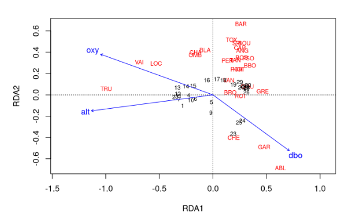
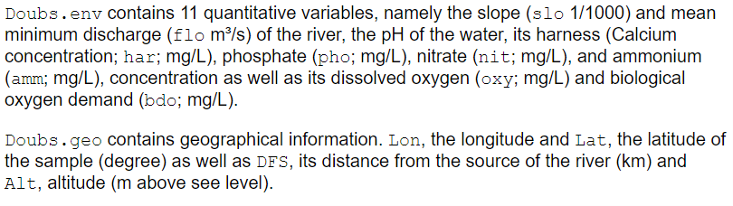

```{r setup, include=FALSE}
knitr::opts_chunk$set(echo = TRUE)
```


You can load up the lab script [here](OrdinationLab2023_script.R)

## Lecture Review  
  
In last week's lecture, we covered the basics of ordination. We reviewed a bit of matrix algebra, learned to compute the most common distance metrics (Euclidean and Bray-Curtis), and covered unconstrained and constrained ordination techniques.  
  
As a reminder, unconstrained ordination methods do not require any prior knowledge or assumptions about the data, and they are primarily used for visualization. These methods include PCA, PCoA, CA, and NMDS.  
  
In contrast, constrained ordination methods do require prior knowledge and/or assumptions about the data. Constrained ordination methods combine concepts from ordination and regression to test hypotheses. These methods include RDA and CCA.  
  
What do we mean by prior knowledge or assumptions about the data? Typically in constrained ordination, we are trying to identify the relationships between a matrix of response variables and a matrix of predictor variables. We partition the variation within the response variables into two parts: the part that *can* be explained by predictor variables, and the part that *cannot* be explained by predictor variables. The variation from the response variables that *can* be explained by the predictor variables is used to create our *constrained ordination axes*. These axes are *constrained* by the response variables.

<!-- MG Note: I think there should be an example of an interpretation of an RDA plot from a paper to set up the last question about how to interpret an RDA plot. I don't know how to interpret an RDA plot compared to a PCA, PCoA, or CA plot (and I don't cover that in the lecture) so having an example would be a good way to help them interpret the plot they make in the last question -->


## RDA Review

The basic steps of redundancy analysis (RDA) are:

1.  Regress each response variable in y over the predictor variables in x\
    
2.  Perform a PCA on the model predictions\
    

Of course, the actual RDA function from the vegan package is a bit more sophisticated than this. It involves [QR decomposition](https://en.wikipedia.org/wiki/QR_decomposition) and some complex matrix algebra. But, today we will focus on using RDA, rather than getting into the weeds with matrix math.  
  

### Doubs Fish Data

For this example, we will be using the Doubs fish data (Verneaux, 1973). It contains 3 datasets. Doubs.fish is a dataset containing counts of 27 species observed across 30 sites in the Doubs river in France. Doubs.env and Doubs.geo are datasets containing attributes on each site, such as longitude and latitude, slope, pH, and dissolved oxygen concentration.

```{r Doubs fish data, message=F}
# Load libraries ----
library(codep)
library(vegan)

# Load Doubs fish Data ----
data(Doubs)
species <- as.data.frame(Doubs.fish[-8,])
vars <- as.data.frame(cbind(Doubs.env[-8,],Doubs.geo[-8,]))
```

Let's take a closer look at the data, starting with the distribution of abundance values we find.

```{r Exploring the data}
## Explore the data ----
# Count the number of species frequencies in each abundance class
ab <- table(unlist(species))
# Plot distribution of species frequencies
barplot(ab, xlab = "Abundance class", ylab = "Frequency", col = grey(5:0/5))
```

That's a lot of zeros!

We can also look at the spread of our predictor variables. The help page for the Doubs data gives explanations of what the variables mean.

```{r Exploring the data 2}
# Look at the spread of the predictor variables
# ?Doubs
summary(vars)
```



The predictor variables are all in different units, and are on very different scales!

## Exercise 1

Before we can perform an RDA, we need to center and scale the predictor variables, as well as account for the double-zero problem. In the previous lecture, we talked about how we can use different distance metrics, such as the Bray-Curtis dissimilarity to account for the double-zero problem. Since we are using the canned RDA function, we don't have the option to use the Bray-Curtis dissimilarity. The RDA function uses the euclidean distance metric. Therefore, we need to fix the double-zero problem before we feed the data into the RDA function.

We can use the hellinger-transformation to account for the double-zero problem. The hellinger transformation takes raw abundance values, and transforms them into the square root of the relative abundance. The formula for the hellinger transformation is:\


where *j* represents species and *i* represents sites (*y~ij~* represents species *j* in site *i*). *y~i**.**~* represents the summed abundance of all species in site *i*.

Write a function called RDA_prep() that uses the hellinger transformation and the scale function to prepare the data for RDA. This function should be specified as follows:

**Input:**

-   x = a dataframe containing the predictor variables\
-   y = a dataframe containing the response variables

**Suggested Algorithm:**

1.  Using the hellinger formula and a for loop, hellinger-transform the y dataframe. (Hint: convert y to a matrix first).\
2.  Use the scale function to center and scale the x dataframe

**Return:**

-   out = a list containing x (the centered and scaled x dataframe) and y (the hellinger-transformed y dataframe)

You can use the following code to check your answer:

```{r Exercise 1, results=F}
decostand(species, "hellinger")
```

After you've made your function, use it to prepare the Doubs fish data for RDA!

## Exercise 2

Now that our data is ready, let's practice using RDA for variable selection! In real life when we are creating models for inference, we should always select variables based on ecological reasoning. But since none of us work on fish in the Doubs river, and we're just trying to get some practice using these functions, we're just going to throw all the data we have at this model!

The ordiR2step() function from the vegan package can help us with variable selection. The concept is similar to the [MuMIn::dredge() function](https://www.rdocumentation.org/packages/MuMIn/versions/1.47.5/topics/dredge). Essentially, it takes a null model and a global model, and then adds predictor variables from the global model to the null model stepwise. If a predictor variable increases the adjusted-R^2^ value, it keeps it. This works because the adjusted-R^2^ value calculation contains a penalty for the number of parameters fit, meaning that adding more parameters does not always increase the adjusted-R^2^.

The two main arguments we need to specify for the ordiR2step() function are object and scope. Object is the null model we want to add to, and scope is the fully specified model we want to pull predictor variables from.

For this exercise, use the rda() function to create null and global models. Then, use the ordiR2step function to choose the best predictor variables. In your word document, answer the following questions:

-   What variables did ordiR2step select?\
-   Can you think of a scenario where it would be appropriate to use ordiR2step (or dredge) for variable selection?

## Exercise 3

So far, we've scaled and transformed our data, and used a variable selection tool to narrow down our predictor variables. Say we want to test the hypothesis that our selected predictor variables are impacting the fish community in the Doubs river. There are functions that allow us to obtain R^2^ and p-values from an RDA!  
  
The RsquareAdj() function extracts the percent of the variation in the response matrix (Doubs fish community) explained by the predictor matrix (environmental variables). This is also called the *constrained variance*. Then, it adjusts the constrained variance for the number of predictor variables used in the model to obtain the adjusted-R^2^ value.  
  
The anova.cca() function allows us to test the significance of the predictor variables used in our RDA by implementing an ANOVA-like permutation test. Essentially, if the argument 'by = "terms"' is specified, the function will sequentially assess if adding each predictor variable makes a significant difference in the amount of variation explained compared to a null model. It's important to note that the order of terms will affect their significance, as they are assessed sequentially from first to last. 

In this last exercise, we will run an RDA on our selected variables, plot the output, and assess its R^2^ value and significance. After completing these tasks, answer the following questions in your word document:

-   What values did you get for the adjusted-R^2^ and p-values?\
-   Are there any conclusions you can draw from your RDA plot?  

  
  
  

