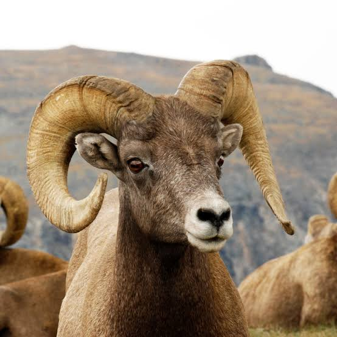

```{r setup, include=FALSE}
knitr::opts_chunk$set(echo = TRUE, cache = TRUE)
```

Here's the code in case you'd like to follow along: [RSF_Lab.R](RSF_Lab.R)

## Lab Introduction

Now that we have covered how resource selection functions (RSFs) works in theory and how they can be used, let's try to build a model based on some real-world data! In this lab, our goal is to create an RSF for Bighorn sheep in North Dakota, adapting a data set collected by Sean. 

You will be given a CSV-file containing the GPS coordinates of collar-marked sheep, where each row represents a point in time where an individual was located. By combining this data with covariates (such as information about vegetation), or adding random slopes and interactions, we can gain a better understanding how this particular species uses the landscape, or what type of _resources they select for._ 

Be dangerous! We encourage you to try adding and removing your own covariates, intercepts, quadratic terms or whatever your heart calls you to do. We will then towards the the end of the lab attempt to answer some questions about what the sheep are selecting for in this region, and discuss what factors seem to be the most relevant in describing their spatial distribution.

<center>

</center>

---

## Data Preparation

Let's begin by loading some packages. You might have to install a few of these before running the code yourself... If prompted in R, click "Install dependencies" to have them all installed in one go!

```{r packages, warning=FALSE, message=FALSE}

# load packages ---------------

library(ResourceSelection)
library(lubridate)
library(tidyr)
library(terra)
library(spdep)
library(sf)
library(dplyr)
library(sp)
library(adehabitatHR)
library(scales)
library(raster)
#library(rgdal) # Removed from CRAN in October! Replaced by terra.
library(ggplot2)
library(amt, quietly = T)
library(raster, quietly = T)
library(glmmTMB)

```

Now, let's read in the GPS collar data. Download the ["rsf_intro.csv"](rsf_intro.csv) file if you want to tag along, and put it in your working directory.

```{r read_data}

  # NOTE: download this from the website if you'd like to follow along... 
sheeps <- read.csv("rsf_intro.csv")
head(sheeps) # What does the first few rows look like?

```

As you can see, the data set has 5 columns:

* ID: Individual identification number. (How many individuals do you think we have?)
* Sex: Categorical variable (M/F). The sex of each individual.
* Julian Day: April 1-June 30, 2020. You'll notice that the Julian date is usually much easier to work with in R than the actual dates!
* Easting/Northing: GPS coordinates using the coordinate system NAD83, UTM Zone 13.


#### Data distribution

Let's continue by looking at the data distribution throughout the spring of 2020.

```{r distplot, out.width="100%"}

ggplot(sheeps, aes(x = JulianDay)) +
  geom_histogram(binwidth = 1, fill = "gray", color = "black") +
  scale_y_continuous(labels = scales::comma, breaks = seq(0, max(table(sheeps$JulianDay)), by = 100000)) +
  labs(title = "Spring '20 Data Distribution", x = "April 1-June 30", y = "Number of Records") +
  theme_minimal() +
  theme(
    plot.title = element_text(hjust = 0.5),
    panel.grid.major = element_blank(), 
    panel.grid.minor = element_blank()
  )

```

Hm, the plot indicates that something something strange is going on. The GPS collar data should be somewhat evenly distributed throughout the spring, though there seems to be a lower number of records from the Julian date ~110-150. Because of this, we need to introduce a random effect on ID to account for uneven sampling.


#### ID as a random effect

To do this, We will be using ID as our predictor, so let's begin by identify how many individuals we have.

```{r individuals}

colnames(sheeps)[1] <- 'ID' # Bug fix, don't mind
n_indivs <- sheeps %>% 
  distinct(ID) %>% 
  n_distinct() 
n_indivs ## 20 individuals 

```

OK, in this data set we're working with 20 unique individuals! Note that for this project, each collar corresponds to one individual. This often is *NOT* the case in collar studies and must be remedied prior to analysis. Additionally, individuals sometimes wear more than one collar - both of these scenarios have implications for how we need to organize the data prior to analysis. 

Let's proceed by identifying the male to female ratio:

```{r sex_ratio}
ggplot(sheeps, aes(x=Sex, fill=Sex))+
  geom_bar() + 
  labs(title= "Number of Records for Males vs. Females", 
       x="Sex", 
       y="Number of Records") +
  theme_minimal()

mf_counts <- table(sheeps$Sex)
mf_counts
```

The plot and the R output tells us that the data points are dominated by female sheep; nearly 3 times as many GPS coordinates are sampled from female sheep than male. How many times have each individual been recorded?

```{r count_table}

count_table <- table(sheeps$ID)
barplot(count_table, main = "Number of Records for Each Individual",
        xlab = "Individual", ylab = "Number of Records",
        col = "skyblue", border = "black")

```

Finally, let's visualize how the sheep are distributed, divided by sex:

```{r spatial_plot}

plot(Northing~Easting, sheeps, col=ifelse(Sex=="M","blue","red"), pch=16)

```

We can already tell that males and females may not be overlapping throughout this study area. This has implications for any models we create where we use sex as a categorical variable (e.g., a male vs. female resource selection model).

We should also note that the data is currently in NAD83 UTM Zone 13. This correctly corresponds with the region of North Dakota we are interested in. In the future when we import raster images, we will need to ensure the data remains in this coordinate reference system (CRS) and, as well as the raster images themselves. More on this later on!


#### Study area using MCPs

Let's continue by creating a study area for our model using the MCP package. MCP helps us estimate a home range for our population (or data set) using a Minimum Convex Polygon. You can think of the package as creating a polygon with the smallest size possible, while still including all of our data points by trailing the ones at the edge of our habitat. 


```{r MCP}

# (In this example, we will create an MCP using a helper package called SpatialPoints)
# SpatialPoints data frame objects don't like missing values
# Let's remove the first two rows that contain NA values and...
# Only include the x and y coordinates for making our MCP:
sheeps.sp <- sheeps[, c("Easting", "Northing")] 
spatial <- SpatialPoints(sheeps.sp)

# Calculate MCPs for sheep:
sheep.mcp <- mcp(spatial, percent = 100)

# Let's examine the output!
sheep.mcp # Calling the MCP object will give us an estimate of area
plot(Northing~Easting, sheeps, col=ifelse(Sex=="M","blue","red"), pch=16)
plot(sheep.mcp, col = alpha(1:5, 0.5), add = TRUE)

```

Perhaps not the prettiest plot, but it does the job! Is this a realistic estimate of the population's habitat range, though? Ideally, we should create a "buffer" around our MCP to better capture the population's available habitat. For the purpose of this lab, however, we are  assuming this is the extent of the sheeps' available habitat.


#### Using random points

Random points are essential to building a statistically significant resource selection function. As you might recall from our lecture, the purpose of generating random points is to estimate the overall habitat availability and comparing this availability to the landscape characteristics your organism is actually selecting for.You can think of random points as a way to generate the null model which you will be testing against your hypothesis. 

There is a more statistically sound method of generating random points as a function of individual selection, but for the purposes of this exercise we will be generating random points using a 1:1 ratio between the number of random points and data points we have in the data set. In other words, we have a total of 1115 "used" points, so we will generate 1115 "random" points throughout our study area to simulate a no selection preference.

```{r rand_points, warning=FALSE}

sheep.mcp <- st_as_sf(sheep.mcp) # Let's use our MCP that we created and convert it to a spatial data frame
class(sheep.mcp) # You can use the "class" function to verify that your "sheep.mcp" object is indeed a data frame!
rand <- st_sample(sheep.mcp, size = nrow(sheeps)) # Let's generate a number of random data points equal to the length of our data set (1:1 ratio).

rand_final <- st_coordinates(rand) # Let us also make sure that we save their coordinates 
rand_final <- as.data.frame(rand_final) # and convert this to a data frame

plot(Northing~Easting, sheeps, col=ifelse(Sex=="M","blue","red"), pch=16)
plot(sheep.mcp, col = alpha(1:5, 0.5), add = TRUE)
plot(rand, add=T, pch=16, col="green", cex=0.5) # Let's plot the points!

```

Now, let's merge our randomly generated points with our original data frame using some *SERIOUS* hardcoding

*VERY IMPORTANT!* When merging the random points data frame with the used points data frame, we still need a way to identify which data points are which. For avoid confusion, let's create a column named "Used". Every used location (points in our data set) receives a "1" and every random location (our generated points) receives a "0".

```{r rand_merge1}

colnames(rand_final)[1] <- "Easting" 
colnames(rand_final)[2] <- "Northing"
rand_final$Used <- 0 # Random Points
sheeps$Used <- 1 # Used Points
sheeps$Num <- 1:1115
rand_final$Num <- 1115:2229
rand_merge <- merge(sheeps,rand_final, by = "Num", all=TRUE)
rand_merge[is.na(rand_merge)] <- ""
rand_merge$Easting <- paste(rand_merge$Easting.x, rand_merge$Easting.y)
rand_merge$Northing <- paste(rand_merge$Northing.x, rand_merge$Northing.y)
rand_merge$Used <- paste(rand_merge$Used.x, rand_merge$Used.y)
rand_merge <- subset(rand_merge, select = -c(Easting.x, Easting.y, Northing.x, Northing.y, Used.x, Used.y))

```

Continue by merging and copy "Used" values to "Random" values:

```{r rand_merge2, warning=FALSE}

copydata <- c("ID", "Sex", "JulianDay")
rand_merge[1116:2229, copydata] <- rand_merge[1:1115, copydata]
all_sheep <- rand_merge
all_sheep$Easting <- as.numeric(all_sheep$Easting)
all_sheep$Northing <- as.numeric(all_sheep$Northing)
all_sheep <- na.omit(all_sheep)
missing <- apply(all_sheep, 2, function(x) any(is.na(x)))
all_sheep <- all_sheep[complete.cases(all_sheep), ]

```

Our merged data frame now finally contains 1:1 random and used points. Let's plot and see what it looks like!

```{r plot_merge}

plot(Northing~Easting, rand_merge, col=ifelse(Sex=="M","blue","red"), pch=16, cex=0.5)

```

#### Load raster image

As you can see, the plot above looks very similar to the plot we had before with our MCP, but now the data is neatly contained in a single data frame. This will make it easier to apply raster image layers to and extract covariates for. Let's proceed by doing exactly that! Make sure that the provided raster image ["samplestudy.tif"](samplestudy.tif) is in your working directory before proceeding.

```{r}

# NOTE: you can load this file from the 
raster <- "samplestudy.tif"
pfg <- rast(raster)
print(pfg) # This provides us some basic metadata for our beautiful raster file
plot(pfg) # What does it look like?

```

What you're looking at is a map of the percentage of perennial forbs and grasses (PFG) cover in our study area. Each cell (pixel) corresponds to an area that's 30x30 meters. White values represent a low cover, and green values correspond to a high cover. Maybe this could be used as valuable covariate for our data...? Before we proceed, however, remember that we need to make sure that our sheep data and raster image have the same coordinate reference system before we can overlay them with each other:

```{r overlay, warning=FALSE}

# Let's convert the sheep and raster image to use same datum:  
# epsg <- 26913
crs.dat <- CRS("+init=epsg:26913")
sheep_spat <- SpatialPointsDataFrame(coords = all_sheep[,c("Easting","Northing")], 
                                     data=all_sheep, 
                                     proj4string = crs.dat)

#plot(sheep_spat, pch=16, col="blue") # Where are our data points in relation to the raster image?

crs.pfg <- crs(pfg)
pfg_proj <- terra::project(pfg, crs.dat) # Projection using the "terra" package

plot(pfg_proj)
plot(geometry(sheep_spat), pch=16, cex=0.5, col="blue", add=T) # Plot both the raster and our data together!

```

<center>
_Look! It's the flag of Brazil!_
</center>

#### Assign covariate values!

Finally, now that we have both our data points (random and used) referenced with the raster image, we can assign each data point a PFG value for statistical analysis.

```{r, final_df}

# Extract point values
point_values <- terra::extract(pfg_proj, sheep_spat@coords)

# Add point values back to main data frame ##

all_sheep <- cbind(all_sheep,point_values)
colnames(all_sheep)[8] <- "pfg"
# hist(all_sheep$samplestudy) # Distribution of PFG values for you to explore!

# View final data frame #
head(all_sheep)

```

That's it! This demonstrates the general process of extracting values from a spatial covariate, given a raster image file with the same coordinate reference system as our population data set. In the exercises below, you will be given a larger data frame, containing more covariates for you to implement into your resource selection model (depending on how you choose to build it!). 


---

## Exercises 

In the lab introduction above, we extracted data for the cover of perennial grasses and forbs (PFG) and added it as a column into our data frame. Now, to make things more interesting, we have added a couple of more covariates for you to include in your models. [*Go ahead and download the "RSF_Lab.csv" file.*](RSF_Lab.csv) 

```{r echo=FALSE, eval=FALSE}

# Exercises ----------------------

all_sheep <- read.csv("rsf_lab.csv")
colnames(all_sheep)[1] <- 'ID' # Bug fix, don't mind
head(all_sheep)
```

As you can see, in addition to PFG, the new covariates are (extracted using a similar process as described above):

* Annual forbs and grasses (AFG), percentage cover per cell, 0-100%
* Shrubs, percentage cover per cell, 0-100%
* Trees, percentage cover per cell, 0-100%
* Elevation, in meters above sea level.

You can now get started with the exercises! For both of these, we provide you with some general questions below for you to consider. All of them can essentially be explained with resource selection models! 

* Which covariates do sheep appear to be selecting for or against? For example, do they prefer areas that are covered with trees more than shrubs?
* Is there a difference in resource selection between males and females?
* Based on your model, do you think you have a decent understanding of what sheep are selecting for in this region? Why or why not? 

#### Exercise 1
Our first exercise takes a frequentist approach to building a resource selection model. We suggest using a GLMM - below is a simple example - though it's up to you to choose your covariates and random effects. Consider what link-function would be appropriate to use. To avoid convergence issues, you might also have to transform the covariate columns. Good luck!


```{r hidden_GLMM}

#Suggested solution?

all_sheep$Used <- as.numeric(all_sheep$Used)
all_sheep$JulianDay <- as.numeric(all_sheep$JulianDay)

mean.pfg <- mean(all_sheep$pfg)
sd.pfg <-  sd(all_sheep$pfg)
all_sheep$pfg.s <- (all_sheep$pfg-mean.pfg)/sd.pfg

mean.jul <- mean(all_sheep$JulianDay)
sd.jul <-  sd(all_sheep$JulianDay)
all_sheep$Julian.s <- (all_sheep$JulianDay-mean.jul)/sd.jul

all_sheep$ID2 <- as.numeric(as.factor(all_sheep$ID))

## Build your GLMM:: 

spring_mod0 <- glmmTMB(Used ~ Sex + JulianDay + pfg + 
                         (1|ID), data = all_sheep, family=binomial(link="logit"),
                       na.action = "na.fail",REML=FALSE )
# summary(spring_mod0)

```


#### Exercise 2

This second exercise allows you to build a similar resource selection model in JAGS/BUGS. To make your lives a little easier (and given the time constraint), we've provided the JAGS code for you below. Try modifying the likelihood function by including different covariates other than PFG, and attempt to interpret the posterior distributions. Have fun!

```{r hidden_JAGS}

## Jags example --------------------

library(jagsUI)
cat("
    model{
    
        ## Specify likelihood:: 
        for(o in 1:n){
          logit(exp_use[o]) <- b0.l+b1*isfem[o]+b2*JulianDay[o]+b3[ID[o]]*pfg[o]+reff[ID[o]]
          used[o] ~ dbern(exp_use[o])
        }
        for(i in 1:nn){
          reff[i] ~ dnorm(0,reff.prec)
          b3[i] ~ dnorm(b3.0,b3.prec) 
        }
        ## Specify Priors::
        
        b0 ~ dunif(0,1)
        b0.l <- log(b0/(1-b0))
        b1 ~ dnorm(0,0.01)
        b2 ~ dnorm(0,0.01)
        b3.0 ~ dnorm(0,0.01)
        b3.prec <- pow(b3.sd,-2)
        b3.sd ~ dunif(0,10)
        reff.sd ~ dunif(0,10)
        reff.prec <- pow(reff.sd, -2)
    }
    
    ", file="jagscode.txt" 
    
)
## define isfem, JulianDay, pfg, ID, n, nn

## Package data for JAGS

jagslist <- list(
  isfem = ifelse(all_sheep$Sex=="F", 1, 0), 
  JulianDay = all_sheep$Julian.s,
  pfg = all_sheep$pfg.s, 
  ID = all_sheep$ID2, 
  n = nrow(all_sheep), 
  nn = max(all_sheep$ID2),
  used = all_sheep$Used
  
)
#jagslist

### Define inits for Jags:: 

initials <- function(){
  list(
    b0 = runif(1,0.4,0.6), 
    b1 = rnorm(1,0,0.1),
    b2 = rnorm(1,0,0.1),
    b3.0 = rnorm(1,0,0.1),
    b3.sd = runif(1,0.1,0.5),
    reff.sd = runif(1,0.1,0.5)
  )
  
}
#initials()

params <- c("b0","b1","b2","b3", "b3.0", "b3.prec","reff.sd","reff")
#?jags

model <- jags(data=jagslist, inits=initials, parameters.to.save=params, model.file="jagscode.txt",
              n.chains=3, n.adapt=1000, n.iter=10000, n.burnin=5000, n.thin=2,
              parallel=TRUE)

sims = model$sims.list

# Some histograms for you to look at!
# hist(sims$b0)
# hist(sims$b1)
# hist(sims$b2)
# hist(sims$b3[,5]) # effect for individual 1
# hist(sims$b3.0)
# hist(sims$reff.sd)
# hist(sims$reff[,1])

```


