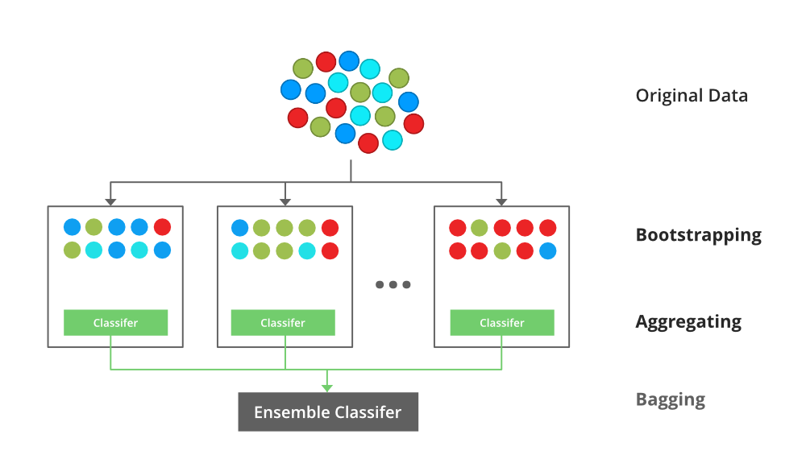

```{r setup, include=FALSE}
knitr::opts_chunk$set(echo = TRUE)
```

```{r, out.width = "800px", echo=FALSE, fig.align="center"}
knitr::include_graphics("./forest.gif")
```

NOTE: you can download the R code [here](RandomForests.R)

# Introduction

***What are *Random Forests?***

*An ensemble learning method utilizing multiple decision trees at training time and outputting the class that is the mode or mean of the individual trees.*

Ensemble learning is the process by which multiple models, such as classifiers or experts, are strategically generated and combined to solve a particular computational intelligence problem.

In short, a random forest is a predictive, non-linear, computational algorithm based on decision trees.  

***OK... so what's a *Decision Tree* then?***  

Woah there pardner! Don't put the ***CART*** before the horse!

```{r, out.width = "400px", echo=FALSE}

```


In this case, ***CART*** is an acronym for *Classification and Regression Trees*.

Originally described in [@cart], a *classification tree* is a partitioning of categorical data and
a *regression tree*  is a partitioning of continuous numerical data.

These split partitions or regions aim to maximize the homogeneity of the target 
variable.

# Thinking about Partitioning

If we wanted to maximize homogeneity of a continuous response variable by 
dividing it into regions, how might we go about that?

## Simple Example: Quantiles
Lets look at one of the example data sets in R: ***mtcars***.

```{r echo = FALSE, results = 'asis'}
library(knitr)
kable(mtcars[1:5,], caption = "mtcars")
```

**mpg**	= Miles/(US) gallon, 
**cyl**	= Number of cylinders, 
**disp** = Displacement (cu.in.), 
**hp** = Gross horsepower, 
**drat** = Rear axle ratio, 
**wt** = Weight (1000 lbs), 
**qsec** = 1/4 mile time, 
**vs** = Engine (0 = V-shaped, 1 = straight), 
**am** = Transmission (0 = automatic, 1 = manual), 
**gear** = Number of forward gears, 
**carb** = Number of carburetors.  

Let's take a look at *mpg* as a response variable to *disp* and fit a linear 
model to it.
```{r, echo = FALSE, message = FALSE}
library(dplyr)
library(tibble)
data(mtcars)
mtcars <- as_tibble(rownames_to_column(mtcars, var = "model"))

quantile.range <- function(data, return.var, split.var, split.n = 10){
  dec <- quantile(data[[split.var]], probs = seq(0, 1, 1/split.n))
  y.store <- vector(mode="numeric", length=0)
  min.store <- vector(mode="numeric", length=0)
  max.store <- vector(mode="numeric", length=0)
  sse.store <- vector(mode="numeric", length=0)
  for (i in 1:length(dec - 1)){
    min <- dec[i]
    max <- dec[i+1]
    restrict <- filter(data, .data[[split.var]] > min & .data[[split.var]] < max)
    restrict.col <- restrict[[return.var]]
    y.pred <- mean(restrict.col)
    y.store <-  c(y.store, y.pred)
    min.store <- c(min.store, min)
    max.store <- c(max.store, max)
    sse <- 0
    for (j in  restrict.col){
      res.err <- (j - y.pred)^2 
      sse <-  sse + res.err
    }
    sse.store <- c(sse.store, sse)
  }
  df <- as.data.frame(cbind(y.store, min.store, max.store, sse.store))
  names(df) <- c(return.var, "min", "max", "sse")
  # df <- filter(df, !is.na(.data[[return.var]])) # to remove NAs
  return(df)
}
plot(mpg ~ disp, data = mtcars, main = "Linear regression")
lm1 <- lm(mpg ~ disp, data = mtcars)
abline(lm1, col = "yellow", lwd = 1.5)
SSE.lm <- with(summary(lm1), df[2] * sigma^2)
```

**SSE:**  `r round(SSE.lm, 1)`

What sort of gain do we get if we partition the data set into R = 4 regions and 
calculate a mean?

```{r, echo = FALSE, message = FALSE}
means.quartile <- quantile.range(mtcars, "mpg", "disp", split.n = 4)
SSE.quartile <- sum(means.quartile$sse) 
plot(mpg ~ disp, data = mtcars, main = "Quartile means")
segments(means.quartile$min, means.quartile$mpg, means.quartile$max, 
         means.quartile$mpg, col = "blue", lwd = 2)
abline(v = min(means.quartile$min), col = "gray")
abline(v = means.quartile$max, col = "gray")
```

**SSE:**  `r round(SSE.quartile, 1)`  

Can we improve our SSE gain if we partition the data set into R = 10 regions?

```{r, echo = FALSE, message = FALSE}
means.decile <- quantile.range(mtcars, "mpg", "disp", split.n = 10)
SSE.decile <- sum(means.decile$sse) 
plot(mpg ~ disp, data = mtcars, main = "Decile means")
segments(means.decile$min, means.decile$mpg, means.decile$max, means.decile$mpg, 
         col = "red", lwd = 2)
abline(v = min(means.decile$min), col = "gray")
abline(v = means.decile$max, col = "gray")
```

**SSE:**  `r round(SSE.decile, 1)`

What about R = n regions (where n = unique(x))?

```{r, echo = FALSE, message = FALSE}
means.n <- quantile.range(mtcars, "mpg", "disp", 
                          split.n = length(unique(mtcars$disp)))
SSE.n <- sum(means.n$sse) 
plot(mpg ~ disp, data = mtcars, main = "n means")
segments(means.n$min, means.n$mpg, means.n$max, means.n$mpg, 
         col = "violet", lwd = 2)
abline(v = min(means.n$min), col = "gray")
abline(v = means.n$max, col = "gray")
```

**SSE:**  `r round(SSE.n, 1)`

We could go even further by fitting linear models to each region instead of 
just taking the mean of region R.

***Simple partitioning - Some drawbacks***

* Clearly easy to over fit the data based on the number of partitions chosen 
(low bias, large variance).
* How do we decide how many partitions to use to maximize the utility of the 
partition?
* What if we wanted some way to partition *disp* that isn't based on quantiles? 
Something more flexible?
* What if we had many possible predictor variables (as in this case), some 
continuous and some categorical? Where would we partition?

## Decision Trees - A partial solution... 

### Binary Splitting with Continuous Response (Regression Trees) 

We can use binary splitting to brute force selection of regions R.  

If we break x = displacement between every possible break point and calculate
the squared estimate of errors for regions left of the break and right of the 
break and add them, we can determine which breaking point results in the minimal 
SSE.  


```{r, echo = FALSE, message = FALSE}
find_split <- function(data, y.var, x.var){
  require(foreach)
  require(dplyr)
  data <- arrange(data, .data[[x.var]])  # puts our input in order of x.var 
  se <- function(y, y.bar) (y-y.bar)^2
  sse.breaks <- foreach (i = 1:(nrow(data)-1), .combine = bind_rows) %do% {
    x.mean <- mean(c(data[[x.var]][i], data[[x.var]][i+1]))
    left.data <- head(data[[y.var]], i)
    right.data <- tail(data[[y.var]], -i)
    left.mean <- mean(left.data)
    right.mean <- mean(right.data)
    se.left <- sapply(left.data, se, y.bar = mean(left.data))
    se.right <- sapply(right.data, se, y.bar = mean(right.data))
    sse = sum(c(se.left, se.right))
    out <- tibble(!!x.var := x.mean, sse = sse)
    out
  }
  return(sse.breaks)
}

# plot the first partitioning into regions R1 and R2 to minimize SSE for each 
# region
SSEs <- find_split(mtcars, "mpg", "disp")
plot(sse ~ disp, data = SSEs, ylim = c(min(SSEs$sse)-200, max(SSEs$sse)+200),
     main = "SSE by disp break value")
abline(h = min(SSEs$sse), col = "red", lty = 3)
x.break <- filter(SSEs, sse == min(SSEs$sse))
abline(v = x.break$disp, col = "red")
```

If we then plot this regional break on out mpg ~ disp plot we get:

```{r, echo = FALSE, message = FALSE}
plot(mpg ~ disp, data = mtcars, main = "Binary breaks")
abline(v = x.break$disp, col = "red")
axis(1, at=x.break$disp, labels=round(x.break$disp, 0))
```

If we continue to partition regions R~1~ and R~2~ into sub-partitions, and those
into even further partitions, we can see the result:

```{r, echo = FALSE, message = FALSE}
recursive.split <- function(data, y.var, x.var, n.splits, r = 1){
  SSEs <- find_split(data, y.var, x.var)
  x.break <- filter(SSEs, sse == min(SSEs$sse)) %>% 
    mutate(n = r)
  left.df <- filter(data, .data[[x.var]] <= x.break[[x.var]])
  right.df <- filter(data, .data[[x.var]] > x.break[[x.var]])
  if ((n.splits - 1) > 0){
    bl <- recursive.split(left.df, y.var, x.var, n.splits -1, r +1)
    br <- recursive.split(right.df, y.var, x.var, n.splits -1, r +1)
    x.break <- rbind(x.break, bl, br)
  }
  return(arrange(x.break, n, .data[[x.var]]))
}
R <- recursive.split(data = mtcars, y.var = "mpg", x.var = "disp", n.splits = 3)
plot(mpg ~ disp, data = mtcars, main = "Binary breaks", xaxt="n" )
pal <- colorRampPalette(c("red", "blue"))(max(R$n))
R <- R %>% mutate(col = pal[n])
abline(v = R$disp, lwd = max(R$n)/R$n, col = R$col)
axis(1, R$disp, labels=round(R$disp, 0), las = 2)
```

We can visualize this process through a decision tree diagram and with the help
of the rpart library!

```{r, echo = TRUE, message = FALSE}
library(rpart)
library(rpart.plot)
tree <- rpart(formula = mpg~disp, data = mtcars, 
              control = rpart.control(maxdepth = 3, minbucket = 1, cp = 0))
prp(tree, faclen = 0, cex = 0.8, extra = 1)
```

Decision trees have 4 different parts:

1. Root Node
2. Internal Nodes
3. Branches
4. Leaf Nodes

In the above regression tree, we have passed some control variables to rpart() 
in order to control how our tree is grown. In this case: 

* **maxdepth = 3** tells rpart to grow our tree to a depth of **3** (or to 
split 3 times).
* **minbucket = 1** tells rpart that the minimum *n* for a leaf node is **1**
* **cp = 0** is a complexity parameter.  

The complexity parameter  cp (or $\alpha$) specifies how the cost of a tree 
$C(T)$ is penalized by the number of terminal nodes $|T|$, resulting in a 
regularized cost $C_{\alpha}(T)$  

Thus:

$C_{\alpha}(T) = C(T) + \alpha|T|$ 

Small $\alpha$ results in lartger trees with potential overfitting. Large 
$\alpha$ in small trees an potential underfitting. In practice, setting 
cp = 0 sets a cost of 0 to new branches of our tree, meaning there is no 
penalized cost for adding nodes.  

Higher values 'pre-prune' our tree, ignoring splits that don't meet a minimum 
target for increased homogeneity at a certain node depth.

There are many control parameters we can pass to rpart to determine how the 
tree is grown!

### Binary Splitting with Multiple Variables

What if we wanted to partition our data according to multiple input variables?

Luckily this algorithm is not restricted to a single partitioning variable!

Conceptually the process can be thought of thus:

1. For each variable **k**, determine the minimum SSE for the first split.
2. Compare these SSEs from all **k**
3. Create the root node from the **k** split that gives min(SSE).
4. Repeat steps 1-3 on the newly branched nodes for all **k**.

While we could expand our binary splitting algorithms from above to produce these 
results, lets take advantage of rpart!

Lets use a fancier plotting library this time.
```{r, echo = TRUE, message = FALSE}
library(rattle)
library(RColorBrewer)
tree <- rpart(formula = mpg~disp+wt, data = mtcars, 
              control = rpart.control(maxdepth = 3, minbucket = 1, cp = 0))
fancyRpartPlot(tree, caption = NULL)
```

What would this look like if we plotted mpg by both displacement and weight and 
added the nodes from our tree?

```{r, echo = FALSE, message = FALSE}
pal <- colorRampPalette(c("yellow", "blue"))(length(unique(mtcars$mpg)))
colors <- tibble(color = pal, mpg = sort(unique(mtcars$mpg)))
d <- mtcars %>% left_join(colors, by = c("mpg" = "mpg"))
plot(wt~disp, data = d, pch = 19, col = color, 
     main = "Mpg by Displacement and Weight")
wts <- c(1.7, 2.3, 3.3)
disps <- c(79, 267, 450)
abline(h = 2.3)
segments(79, 0, 79, 2.3)
abline(h = 1.7)
segments(267, 2.3, 267, 10)
segments(450, 2.3, 450, 10)
segments(0, 3.3, 267, 3.3)
```

And if we used many more predictor variables?

```{r, echo = TRUE, message = FALSE}
tree.m <- rpart(formula = mpg~disp+wt+cyl+drat+vs+am+gear+carb, data = mtcars, 
              control = rpart.control(maxdepth = 3, minbucket = 1, cp = 0))
fancyRpartPlot(tree.m, caption = NULL)
```

### Categorical Response (Classification Trees)

What if we had a categorical response variable? CART algorithms handle these as 
well!

Lets modify our mtcars example and change mpg to a categorical variable.

```{r, echo = TRUE, message = FALSE}
mtcars.class <- mutate(mtcars,
                mpg = case_when(mpg < 16.7 ~ "low",
                                mpg >= 16.7 & mpg < 21.4 ~ "medium",
                                mpg >= 21.4 ~ "high"))
kable(mtcars.class[1:7,], caption = "mtcars (classified)")
```

While we can attempt to minimize SSE for a continuous response variable, we
need a different method for categorical response variables.

The two methods used in rpart are:

1. Gini impurity (default)
2. Information gain

Lets have a look a Gini impurity as its description is more straightforward.

With a set of items with $J$ classes, $i \in \{1,2,...,J\}$ and $p_{i}$ being
the fraction labeled with class $i$ in the set. Then the Gini impurity can be 
calculated as the following:

$$I_{G}(p) =\sum_{i = 1}^Jp_{i}\sum_{k \neq i}p_{k} =\sum_{i = 1}^J p_{i}(1 - p_{i})$$
As a simple example lets say we have the following data set:

```{r}
set <- c("horse", "horse", "cart", "cart", "cart")
set
```

then the Gini impurity would be:

```{r}
p.horse <- length(set[set == "horse"])/length(set) # 2/5
p.cart <-  length(set[set == "cart"])/length(set)  # 3/5
I <- (p.horse * (1-p.horse))+ (p.cart * (1-p.cart))
I  # 0.48
```

or $0.4 * (1 - 0.4) + 0.6 * (1 - 0.6) = 0.4*0.6 + 0.6 * 0.4 = 0.24 + 0.24 = 0.48$

Gini impurity is a measure of impurity, so what would happen if our set is 
composed of just one class? Then:

$1*(1-1) + 0*(1-0) =  0 + 0 = 0$

So we then can use a decrease in Gini impurity to classify whether a split is a 
good choice. We do this by calculating the **Gini Gain**. Lets say we split the 
above set into two shabby groups:

```{r}
set.1 <- c("horse", "cart")
set.2 <- c("horse", "cart", "cart")
I.1 <- (0.5*(1-0.5)) + (0.5*(1-0.5))  # 0.5
I.2 <- (1/3 * (1 - 1/3)) + (2/3 * (1 - 2/3))  # 0.44
I.1
I.2
```

We can then take the sum of the Gini Impurity for each group, weighted by the 
number of members of each group.

```{r}
I.new <- (I.1 * length(set.1)/length(set)) + (I.2 * length(set.2)/length(set))
I.new
I.gain <- I - I.new
I.gain
```

I this case our split is only marginally better than the unsplit data.  If we
were to change our node groupings to pure horses and carts, what sort of gain 
would we get?  Well, we know that a homogeneous group has a Gini impurity of zero,
so: $0.4 * 0 + 0.6 * 0 = 0$ and thus $0.48 - 0 = 0.48$, a significant gain!  

Knowing this, lets take a look at a classification tree for our modified mtcars
data set:

```{r}
tree.class <- rpart(formula = mpg~disp+wt+hp+vs+gear, data = mtcars.class, 
              control = rpart.control(maxdepth = 3, minbucket = 1, cp = 0))
fancyRpartPlot(tree.class, caption = NULL)
```

What other types of methods are available in rpart?

* Categorical - method=="class"
* Continuous - method=="anova"
* PoissonProcess/Count - method=="poisson"
* Survival - method=="exp"

### Tree Complexity and Pruning

So far we have built a regression tree and a classification tree and given both
a depth of n = 3 (three splits). But we have yet to address if our tree is a 
good fit for our data. How do we address this? How do we prevent over-fitting?

We can use k-fold cross validation and select the split that gives the minimum
CV error. rpart does this cross validation automatically (n=10) for us, which 
we can see the results of via printcp()

```{r}
printcp(tree)
```

The rule of thumb is that we sum the minimum cross-validation error (xerror) and
the xstd field and then choose the lowest nsplit where xerror that is >= the sum 
of these values.  In this case, min(xerror) + xstd = 

```{r}
0.22539  + 0.05324
```

In this case the min nsplit that has a cross validation error less than 0.27863
is nsplit = 4 and CP = 0.0121987. We can choose a cp for pruning which is 
slightly greater (0.013)

```{r}
tree.p <- prune(tree, cp = 0.013)
fancyRpartPlot(tree.p, caption = NULL)
```

## Example: Regression Trees

### Creating the Model: Ames Housing Data Set

```{r, out.width = "800px", echo=FALSE, fig.align="center"}

```

We wanted a data set that had a high number of variables and data points.

The Ames Housing data set has 82 fields and 2,930 properties all from Ames, IA.

Some other good data sets are:

1. Package: SwissAir
  - Data: AirQual
  
2. Package: lme4
  - Data: Arabidopsis
  
3. Package: PASwr
  - Data: titanic3

Some of the variables include:

1. Lot Area
2. Lot Shape
3. Utilities
4. House Style
5. Roof Style
6. Number of Car Garage
7. Pool area
8. House Condition

**How do these variables affect sales price? Let's find out!!!**

First let's create a model.

These are the base packages you will need.

```{r message = FALSE}
library(rsample) 
library(dplyr)
library(rpart)
library(rpart.plot)
library(ModelMetrics)
```

You should separate the data into training and test data using the 
'initial_split()' function.  

Additionally we will be setting a seed so that the data is split the same way 
each time.

```{r}
set.seed(123)
ames_split <- initial_split(AmesHousing::make_ames(), prop = .7)
ames_train <- training(ames_split)
ames_test  <- testing(ames_split)
```
  
Now, let's set up a model!!!!

```{r}
m1 <- rpart(
formula = Sale_Price ~ .,
data    = ames_train,
method  = "anova"
)
```

Let's look at the output.

```{r}
m1
```
  
The tree looks like this.

```{r}
rpart.plot(m1)
```
  
The 'rpart()' function automatically applies a range of cost complexity. 

Remember that the cost complexity parameter penalizes our model for every 
additional terminal node of the tree.

$minimize(SSE + ccp*T)$

```{r}
plotcp(m1)
```
  
[@cart] suggests that it's common practice to use the smallest 
tree within 1 standard deviation of the minimum cross validation error.  

We can see what would happen if we generate a full tree. We do this by using 
'cp = 0'.

```{r}
m2 <- rpart(
  formula = Sale_Price ~ .,
  data    = ames_train,
  method  = "anova", 
  control = list(cp = 0, xval = 10)
)

plotcp(m2)
abline(v = 12, lty = "dashed")
```

So we see that rpart does some initial pruning on its own. However, we can go 
deeper!!!!!!

### Tuning

Two common tuning tools used besides the cost complexity parameter are:

1. `minsplit` : The minimum number of data points required to attempt a split 
before it is forced to create a terminal node. Default is 20.
2. `maxdepth` : The maximum number of internal nodes between the root node and 
the terminal nodes.

Let's mess with these variables!!!!

```{r}
m3 <- rpart(
  formula = Sale_Price ~ .,
  data    = ames_train,
  method  = "anova", 
  control = list(minsplit = 10, maxdepth = 12, xval = 10)
)

m3$cptable
```
  
We can perform a hyperparameter grid to determine the best values for these 
parameters.

```{r}
hyper_grid <- expand.grid(
minsplit = seq(5, 20, 1),
maxdepth = seq(8, 15, 1)
)
head(hyper_grid)
nrow(hyper_grid)
```
  
Now let's run a for loop to determine what are the best values!!!

```{r}
models <- list()

for (i in 1:nrow(hyper_grid)) {

minsplit <- hyper_grid$minsplit[i]
maxdepth <- hyper_grid$maxdepth[i]

models[[i]] <- rpart(
  formula = Sale_Price ~ .,
  data    = ames_train,
  method  = "anova",
  control = list(minsplit = minsplit, maxdepth = maxdepth)
  )
}
```

Let's use some data wrangling and handy dandy R to figure out the top 5 
sequences of values which would produce the lowest error values.

```{r}
get_cp <- function(x) {
  min    <- which.min(x$cptable[, "xerror"])
  cp <- x$cptable[min, "CP"] 
}

get_min_error <- function(x) {
  min    <- which.min(x$cptable[, "xerror"])
  xerror <- x$cptable[min, "xerror"] 
}

hyper_grid %>%
  mutate(
    cp    = purrr::map_dbl(models, get_cp),
    error = purrr::map_dbl(models, get_min_error)
    ) %>%
  arrange(error) %>%
  top_n(-5, wt = error)
```

If we are satisfied, we can use these values and create a new model. With this 
model, we can predict the sales prices of the test data.

```{r}
optimal_tree <- rpart(
  formula = Sale_Price ~ .,
  data    = ames_train,
  method  = "anova",
  control = list(minsplit = 11, maxdepth = 8, cp = 0.01)
  )

pred <- predict(optimal_tree, newdata = ames_test)
rmse(pred = pred, actual = ames_test$Sale_Price)
```
  

# Ensemble Methods ##

## Bootstrap Aggregating (or Bagging)

### Overview

In our previous interaction with the mtcars data set, we fitted a tree and used 
k-fold cross validation to prune the tree in order to prevent over-fitting.  

One similar but slightly different technique is an ensemble method called 
*bootstrap aggregating* or **bagging**.  

In k-fold cross validation, our sample is divided into k samples where the $k_{}i$ 
sample is set aside for prediction and the $k_{j \neq i}$ samples are use for 
training data, averaging the results. **Each fold is run through the same model** 

In **bagging** we similarly create a N subsets of our training data 
(with replacement) and then we fit **a full unpruned model** to each subset $N_{i}$
and average the models. Generally speaking, we are aiming for 50+ bootstraps.

```{r, out.width = "800px", echo=FALSE, fig.align="left"}

```
Source: [@global]

Similarly to cross validation, this method helps to reduce over-fitting of our 
model. Bagging is particularly useful in situations where we have unstable 
predictors with high variance.  

One problem with bagging, trees produced use the same splitting variables, which
can lead to highly correlated trees, **especially if there are only a few highly dominant predictors!**

### Example: Bagging the Ames Housing Data Set

```{r, out.width = "800px", echo=FALSE, fig.align="left"}
knitr::include_graphics("./baggingSterf.png")
```

```{r message = FALSE}
library(rsample) 
library(dplyr)
library(ipred)       
library(caret)
library(ModelMetrics)
library(AmesHousing)
```

```{r}
set.seed(123)

ames_split <- initial_split(AmesHousing::make_ames(), prop = .7)
ames_train <- training(ames_split)
ames_test  <- testing(ames_split)
```

Fitting a bagged tree model is not that much more difficult than single 
regression trees. Within the model function we will use `coob = TRUE` to use 
the OOB sample to estimate the test error.

```{r}
set.seed(123)
bagged_m1 <- bagging(
formula = Sale_Price ~ .,
data    = ames_train,
coob    = TRUE
)
bagged_m1
```

The default for `bagging` is 25 bootstrap samples. Let's asses the error versus 
number of trees!!!

```{r}
ntree <- 10:70
rmse <- vector(mode = "numeric", length = length(ntree))
for (i in seq_along(ntree)) {
  set.seed(123)
  model <- bagging(
  formula = Sale_Price ~ .,
  data    = ames_train,
  coob    = TRUE,
  nbagg   = ntree[i]
  )
rmse[i] <- model$err
}
plot(ntree, rmse, type = 'l', lwd = 2)
```
  
We can also use `caret` to do some bagging. `caret` is good because it:

1. Is easier to perform cross-validation
2. We can assess variable importance

Let's perform a 10-fold cross-validated model.

```{r}
ctrl <- trainControl(method = "cv",  number = 10) 

bagged_cv <- train(
Sale_Price ~ .,
data = ames_train,
method = "treebag",
trControl = ctrl,
importance = TRUE
)

bagged_cv
plot(varImp(bagged_cv), 20)

```
  
The predictors with the largest average impact to SSE are considered most 
important. The importance value is simply the relative mean decrease in SSE 
compared to the most important variable (provides a 0-100 scale).

```{r}
pred <- predict(bagged_cv, ames_test)
rmse(pred, ames_test$Sale_Price)
```

## Random Forests

### Overview

And here we are, the title of our presentation. *Random Forests* are very 
popular machine learning algorithm.  One can think of Random Forests as a 
variation on bagging. The primary difference?

1. Bagging uses the average prediction of many bootstrapped models.
2. Random Forest also does this, 
**but also selects a random subset of predictor features at each candidate split**.  

This helps deal with the correlation issue present in bagging and helps further 
reduce variance and stabilize our predictive model.

```{r, out.width = "800px", echo=FALSE, fig.align="left"}

```
Source: [@global]

### Example: Random Forest on the Ames Housing Data

#### Model Development

There are over twenty different packages we can use for random forest analysis, 
we will be going over a few.

```{r message = FALSE}
library(rsample)      
library(randomForest)
library(ranger)      
library(caret)        
library(h2o)
library(AmesHousing)
```

Let's set our seed and split our data like the previous examples!

```{r}
set.seed(123)
ames_split <- initial_split(AmesHousing::make_ames(), prop = .7)
ames_train <- training(ames_split)
ames_test  <- testing(ames_split)
```

Let's go over the basic steps for random forest analysis one more time. Given 
our training data set we:

1. Select a number of trees to build (ntrees)
2. For i = 1 to ntrees we:
    a. Generate a bootstrap sample of the original data.
    b. Grow a regression tree to the bootstrapped data
    c. For each split we:
        i. Select m variables at random from all p variables
        ii. Pick the best variable/split-point among the m
        iii. Split the node into two child nodes
    d. Use typical tree model stopping criteria to determine when a tree is 
    complete (but do not prune)
3. Repeat the process for each tree

Let's run a basic random forest model! The default number of trees used is 500 
and the default m value is `features/3`.

```{r}
set.seed(123)

m1 <- randomForest(
formula = Sale_Price ~ .,
data    = ames_train
)

m1
```

If we plot m1 we can see the error rate as we average across more trees.

```{r}
plot(m1)
```

The plotted error rate is based on the OOB sample error and can be accessed as 
follows:

```{r}
which.min(m1$mse)
sqrt(m1$mse[which.min(m1$mse)])
```
  
#### Tuning

Tuning random forest models are fairly easy since there are only a few tuning 
parameters. Most packages will have the following tuning parameters:

1. `ntree`: Number of trees
2. `mtry`: The number of variables to randomly sample at each split
3. `sampsize`: The number of samples to train on. The default is 63.25% of the 
training set. 
4. `nodesize`: The minimum number of samples within the terminal nodes.
5. `maxnodes`: Maximum number of terminal nodes.

If we want to tune just `mtry`, we can use `randomForest::tuneRF`. `tuneRF` 
will start at a value of `mtry` that you input and increase the amount 
until the OOB error stops improving by an amount that you specify.

```{r}
features <- setdiff(names(ames_train), "Sale_Price")

set.seed(123)

m2 <- tuneRF(
x          = ames_train[features],
y          = ames_train$Sale_Price,
ntreeTry   = 500,
mtryStart  = 5,
stepFactor = 1.5,
improve    = 0.01,
trace      = FALSE      # to not show real-time progress 
)
```

In order to preform a larger search of optimal parameters, we will have to use 
the `ranger` function. This package is a c++ implementation of Brieman's random 
forest algorithm. Here are the changes in speed between the two methods.

```{r}
system.time(
ames_randomForest <- randomForest(
  formula = Sale_Price ~ ., 
  data    = ames_train, 
  ntree   = 500,
  mtry    = floor(length(features) / 3)
)
)

system.time(
ames_ranger <- ranger(
  formula   = Sale_Price ~ ., 
  data      = ames_train, 
  num.trees = 500,
  mtry      = floor(length(features) / 3)
)
)
```
  
Let's create a grid of parameters with `ranger`!!!

```{r}
hyper_grid <- expand.grid(
mtry       = seq(20, 30, by = 2),
node_size  = seq(3, 9, by = 2),
sampe_size = c(.55, .632, .70, .80),
OOB_RMSE   = 0
)

nrow(hyper_grid)
```
  
Now, we can loop through the grid. Make sure to set your seed so we 
consistently sample the same observations for each sample size and make it more 
clear the impact that each change makes.

```{r}
for(i in 1:nrow(hyper_grid)) {

model <- ranger(
  formula         = Sale_Price ~ ., 
  data            = ames_train, 
  num.trees       = 500,
  mtry            = hyper_grid$mtry[i],
  min.node.size   = hyper_grid$node_size[i],
  sample.fraction = hyper_grid$sampe_size[i],
  seed            = 123
)

hyper_grid$OOB_RMSE[i] <- sqrt(model$prediction.error)
}

hyper_grid %>% 
dplyr::arrange(OOB_RMSE) %>%
head(10)
```
  
Let's run the best model we found multiple times to get a better understanding 
of the error rate.

```{r}
OOB_RMSE <- vector(mode = "numeric", length = 100)

for(i in seq_along(OOB_RMSE)) {

optimal_ranger <- ranger(
  formula         = Sale_Price ~ ., 
  data            = ames_train, 
  num.trees       = 500,
  mtry            = 28,
  min.node.size   = 3,
  sample.fraction = .8,
  importance      = 'impurity'
)

OOB_RMSE[i] <- sqrt(optimal_ranger$prediction.error)
}

hist(OOB_RMSE, breaks = 20)
```
  
We set importance to `impurity` in this example, this means we can assess variable 
importance.   
  
Variable importance is measured by recording the decrease in MSE each time a 
variable is used as a node split in a tree. The remaining error left in 
predictive accuracy after a node split is known as node impurity and a 
variable that reduces this impurity is considered more important than those 
variables that do not. Consequently, we accumulate the reduction in MSE for 
each variable across all the trees and the variable with the greatest 
accumulated impact is considered the more important, or impactful.
  
```{r echo=FALSE}
optimal_ranger <- ranger(
  formula         = Sale_Price ~ ., 
  data            = ames_train, 
  num.trees       = 500,
  mtry            = 28,
  min.node.size   = 3,
  sample.fraction = .8,
  importance      = 'impurity'
)
```
  
```{r}
plot(optimal_ranger$variable.importance)
which.max(optimal_ranger$variable.importance)
which.min(optimal_ranger$variable.importance)
```
  
There are other ways we can run random forest models that take even less time 
than `ranger`. One such way is through the `h2o` package. This package is a 
java-based interface that provides parallel distributed algorithms. 
Let's start up `h2o`!!

```{r}
h2o.no_progress()
h2o.init(max_mem_size = "5g")
```
  
Let's try a comprehensive (full cartesian) grid search using `h2o`.

```{r eval=FALSE}
y <- "Sale_Price"
x <- setdiff(names(ames_train), y)

train.h2o <- as.h2o(ames_train)

hyper_grid.h2o <- list(
ntrees      = seq(200, 500, by = 100),
mtries      = seq(20, 30, by = 2),
sample_rate = c(.55, .632, .70, .80)
)

grid <- h2o.grid(
algorithm = "randomForest",
grid_id = "rf_grid",
x = x, 
y = y, 
training_frame = train.h2o,
hyper_params = hyper_grid.h2o,
search_criteria = list(strategy = "Cartesian")
)

grid_perf <- h2o.getGrid(
grid_id = "rf_grid", 
sort_by = "mse", 
decreasing = FALSE
)
print(grid_perf)
```
  
This method obtains a model with a lower OOB RMSE,  this is because some of the 
default settings regarding minimum node size, tree depth, etc. are more 
“generous” than ranger and randomForest (i.e. h2o has a default minimum node 
size of 1 whereas ranger and randomForest default settings are 5).  

If we want to do this even faster, we can use the `RandomDiscrete` function. 
This will jump from one random combination to another and stop once a certain 
level of improvement has been made, certain amount of time has been exceeded, 
or a certain amount of models have been ran. While not able to find the 
best model, it finds a pretty good model.

```{r}
y <- "Sale_Price"
x <- setdiff(names(ames_train), y)

train.h2o <- as.h2o(ames_train)

hyper_grid.h2o <- list(
ntrees      = seq(200, 500, by = 150),
mtries      = seq(15, 35, by = 10),
max_depth   = seq(20, 40, by = 5),
min_rows    = seq(1, 5, by = 2),
nbins       = seq(10, 30, by = 5),
sample_rate = c(.55, .632, .75)
)

search_criteria <- list(
strategy = "RandomDiscrete",
stopping_metric = "mse",
stopping_tolerance = 0.005,
stopping_rounds = 10,
max_runtime_secs = 10*60
)

random_grid <- h2o.grid(
algorithm = "randomForest",
grid_id = "rf_grid2",
x = x, 
y = y, 
training_frame = train.h2o,
hyper_params = hyper_grid.h2o,
search_criteria = search_criteria
)

grid_perf2 <- h2o.getGrid(
grid_id = "rf_grid2", 
sort_by = "mse", 
decreasing = FALSE
)
print(grid_perf2)
```
  
Once we find our best model, we can run it with our test data and calculate 
RMSE!!

```{r}
best_model_id <- grid_perf2@model_ids[[1]]
best_model <- h2o.getModel(best_model_id)


ames_test.h2o <- as.h2o(ames_test)
best_model_perf <- h2o.performance(model = best_model, newdata = ames_test.h2o)


h2o.mse(best_model_perf) %>% sqrt()
```

Now we can predict values using each of the three techniques that we used!!!!

```{r}
pred_randomForest <- predict(ames_randomForest, ames_test)
head(pred_randomForest)


pred_ranger <- predict(ames_ranger, ames_test)
head(pred_ranger$predictions)


pred_h2o <- predict(best_model, ames_test.h2o)
head(pred_h2o)
```

# References


