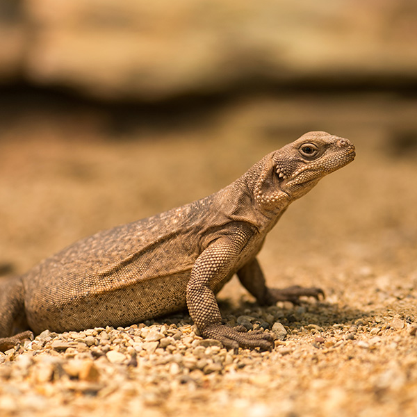

```{r setup, include=FALSE}

knitr::opts_chunk$set(echo = TRUE, cache = TRUE)

```

```{r echo=FALSE}

############################################################
####                                                    ####  
####  NRES 746, SDMs                                    ####
####                                                    ####
####  Corey Mitchell & Lauren Phillips                  #### 
####  University of Nevada, Reno                        ####
####                                                    #### 
############################################################


############################################################
####  Species distribution modeling!                    ####
############################################################


```


# What is it? 

### Also known as:  
* Habitat Suitability Modeling     
* Climate Envelope Modeling   
* Niche Modeling (although not correct...(Kearney 2006))

### Spatial models  
* Correlative (SDM) vs. mechanistic (niche) 
* Use species occurrences and environmental variables with a chosen algorithm to produce a map of potential habitat suitability and/or species distributions  
 
### Three components: (Franklin 2009)
    1. Ecological Model - theory connecting species with landscape  
    2. Data Model - how data are collected, measured, cleaned  
    3. Statistical model - algorithm, calibration, validation, prediction  
    
## What is it for? 

* IDENTIFY YOUR PURPOSE FIRST - affects all three components

* Predicting species invasions
* Predicting presence on the landscape in current vs. future conditions
* Identifying suitable habitat to conduct surveys for species of concern 
* Identifying conservation hotspots
* Assessing impacts of land use change for development or protection 

 
## When to use?    
* When you have spatially referenced:  
    + Presence/detection data  
    + Presence/detection + absence/nondetection data  
    
## Preprocessing

### This is time consuming! 
* Data acquisition
+ Opensource: eBird, Herpnet 
+ Museum Records, Longterm monitoring data, and collaboration!
* Sampling design 
* Sampling bias (likely)
* Extent delineation 
+ points + buffer
* Environmental variable acquisition


***

## Conceptual Model Example 

```{r echo=FALSE, out.width='100%'}

#

```

***

## Workflow Example 

```{r echo=FALSE, out.width='100%'}

#knitr::include_graphics('workflow_swfl.png')

```

***

## Data Cleaning and Preparation
* Checking occurrences for inaccuracies 
+ spatial irregularities common! 

## Environmental Variable Preparation 
* Formatting
  + Same projection
  + Same extent
  + Resampling to same resolution
* CHECKING that the formatting doesn’t omit valuable information 
* Collinearity 

## Data Cleaning and Preparation Part 2
* Pseudoabsence generation
+ how many? what strategy? 
* Addressing spatial autocorrelation 
* Thinning occurrences if sampling uneven
* Dividing dataset into training and testing

## Algorithms

* Selecting the best one for your dataset
  + Singular vs. ensemble
  + Presence-only vs. Presence/Absence
* Random Forest 
* GAM
* ANN
* GLM
* SRE
* GBM
* MARS
* GARP  
* MAXENT (an option, but not the only one.)

## Forecast Habitat Suitability
* Generate prediction surface
* Scale 0-1
* You may choose to do this before or after looking at model performance metrics! 

## Model Selection/Evaluation  

###Performance Metrics  (see Liu et al. 2018)
* Based on the testing dataset
  + Set aside in beginning
  + Threshold dependent vs. Independent 
* AUC - ROC
  + Closer to 1 is “better”, .5 is random
  + .8 to 1 can be a red flag for overparameterization  (Lobo et al 2008)
* TSS 
  + False positive and true positive rates
* Accuracy
  + How often did it predict correctly? 
* Others:
  + Kappa, F, Correlation Coeff, Precision, Prevalence, Odds Ratio

### Variable Importance 
* Assess contribution of each variable to model
  + Decide which to keep or drop
  + If some relationships shock you, may indicate a formatting issue 
* Response curves 
  + Trends should make logical sense
  
## Iterative Process
* Drop poorly performing algorithms
* Drop poorly performing variables
* Cry
* Re-run 
* Re-assess
* Rinse
* Repeat

***

## Let's work through an example! 

### Species: Common Chuckwalla (*Sauromalus ater*) 

Code adapted from Dr. Ken Nussear's Species Habitat Modeling Course (Geog 701M)

```{r echo=FALSE, out.width='75%'}

#

```

Source: http://www.ndow.org/Species/Reptiles/Chuckwalla/


##### First install the necessary packages if you don't already have them. 
```{r}

#install.packages(c("dismo","rgdal","raster","sp","ggmap","ggplot","mgcv","nlme","biomod2","gstat"))

```  


##### Obtain data from Global Biodiversity Information Facility, can directly import to r with the dismo package!
There was a species name change for chuckwalla at some point so we'll import data for both ater and obesus. 
```{r}  

library(dismo)
chuck1 <-  gbif(genus = "Sauromalus", species = 'obesus', geo=T)
chuck2 <-  gbif(genus = "Sauromalus", species = 'ater', geo=T)

```  


##### The number of columns differ, need to identify which columns to keep so we can combine the data. 
```{r}

dim(chuck1)
dim(chuck2)

keepcols <- c('genus','specificEpithet','eventDate','lon','lat','elevation','geodeticDatum')
keepcols %in% names(chuck1)
keepcols %in% names(chuck2)

allchck <- rbind(chuck1[,c(keepcols)], chuck2[,keepcols])

## Check out the data and remove any duplicates
chuckNoDup <- allchck[!duplicated(allchck),]

```


##### Plot the data to look for erroneous points.  
```{r}

plot(chuckNoDup$lon, chuckNoDup$lat)

```


##### Remove points that don't look correct. 
```{r}

chuckNoDup <- chuckNoDup[chuckNoDup$lon < -105,]
plot(chuckNoDup$lon, chuckNoDup$lat)
chuck.sp <- chuckNoDup
summary(chuck.sp$lat)
summary(chuck.sp$lon)

```


##### Remove the NA's
```{r}

chuck.sp <- chuck.sp[!is.na(chuck.sp$lon),]

```


##### Make it into a spatial points data frame by assigning coordinates and a projection.
```{r}

coordinates(chuck.sp) <- c('lon','lat')
proj4string(chuck.sp) <- CRS('+proj=longlat + datum=WGS84')
plot(chuck.sp)

```


##### Plot data over a basemap to check for other problems. 
```{r}

library(rgdal)
library(sp)
e = extent(chuck.sp)
e
buf = .5
chuck.df<- as.data.frame(chuck.sp)

library(ggmap)
myMap <- get_stamenmap(bbox = c(left = e[1]-buf,
                                bottom = e[3] -buf,
                                right = e[2]+buf,
                                top = e[4] +buf),
                       maptype = "terrain",
                       crop = FALSE,
                       zoom = 6)
# plot map
ggmap(myMap) +  geom_point(aes(x = lon, y = lat), data = chuck.df, alpha = .5)


```


##### A little more cleanup is needed. Remove points west of longitude -119
```{r}

chuck.sp <- chuck.sp[coordinates(chuck.sp)[,1] > -119,]
chuck.df <- as.data.frame(chuck.sp)
ggmap(myMap) +  geom_point(aes(x = lon, y = lat), data = chuck.df, alpha = .5)

```


##### Now let's get our Environmental Layers in order. Decide which variables are important to your species "apriori". Do NOT just use all 20 Bioclim layers and see which stick. 

```{r}

library(raster)
library(sp)

blk.dens <- raster("ofr20091102 Environmental Layers/BlkDensity.asc") # Bulk density (soil)
pct.cov <-raster("ofr20091102 Environmental Layers/pctCov.asc") #% Shrub cover
pct.rock <-raster("ofr20091102 Environmental Layers/pctRocks.asc") #% rocks
pct.rough <-raster("ofr20091102 Environmental Layers/pctRuf.asc") #% roughness
slope <-raster("ofr20091102 Environmental Layers/slope.asc") #slope
s.precip <- raster("ofr20091102 Environmental Layers/sp30.asc") #summer precip
w.precip <- raster("ofr20091102 Environmental Layers/wp30.asc") #winter precip

```


##### Stack your environmental variables. They must be at the same extent, resolution, and projection to stack. This may require significant formatting (cropping, masking, spatial transformation, resampling, etc...).
```{r}

env <- stack(blk.dens, pct.cov, pct.rock, pct.rough, slope, s.precip, w.precip)

```


##### Plot your Environmental Variables to check them! You may decide to drop addtional variable prior to first model.
```{r}

par(mfrow=c(1,1))          
plot(env[[5]], main= "Slope")

```


##### Now we mask our points to the environmental data! But first we need to reproject our chuck points to the same projection as the environmental data because they are different.
```{r}

proj4string(chuck.sp)
proj4string(env)
chuck.sp.utm <- spTransform(chuck.sp, CRS(proj4string(env)))
chuck.sp.utm$keep<- extract(env[['pctRocks']], chuck.sp.utm)
summary(chuck.sp.utm$keep) 
chuck.sp.utm <- chuck.sp.utm[!is.na(chuck.sp.utm$keep),] ### remove the points outside of your env extent 
chuck.sp.utm$Chuckwalla = 1 # create a presence column
chuck.sp.utm <- chuck.sp.utm[,'Chuckwalla'] # drop all other columns

```


#### Plot the points over the environmental layers
```{r}

plot(env[['pctRocks']], main = "Percent Rocks")
points(chuck.sp.utm, pch = 19)

```


##### The algorithms we are interested in fitting do not work with presence-only data. Because we do not have "absence" data, we need to generate pseudoabsences. Luckily, you can use biomod2 to generate them.
```{r}

library(biomod2)
set.seed(24)

chuck.sp.utm.pa <- BIOMOD_FormatingData(resp.var = chuck.sp.utm$Chuckwalla,
                     expl.var = env,
                     resp.xy = coordinates(chuck.sp.utm),
                     resp.name = 'Chuckwalla',
                     #eval.resp.var = chuck.sp.utm.ex.tst$Chuckwalla,
                     #eval.expl.var = env,
                     #eval.resp.xy = coordinates(chuck.sp.utm.ex.tst),
                     PA.nb.rep = 1,
                     PA.nb.absences = dim(chuck.sp.utm)[1],
                     PA.strategy = 'sre',
                     PA.dist.min = NULL, # for 'disk' strategy
                     PA.dist.max = NULL, # for 'disk' strategy
                     PA.sre.quant = 0.1,
                     PA.table = NULL,
                     na.rm = TRUE)
 chuck.sp.utm.pa
 
```
##### There are four strategies for selecting PAs. For SRE (surface range envelope), PAs are selected in conditions that differ from a defined proportion (PA.sre.quant) of the presence data. It forces PAs to be selected outside of the broadly defined environemental conditions for the species. 


##### Check headers to find where presences and PAs are being stored
```{r}

dim(chuck.sp.utm)
str(chuck.sp.utm.pa) 
summary(chuck.sp.utm.pa@data.species)

```


##### Grab the PA data from the formatted dataset
```{r}

chuck.sp.all <- SpatialPointsDataFrame(coords = chuck.sp.utm.pa@coord, data = data.frame(Chuckwalla = chuck.sp.utm.pa@data.species), proj = CRS(proj4string(chuck.sp.utm)))

```


##### Replace the NA from the PA data with 0 to feed into next data selection
```{r}

chuck.sp.all$Chuckwalla[is.na(chuck.sp.all$Chuckwalla)] <- 0
chuck.sp.all

```


##### Check the Observations and PAs on a plot. 
```{r}

plot(env[[3]])
points(chuck.sp.all, col='red') 
points(chuck.sp.utm, col='black')

```


##### Now we create training and 'Evaluation' sets. Start by checking how many records you have after the initial cleaning. Then, decide what percent of the data you want to use for training and testing. 
```{r}

howmanychucks <- dim(chuck.sp.all)[1]/2

## 70 % of those
pct70 <- round(howmanychucks * 0.7)

```


##### Now split the presence data from PAs.
```{r}

chuck.sp.Pres <- chuck.sp.all[chuck.sp.all$Chuckwalla == 1,]
chuck.sp.Pa <- chuck.sp.all[chuck.sp.all$Chuckwalla == 0,]

```


##### Sample 70% from the whole length withouth replacement.
```{r}

trnchuckrows <- sample(1:howmanychucks, size = pct70, replace = F)

```


##### Grab Presence and PA data to assign to training and testing sets. 
```{r}

## select those rows
chuck.sp.Pres.trn <- chuck.sp.Pres[trnchuckrows,'Chuckwalla']
chuck.sp.Pa.trn <- chuck.sp.Pa[trnchuckrows,'Chuckwalla']

## select the opposite for testing
chuck.sp.Pres.tst <- chuck.sp.Pres[-trnchuckrows,'Chuckwalla']
chuck.sp.Pa.tst <- chuck.sp.Pa[-trnchuckrows,'Chuckwalla']

## Combine rows #### 
chuck.sp.trn <- rbind(chuck.sp.Pres.trn, chuck.sp.Pa.trn)
chuck.sp.tst <- rbind(chuck.sp.Pres.tst, chuck.sp.Pa.tst)

```


##### Check training and testing dataset on maps. 
```{r}

plot(env[['sp30']], main = " Summer Precipitation: Training Data")
points(chuck.sp.trn[chuck.sp.trn$Chuckwalla == 1,], pch=19)
points(chuck.sp.trn[chuck.sp.trn$Chuckwalla == 0,], pch=24, col='red')

plot(env[['sp30']], main = " Summer Precipitation: Testing Data")
points(chuck.sp.tst[chuck.sp.tst$Chuckwalla == 1,], pch=19)
points(chuck.sp.tst[chuck.sp.tst$Chuckwalla == 0,], pch=24, col='red')

```


##### Before we can start modeling, we need to check our data for spatial autocorrelation. We do this by creating variograms and then thinning the data. 
```{r}

library(gstat)
c.variog <- variogram(Chuckwalla ~1, chuck.sp.trn, xlab= "Distance (m)", ylab="Semivariance")
plot(c.variog) #check training data for SA (it there)

c.variog2 <- variogram(Chuckwalla ~1, chuck.sp.tst, xlab= "Distance (m)", ylab="Semivariance")
plot(c.variog2) #check testing data for SA (it there)

### Zooming in a bit to focus on local effects
c.variog3 <- variogram(Chuckwalla ~1, chuck.sp.trn,cutoff = 50000)
c.variog3.f <- fit.variogram(c.variog3, vgm(psill = 0.1, "Sph", range = 25000, nugget = 0))
plot(c.variog3, model = c.variog3.f)

```


##### Now we need to thin the dataset to reduce our Spatial Autocorrelation, which is due to strong sampling/collecting bias. We start by making a grid. 
```{r}

## Lets make a quick grid for sampling

minx <- min(bbox(chuck.sp.utm)[1,])
maxx <- max(bbox(chuck.sp.utm)[1,])
miny <- min(bbox(chuck.sp.utm)[2,])
maxy <- max(bbox(chuck.sp.utm)[2,])
sidel <- 35000  # determines grid spacing (based on where SA tapers off)

proj <- CRS(proj4string(chuck.sp.utm))
x <- seq(from = minx, to = maxx, by = sidel) ## sequence of x centroids
y <- seq(from = miny, to = maxy, by = sidel) ## sequence of y for centroids

```


##### Create a grid of all pairs of coordinates (as a data.frame) using the "expand grid" function and then make it a gridded object.
```{r}

xy <- expand.grid(x = x, y = y)
grid.pts<-SpatialPointsDataFrame(coords= xy,data = data.frame(id = 1:dim(xy)[1]), proj4string = proj)
plot(grid.pts)
gridded(grid.pts) <- TRUE
grid <- as(grid.pts, "SpatialPolygons")

```


##### Plot for inspection if needed
```{r}

plot(grid)
points(grid.pts, col='red')

```


##### Now convert it to an SPDF and trasform it to the projection of your data. 
```{r}

gridspdf <- SpatialPolygonsDataFrame(grid, data=data.frame(id=row.names(grid), row.names=row.names(grid), values = rep(1,length(grid))))
names.grd<-sapply
proj4string(gridspdf)
gridspdf <- spTransform(gridspdf, proj)
plot(gridspdf)
points(chuck.sp.utm, col='red')

```


##### Subsample your grid to drop the squares you don't need. 
```{r}

getgrid <- over(gridspdf, chuck.sp.utm)
head(getgrid)
grids2.occ <- gridspdf[!is.na(getgrid$Chuckwalla),]
plot(grids2.occ)
points(chuck.sp.utm, col='red')

```


##### Thin the data down to 5 Chuckwallas per grid-space. Note: this is really heavy thinning.
```{r}

set.seed(24)
## find five per grid
nper = 5
keepchucks <- chuck.sp.utm[1,]
for(i in 1:length(grids2.occ)){
  tmp.poly <- grids2.occ[i,]
  #plot(tmp.poly)
  tmp.over <- over(chuck.sp.utm, tmp.poly)
  tmp.chucks <- chuck.sp.utm[!is.na(tmp.over$id),]
  #points(tmp.chucks)
  length(tmp.chucks)
  if(length(tmp.chucks) > nper){
  tmp.chucks <- tmp.chucks[sample(size = nper,x = 1:length(tmp.chucks)),]
  }
  #points(tmp.chucks, col='red')
  keepchucks <- rbind(keepchucks,tmp.chucks)
}
## Get rid of first row that you used to build the df
keepchucks <- keepchucks[-1,]

plot(gridspdf)
points(chuck.sp.utm, pch=19,col='blue')
points(keepchucks, pch=19, col='red')

```


##### Now we re-format the data to generate PAs for the thinned dataset and re-check it for SA. 
```{r}

set.seed(24)
keepchuck.pa.bm <- BIOMOD_FormatingData(resp.var = keepchucks$Chuckwalla,
                     expl.var = env,
                     resp.xy = coordinates(keepchucks),
                     resp.name = 'Chuckwalla',
                     #eval.resp.var = chuck.sp.utm.ex.tst$Chuckwalla,
                     #eval.expl.var = env,
                     #eval.resp.xy = coordinates(chuck.sp.utm.ex.tst),
                     PA.nb.rep = 1,
                     PA.nb.absences = dim(keepchucks)[1],
                     PA.strategy = 'sre',
                     #PA.dist.min = 1000,
                     #PA.dist.max = 20000,
                     PA.sre.quant = 0.1,
                     PA.table = NULL,
                     na.rm = TRUE)
keepchuck.pa.bm

```


##### Now we grab the PAs from this dataset. (Full process hidden from HTML-same as above)
```{r}

## Grab the PA data from the first object
keepchuck.all <- SpatialPointsDataFrame(coords = keepchuck.pa.bm@coord, data = data.frame(Chuckwalla = keepchuck.pa.bm@data.species), proj = CRS(proj4string(chuck.sp.utm)))

## replace the NA from the PA with 0 to feed into next data selection

keepchuck.all$Chuckwalla[is.na(keepchuck.all$Chuckwalla)] <- 0
keepchuck.all

#plot(keepchuck.all[keepchuck.all$Chuckwalla == 0,], pch = 19, col='red', cex=0.5)
#points(keepchuck.all[keepchuck.all$Chuckwalla == 1,], pch = 19)

#summary(keepchuck.all)

```


##### Again, create training and evaluation datasets from the thinned data. This is the same process we used before. (Process hidden from html-same as above)
```{r}

 ## How many records are left?
howmanychucks.kc <- dim(keepchuck.all)[1]/2

## 70 % of those
pct70.kc <- round(howmanychucks.kc * 0.7)

## split pres from PA ####
k.chuck.Pres <- keepchuck.all[keepchuck.all$Chuckwalla == 1,]
k.chuck.Pa <- keepchuck.all[keepchuck.all$Chuckwalla == 0,]


## sample 70 pct from the whole length withouth replacement
trnchuckrows.kc <- sample(1:howmanychucks.kc, size = pct70.kc, replace = F)


## select those rows
k.chuck.Pres.trn <- k.chuck.Pres[trnchuckrows.kc,'Chuckwalla']
k.chuck.Pa.trn <- k.chuck.Pa[trnchuckrows.kc,'Chuckwalla']

## select the opposite for testing
k.chuck.Pres.tst <- k.chuck.Pres[-trnchuckrows.kc,'Chuckwalla']
k.chuck.Pa.tst <- k.chuck.Pa[-trnchuckrows.kc,'Chuckwalla']

## Combine rows #### 
k.chuck.trn <- rbind(k.chuck.Pres.trn, k.chuck.Pa.trn)
k.chuck.tst <- rbind(k.chuck.Pres.tst, k.chuck.Pa.tst)

```


##### Check the thinned data for SA. We effectively decreased range of SA, from about 35000 to 15000.
```{r}

### spatial autocorrelation
kc.variog <- variogram(Chuckwalla ~1, k.chuck.trn, xlab= "Distance (m)", ylab="Semivariance")
plot(kc.variog)

kc.variog2 <- variogram(Chuckwalla ~1, k.chuck.tst, xlab= "Distance (m)", ylab="Semivariance")
plot(kc.variog2) #check testing data for SA (it there)

### Zooming in a bit to focus on local effects
kc.variog3 <- variogram(Chuckwalla ~1, k.chuck.trn, cutoff = 50000, xlab= "Distance (m)", ylab="Semivariance")
kc.variog3.f <- fit.variogram(kc.variog3, vgm(psill = 0.1, "Sph", range = 25000, nugget = 0))
plot(kc.variog3, model = kc.variog3.f)

```


##### Re-format the data again to include the thinned training and testing data.  
```{r}

## create a new dataset with the testing data assigned in the eval slots
set.seed(24)
chuck.sp.bm <- BIOMOD_FormatingData(resp.var = k.chuck.trn$Chuckwalla,
                     expl.var = env,
                     resp.xy = coordinates(k.chuck.trn),
                     resp.name = 'Chuckwalla',
                     eval.resp.var = k.chuck.tst$Chuckwalla,
                     eval.expl.var = env,
                     eval.resp.xy = coordinates(k.chuck.tst),
                     PA.nb.rep = 0,
                     PA.nb.absences = NULL,
                     PA.strategy = NULL,
                     PA.dist.min = NULL,
                     PA.dist.max = NULL,
                     PA.sre.quant = NULL,
                     PA.table = NULL,
                     na.rm = TRUE)
 chuck.sp.bm
 
```
  
  
## Model Fitting Time! 

##### Let's see which algorithms are available for model fitting. 
```{r}
myBiomodOption <- BIOMOD_ModelingOptions() 
myBiomodOption
```


##### Now let's set up our model code.  
```{r, results='hide'}

set.seed(28)
library(mgcv)
library(nlme)
# NOTE: We don't usually use the suppress warnings function, but needed it to spruce up the html file for the presentation.
suppressWarnings(system.time( myBiomodModelOut <- BIOMOD_Modeling( chuck.sp.bm, 
               models = c('SRE','GAM','GBM','RF'), # four algorithms
               models.options = myBiomodOption, # where to find algorithms
               NbRunEval=5, # number of iterations
               DataSplit=80, # used for internal data calibration
               VarImport=10, # num of bootstraps to determine var importance
               models.eval.meth = c('TSS','ROC','ACCURACY'), # performance metrics
               do.full.models=FALSE, # run using all training data
               rescal.all.models = T, # need for ensemble compatibility
               modeling.id="test")))

                                                           
```


##### Let's see if it worked!
```{r}

myBiomodModelOut 

```


##### Pull the evaluation data and check it. 
##### SRE and GAM don't appear to perform as well as the GBM and RF models. Run5 looks good for both GBM and RF, for this exercise we will choose that run for those two models.
```{r}

myBiomodModelEval <- get_evaluations(myBiomodModelOut)
myBiomodModelEval

```


##### You can index it by test, model, and run.  
```{r}

dimnames(myBiomodModelEval)   # we specify two algorithms, and run 5
 myBiomodModelEval[c("ROC", "TSS","ACCURACY"),c("Testing.data","Evaluating.data", "Sensitivity","Specificity"),c("RF","GBM"),"RUN5",]

```


##### Next, look at variable importance. Once you review it, you may decide that some variables contributed so little to the model that you drop them and re-run with a reduced set of environmental variables. (PRINCIPLE OF PARSIMONY)

##### You can index the tables by run and model. 
```{r}

MyBiomodModelVarImp <- get_variables_importance(myBiomodModelOut)
dimnames(MyBiomodModelVarImp)
MyBiomodModelVarImp[,,"RUN5",]

```


##### You can also visually inspect variable importance by algorithm. 
##### Here it's plotted for the Random Forest models.
```{r, message=F}

str(MyBiomodModelVarImp)
rf.imp <- MyBiomodModelVarImp[1:7,4,1:5,1] #pulling out the rf data

##Have a look at the average value....
rfimp.m <- melt(rf.imp) #condenses data to more readable 
rfimp.av <- aggregate(value~ X1, data =rfimp.m, FUN = mean) #take average value of all runs for each covariate, mean importance 
rfimp.av.o <- rfimp.av[order(rfimp.av$value, decreasing = T),] #order them, highest at top 
## Plot means 
library(gplots)
levels(rfimp.m$X1)
rfimp.m$X1 <- factor(rfimp.m$X1, levels = rfimp.av.o$X1) #refactor to make levels equal to those we just made that are in order
plotmeans(value~ X1, data =rfimp.m, connect=F, n.label=F, xlab = '', ylab = 'Chuck', main = 'Chuck RF Models', las=2)

```


##### And for the GBM models!
```{r, message=F}

gbm.imp <- MyBiomodModelVarImp[1:7,3,1:5,1] #pulling out the rf data

##Have a look at the average value....
gbmimp.m <- melt(gbm.imp) #condenses data to more readable 
gbmimp.av <- aggregate(value~ X1, data =gbmimp.m, FUN = mean) #take average value of all runs for each covariate, mean importance 
gbmimp.av.o <- gbmimp.av[order(gbmimp.av$value, decreasing = T),] #order them, highest at top 
## Plot means 

levels(gbmimp.m$X1)
gbmimp.m$X1 <- factor(gbmimp.m$X1, levels = gbmimp.av.o$X1) #refactor to make levels equal to those we just made that are in order
plotmeans(value~ X1, data =gbmimp.m, connect=F, n.label=F, xlab = '', ylab = 'Chuck', main = 'Chuck GBM Models', las=2)

```


##### Now we need to look into our variable importance further by checking the response curves. These trends should me unimodel and be able to be explained biologically. Flatlines are "dead" to your model.
```{r}

myMods <- BIOMOD_LoadModels(myBiomodModelOut, models= c('RF','GBM'), run.eval="RUN5")
response.plot2(models = myMods,
               Data = get_formal_data(myBiomodModelOut,'expl.var'),
               show.variables=       get_formal_data(myBiomodModelOut,'expl.var.names'),
               do.bivariate = FALSE,
               fixed.var.metric = 'median',
               col = c("blue", "red"),
               legend = TRUE,
               data_species = get_formal_data(myBiomodModelOut,'resp.var'))

```
##### It appears that pctRocks is consistently the least important variable. 
##### (...considering our species is typically found in rocky areas and boulder fields this may set off some red flags. Perhaps you should dive deeper into the environmental variables, there may be an issue with this layer!)


##### Now that we've determined which runs and algorithms look best, we can create prediction surfaces.  
```{r}

myBiomodProj <- BIOMOD_Projection(
  modeling.output = myBiomodModelOut,
  new.env = env,
  proj.name = 'Chuckwalla_proj', 
  selected.models = c('Chuckwalla_AllData_RUN5_GBM','Chuckwalla_AllData_RUN5_RF'), 
  binary.meth = NULL, 
  compress = 'xz', 
  clamping.mask = F, 
  output.format = '.img')

myBiomodProj

```


##### Next, get the rasters out and plot them. 
```{r}

myCurrentProj <- get_predictions(myBiomodProj)
class(myCurrentProj)
plot(myCurrentProj)

```


##### Rescale predictions to a 0-1 scale. Take time to examine your model. Does this prediction surface make sense based on your prior knowledge for this species? 
```{r}

GBM_pred <-myCurrentProj[[1]]/1000
RF_pred <-myCurrentProj[[2]]/1000

plot(GBM_pred)
plot(RF_pred)

```


##### Save your models to your working directory! 
```{r}

#writeRaster(GBM_pred, "")  ### insert file name to save 
#writeRaster(RF_pred, "")

```


##### And save your workspace! 
```{r}

save.image("Chuckspace.RData")

```


#### See the MiniLab Code if you want to create an Ensemble Model that combines the results from the RF and GBM SDMs. 


##### Hey! You just created a species distribution model! Now go home and drink wine and celebrate! 
```{r echo=FALSE}

#

```


## References and useful resources:

Araújo, Miguel B., and Antoine Guisan (2006) Five (or so) Challenges for Species Distribution Modelling. Journal of Biogeography 33 (10): 1677–88. 

Barbet-Massin, Morgane, Frédéric Jiguet, Cécile Hélène Albert, and Wilfried Thuiller (2012) Selecting Pseudo-Absences for Species Distribution Models: How, Where and How Many?: How to Use Pseudo-Absences in Niche Modelling? Methods in Ecology and Evolution 3 (2): 327–38. 

Buckley, Lauren B., Mark C. Urban, Michael J. Angilletta, Lisa G. Crozier, Leslie J. Rissler, and Michael W. Sears (2010) Can Mechanism Inform Species’ Distribution Models?: Correlative and Mechanistic Range Models. Ecology Letters, 13:1041-1054.

Elith, Jane, and John R. Leathwick (2009) Species Distribution Models: Ecological Explanation and Prediction Across Space and Time. Annual Review of Ecology, Evolution, and Systematics 40 (1): 677–97.

Franklin, Janet (2009) Mapping Species Distributions: Spatial Inference and Prediction. Cambridge, UK: Cambridge University Press.

Guisan, Antoine, and Wilfried Thuiller (2005) Predicting Species Distribution: Offering More than Simple Habitat Models. Ecology Letters 8 (9): 993–1009.

Guisan, Antoine, and Niklaus E. Zimmermann (2000) Predictive Habitat Distribution Models in Ecology. Ecological Modelling 135 (2–3): 147–86. 

Kearney, M. 2006. Habitat, environment and niche: what are we modeling? Oikos 115: 186-191. 

Liu, C., M. White and G. Newell. 2018. Measuring and comparing the accuracy of species distribution models with presence–absence data. Ecography 34 (2), 232-243.

Lobo, J.M., A. Jiménez-Valverde, and R. Real, (2008), AUC: a misleading measure of the performance of predictive distribution models. Global Ecology and Biogeography, 17, 145-151.

Nussear, Kenneth E., Todd C. Esque, Richard D. Inman, Leila Gass, Kathryn A. Thomas, Cynthia S.A. Wallace, Joan B. Blainey, David M. Miller, and Robert H. Webb (2009) Modeling Habitat of the Desert Tortoise (Gopherus agassizii) in the Mojave and Parts of the Sonoran Deserts of California, Nevada, Utah, and Arizona. U.S. Geological Survey open-file report 2009-1102, 18 pp.

Thuiller, Wilfried & Georges, D & Engler, R. 2014. biomod2: Ensemble platform for species distribution modelling. 2. Version 3.3-7.1.
