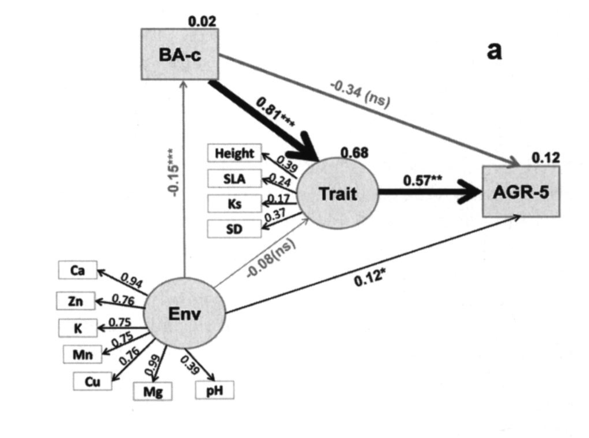
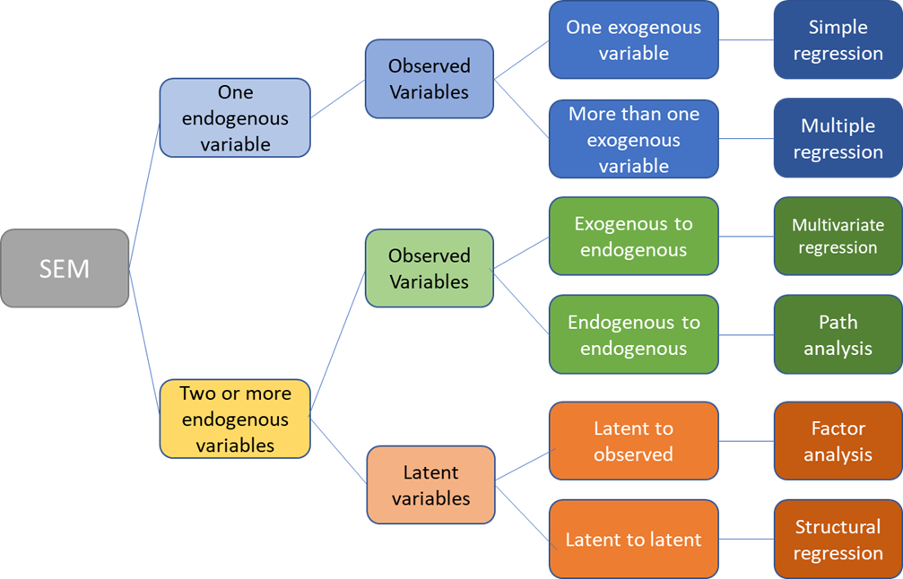
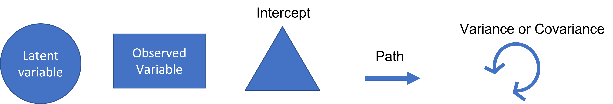
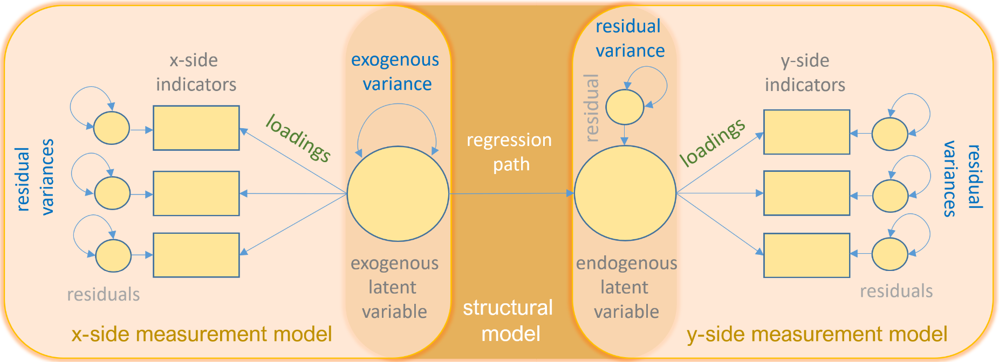
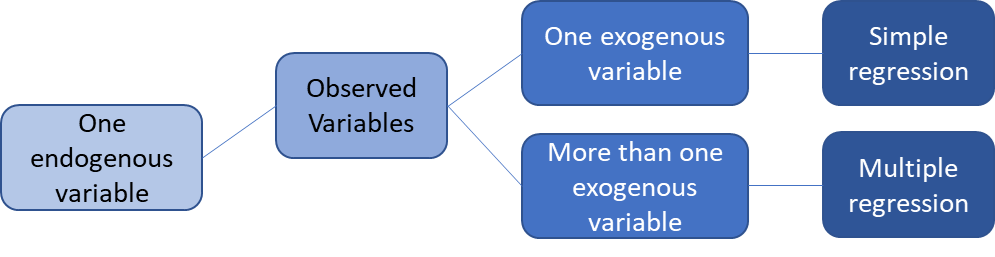
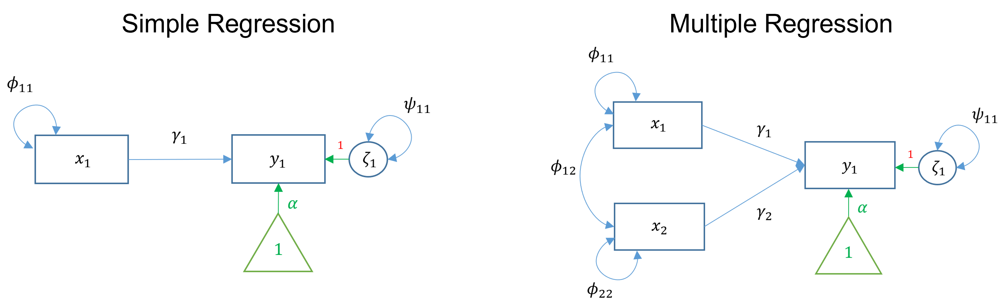
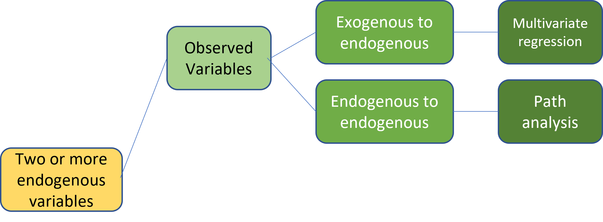
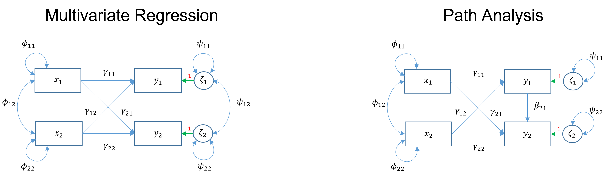
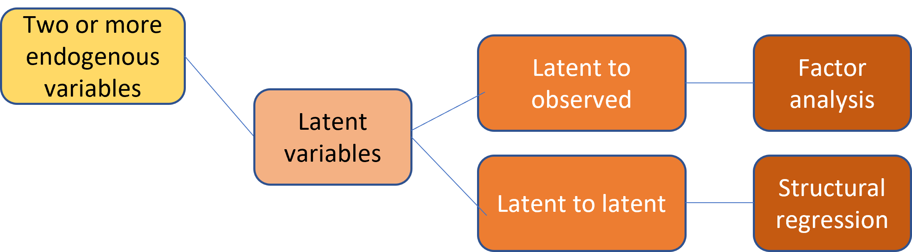
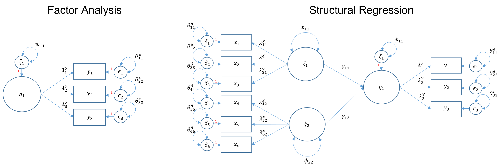

```{r setup, include=FALSE}
knitr::opts_chunk$set(echo = TRUE)
```

If you'd like to follow along in R, you can download the code here: [SEM R code](Adkins.SEM.R)

## What is SEM

Multivariate technique used to map and analyze complex networks of causal relationships between observed and latent variables. Most frequently used in social sciences.

### Why is it useful for ecologists?

* Theory oriented
* Causal network hypothesis testing
* Testing multiple models
* More intuitive interpretation

### Example
SEMs are ideal for describing complex systems. Liu et al. 2016 used SEMs to model the relationship between growth rates, functional traits, environmental factors, and neighborhood competition effects in a subtropical forest. They hypothesized that the abiotic and biotic environment indirectly affect tree growth via their effect on plant traits. They defined latent variables based on observed data. For example, the environmental latent variable included six soil nutrients and pH. The functional trait latent variable included tree height (Height), specific leaf area (SLA), hydraulic conductivity (Ks), and stomatal density (SD). They kept conspecific basal area (BA-c) separate from the trait latent construct. By combining many observed variables into thoughtful latent variables, they could create models that make more intuitive sense. They found that there were strong positive relationships between functional traits and growth rates. The environmental latent variable had a weaker but still significant relationship with growth rate. Below is a path analysis diagram illustrating the SEM.



***

### Definitions

* Observed variable - Exists in data
* Latent variable - Constructed in model
* Exogenous - Independent that explains endogenous (observed or latent) (predictor)
* Endogenous - Dependent that has a causal path leading to it (observed or latent) (response)
* Measurement model - Links observed and latent variables
  + Indicator - Observed (exogenous or endogenous)
  + Factor - Latent (exogenous or endogenous)
  + Loading - Path between indicator and factor
* Structural model - specifies causal relationships between exogenous and endogenous variables
* Regression model - Path between exogenous and endogenous variables

***

## Types of Structural Equation Models

<br>



<br>
<br>

### Path Diagram Symbols

<br>



<br>
<br>

### Path Diagram
Path diagrams can be used to better visualize the matrix equations in SEMs. The figure below illustrates the many types of variables and relationships that SEM can encompass.

<br>



<br>
<br>

### SEMs with one endogenous variable 
Simple regression and multiple regression both involve one endogenous variable. In simple linear regression, there is one exogenous variable that predicts one endogenous variable. In multiple regressions, multiple exogenous variables (with covariance) predict a single endogenous variable. The exogenous variables each have variance. The endogenous variable has an intercept (the triangle) and residual variance.

<br>


<br>



<br>
<br>

### Two or more endogenous variables

#### Observed
Multivariate regression and path analysis both have two or more observed endogenous variables. The main difference is that multivariate regression has only exogenous variables predicting endogenous variables. However, in path analysis, endogenous variables can also predict other endogenous variables.
<br>



<br>



<br>
<br>

#### Latent
Factor analysis and structural regression both have two or more endogenous variables. The main difference is that factor analysis looks at how a latent variable can predict observed variables. Structural regression can use latent variables to predict other latent variables.

<br>



<br>



***

### Steps of an SEM

1. Model Specification – defines hypothetical relationships
2. Model Identification
   + Over identified – more knowns than free parameters
    + Just-identified – the number of unknowns equals the number of free parameters
    + Under-identified – the number of unknowns is greater than the number of parameters (model coefficients cannot be estimated)
3. Parameter Estimation – comparing actual and estimated covariance (i.e., maximum likelihood estimate)
4. Model Evaluation- goodness of fit (i.e., Chi-square, Akaike Information Criterion (AIC), Comparative Fit Index (CFI))
5. Model Modification – post hoc model modification

***

## Examples

### Data

These examples and data are from an introductory SEM seminar by the Institute for Digital Research and Education Statistical Consulting. The data set is from the social sciences. However, the same steps and concepts could apply to ecological research. The data has six observed variables ascribed to 3 hypothetical latent variables describing the effects of student background on academic achievement. Nine observed variables are clustered into hypothetical latent constructs based on prior knowledge or theory. In this example, the three hypothesized latent constructs are adjustment, risk, and achievement. Adjustment is defined by the observed variables motivation, harmony, and stability. Similarly, risk is defined by negative parental psychology, socioeconomic status, and verbal IQ. Finally, achievement is composed of reading, arithmetic, and spelling.
Variable abbreviations are:

* Motivation = motiv
* Harmony = harm
* Stability = stabi
* Negative parental psychology = ppsych
* Socioeconomic status = ses
* Verbal IQ = verbal
* Reading = read
* Arithmetic = arith
* Spelling = spell

We will be using the lavaan() package. There are SEM programs outside of R that some people prefer, but they are not free to use.

```{r}
library(lavaan)
dat <- read.csv("https://stats.idre.ucla.edu/wp-content/uploads/2021/02/worland5.csv")
```
### Simple Linear Regression
For this example, we will perform a simple regression that determines the relationship of two observed variables (one exogenous and one endogenous). This analysis is the first building block in SEM, as an SEM is a  linear model framework. This analysis could be done using the lm() function. However, we will use lavaan(). The primary difference is that lavaan() uses maximum likelihood instead of the least square estimator. While the coefficients will be the same, the residual variance will be a little different.

<br>

Here we will choose to look at how motivation predicts reading. The notation is similar to lm(), but we must add 1 to the predictor side to include the intercept. We may choose to include the variance. For simple regression, it would only be the variance of the predictor.

We can illustrate this analysis using a path diagram such as the one below.


```{r}
m1 <-   '
  # regressions
    read ~ 1 + motiv
  # variance (optional)
    motiv ~~ motiv
'
```
Next, we fit the model to the data using sem() from lavaan. Followed by a summary, including model fit.

```{r}
fit1 <- sem(m1, data=dat)
summary(fit1, fit.measures=TRUE)
```


### Path Analysis
For this example, we will perform a path analysis, which is broader than a multivariate regression and allows endogenous variables to explain other endogenous variables.

First, we will use negative parental psychology and motivation as predictors of reading and arithmetic. We will also include reading as a predictor of arithmetic (an endogenous variable explaining another endogenous variable). 

We can illustrate this analysis using a path diagram such as the one below.


```{r}
m2 <- '
  # regressions
    read ~ 1 + ppsych + motiv
    arith ~ 1 + motiv + read + ppsych
  # covariance and variance
    read~~read
    ppsych~~ppsych
    motiv~~motiv
    arith~~arith
    motiv ~~ ppsych
    
'
```

Next, we fit the model to the data using sem() from lavaan. Followed by a summary, including model fit.

```{r}
fit2 <- sem(m2, data=dat)
summary(fit2, fit.measures=TRUE)
```


### Structural Regression
For the last example, we will create a structural model that relates multiple latent variables. First, we create a measurement model by defining each latent variable. Adjustment will be motivation, harmony, and stability. Risk will be verbal, negative parent psychology, and socioeconomic status. Achievement will be reading, arithmetic, and spelling. Next, we define the regression path. Achievement will be the combination of adjustment and risk.

We can illustrate this analysis using a path diagram such as the one below.


```{r}
m3 <- '
# measurement model
adjust =~ motiv + harm + stabi
risk =~ verbal + ppsych + ses
achieve =~ read + arith + spell
# regressions
achieve ~ adjust + risk
'
```

Next, we fit the model to the data using sem() from lavaan. Followed by a summary, including model fit.

```{r}
fit3 <- sem(m3, data=dat)
summary(fit3, fit.measures=TRUE)
```


<br>

## Conclusion

Structural equation modeling is an effective form of analysis for ecology as it can describe complex networks of observed and unobserved (latent) variables and their relationships. This was a broad crash course in SEM. If you are interested in learning more about SEMs, I recommend "taking a look under the hood." While I have given diagrams that illustrate how SEMs work, Lavaan() uses matrices to run these analyses.

## Resources

* Introduction to structural equation modeling (SEM) in R with Lavaan. UCLA: Statistical Consulting Group. from https://stats.idre.ucla.edu/r/seminars/rsem/#s2h

* Liu, X., Swenson, N. G., Lin, D., Mi, X., Umaña, M. N., Schmid, B., & Ma, K. (2016). Linking individual-level functional traits to tree growth in a subtropical forest. Ecology (Durham), 97(9), 2396-2405. https://doi.org/10.1002/ecy.1445 

* UCLA Office of Advanced Research Computing. (2021) Introduction to Structural Equation Modeling [video]. YouTube. https://www.youtube.com/watch?v=sKVFkVoYfbs 

