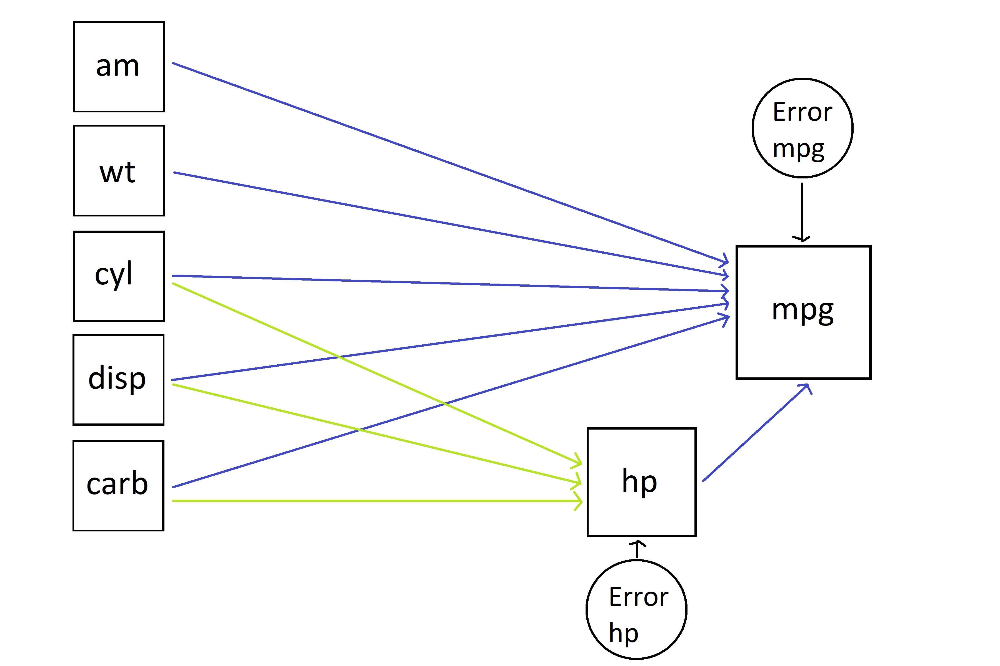
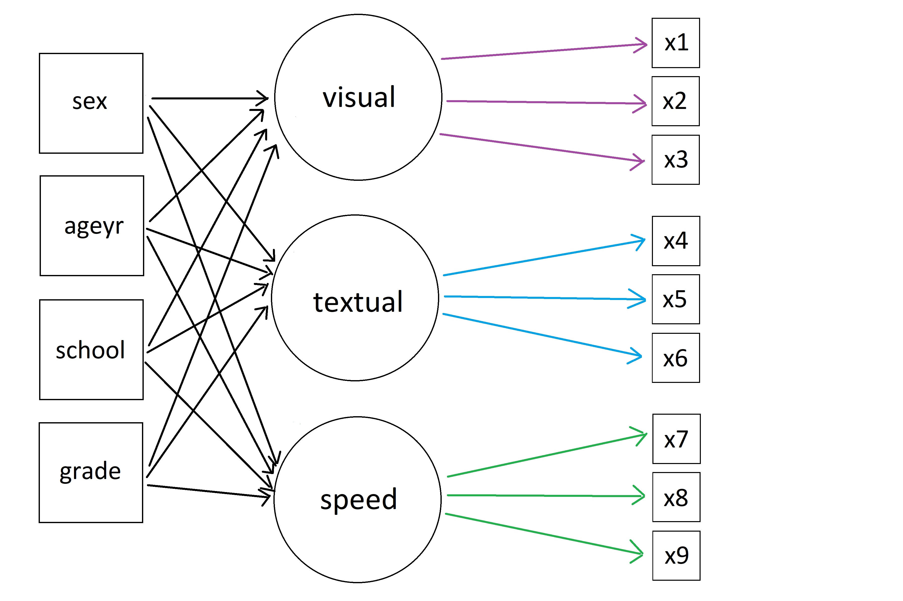

```{r setup, include=FALSE}
knitr::opts_chunk$set(echo = TRUE, fig.width=12, fig.height=8, cache = TRUE)
```

```{r echo=FALSE}

############################################################
####                                                    ####  
####  NRES 746, Student-led topic #2                    ####
####                                                    ####
############################################################


############################################################
####  Structural Equation Modeling                      ####
############################################################


```

**Presenters**: Maya Zawlodzki, Stephanie Coronado, Stephanie Cole, Elaine Chu, Chris Wolfe  

For those wishing to follow along with the R-based demo in class, [click here](SEM.R) for the companion R script for this lecture.

For those wishing to follow along with the slide presentation, [click here](https://docs.google.com/presentation/d/1BibPb9OGinVAimd1QLBxxWenz72K1sQchATXXWoO5Q0/edit?usp=sharing) for the Google Sheets component of this lecture.

    
# Set-Up

There are a LOT of packages / libraries used in this tutorial. So load them sooner than later!

```{r load packages and libraries}
## Install packages
#install.packages("OpenMx")
#install.packages("lavaan")
#install.packages("semPlot")
#install.packages("tidyverse")
#install.packages("GGally")

## Load libraries
suppressMessages(library(lavaan))
suppressMessages(library(OpenMx))
suppressMessages(library(semPlot))
suppressMessages(library(tidyverse))
suppressMessages(library(GGally))
```

# Path Analysis

* This tutorial was adapted from ["Introduction to Path Analysis in R"](http://www.rpubs.com/tbihansk/302732) by Thomas Bihansky (2017)

## Modeling

Because SEM is method of model verification, we need to have an initial model in mind. Keep in mind that SEM is inherently *causal*. Therefore, our results will depend on our research design.

The first step is to look at our data. 

```{r data}

## View your data
summary(mtcars)

```

We can use a correlation plot to explore the relationships between the variables in our data:

```{r PA correlation plot}

ggcorr(mtcars[-c(5,7,9)], nbreaks=NULL, label=T, low="red3", high="green3", label_round=2, name="Correlation Scale", label_alpha=T, hjust=0.75) + 
     ggtitle(label="Correlation Plot") + 
     theme(plot.title=element_text(hjust=0.6))

```


From our summary and correlation plot, we can decide what variables we want to use in our model:       

##### **dependent variable:**       
+ mpg      

##### **independent variables:**      
- hp    
- cyl    
- disp    
- carb    
- am      
- wt    
     
First, we could evaluate this relationship using a simple linear regression:

```{r}

## Simple Linear Model:
linear <- lm(mpg ~ hp+ cyl + disp + carb + am + wt, data=mtcars)

linear

```

With our generalized linear model, we have the best coefficients (beta-values) for our relationship.

But what if the relationships between our independent variables are more complex?

We can explore these complexites by applying a structure to our model. To do so, we are **applying causality**.

For that, we could draw a model:       



Now, lets code our model:

```{r model code}

## Set up your model in R
model = '
     # Blue Relationship
     mpg ~ hp + cyl + disp + carb + am + wt
     
     # Green Relationship
     hp ~ cyl + disp + carb
'

```

## Test Your Model

After we have our model coded in our global environment, we can test our model to see how well it works using the sem() function:

```{r sem computation}

## run sem()
path <- sem(model, data=mtcars)

path

```

This simple output from returning "path" provides us with a quick evaluation of our model. Here, we can do a basic evaluation of how well our model has worked, by looking at our "Model Fit Test Statistic", which is a Chi-Square statistic. Our "Degrees of Freedom" tells us how many potential paths were *NOT* used in our model. Additionally, our p-value lets us know if the Chi-Square is statisically significant. This analysis informs us how "good" our model is. Because we reject the null hypothesis, this means that our model essentially could be better. 

## Interpreting Results

To get a more in-depth look at our path results, including our coefficients, we can use the summary() function:

```{r path summary}

summary(path, standardized = T, fit.measures=T, rsquare=T)

```

## Summary Break-down

The summary can provide us with additional information about our model:     

* CFI and TFI are numerical indicators of fit. A value of 0.9+ is the industry standard for a "good" model fit. The closer to 1, the better   
* AIC and BIC: allows us to compare models  
* Unstandardized coefficients: provides us with model-specific path coefficients that are of **original scale** of the data, and allows for estimation of expected values   
* Standardized: Allows for comparison of path coefficients between models    
* R-Square: descriptive statistic to tell us about the fit of our coefficients      

## Visualize Your Model!

```{r PA paths}

## Generated path
semPaths(path, "std", layout='tree', edge.label.cex=.9, curvePivot=T)

```

The model allows us to visualize how well our model fits the data we have.


# SEM with Latent Variables

* The following tutorial was adapted from [Yves Rossel Lavaan Tutorial (2012)](http://users.ugent.be/~yrosseel/lavaan/lavaanIntroduction.pdf)

To this point, we have demonstrated the simplest form of structural equation modeling in which only single known indicators (exogenous/independent variables) are employed for the casual model. As we have mentioned earlier, path analysis is just a special form of multiple regression and SEM. 

What if some of the observed variables are related to one another in some way? This may lead to issues associated with dimensionality and multicollinearity. Therefore, a hallmark of SEM is the ability to define latent variables to account for such issues and in turn, to see how the *unobserved* (unquantified) may be related to the endogenous/response variable.

Here is the syntax for such construction in 'lavaan':    

>     y ~ f1 + f2 + x1 + x2      
>     f1 ~ f2 + f3        
>     f2 ~ f3 + x1 + x2        
     
Where **y** is the observed response, **x** is the observed independent, and **f** is a latent variable. Notice that this is still a series of regression equations.      

Any of the latent variables found in the regression formulas must be "defined" by listing their (manifestor latent) indicators. We do this by using the special operator "=~", which can be read as "is measured by."

For example, to define the three latent variables **f1**, **f2**, and **f3**, we can use the following model:     

>     f1 =~ y1 + y2 + y3        
>     f2 =~ y4 + y5 + y6         
>     f3 =~ y7 + y8 + y9        
     
Additonally, SEM allows us to define variances and covariances between variables up front using the special operator "~~" or intercepts using "~". We will leave this out of the model. Let's apply our model using the lavaan package to a built-in dataset called *HolzingerSwineford1939*:

```{r HolzingerSwineford1939}

#?HolzingerSwineford1939  # some information about the data

head(HolzingerSwineford1939)  # let's look at the first few lines

```

This is a classic SEM dataset that consists of mental ability test scores of seventh- and eight-grade children from two different schools.

To help with understanding the data, the descriptions of certain variables are as follows:    

     x1: visual perception      
     x2: cubes      
     x3: lozenges     
     x4: paragraph comprehension     
     x5: sentence completion      
     x6: word meaning     
     x7: speeded addition     
     x8: speeded counting of dots     
     x9: speeded discrimination straight and curved capitals      

An SEM model that is often proposed for these 9 variables consists of three latent variables (f#), each with three indicators(y#):      

1. visual factor (f1) measured by 3 variables: x1, x2, and x3       
2. textual factor (f2) measured by 3 variables: x4, x5, and x6       
3. speed factor (f3) measured by 3 variables: x7, x8, and x9         
     
What if we want to observe the relationship of age, sex, school, and grade in addition to the three latent variables?



## Test Your Model

```{r SEM Latent Model}

## Define your model:
ability_model <- '
     # regression equations
     visual ~ sex + ageyr + school + grade
     textual ~ sex + ageyr + school + grade
     speed ~ sex + ageyr + school + grade

     # latent variables
     visual =~ x1 + x2 + x3
     textual =~ x4 + x5 + x6
     speed =~ x7 + x8 + x9

     # covariances
     visual ~~ textual
     visual ~~ speed
     textual ~~ speed
'

```

```{r SEM fit}

## Run the model
fit_ability <- sem(ability_model, data=HolzingerSwineford1939)

## Summarize including fit measures
summary(fit_ability, standardized=T, rsquare=T, fit.measures=T)

```

```{r SEM plot}

## Visualize your paths (may have to try a few!)
semPaths(fit_ability, 'std', layout='circle')

semPaths(fit_ability,'std', layout='tree', edge.label.cex =.9, curvePivot=T)

```

# Questions?


