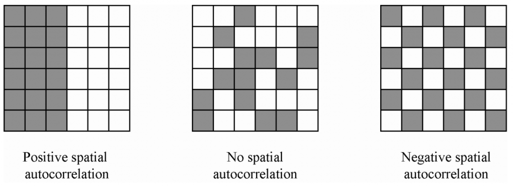
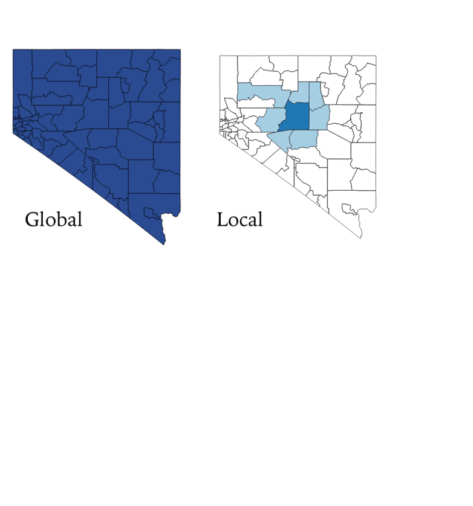
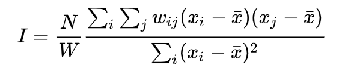
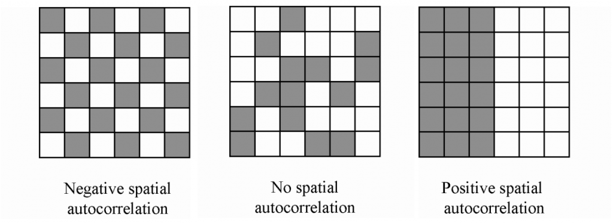

```{r setup, include=FALSE}
knitr::opts_chunk$set(echo = TRUE, cache = TRUE)
```

```{r echo=FALSE}

############################################################
####                                                    ####  
####  NRES 746, Student-led topic #3                    ####
####                                                    ####
############################################################


############################################################
####  Spatial autocorrelation                           ####
############################################################


```


For those wishing to follow along with the R-based demo in class, [click here](SEM.R) for the companion R script for this lecture.

```{r}

#first things first: here are the packages you'll need to follow along:

list = c('gstat', 'raster', 'geosphere', 'ape', 'foreach', 'doParallel', 'rgdal')
#install.packages(list)

```
>Tobler's First Law of Geography: "everything is related to everything else, but near things are more related than distant things."

Introduced by Waldo R. Tobler in 1969

##Definition:

Observations made at different locations may not be independent.  For example, measurements made at nearby locations may be closer in value than measurements made at locations farther apart.  This phenomenon is called **spatial autocorrelation** (SA).

SA is everywhere. Variables like rainfall, soil nutrient content, elevation, population density, etc. are all spatially autocorrelated by nature. This is intuitive: two points that are close together are much more likely to have a similar elevation than two points that are far apart.

##Positive and Negative SA

Positive SA indicates **clumping,** while negative SA indicates **overdispersion.** Clumping *may* be a problem for those fitting linear models to spatially-explicit data (more on this later).



To further illustrate this principle, we'll simulate a landscape and generate some randomly sampled points.

### Simulated Landscape Example

First, we will load packages and create an empty grid.
```{r message = FALSE}
library(gstat)
library(raster)

xy <- expand.grid(1:100, 1:100) # create a coordinate grid to represent a real landscape.
                                # the larger the grid, the longer it will take to generate data
names(xy) <- c('x','y') # name the axes of the grid
```

Now, we will use the `gstat()` and `predict()` functions to fill the empty grid with simulated elevation values.
```{r echo = FALSE, message = FALSE}
  # Specify a model to create a spatially-autocorrelated z variable.
  # range parameter controls degree of spatial autocorrelation.
saLandscapeModel <- gstat(formula=z~1, locations=~x+y, dummy=T, beta=c(100), 
                 model=vgm(psill=100, range=100, model='Exp'), nmax=20)

saLandscape <- predict(saLandscapeModel, newdata = xy, nsim = 1)
image(saLandscape, axes = FALSE, col = terrain.colors(10))
```

Next, we'll take a random sample of 30 locations and measure the elevation at each location.
```{r echo = FALSE, message = FALSE}
sample <- xy[sample(nrow(xy), 30),] # Randomly sample pixels from the grid
samplePoints <- SpatialPoints(sample) # Create a SpatialPoints object
colors <- topo.colors(20)


# Extract explanatory values.
names(saLandscape) <- c('x','y','z') # Step 1: rename columns in envImage df for clarity
gridded(saLandscape)=~x+y # Step 2: Data frame must be converted to gridded object to create raster layer
saRaster <- raster(saLandscape) # Step 3: convert gridded object to raster
elev <- raster::extract(x=saRaster, y=samplePoints) # Step 4: extract values.
sample <- cbind(sample, elev)
row.names(sample) <- (1:30) 
```
```{r}
print(head(sample))
```
```{r echo = FALSE, message=FALSE}
image(saLandscape, axes = FALSE, col = terrain.colors(10))
points(sample)
```
As you can see, points that are very close to each other always have a similar elevation, while points that are distant from each other are less likely to have a similar elevation.

Next, we will focus on a couple of ways to test for SA: one graphical, and one statistical.

##The Semivariogram: a graphical representation of SA

This function will create a semivariogram.
```{r}
semivariogram <- function(value,x,y){
  
  # building empty and null vectors
  dist <- vector(mode="numeric", length=length(value))
  semivar <- vector(mode="numeric", length=length(value))
  distance <- c()
  semivariance <- c()
  
  # calculating all possible
  
  for (i in 1:length(value)) {                    # these loops compare all the values with each other
    for( j in 1:length(value)) {
      dist[j] <-  sqrt((x[i]-x[j])^2 + (y[i]-y[j])^2)           # measuring the distance
      semivar[j] <- (value[i]-value[j])^2                       # calcualting the semivariance
    }
    distance <- c(distance,dist)
    semivariance <- c(semivariance,semivar)
  }
  
  plot(distance, semivariance, xlab="Distance Between Points", ylab="Squared Difference")
}
```

```{r semivariogram, echo=FALSE}
semivariogram(sample$elev,sample$x,sample$y)
```

- The Sill is where we see the values level off.  This is the distance where we expect to see SA fade.


- Unfortunately we don't always have data that looks this clean. Here's another example.

```{r include=FALSE}
semivariogram.ll <- function(value,lat,lon){
  library(geosphere)
  
  # building empty and null vectors
  dist <- vector(mode="numeric", length=length(value))
  semivar <- vector(mode="numeric", length=length(value))
  distance <- c()
  semivariance <- c()
  
  # calculating all possible
  
  for (i in 1:length(value)) {
    for( j in 1:length(value)) {
      dist[j] <- distm(c(lon[i], lat[i]), c(lon[j], lat[j]), fun = distHaversine) # measuring the euclidean distance [meters]
      semivar[j] <- (value[i]-value[j])^2          # calcualting the semivariance
    }
    distance <- c(distance,dist)
    semivariance <- c(semivariance,semivar)
  }
  
  plot(distance, semivariance, xlab="Distance [meters]", ylab="Squaired Difference")
  #data <- cbind(distance,semivariance)
  #return(data)
}

week1_transects <- read.csv("SnowEx17_GPR_Week1_transects.txt")
tail(week1_transects)

########### seperating the data by transect ###########
transect46 = week1_transects[which(week1_transects$TRANSECT == 46),]
transect1 = week1_transects[which(week1_transects$TRANSECT == 1),]

# building a small data set for the semivarance
df.new <- transect46[seq(1, nrow(transect1), 200),]
#df.new <- week1_transects[seq(1, nrow(week1_transects), 1000),] #this will take all the transects

# seprating data for the function
lat <- df.new$LAT
lon <- df.new$LONG
x <- df.new$SNOW.DEPTH..m..assuming.velocity.of.0.234.m.ns.

# run the function
#semivariogram.ll(x,lat,lon)

```


```{r, echo=FALSE}
semivariogram.ll(x,lat,lon)
```

- One think we can consider is thining the data set to see if it makes more sense

```{r, echo=FALSE}
# building a small data set for the semivarance
df.new <- transect46[seq(1, nrow(transect1), 500),]
#df.new <- week1_transects[seq(1, nrow(week1_transects), 1000),] #this will take all the transects

# seprating data for the function
lat <- df.new$LAT
lon <- df.new$LONG
x <- df.new$SNOW.DEPTH..m..assuming.velocity.of.0.234.m.ns.
```
```{r, echo=FALSE}
semivariogram.ll(x,lat,lon)
```

- The next step might be looking at some numeric values for the day.

##Moran's I: a quantitative representation of SA


- Moran, P. A. P. (1950). "Notes on Continuous Stochastic Phenomena". Biometrika. 37 (1): 17–23.

##Global vs Local

- Moran's I evaluates SAC at a Global level


##Moran's I


- "N" is the number of spatial units indexed by"i" and "j"; "x" is the variable of interest; "x bar" is the mean of "x"; "w_ij" is a matrix of spatial weights with zeroes on the diagonal (see in a moment); and "W" is the sum of all "w_ij".
- Weights are assigned by a a variety of functions such as nearest neighbor or distance decay


##Calculating Moran's I
- Install the package "ape". Used for "Analyses of Phylogenetics and Evolution"
```{r,message=FALSE}
#install.packages("ape")
library("ape")
#look at package "ape"
#??ape
```
```{r}
#function we will use is Moran.I()
#?Moran.I
#look at the help and see the Moran's forumla
#requires "x" - a numeric vector - which is our variable.
#requires "weight" - a matrix of weights - calculated using dist().
```

- First we will calculate our distance matrix. In this example, the distance matrix is used to calculate the weights using nearest neighbor in `Moran.I()`
```{r}
#generating IDW matrix
#use dist() to compute and return the distance matrix between rows of data
#?dist
sample.distances<-as.matrix(dist(cbind(sample$x,sample$y))) #distance weight matrix
sample.distances.inverse<-1/sample.distances #inverse distance weight matrix
sample.distances.inverse[1:5,1:5] #however "infin" problem"
```
```{r}
#Remove infinity and replace with 0's - occurs because 1 divide by 0 is infinity
diag(sample.distances.inverse)<-0 
sample.distances.inverse[1:5,1:5]
```

##Evaluating Moran's I




##Moran's I
```{r MoransI}
#Morans I
#?Moran.I
#Weights are obtained, now place desired variable to test as "x"
Moran.I(x=sample$elev,weight=sample.distances.inverse)
#Results!
```
##Results
 - Returned is a list of 4 objects: observed, expected, sd, p.value

1: observed = Moran's I

2: expected = the expected value under the null hypothesis

3: sd = standard deviation under the null hypothesis

4: p.value = P-value of the test of the null hypothesis against the alternative hypothesis


## When SA is a problem: Modelling spatially-explicit data.

When SA occurs in spatially-explicit expanatory and response variables, Type I error rates (rejecting a true null hypothesis) are inflated. To demonstrate this phenomenon, I've recreated a simulation from Legendre et al. 2002 - a seminal paper on the topic of SA effects on field surveys.


Assume we want to test whether tree height is related to soil P concentration. To test our hypothesis, we decide to collect some field data, randomly selecting trees and recording the location (xy), height, and age of each tree.

To break our model down further, we can think of each variable (height and age) as being determined by 3 components: a deterministic component, a stochastic (error) component, and a degree of SA. 

From Legendre et al. 2002:


With this concept in mind, let's simulate some data. Lots of data.

Each simulation needs 6 landscapes:

1. Deterministic soil P structure.  
2. SA in soil P structure.  
3. Stochastic error in soil P variable.  
4. Deterministic height structure.  
+ This is simply the sum of the first three landscapes, multiplied by a single coefficient. If there is no relationship between soil P and tree height, the coefficient will be 0.  
5. SA in height structure.  
6. Stochastic error in height variable. 

For this simulation, we're going to make the null hypothesis (no relationship between soil P and height) true. That means the true coefficient linking soil P and tree height will be 0. Therefore, if we fit a linear model `lm(height~soilP)` to each simulated dataset, the type I error rate (incorrectly rejecting a true null hypothesis) should be equal to $\alpha$ (=0.05).
```{r}
## Parallel Spatial Autocorrelation Simulation
library(parallel)
library(foreach)
library(doParallel)

numCores <- detectCores() - 1
registerDoParallel(numCores)

resultsList<-foreach(i=1:100, .combine = c) %dopar% {
  library(gstat)
  library(raster)
  
  xy <- expand.grid(1:100, 1:100) # create a coordinate grid to represent a real landscape.
  # the larger the grid, the longer it will take to generate data
  names(xy) <- c('x','y') # name the axes
  
  # If desired, model deterministic component of explanatory variable on landscape surface
  # by altering the beta parameters in the gstat() call.
  # Currently set to 0 (no deterministic relationship between space and explanatory variable)
  envDeterm <- gstat(formula=z~1+x+y, locations=~x+y, dummy=T, beta=c(1,0,0), 
                     model=vgm(psill=0, range=1, model='Exp'), nmax=1)
  
  # Model spatially-autocorrelated component of explanatory variable on landscape surface.
  # range parameter controls degree of spatial autocorrelation. Set to 1 to eliminate spatial autocorrelation.
  envSA <- gstat(formula=z~1, locations=~x+y, dummy=T, beta=c(0), 
                 model=vgm(psill=.025, range=20, model='Gau'), nmax=2)
  
  # Model stochastic (error) component of explanatory variable on landscape surface.
  envErr <- gstat(formula=z~1, locations=~x+y, dummy=T, beta=c(0), 
                  model=vgm(psill=.025, range=1, model='Gau'), nmax=1)
  
  # Simulate data from each model across the landscape surface.
  # Can visualize each surface using image() if desired
  eDe <- predict(envDeterm, newdata=xy, nsim=1) 
  eSa <- predict(envSA, newdata=xy, nsim=1) 
  eEr <- predict(envErr, newdata=xy, nsim=1)
  # image(eDe)
  # image(eSa)
  # image(eEr)
  
  # Add each component into a single landscape surface.
  envImage <- eDe+eSa+eEr
  # image(envImage)
  
  # Model spatially-autocorrelated component of response variable on landscape surface.
  # range parameter controls degree of spatial autocorrelation. Set to 1 to eliminate spatial autocorrelation.
  resSA <- gstat(formula=z~1, locations=~x+y, dummy=T, beta=c(0), 
                 model=vgm(psill=.025, range=20, model='Gau'), nmax=2)
  
  # Model stochastic (error) component of response variable on landscape surface.
  resErr <- gstat(formula=z~1, locations=~x+y, dummy=T, beta=c(0), 
                  model=vgm(psill=.025, range=1, model='Gau'), nmax=1)
  
  # Simulate data from response variable SA and error models across the landscape surface.
  # Again, can visualize each surface using image() if desired
  rSa <- predict(resSA, newdata=xy, nsim=1)
  rEr <- predict(resErr, newdata=xy, nsim=1)
  # image(rSA)
  # image(rEr)
  
  # Combine the explanatory variable surface with the response SA and error
  # surfaces to generate predicted response values. If there is no true
  # relationship between the explanatory and response variables, the beta1
  # parameter is set to zero.
  beta1 <- 0
  resImage <- (beta1*envImage$sim1) + rSa + rEr 
  
  # Create random sample points
  sample <- xy[sample(nrow(xy), 100),] # Randomly sample pixels from the grid
  samplePoints <- SpatialPoints(sample) # Create a SpatialPoints object
  
  # Extract explanatory and response values using the sampling locations. There
  # is probably a simpler way to do this, but in this case I am creating rasters
  # from the envImage and resImage data frames, then using raster::extract to
  # extract the explanatory and response values and combine them in a new data
  # frame of simulated data.
  
  # Extract explanatory values.
  names(envImage) <- c('x','y','explanatory') # Step 1: rename columns in envImage df for clarity
  gridded(envImage)=~x+y # Step 2: Data frame must be converted to gridded object to create raster layer
  envRaster <- raster(envImage) # Step 3: convert gridded object to raster
  explanatory <- raster::extract(x=envRaster, y=samplePoints) # Step 4: extract values.
  
  # Extract response values. Repeat steps 1-4.
  names(resImage) <- c('x','y','response')
  gridded(resImage)=~x+y
  resRaster <- raster(resImage)
  response <- raster::extract(x=resRaster, y=samplePoints) 
  
  # Bind locations, explanatory values, and response values into a singe data
  # frame of simulated data
  sample <- cbind(sample,explanatory,response) 
  
  # Create simple linear model and extract the p-value.
  model <- lm(response ~ explanatory)
  pvals <- summary(model)$coefficients[,4]
  # pvals
  i <- as.numeric(pvals[2]) # Store the p-value for the beta1 parameter in the resultsList
}

# Count number of positive results (p value > 0.05)
for (i in 1:length(resultsList)){
  if (resultsList[i] >= 0.05){
    resultsList[i] <- FALSE
  }else(resultsList[i] <- TRUE)
}

typeIerror <- sum(resultsList)/100
pvalue <- 0.05
simulationResults <- c(pvalue, typeIerror)
names(simulationResults) <- c('P-value', 'Type-I error rate')
print(simulationResults)
```
As you can see, the type I error rate is greater than $\alpha$. If we were to eliminate SA in either soil P or tree height, this effect would go away. 

So, maybe you used a semivariogram and Moran's I to check for spatial autocorrelation in your explanatory and response variables, and (surprise!) you've found it. What can be done? In the next section, we will discuss one method for *correcting* a model to account for spatial autocorrelation.

## Accounting for SA: the Autocovariate Modeling method

<br>
Suppose we want to find the relationship between a tree species' height and its age. We go out and record the age, height, and location of sampled trees. 

```{r echo=FALSE, message=FALSE }

library(rgdal)
library(raster)
age.data1 <- read.csv('age.data1.csv')
print(head(age.data1))

cropped <- raster('AutoCovRaster.tif')
plot(cropped, axes = FALSE, col = terrain.colors(10))
points(age.data1[,1], age.data1[,2])


semivariogram1 <- function(value,x,y){                     
  dist <- vector(mode="numeric", length=length(value))    
  semivar <- vector(mode="numeric", length=length(value))
  distance <- c()
  semivariance <- c()
  for (i in 1:length(value)) {
    for( j in 1:length(value)) {
      dist[j] <-  sqrt((x[i]-x[j])^2 + (y[i]-y[j])^2)           
      semivar[j] <- (value[i]-value[j])^2                       
    }
    distance <- c(distance,dist)
    semivariance <- c(semivariance,semivar)
  }
  plot(distance, semivariance, xlab="Distance Between Points", ylab="Squaired Difference between residuals", ylim=c(0,250))
}

```

If we simply run a linear regression using the most common method, Ordinary Least Squares (OLS), we get find the following relationship:

```{r}
basic.model <- lm(heights~age, data=age.data1)
basic.model$coefficients


```

<br>
<br>
But this model is only valid if the assumptions of OLS are met. One assumption of OLS is that the residuals are independent. In other words, there must not be spatial autocorrelation in the residuals.

```{r echo=FALSE, message=FALSE}
semivariogram1(basic.model$residuals,age.data1$x,age.data1$y)

```

Now we will account for correlation in the residuals of this model by applying the Autocovariate modeling method. This method works by computing an "autocovariate" value for each site. This value represents the degree of correlation between a given site and its neighbors. The autocovariate is then treated as an additional predictor variable in our linear model.
<br>
<br>

$$Y=CX + \varepsilon \,\,\,\,\,\,\,\,\,\, \rightarrow \,\,\,\,\,\,\,\,\,\, Y=C_{1}X+C_{2}A +\varepsilon$$
Where the autocovariate value, A is defined as:
$$A_{i}= \sum_{j \, \epsilon \, k} W_{ij}Y_{j} $$
k is the neighborhood around a given site. Each site has a neighborhood containing some number, j, neighbors.
<br>
<br>
The following functions will calculate A, but how do the functions work?
<br>
<br>
$$ \textrm{datapoint locations}\,\,\,\,\,\,\,\, \rightarrow \,\,\,\,\,\,\,\,\textrm{dist matrix}\,\,\,\,\,\,\,\, \rightarrow \,\,\,\,\,\,\,\,\ \textrm{weight matrix} \,\,\,\,\,\,\,\, \rightarrow \,\,\,\,\,\,\,\, A   $$
<br>
```{r echo=T }
linear.cor <- function(dist.matrix=distance){  # helper function for autocovariate.model()
  weight.part1 <- (dist.matrix*(-1/40) + 1)    # defines how strongly neighboring points are correlated with each other as a function of distance between them
}                                              # ie. determines what the values of the weight matrix will be


# Autocovariate.model() is a function which appends an autocovariate value to each datapoint.
# The autocovariate values are then used as a second predictor variable in you linear model
# The inputs are your data and your correlation function (uses the above function, linear.cor() by default)

autocovariate.model <- function(data=data1, cor.func=linear.cor){
  dist.temp <- dist(data[,1:2])      # create a distance matrix from the data
  distance <- as.matrix(x=dist.temp) # create a distance matrix from the data
  weight.part1 <- cor.func(distance) # next few lines create a weighted distance matrix based on your correlation function
  no.negs <- function(x){
    if(x>=0){x<-x}else{x<-0}
    return(x)
  }
  weight <- apply(weight.part1, c(1,2), no.negs)   # neibors beyond a given threshold should have no influance rather than a negative correlation, so any negative values are converted to 0
  weighted.heights <- matrix(nrow=nrow(data), ncol=nrow(data)) # set up matrix which will be the weight matrix times the response variable
  for(i in 1:nrow(data)){
    weighted.heights[i,] <- (weight[i,]*data$heights)
  }
  autocov <- numeric(nrow(data))                   # calculates the autocovariate value at each site
  for(i in 1:nrow(data)){                          # autocov is the sum a given site's neighbors' (weight*response variable)
    autocov[i] <- sum(weighted.heights[i,])-weighted.heights[i,i]
  }
  data.autocov <- cbind(data,autocov)
  return(data.autocov)
}


age.data2 <- autocovariate.model(age.data1)            
head(age.data2)

basic.model <- lm(heights~age, data=age.data2)
corrected.model <- lm(heights~age+autocov, data=age.data2)

```

```{r echo=FALSE, message=FALSE }

semivariogram1(basic.model$residuals,age.data2$x,age.data2$y)
title(main='basic model')
semivariogram1(corrected.model$residuals,age.data2$x,age.data2$y) # clearly still autocorrelation in the residuals, but it is significantly reduced
title(main='corrected model')
 
require ("ape")                # see how much correlation in the residuals is reduced acording to moran's I with a generic 1/distance weight matrix
sample.distances<-as.matrix(dist(cbind(age.data2$x,age.data2$y)))   # first calculate inverse distance weights (IDWs)
sample.distances.inverse<-1/sample.distances
diag(sample.distances.inverse)<-0             # get rid of infinity for 0's because 1 divide by 0 is infinity
```

Our method of correcting for spatial autocorrelation was not totally successful. It did not eliminate all spatial correlation in the residuals of the linear model, but it did significantly reduce it. Moran's I shows this as well.


```{r}

Moran.I(basic.model$residuals,sample.distances.inverse, scaled=TRUE)
Moran.I(corrected.model$residuals,sample.distances.inverse, scaled=TRUE) # Moran's I also shows significant reduction

```

<br>
<br>
While the method isn't perfect, it did greatly improve the accuarcy of our model. 
                    
```{r}
summary(basic.model)$r.squared
summary(corrected.model)$r.squared
```

<br>
<br>
Because I generated the data I know that the true value of the coeficient parameter is 0.1

```{r}

basic.model$coefficients                  
corrected.model$coefficients
```

## Potential pitfalls

1. Most methods (including autocovariate regression) depend on the *spatial weight matrix.* Make sure you choose appropriate weights.

2. Autocovariat regression assumes stationarity. Values need to have the same mean, standard deviation, and autocorrelation for the model to be valid.

3. False autocorrilation, mapping bias or mapping heterogeneity can cause false autocorrelation in real data

4. Autocovariate regression is just one of many ways to account for SA. We suggest exploring other methods as well.

- Eigenvector filtering with the `spdep` package. 
