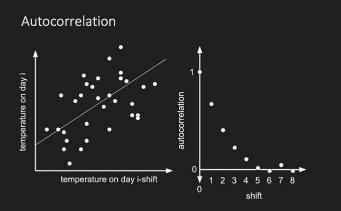
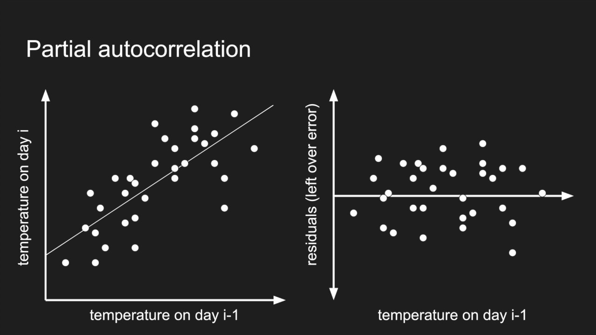
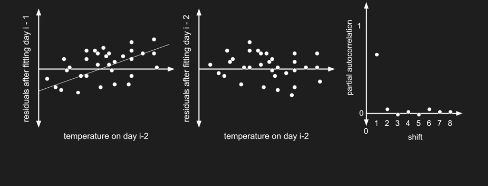

```{r setup, include=FALSE}
knitr::opts_chunk$set(echo = TRUE, cache = TRUE)
```

```{r echo=FALSE}

############################################################
####                                                    ####  
####  NRES 746, Student-led topic #1                    ####
####                                                    ####
############################################################


############################################################
####  Time-series analysis                              ####
############################################################


```


For those wishing to follow along with the R-based demo in class, [click here](TimeSeries.R) for the companion R script for this lecture.

Presenters: V. Alaasam, Z. Bess, A. Tatarko, D. Picklum, D. Salcido      

*November 5, 2018*

```{r, results="hide"}

#########
# Load packages

suppressWarnings(library(forecast))
suppressWarnings(library(tseries))
suppressWarnings(library(dtw))

```

## Intro to the topic
Linear regressions: autocorrelation is a major broken assumption. In time series there is a constant, unbroken frequency of measurement. Time series analysis allows you to make inference about change over time and allows for autocorrelation between datapoints, but not between errors. You can also use time series to forecast likely future values. 

## Lake Tahoe Clarity Data: worked example
We will build our first time series from 50 years (1968-2017) of Secchi disc (water clarity) data taken in the summer and winter in Lake Tahoe. To take these measurements, the Secchi disk is lowered into the water until it is no longer visible, and depth at which it can no longer be seen is recorded. 

```{r}

## Set up the time series

year<-seq(1968, 2017, by=1)
winter<-c(33.4, 36.3, 30.3, 33.5, 26.1, 29.5, 29.7, 28.8, 27.6, 27.8, 26.7, 29.0, 27.7,
          24.9, 27.6, 29.0, 22.0, 27.3, 26.9, 23.2, 23.6, 26.7,
          25.8, 21.6, 22.1, 25.8, 21.8, 22.9, 26.9, 20.0, 23.2, 24.7, 21.5, 23.7, 23.9, 21.6, 25.4, 
          24.5, 23.4, 25.1, 26.0, 24.8, 22.2, 25.9, 26.9, 23.7, 24.1, 21.8, 25.4, 23.3)
summer<-c(28.7, 22.8, 28.5, 26.3, 27.8, 22.9, 25.3, 23.7, 25.8,
          28.3, 25.0, 24.9, 22.8, 29.8, 19.7, 17.4, 22.7, 22.1,
          22.6, 26.1, 28.0, 23.0, 23.0, 22.2, 25.2, 19.9, 23.7, 17.7, 21.1,
          19.1, 18.2, 19.2, 19.5, 22.2, 24.7, 21.1, 22.3, 20.4, 17.5, 19.9, 15.4, 18.0, 
          15.8, 15.7, 19.7, 19.4, 23.4, 22.3, 17.2, 16.3)

tahoedatasummer<-data.frame(year, summer)
tahoedatasummer$season<-2
tahoedatawinter<-data.frame(year, winter)
tahoedatawinter$season<-1

names(tahoedatasummer) <- c("year", "clarity","season")
names(tahoedatawinter) <- c("year", "clarity", "season")
tahoedata<-as.data.frame(rbind(tahoedatasummer, tahoedatawinter))
tahoedata <- tahoedata[order(tahoedata$year,tahoedata$season),] 
rownames(tahoedata) <- c()
head(tahoedata)

```

### Creating time series 
Frequency in the ts() function specifies the number of times that data was collected per year. For monthly time series data, frequency=12. For quarterly data, frequency=4. The start parameter specifies the first year that the data was collected, and the first interval in that year, if applicable (e.g. start=c(1958,2) means the second quarter (or month, depending on frequency) of the year 1958). 
R requires complete data set for time series, so in data sets with missing values, you can impute the missing values. 

```{r, fig.height=5, fig.width=8}

#Create a time searies using the ts() command 
tahoetimeseries <- ts(tahoedata$clarity, frequency=2, start=c(1968,1))
class(tahoetimeseries) #This confirms that the dataset is now a timeseries object

#Create a time series plot
plot.ts(tahoetimeseries, main="Declining Lake Tahoe Clarity Over Time",
        ylab="Depth of H2O Clarity (meters)", xlab="Year", lwd=1)

```

### Decompose data
The decompose() function will separate the time series into the component sources of variation in the measured variable. In this case, we are separating the Secchi disk water clarity into estimated sources of variation due to seasonality, the overall trend, and the "Irregular" component (also called the random component, which is all other remaining variation unnacounted for by the seasonality and trend). To decompose, we have to specify that our model is additive or multiplicative. This time series is additive because the fluctuations are constant in size over time (rather than changing over the course of the time series). 

* In an additive model, Value[t] = Trend[t] + Seasonal[t] + Irregular[t]
* In a multiplicative model, Value[t] = Trend[t] * Seasonal[t] * Irregular[t]

```{r,results="hide"}

# Decompose the time series into trend, seasonal, and random components

tahoetimeseriescomponents <- decompose(tahoetimeseries, type="additive") # specify an additive decomposition 

tahoetimeseriescomponents$trend #portion of variation in H20 Clarity due to the trend
tahoetimeseriescomponents$seasonal #portion of variation in H20 Clarity due to seasonal patterns
tahoetimeseriescomponents$random #portion of variation in H20 Clarity due to random effects
```
```{r, fig.height=6, fig.width=8}
# We can visualize each of the components

plot(tahoetimeseriescomponents)

```

If we want to adjust for seasonality we can subtract the seasonal component from the original time series. Note that this plot matches the 'trend' plot made using the decompose() function. If a multiplicitive model had been specified, we would have used division instead of subtraction. If we want to adjust for seasonality, we can subtract the seasonal component from the original time series.

```{r, fig.width=9, fig.height=4}

par(mfrow=c(1,3))
plot.ts(tahoetimeseries, main="Declining Lake Tahoe \nClarity", xlab="Year", ylab="Clarity (meters)")

seasonallyadjusted <- tahoetimeseries-tahoetimeseriescomponents$seasonal #Remove the seasonal component
plot(seasonallyadjusted, main="Seasonal Component \nRemoved", ylab="Clarity (meters)", xlab="Year")

trend<- seasonallyadjusted-tahoetimeseriescomponents$random #With both seasonal and random components removed, only trend remains.
plot(trend, main="Seasonal and Random \nComponents Removed", xlab="Year", ylab="Clarity (meters)")

```

### Data Smoothing  
The Holt-Winters function "smooths" our data and can be used for forecasting time series with seasonality.
Smoothing is controlled by:
    1) The parameter 'alpha' (0-->1) for the estimate of the level (local average) at a particular time point.
    2) The parameter 'beta' (0-->1) for the estimate of the slope.
    3) The parameter 'gamma' (0-->1) for the estimate of the seasonality.
These parameters will tell you if your estimates are due to newer or older time points in the time series. You can think of this as the "memory" of the model. For example, if alpha is near 0, little weight is placed on the most recent observations when making forecasts of future values, and more weight is placed on the older values. 
```{r}

forecasted <- HoltWinters(tahoetimeseries)
forecasted

```
We can plot our smoothed forecast. By default, this function just uses the range of years that exist in our data. In other words, it doesn't forecast into the future. Thus, it can assess how good the forecast is by comparing with our actual data.
  
```{r, fig.width=8, fig.height=5}

plot(forecasted, xlab="Year")

```

### Forecasting: Into the future
Now, we can make forecasts for future time points by using the "forecast" function in R. This integrates the Holt-Winters smoothing function. The argument "h" specifies how many intervals in the future to forecast.
```{r,fig.width=8,fig.height=5}

future<-forecast(HoltWinters(tahoetimeseries), h=40)
plot(future)

```

This will produce forecasted values for 20 years because we specified h=40 and there are two sampling events per year. The upper and lower 80 and 95% prediction intervals are also produced.
The Holt-Winters model is used for an additive model with increasing or decreasing trends, and can accomodate seasonality.

### Autocorrelation: Corellogram and Box-Ljung test



To see if our model is OK, we can look at the residuals of the model. A Ljung-box test assesses autocorrelation of our residuals over time. Shift=Lag. A Lag is the time difference at which you make a comparison of the measurement at one point in time with a given. The null hypothesis is that data are independently distributed.

To test goodness of fit of our forecast, we can plot a correlogram of our residuals. 
If the residuals of our model are autocorrelated, the model can be improved
(we will get into how to do this later). This is assessing the fit of the model within the time period that has already occurred. 

Residual magnitude = 'observed value' - 'expected value'    

If Lag=1, you are comparing the observation at one time point with the observation at an adjacent time point. If Lag=2, you are comparing the observation at one time point with the observation at two intervals away. 

```{r}

Box.test(future$residuals, lag=20, type="Ljung-Box")

```

This correllogram helps us visualize the autocorrelation of the residuals at each lag time to see if our forecast is good. A high p-value indicates low autocorrelation, so this model works well with our timeseries. In other words, the magnitude of the residuals does not increase or decrease over time.

```{r, fig.height=4.5, fig.width=8}

acf(future$residuals, lag.max=20, na.action = na.pass)

```

### Choosing model parameters: a function for model assessment
Inputs are a) a vector of forecasts and b) the number of lags desired for the correlogram and for the Ljung-Box Test. 
The function will produce:

* The test statistics and p-values for a Shapiro-Wilk Test (testing to see if the errors are normally distributed) and a Ljung-Box Test for autocorrelation
* A histogram of the errors
* A correlogram for the temporal correlation of the errors
*An idealized normal distribution curve with a mean of 0 and a standard deviation equal to the standard deviation of the residuals.

Perform a Shapiro-Wilk test on the residuals to determine normality.
Perform a Ljung-Box test to assess temporal autocorrelation.
```{r}

## A function for building correlograms and testing errors

ErrorDistribution<-function(forecastedvalues, lags){
  errors<-na.omit(forecastedvalues$residuals) 
  par(mfrow=c(1,2))
  hist(errors, main="Distribution of Forecast \nErrors", freq=FALSE, col="royalblue1", 
       xlab="Error Magnitude", ylim=c(0,(dnorm(0, 0, sd(errors))+1))) #Histogram of the residual        distribution
  curve(dnorm(x, 0, sd(errors)), type='l', add=TRUE, lwd=3) #Histogram of residuals should follow this curve.
  legend("topleft", lwd=3, c("Ideal Normal Distribution"), cex=0.5) #Create a legend
  acf(errors, main="Corellogram", lag=lags, na.action=na.pass, ylab="Correlation Coefficient") #Plot the corellogram 
  legend("topright", c("95% Confidence \nIntervals\n"), lty=2, col=4, cex=0.6) 
  shapiro<-shapiro.test(errors) 
  ljung.box<-Box.test(errors, lag=lags, type="Ljung-Box") #Ljung-Box test: tests temporal autocorrelation
  matrix<-matrix(data=c(shapiro$statistic, shapiro$p.value, 
                        ljung.box$statistic, ljung.box$p.value), nrow=2, ncol=2)
  colnames(matrix)<-c("Shapiro-Wilk Test", "Ljung-Box Test")
  rownames(matrix)<-c("Test Statistic", "P-Value") #Makes a matrix of the test results.
  return(matrix)
  
}
```
```{r, fig.width=9}

ErrorDistribution(forecastedvalues=future, lags=20)

```

The output from a Sharpiro-Wilk test tells us that our errors are normally distributed. We can see from the graph on the left that the mean is approximately zero, meaning that the residuals are not positively- or negatively-biased. The Ljung-Box test tells us that the errors are not temporally autocorrelated within the timeframe that has already happened.

Let's try using the first half of our data and "forecasting" the second half of our data. This will allow us to test the acccuracy of our predicting abilities. We can subset the time series using the window() function to look at just a chunk of time. Here, we are looking at the time series for only 1990 onward. Then, we can create a forecast from 1968 to 2009, using it to predict from 2010-2017; 16 intervals. 
```{r, fig.width=8}

# Testing our forecasting ability

plot.ts(window(tahoetimeseries, start=c(1990,1), end=c(2017, 2)), main="Declining Lake Tahoe Clarity Over Time", ylab="Depth of H2O Clarity (meters)", xlab="Year", ylim=c(0, 40), lwd=2)
shortforecast<-data.frame(forecast(HoltWinters(window(tahoetimeseries, start=c(1968, 1), end=c(2009, 2))), h=16)) #Shortened forecast (using 1968-2009 data)
predictionyears<-seq(2010, 2017.5, by=0.5) #Prediction years

#Plot Forecast with 95% prediction intervals 
points(predictionyears, shortforecast$Point.Forecast, type='l', col="red", lwd=2) #Forecast
points(predictionyears, shortforecast$Lo.95, type='l', lty=2, col="red", lwd=1) #lower 95% PI
points(predictionyears, shortforecast$Hi.95, type='l', lty=2, col="red", lwd=1) #Upper 95% PI
legend("topleft", c("Observed Values (2000-2017)","Forecasted Values (2010-2017)", "95% Prediction Intervals"), lwd=c(2,2,1), col=c(1,2,2), lty=c(1,1,2), cex=0.75)

```


## Airpassengers Dataset Example
We will use this dataset to explore different forecasting methods. The AirPassengers data set is a timseries provided by R. Unlike the Tahoe clarity data, this dataset consists of monthly measurements. 

```{r}

AirPassengers
class(AirPassengers) 
```
```{r, fig.width=8}
## plot of Air Passengers between 1948 to 1960

plot.ts(AirPassengers)

```

### Non-Stationarity 
Looking at the raw time series, it appears that the seasonal variance in the number of air passengers increases with time. This means that our time series is non-stationary. We can visualize the non-stationarity in our time series by applying the short forecasting method as we did with the Tahoe data. We will plot a shortened forecast (using 1949-1955 data) and overlay the forecast for the last 4 years (48 months) onto the observed data. As you can see, the additive Holt-Winters forecast does a poor job predicting, and the observed values often exceed the 95% confidence intervals. Also, the Ljung-Box test gives a significant result, telling us that the residuals are autocorrelated. 
```{r, fig.width=8}

## Create a Holt-Winters projection of the last 

forecastAirPassengers<-forecast(HoltWinters(AirPassengers, seasonal="mult", gamma=), h=40)
plot.ts(AirPassengers, main="Air Passenger Data", ylab="# of Airline Passengers",xlab="Year", xlim=c(1950, 1960), ylim=c(100, 555), lwd=2)
shortforecast<-data.frame(forecast(HoltWinters(window(AirPassengers, start=c(1950, 1), end=c(1955, 12))),h=48))
predictionyears<-seq(1956, 1959+(11/12), by=1/12)

points(predictionyears, shortforecast$Point.Forecast, type='l', col="red", lwd=2)
points(predictionyears, shortforecast$Lo.95, type='l', lty=2, col="red", lwd=1)
points(predictionyears, shortforecast$Hi.95, type='l', lty=2, col="red", lwd=1)
legend("topleft", c("Observed Values (Jan,1949-Dec,1960)", "Forecasted Values (Jan,1956-Jan,1960)", "95% Confidence Intervals"), lwd=c(2,2,1), col=c(1,2,2), lty=c(1,1,2), cex=0.75)

##Ljung-Box test for autocorrelation of residuals
Box.test(forecastAirPassengers$residuals, lag=20, type="Ljung-Box")

```
### Choosing forecasting models: Autoregressive Integrated Moving Average (ARIMA)
In addition to using Holt-Winters forecasting methods, we can fit ARIMA models. While Holt-Winters models implemen exponential smoothing and are parameterized by 3 components (level, trend and seasonal), the ARIMA model is an autoregressive model with a moving average and differencing components. In ARIMA models, the forecast variable is dependent on lagged observations. ARIMA forecasting models make the assumption that your data is stationary (ie, the mean and variance is not changing over time). Therefore, we must check this assumption, and transform or difference our time series to meet this assumption, and incorporate this info into the ARIMA model. 

### Autocorrelation and Partial Autocorrelation
Autocorrelation is important to examine and define for the ARIMA model. You can define autocorrelation as 1st order, if data points are correlated with the immediate lag (eg. first shift in time series) and 2nd order if correlated with the first two lags. Patterns and characteristics of autocorrelation are interpreted from the correlogram. Specifically, we can determine if the correlation and its magnitude is due to lags or lagged errors or both. For example, in the correlogram below  we see data is significantly correlated as the correlations at each lag are outside the 95% bounds. Further, it shows us evidence of seasonality with the cyclic behavior. In partial autocorrelation, the residuals of one point in a time series are similar to residuals of other points before or after it in time. A PACF visualizes partial autocorrelation. ARIMA accounts for both autocorrelation and partial autocorrelation. 

{ width=70% }
 
 

```{r, fig.width=8, fig.height=4.5, warning=FALSE}

## Correlogram and Ljung-Box test for the first 48 months (= lag of 4 years)

acf(AirPassengers, lag.max=48, na.action = na.pass,xlab="lag (years)")
pacf(AirPassengers, lag.max=48, na.action = na.pass,xlab="lag (years)")
adf.test(AirPassengers) #Augmented Dickey-Fuller Test
kpss.test(AirPassengers) #Kwiatkowski-Phillips-Schmidt-Shin: null hypothesis: x is level or trend stationary

```

### First: differencing, or de-trend the data
This dataset is VERY non-stationary because the p-value ~0. If you start off with a non-stationary time series, you need to make it stationary. We can see that this timeseries is non-stationary in two ways: 1) The mean changes over time 2) the variance is not constant in size over time. We will address non-stationarity first by differencing our time series, removing the change in mean over time (de-trending!). 

Original Time Series: Value [T1], Value [T2], Value [T3], ...

Time Series Differenced by One Order: Value [T2-T1], Value [T3-T2], Value [T4-T3], ...
```{r, warning=FALSE}

# The diff() command de-trends the timeseries to make it more stationary
# This plot gives: 
# 1. overal shape of data
# 2. ACF (autocorrelation function: represents the correlation between consecutive data points in the time series)
# 3. pACF (partial autocorrelation fuction: partial correlation coefficients between the series and lags of itself) 

dAP<-diff(AirPassengers, differences = 1)
tsdisplay(ts(dAP, freq=1),lag.max= 48, main="First order Difference", xlab="Months")
adf.test(dAP)
kpss.test(dAP)

```

Our time series looks much more stationary after differencing once. We can confirm this using the ndiffs() command, which will return the number of times the time series should be differenced. 

```{r}

ndiffs(AirPassengers)

```

### Next: Log transform the data
The data is now de-trended with a constant mean, but the data is not yet stationary because variance increases with time. We will log transform the data to change this.
```{r, warning=FALSE}

# Use the diff() command on the logged data and create ACF and pACF plots

ldAP<-diff(log(AirPassengers), differences = 1) #use diff function to take first order diffrence of logged time series
tsdisplay(ts(ldAP, freq=1),lag.max= 48, main="First order Difference",xlab="Months")
adf.test(ldAP)
kpss.test(ldAP)

```

```{r,fig.width=9.5, fig.height=6.5}

# Compare differenced and logged time series and correlograms

par(mfrow=c(2,3),mar=c(4, 4, 1, 1) + 0.1)
acf(AirPassengers, lag.max=48, na.action = na.pass, main="Original Time Series",xlab="Lag (years)")
acf(dAP, lag.max=48, na.action = na.pass, main="Differenced Time Series",xlab="Lag (years)")
acf(ldAP, lag.max=48, na.action = na.pass, main="Differenced and Logged Time Series",xlab="Lag (years)")

plot.ts(AirPassengers, xlab="Year")
plot.ts(dAP, xlab="Year", ylab="logged # of Air Passengers")
plot.ts(ldAP, xlab="Year", ylab="Differenced and logged # of Air Passengers")

```

### Finally: Seasonality is still contributing autocorrelation
Lets take care of seasonality. Because cycles are still evident in the differenced and logged time series, we will now account for non-stationarity due to seasonality. The seasonal cycles can be differenced to remove the effect of seasonality by setting lag=12 in the differencing command.
```{r, fig.width=9, fig.height=4.5, warning=FALSE}

sldAP<-diff(ldAP,lag=12, differences= 1) # Take first order difference of seasonal cycle (12mo)
suppressWarnings(tsdisplay(ts(sldAP,freq=1),main="Logged Raw Data \nDifferenced at lags 1 and 12",lag.max=40))
par(mfrow=c(1,2))
acf(sldAP, lag.max=48, na.action = na.pass, main="Differenced Time Series",xlab="Lag (years)")
plot.ts(sldAP, xlab="Year", ylab="log ( # of Air Passengers )")
adf.test(sldAP)
kpss.test(sldAP)

```

## Building ARIMA models and auto.arima() 
The basic structure of an ARIMA model takes into account the differencing and autocorrelation that we found while looking for stationarity in our time series. It includes both autocorrelation values (from our ACF plots) and partial autocorrelation values (from our pACF plots). This makes ARIMA models flexible and adaptable to a variety of kinds of time series. The basic ARIMA model is as follows: 

ARIMA(p,d,q)(P,D,Q)[period]

* p: number of lags for partial ACF to drop below 95% conf int 
* d: order of differencing
* q: number of lags before the ACF drops below the 95% conf int
* P: For the seasonal component, number of lags for partial ACF to drop below 95% conf int
* D: For the seasonal component, order of differencing
* Q: For the seasonal component, number of lags before the ACF drops below the 95% conf int
* Period: this is the number of seasons in a year

eg: ARIMA(2,1,1)(1,0,0)[12] has differencing of order 1, with 2 lags and 1 partial lag. For the seasonal component, (1,0,0), there was no differencing performed, and there was 1 lag and 0 partial lags. [12] stands for the number of period in a year, so there are measurements for each month in this case. The auto.arima() function will optimize these parameters, and will allow us to make forecasts into the future.
```{r}

arima_model <- auto.arima(log(AirPassengers))
summary(arima_model)

forecastAP <- forecast(arima_model, level = c(95), h = 40)
plot(forecastAP)

```

### ErrorDistribution() Function 
Now we can use the ErrorDistribution() function we created to test how well our ARIMA forecast works.
```{r, fig.width=9, fig.height=4.5}

## Test for normality and autocorrelation of residuals

ErrorDistribution(forecastedvalues=forecastAP, lags=20)

```

## Dynamic Time Warping 
Dynamic Time Warping allows you to compare two different time series, even when the two are not aligned. The method stretches and compresses "time" to make one time series resemble the other as much as possible. It then computes the optimal (least cumulative distance) alignment between points of two time series.

```{r}

dat<-seq(0,6.28,len=100)
query<-sin(dat)+runif(100)/10 #create somewhat noisy data

## Create a template or baseline time series to compare our query time series to
template<-cos(dat)
plot(template); lines(query,col="blue")

```

Now we can use the dtw function
Function arguments: 
two time series or vectors of numbers
keep=TRUE preserves the cumulative cost matrix, inputs, and other internal structures
step=rabinerJuangStepPattern step pattern describing the warping steps, can be specialized
type="twoway" overlays the two time series together, type="threeway" includes the alignment; a line with a slope of 1 means the two are well aligned
```{r}

## Find the best match with the canonical recursion formula
alignment<-dtw(query,template,keep=TRUE) #will need the dtw package for this

plot(dtw(query,template,keep=TRUE, step=rabinerJuangStepPattern(6,"c")),type="twoway")
plot(dtw(query,template,keep=TRUE, step=rabinerJuangStepPattern(6,"c")),type="threeway")

```

## Challenge
The Oceanic Niño Index (ONI) describes warm and cold periods, thereby influencing snow accumulation and snowmelt. See if this data aligns well with the Tahoe clarity data. What other factors may explain declining clarity?

You can load the data [here](onidata.csv)       

```{r, eval=FALSE}

#View ONI data
onidat=read.csv("onidata.csv", header=T)
head(onidat)
onits <- ts(onidat$ONI, frequency=2, start=c(1968,1)) #convert to time series
plot.ts(onits, main="ONI Over Time",
        ylab="Oceanic Niño Index (ONI)", xlab="Year", lwd=1)

```

## Useful links

* [Little book of R for Time Series](https://a-little-book-of-r-for-time-series.readthedocs.io/en/latest/) 
* [Autocorrelation video](https://www.youtube.com/watch?v=ZjaBn93YPWo)
* [dynamic time warping](http://dtw.r-forge.r-project.org/)
* [Regression approach to time series](http://node101.psych.cornell.edu/Darlington/series/series0.htm)


