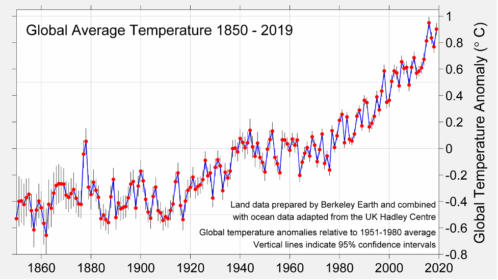
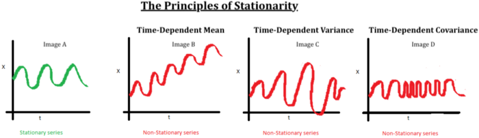
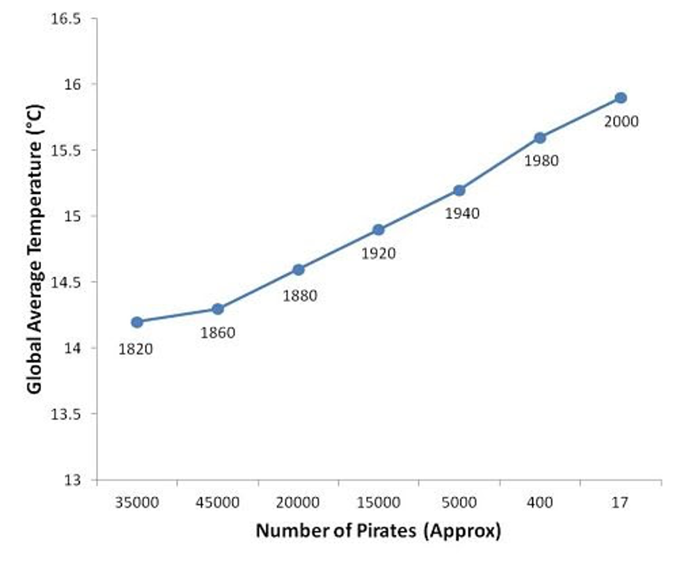
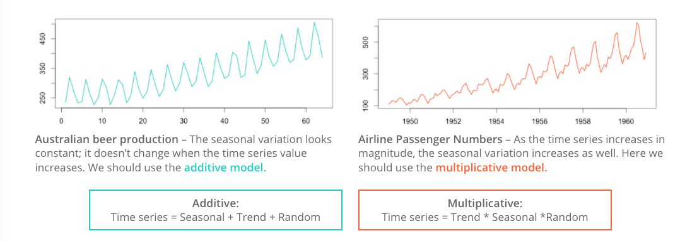
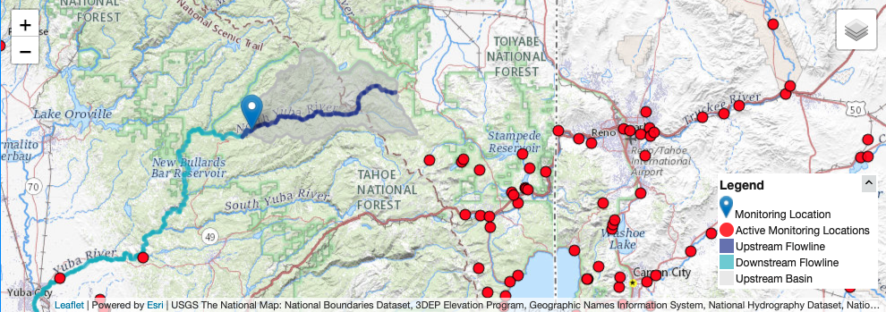

```{r setup, include=FALSE}
knitr::opts_chunk$set(echo = TRUE)
```

## Import Packages

```{r, warning=FALSE, message=FALSE}
library(rnoaa) # package for downloading NOAA, NCDC, and GHCN data
library(forecast) # time series forecasting
library(tseries) # useful functions and tests 
library(tsutils) # more tests
library(tidyverse)
library(lubridate) # date management
library(ggplot2)
library(dataRetrieval) # packaage for downloading USGS stream flow data
library(dplyr) # for data formatting 
library(trend) # for MK test and sen's slope
library(zyp) # y-intercept calc for sen's slope
library(changepoint)
```

# Introduction

#### What is a time series?

A time series is a sequence of repeat measurements that are obtained over time. Analysis of time series data allows us to better understand how things are changing with respect to time, ranging from milliseconds to eons.



#### Why is time series analysis important?

Data collected near to the time that other data is collected is often correlated. We want to look at trends in data or for change points due to treatment or management. It is helpful for developing forecasting models.

#### What do we need to do time series analysis?

(1) A sequence of a minimum of 30 observations (but some say 60 observations)
(2) A sequence that spans enough cycles of the data to model them accurately
(3) A sequence that, if seasonal, contains enough seasons to model them accurately
(4) Data collected from a representative sample of the population


#### Time series terminology

*Discrete* vs. *Continuous*: a time series is discrete if measurements are taken at regularly-spaced intervals  in time, continuous if measurements are taken continuously.

*Stationarity* vs. *Non-Stationarity*: a time series is stationary if the mean and covariance of the data set stays constant over time.


*Lag*: shifting a time series *i* periods back.

*Stochastic Processes*: a process defined by random variables, defined on the same probability space.

*Forecasting*: making predictions about future time series behavior based on a model fit to the historic data.


## Model

Time Series is represented as Y~-1~, Y~0~, [Y~1~, Y~2~, ….., Y~N~], Y~N+1~, ….

The observed time series in [Y~1~, Y~2~, ….., Y~N~]  is the probability sample of the complete time series and is given weights as specified by the statistical model.  

Full Model:

Y~t~ = N(a~t~) + X(I~t~)

Where: 
at  is the t th observation of a strictly exogenous innovation time series with a white noise property:
a~t~ ~ iid Normal(0, σ^2^~a~)
and,
I~t~ is the t^th^ observation of a causal time series, usually in the format of a binary variable of presence or absence of a treatment, or it can be a purely stochastic time series.

Solved for a~t~ with the white noise properties, we will often use the solved model for statistical tests:

a~t~ = N^-1^[Y~t~- X(I~t~)]

## Experiemental Designs

Three main types of time-series experiments:

(1) Descriptive
    + Observation of trends and cycles, interpretation of time series components
    + Precedes hypothesis testing
    + Unable to rule out alternative hypotheses
    + Often uninterpretable in terms of causation
(2) Correlational
    + Infer a causal relationship between two series from their covariance
    + Reliant on strong theoretical foundation, otherwise  invalid
    + Usually limited to small segments of economics and psychology
    
(3) Experimental or Quasi-experimental
    + Interrupted Time Series Designs: tests latent causal effects due temporally discrete intervention or treatment. Divides the time series in the pre and post intervention segments to test hypotheses.

# Getting Started with Time Series Data

## Importing Time Series Data

For this example, we are using temperature and precipitation data from NOAA's GHCN. We use the `rnoaa` package to  download monthly data for the Reno Airport station for 80 years between 1940 and 2020. \

Get an NCEL authentication key from https://www.ncdc.noaa.gov//cdo-web/token.\

"PRCP" = Total Monthly Precipitation. Given in millimeters.\
"EMXP" = Extreme Maximum Precipitation. Given in millimeters.\
"TMIN" = Monthly Minimum Temperature. Average of daily minimum temperature given in Celsius.\
"TMAX" = Monthly Maximum Temperature. Average of daily maximum temperature given in Celsius.\

For more information about the GHCN monthly data set: https://www.ncei.noaa.gov/pub/data/metadata/documents/GSOMReadme.txt

```{r, echo=FALSE}

options(noaakey = "XaunkDfZIPQcaCPDQQoIwnWKAydBmnpb") 

# wrapper function to get data for many years (ncdc() function can only pull 1000 lines at a time)
getGHCN <- function(dataset, stationID, climateVars, startDate, endDate, rmFlag = FALSE) {

  # get number of years in period of interest
  yrs <- time_length(difftime(endDate, startDate), "years")
  
  # split into 1 year chunks for downloading
  if(yrs >= 1){
    dateChunks <- unique(append(seq(from =startDate, to = endDate, by = "1 year"), endDate))
  } else{
    dateChunks <- c(startDate, endDate)
  }
  
  # for each year, download data of interest
  for(i in 1:(length(dateChunks)-1)){
    # print(paste0('start: ', dateChunks[i]))
    # print(paste0('end: ', dateChunks[i+1]))
    start <- dateChunks[i]
    end <- dateChunks[i+1]-days(1)
    
    
    if(i == 1){
      data <- as.data.frame(ncdc(datasetid = dataset, 
                                 datatypeid = climateVars,
                                 stationid = paste0('GHCND:',stationID), 
                                 startdate = start, 
                                 enddate = end, 
                                 limit = 1000)$data)
    } else {
      if(i == length(dateChunks)-1){
      end <- dateChunks[i+1]
      }
      temp <- as.data.frame(ncdc(datasetid = dataset, 
                                 datatypeid = climateVars,
                                 stationid = paste0('GHCND:',stationID), 
                                 startdate = start, 
                                 enddate = end, 
                                 limit = 1000)$data)
      data <- rbind(data, temp)    
    }
    #print(paste('gathering data for', start, 'to', end))
  }
  return(data)
}
```

```{r}
stationID <- 'USW00023185' # Reno airport (1937-03-01 to present)
dataset <- 'GSOM'   # Global Summary of the Month
climateVars <- c('TMIN', 'TMAX', 'PRCP', 'EMXP') # select climate variables to download
startDate <- as.Date('1940-01-01')
endDate <- as.Date('2020-12-31')
GHCN <- getGHCN(dataset, stationID, climateVars, startDate, endDate) # Call to download data using a wrapper function

```

A great first step in time series analysis is to plot all the data to see what we're working with. 

```{r}
ggplot(GHCN, aes(as.Date(date), value, color = datatype)) +
  geom_point() + 
  facet_wrap(~datatype, scales = 'free') +
  scale_x_date(date_breaks = '20 years', date_labels = "%Y") +
  labs(x = "", y = "")

```

## R Time Series Objects

The `ts` object is part of base r but other packages like `zoo` and `xts` provide additional ways to create and manage time series objects. A `ts` object is a very simple, taking a vector or matrix of the time series data values, a start and/or end time for the period of observations, and a frequency which indicates the number of observations per unit time. Let's convert our minimum temperature time series into a `ts` object. 

```{r}
tmin <- GHCN %>% 
  filter(datatype == 'TMIN') %>%  # select only 'TMIN' data from downloaded data frame
  select(value) # select only the data value column, we don't need the stationID, date, or datatype columns

# the ts() function converts to an r time series object
# input data is a vector or matrix of data
tmin.ts <- ts(tmin, frequency = 12, start = c(1940, 1))

head(tmin.ts, n = 60) # look at the first 5 years of data
plot.ts(tmin.ts, ylab = "Min. Temp. (C)") # plot the time series

# explore the time series object and other information it contains
start(tmin.ts)
end(tmin.ts)
frequency(tmin.ts)

```

## Time Series Decomposition

**Decomposition** is a way to parse out the different contributing signals of a time series. Frequently, decomposition is used to remove seasonality, making the long-term trend clearer. Decomposition can also be used to detrend a time series. The random signal in a time series can be used to identify outliers and anomalous data.\

Before detrending, we need to determine if we're working with an additive or multiplicative time series.\

**Additive** time series don't change in magnitude over time. \

**Multiplicative** time series see an increase in seasonal magnitude over time.



Is the Reno Airport minimum temperature time series additive or multiplicative? The `mseastest()` function in the `tsutils` function provides a quick test for seasonality. 

```{r}
plot.ts(tmin.ts, ylab = "Min. Temp. (C)") # plot the time series
tsutils::mseastest(tmin.ts, outplot = 1)
```

Looks like this time series is multiplicative! Let's decompose the plot multiplicatively.

```{r}
tminDecompose <- decompose(tmin.ts, type = "multi")
plot(tminDecompose)

```

The observed plot represents the original observed values for monthly minimum temperature at the Reno Airport.\

The trend plot shows the underlying trend of the data. We can see here a positive trend in the data, suggesting increasing temperatures over the course of the 80 year data period.\

The seasonal plot shows patterns that repeat at a regular interval. In this case, the temperature data shows strong seasonailty with lower values in the winter months and higher values in the summer months.\

The random plot shows the residuals of the time series after the trend and seasonal parts are removed.


## Time Series Adjustments

If the seasonality of the temperature is not of interest, we can simply subtract the seasonality from the original time series to get a seasonally-adjusted time series.

```{r}
tminSeasonAdj <- tmin.ts - tminDecompose$seasonal

plot.ts(tminSeasonAdj, 
        main = "Seasonally-Adjusted Minimum Monthly Temperature",
        ylab = "Min. Temp. (C)")

```


In other cases, such as running a regression on two time series, we might want to remove the trend from a non-stationary time series. To remove the trend from the dataset, we can simply subtract the trend from the original time series.

```{r}
tminTrendAdj <- tmin.ts - tminDecompose$trend

plot.ts(tminTrendAdj, 
        main = "Detrended Minimum Monthly Temperature",
        ylab = "Min. Temp. (C)")

```

## Time Series Forecasting and Forecasting Objects

Another object type in r relevant to time series is the `forecast` object. A `forecast` object contains prediction intervals, fitted values, residuals, information about the method and data used to forecast. There are two types of forecast models. In the first, a function directly produces a `forecast` object. In the second, we first fit a model to the data and only then use a function to forecast from that model.\

Here, we will do a simple forecast using a Seasonal and Trend Decompostion using Loess Forecasting Model (STLF) and the naive method, which uses the most recent values of the time series to project the time series into the future. Other possible methods include ETS, ARIMA, and Random Walk Drift.

```{r}
tminForecast <- forecast::stlf(tmin.ts, method = "naive")

plot(tminForecast, 
        main = "Minimum Monthly Temperature with Forecasting through 2022",
        ylab = "Min. Temp. (C)")
```


# Hydroclimatic Trend Analysis

For this section, we'll work through a trend analysis using USGS streamflow data. We'll start by downloading the data directly into R, formatting the date information, and then calculating hydrologic statistics which will be tested for significant trends. This type of analysis is common in hydrologic and climatologic science.



This gauge was selected because there are no significant diversions or damns in the drainage basin above. Therefore, any trends we may find should be related to changes in the hydroclimatology of the area.

```{r}
# identifying parameters for data download
siteNumber <- "11413000" # USGS gauge number
parameterCd <- "00060"  # mean daily discharge in cfs
startDate <- "1940-10-01" # starting date bc missing few years in the 30's
endDate <- "2021-11-01" # date today
```

We'll use the ```dataRetrevial``` package to download the daily stream gauge data into R. To select a different gauge, simply look up the site number and download. 

```{r}
# download data using readNWISdv function
yuba_raw <- dataRetrieval::readNWISdv(siteNumber, parameterCd, startDate, endDate)
head(yuba_raw) # check
colnames(yuba_raw)[4] <-"discharge_cfs" # rename column 4
yuba_raw <-yuba_raw[,-5] # delete unused col
```

#### Date Formatting

When conducting time series analysis in R, it's important to have your date information formatted so that you find it easy to work with. We will create additional columns using ```lubridate``` for time information to help filter and group the data for further analysis.

```{r}
class(yuba_raw$Date) # check it's actually a data not a character string
yuba_raw$year <-lubridate::year(yuba_raw$Date) # add year col
yuba_raw$month <-lubridate::month(yuba_raw$Date) # add month col
yuba_raw$day <-lubridate::day(yuba_raw$Date) # add day of month col
yuba_raw$doy <-lubridate::yday(yuba_raw$Date) # add day of year col
```

A water year (WY) is a standard time metric for evaluating streamflow and snowpack data in hydrology. It starts on October 1st and ends on September 30th of the following year. The water year is defined by year in which the September 30th date occurs. WY 2022 began on October 1st of last month!

```{r}
yuba_raw <-dataRetrieval::addWaterYear(yuba_raw)
head(yuba_raw) # check
```

Now using ```dplyr``` we'll group by water year, and create a column that is a sequence or count of days begining on October 1st. This will create a metric for day of water year (dowy), account for leap and non-leap years correctly.

```{r}
yuba <- as.data.frame(dplyr::group_by(yuba_raw,waterYear) 
                      %>% mutate(dowy = seq(1:n())))
head(yuba)
tail(yuba)
```

Let's plot the full daily time series using ```ggplot2``` Dr. Shoemaker's favorite plotting package!

```{r}
# set theme for plot, changes background to white
ggplot2::theme_set(theme_light(base_size =11))

# plot
ggplot(yuba, aes(y = discharge_cfs, x = Date))+
  geom_line(size = .3) + # change line width
  labs(title="Yuba near Goodyears Bar,CA Discharge", 
       y="Discharge (cfs)", x="Date")
```

Plotting just WY 2021 with the added extra month, notice the spike from the recent AR event!

```{r}
# filter the date down to the 2021 + 1 month water year and plot
yuba_wy2021 <-dplyr::filter(yuba, Date >= as.Date("2020-10-01") & Date <= as.Date("2021-11-01"))

# plot wy 2021
ggplot(yuba_wy2021, aes(y = discharge_cfs, x = Date))+
  geom_line(size = .7, col = "darkblue") + # change width, set color
  labs(title="Yuba near Goodyears Bar,CA Discharge WY 2021", 
       y="Discharge (cfs)", x="Date")
```


#### Streamflow Metrics

In the Sierra Nevada, the vast majority of the water flows from the mountains during the spring snowmelt season. Water managers and scientists must predict the timing and magnitude of peak streamflow to allocate the resource properly for a range of different purposes, including ecological benefit.

```{r}
# create a dataframe of maximum daily discharge per year
wy_max <-as.data.frame(yuba %>%
  group_by(waterYear) %>%
  filter(discharge_cfs == max(discharge_cfs, na.rm=TRUE)))

head(wy_max)            

# max day of water year
ggplot(wy_max, aes(y = dowy, x = Date)) +
  geom_point(col = "goldenrod")+
  geom_smooth(method = "lm", se = FALSE)+ # add lm trend line
  labs(title="Yuba Max Annual Discharge DOWY", 
       y="Day of Water Year", x="Date")

# max discharge cfs
ggplot(wy_max, aes(y = discharge_cfs, x = Date)) +
  geom_point()+
  geom_smooth(method = "lm", se = FALSE)+ # add lm trend line
  labs(title="Yuba Max Annual Discharge DOWY Discharge", 
       y="Discharge (cfs)", x="Date")
```

A bit tangential, but let's calculate the maximum observed flow for the whole time series.

```{r}
max <-dplyr::filter(yuba, discharge_cfs == max(discharge_cfs, na.rm=TRUE))
print(max)
```

This was a massive rain-on-snow AR event that caused flows much larger than last month! More information [here](https://www.cnrfc.noaa.gov/storm_summaries/jan1997storms.php)

#### Calculating the Onset of Spring Flows

[Stewart et al. (2004)](https://journals.ametsoc.org/view/journals/clim/18/8/jcli3321.1.xml) showed that the onset or time of spring stream flow in the Sierra is changing. Using the newly formatted data with the additional date information, we can to create a function that calculates date of spring flow onset in DOWY. I won't go into detail of how, and am not 100% confident it's correct, but let's assume it is for the purposes of this exercise.

```{r}
melt_onset_dowy <-function(df){
  
  # crop days until until spring and early summer  
  wy_spring <-filter(df, dowy > 100 & dowy < 250) # crop days until until spring and early summer
  mean_spring <-mean(wy_spring$discharge_cfs) # find meann discharge of spring date
  above_mean_days <-wy_spring$dowy[which(wy_spring$discharge_cfs > mean_spring)] # find dates which discharge > mean
  diff_vect <-diff(above_mean_days)
  results <-rle(diff_vect)
  meets <-as.numeric(min(which(results$lengths == max(results$lengths))))
  values_to_cut <-results$lengths[1:(meets-1)]
  #sum the lengths
  index_values_until_start <-as.numeric(sum(values_to_cut))
  #subtract that many values off to get your SDD
  onset_dowy <-as.integer(min(above_mean_days[-c(1:index_values_until_start)]))
  return(onset_dowy)
}
```

Now we can apply this function to each water year and create a dataframe of water year's and date of spring flow onset

```{r}
# create sequence of available years
years <-as.matrix(seq(min(yuba$waterYear),2021,1))

# create an empty matrix to read the data into
loop_mat <-matrix(nrow = length(years))

# filter data to stop at WY 2021
yuba_loop <-dplyr::filter(yuba, Date >= as.Date("1940-10-01") & Date <= as.Date("2021-09-30"))
tail(yuba_loop)

# loop the function for calculating melt onset through all the way years
for (i in 1:length(years)){
  
  yearly_df <-subset(yuba_loop, waterYear == years[i]) # sequence through years to create yearly df
  loop_mat[i] <-melt_onset_dowy(yearly_df) # apply function and sequentially save in empty matrix

}

# bind years vector and new melt onset dates
melt_onset_df <-as.data.frame(cbind(years, loop_mat))
colnames(melt_onset_df)[1] <-"waterYear"
colnames(melt_onset_df)[2] <-"spring_flow_dowy"
tail(melt_onset_df) # check
```


Quick test plot of the spring flow onset metric we just created, with a linear model laid on top.

```{r}
# plot the new data and add a "trend line", just visually
# seems to trend towards early flow onset
ggplot(melt_onset_df, aes(y = spring_flow_dowy, x = waterYear)) +
  geom_point(col = "red")+
  geom_smooth(method = "lm", se = FALSE) + 
  labs(title="Yuba Spring Flow Onset Date", 
       y="Day of Water year", x="Water Year")
```


A few test annual hydrographs to make sure the function is working properly.
```{r}
yuba_wy2021 <-filter(yuba, waterYear == 2021) # subset wy 2021
melt_date <-melt_onset_df$spring_flow_dowy[which(melt_onset_df$waterYear == "2021")]

# for wy2021
ggplot(yuba_wy2021, aes(y = discharge_cfs, x = dowy))+
  geom_line(size = .7, col = "green") + # change width, set color
  geom_vline(xintercept = melt_date, col = "red") + # date calculated
  labs(title="Yuba near Goodyears Bar,CA Discharge WY 2021", 
       y="Discharge (cfs)", x="Date")

# 1970 has the earliest calculated date of 105 or January 15th!
min <-min(melt_onset_df$spring_flow_dowy) 
yuba_wy1970 <-filter(yuba, waterYear == 1970) # low year

# plot to check our function is being reasonable here
# and it is, shows the variability in the hydroclimatic system
ggplot(yuba_wy1970, aes(y = discharge_cfs, x = dowy))+
  geom_line(size = .7, col = "cyan") + # change width, set color
  geom_vline(xintercept = min, col = "red") + # date calculated
  labs(title="Yuba near Goodyears Bar,CA Discharge WY 1970", 
       y="Discharge (cfs)", x="Date")
```


#### Mann-Kendall/Sen's Slope Trend Analysis

We estimated the trend line on the above spring flow timing plot from a linear regression. This statistical test assumes the data a normal distribution, which is rarely the case in hydrology or many earth science fields. We'll turn to the Mann-Kendall (MK) test, which does not require a normal distribution. We'll then estimate the trend's slope using the Thiel-Sen estimator or Sen's Slope.

```{r}
# test the data for normality
hist(melt_onset_df$spring_flow_dowy, breaks = 30)

# but let's use a Shapiro test to check for real
shapiro.test(melt_onset_df$spring_flow_dowy)  
```

P-value is below .05, therefore we reject the null hypothesis of a normal distrubution.

```{r}
# We can turned to the Mann-Kendall trend test, which is non-parametric, not requiring a normal dist
# this only tells us if there is a significant trend, not the estimated slope
mk_results <-trend::mk.test(melt_onset_df$spring_flow_dowy)
print(mk_results) # significant

# for a slope estimate we uses the Sen's slope function
sens_result <-trend::sens.slope(melt_onset_df$spring_flow_dowy)
print(sens_result)
slope_est <-as.numeric(sens_result[[1]]) # slope estimate

# the trend package only gives us slope, not a y-int estimate for plotting
# we'll use the zyp package for that
y_int_results <-zyp::zyp.sen(spring_flow_dowy ~ waterYear, melt_onset_df) # y comes first!!
print(y_int_results) # inspect
y_int <-y_int_results$coefficients[[1]] # pull out y-int estimate for ploting
```

Plot the data with the significant trend

```{r}
# not let's plot the data with our MK estimate trend, instead of lm one from ggplot
ggplot(melt_onset_df, aes(y = spring_flow_dowy, x = waterYear)) +
  geom_point(col = "red")+
  # geom_smooth(method = "lm", se = FALSE) + 
  # use info from our MK and Sen's test to graph the trend line
  geom_abline(intercept = y_int, slope = slope_est, color="blue", size=1.2) +
  labs(title="Yuba Spring Flow Onset Date MK Trend", 
       y="Day of Water year", x="Water Year")

```

We see a significant trend of 2.4 days/decade earlier spring streamflow!

# Second Streamflow Analysis Example

For this section, we'll also work through a trend analysis using USGS streamflow data, using the same procedures as Jack has already shown you. With this dataset I will demonstrate other options for forecasting with an ARIMA model and performing change point detection. 


This gauge was selected because two fires (2011, 2018) have impacted the watershed recently and there could be an opportunity to see changes in the trend or seasonality of the data.

We'll use the same procedures already shown via the ```dataRetrevial``` package to download daily stream gauge data.

```{r, echo=FALSE, results='hide'}
# information from the USGS website
# USGS 10329500 Martin Creek Near Paradise Valley
siteNumber <- "10329500"

# identifying parameters for data download
parameterCd <- "00060"  # mean daily discharge in cfs
startDate <- "1850-10-01" # will just start at first value
endDate <- "2021-10-31" # date today

# download data using readNWISdv function
martin_raw <- dataRetrieval::readNWISdv(siteNumber, parameterCd, startDate, endDate)
head(martin_raw) # check
colnames(martin_raw)[4]<-"discharge_cfs" # rename column 4
martin_raw <-martin_raw[,-5] # delete unused col

# add new columns for data fiyuba_rawering using the lubridate package
martin_raw$year <-year(martin_raw$Date) # year
martin_raw$month <-month(martin_raw$Date) # month
martin_raw$day <-day(martin_raw$Date) # day
martin_raw$doy <-yday(martin_raw$Date)
martin_raw <-dataRetrieval::addWaterYear(martin_raw)
head(martin_raw) # check

## we need to create a column called day of water year or the number of days since oct 1
# since the data doesn't begin on 10/1/1939, lets remove all days before that so it does
# lt_raw <-filter(lt_raw, !(waterYear == "1910")) 
# head(lt_raw) # check

# now using dplyr again, group by water year, and create a sequence or count of days begin on oct 1
# this uses the number of days in a year, so naturally accounts for leap years
martin <- as.data.frame(dplyr::group_by(martin_raw,waterYear) %>% mutate(dowy = seq(1:n())))
head(martin)
tail(martin)
```
First, we will visualize the time series. Conveniently, there are 100 years of data for this gauge.
```{r}
# quick test plot to visualize the time series
plot(martin$Date, martin$discharge_cfs, type = "l",
     main = "Martin Creek Discharge,NV",
     ylab = "Discharge (cfs)",
     xlab = "Date")
```

Next we will convert the average daily cfs recordings to a time series object and take a look at the summary of the data.

```{r}
df_day_ts <- ts(data = martin$discharge_cfs, frequency = 365.25, start = c(1921,10), end= c(2021,10))
summary(df_day_ts)
```
#### Time Series Decomposition
Now we'll proceed with decomposing the data to visualize the trend, seasonality, and residuals.  In order to decompose, we need to select either an additive or multiplicative model. In this case, the data fits an additive model.  If you aren't sure which case your data falls into, you can calculate the sums of squares of the autocorrelation function for the additive decomposition and the multiplicative decomposition of the data to see which model gives you the smallest sum of squares value.  In this case the additive decomposition achieves the smallest sum of squares.  

```{r}
#decompose the data both ways
ddata <- decompose(df_day_ts, type = "additive")
ddatam <- decompose(df_day_ts, type = "multiplicative")
plot(ddata) #additive
plot(ddatam) #multiplicative
#compare which model has smaller sums of squares for the ACF of the residuals
add_info <- sum(acf(ddata$random, lag.max = length(ddata$random), na.action = na.omit)$acf^2)
mult_info <- sum(acf(ddatam$random, lag.max = length(ddatam$random), na.action = na.omit)$acf^2)
add_info
#mult_info
#we will use ddata for the remainder of the demo
```

Let's visualize the decomposed data more closely by looking just at the trend component.
```{r}
#Now we visualize our decomposed data and our trend component
#plot(ddata)
plot(ddata$trend)
abline(reg=lm(ddata$trend~time(ddata$trend)), col="red")
```

We see we might have a positive trend and we might have seasonality to our data (as we would expect). 

#### Testing Time Series Forecasing Assumptions
In order to build time series forecasting models, the data has to meed the assumptions of the model. Forecasting models, whether ARMA (autoregressive moving average) or ARIMA (autoregressive integrated moving average), rely on data that is well-behaved: stationary (no trend), has uniform variance, and is independent, or doesn't exhibit strong temporal autocorrelation.

We can perform several tests to check these assumptions about our data before building a forecasting model.

```{r}
# examine the data for normality
hist(ddata$trend, breaks = 30)

# try autocorrelation function (ACF) (Autoregressive process) and the partial autocorrelation function (PACF) (Moving Average process) to examine the data
acf(df_day_ts,lag.max = length(df_day_ts),
    xlab = "lag #", ylab = 'ACF',main='ACF results in very gradual attenuation')  #possible non-stationarry
pacf(df_day_ts, lag.max = length(df_day_ts), xlab = "lag #", ylab = 'PACF',main='PACF results in rapid dampening') #possible stationary

#Ljung-Box test for independence
#the Ljung-Box test examines whether there is significant evidence for non-zero 
#correlations at given lags. If p-value >0.05, we accept the null hypothesis of independence.
lag.length = 25
options(warn=-1)
Box.test(df_day_ts, lag=lag.length, type="Ljung-Box")
#p-value suggests we should reject the null and assume data is not independent

#Another test we can conduct is the Augmented Dickey–Fuller (ADF) t-statistic 
#test to find if the series has a unit root. Non-stationary data will have a large p-value.
tseries::adf.test(df_day_ts)
#this test suggests that we might have stationary data

#A fourth test we can use to check assumptions is to check for stationarity or trend is the Kwiatkowski-Phillips-Schmidt-Shin (KPSS) test.
tseries::kpss.test(df_day_ts, null="Level") #results in p-value = 0.01, reject null
#this test suggests that our data might not be stationary
```

#### Testing For Differencing Needed to Remove Trend and/or Seasonality
We can use the forecast package to test how many lag differences we may need to do in order for our data to become stationary.

```{r}
forecast::ndiffs(df_day_ts)  # number of differences need to make it stationary
forecast::nsdiffs(df_day_ts) # number for seasonal differencing needed
#if we needed to difference (as some of our tests tell us we might):
stationaryCFS <- diff(df_day_ts, differences=1)
#examine differenced data
plot(stationaryCFS, type="l", main="Differenced and Stationary")  # appears to be stationary
hist(stationaryCFS)
```

And we can verify if our differencing procedure above worked or not.  
```{r}
lag.length = 25
options(warn=-1)
Box.test(stationaryCFS, lag=lag.length, type="Ljung-Box") #still autocorrelated
tseries::adf.test(stationaryCFS) #stationary
tseries::kpss.test(stationaryCFS) #stationary
#Our data might not meet the normality assumption and it is still autocorrelated. We may need to mean-center our data to reduce problems with forecasting and reduce problems due to temporal autocorrelation
```
#### ARIMA Model Development
Now that we are fairly certain our data at least meets the stationary assumption, we will go ahead and fit an ARIMA model using the auto.arima function. We are going to box-cox transform the data to reduce the effects of our non-normal distribution on fitting the model.

```{r}
options(warn=-1)
mymodel <- forecast::auto.arima(stationaryCFS, lambda = "auto", parallel = TRUE, num.cores = 8)
mymodel
```

#### Forecasting using an ARIMA model 
Now we can use the tools in the forecast package to forecast our stream gauge data into the future.

```{r}
#let's try forecasting now that we have an ARIMA model built
fit <- forecast::Arima(df_day_ts, c(3,0,1)) #ARIMA model shows three coefficients for the AR component, 0 seasonal differences, and 1 coefficient for the MA component
plot(forecast::forecast(fit))
```

#### Change Point Detection
Well that is a pretty poor forecast, but what if what we really want to know is if the fires that happened in 2011 and 2018 might have a large enough effect to cause a change in trend or a change in mean run-off, causing an increase in CFS at the gauge.

Let's examine how to detect if change points might exist using the ```changepoint``` package.

```{r}
#we write a function that will help us look for the correct penalty value to set in our change point analysis
cptfn <- function(data, pen) {
  ans <- changepoint::cpt.mean(data, test.stat="Normal", method = "PELT", penalty = "Manual", pen.value = pen) 
  length(cpts(ans)) +1
}
# run our cptfn function expecting there is a signal with a known change point
pen.vals <- seq(0, 12,.2) #set some penalty values to use in the elbow plot
elbowplotData <- unlist(lapply(pen.vals, function(p) 
  cptfn(data = df_day_ts, pen = p))) #apply our function on the data
#and now we plot the penalty parameters as a function of the time series
plot(pen.vals,elbowplotData, 
     xlab = "PELT penalty parameter",
     ylab = " ",
     main = " ")

#look at the graphs, especially the PELT Penalty Parameter to determine
#where the change point might be

penalty.val <- 6 # this value is determined from elbow plots

#next we use cpt.mean and the SegNeigh method with a max number of change points set to 4 to detect change points in the data
options(warn=-1)
cptm_data <- changepoint::cpt.mean(df_day_ts, penalty='Manual',pen.value=penalty.val,method='SegNeigh', Q=4)

cpts_dat <- changepoint::cpts(cptm_data) # change point time points
cpts_dat #gives us the time points
```

We really want to visualize the data.  It is much easier to see the change point means on the decomposed trend data than it is to see it on the original data, so we will perform the above for the decomposed trend data as well and see what differences occur.

```{r}

trend_narm <- na.omit(ddata$trend)  #decomposed trend data without the NA's
options(warn=-1)
cptm_trend <- changepoint::cpt.mean(trend_narm, penalty='Manual',pen.value=penalty.val,method='SegNeigh', Q=4) 
cpts_trnd <- changepoint::cpts(cptm_trend) # change point time points
cpts_trnd #gives us the time points

plot(cptm_data,
     xlab = "Time",
     ylab = "Avg. Daily Discharge (cfs)",
     main = "Change in Mean Signal")

plot(cptm_trend,
     xlab = "Time",
     ylab = "Decomposed Trend of CFS",
     main = "Change in Mean Signal")
```

This concludes the three demonstrations of how to work with time series data. We hope that you now have some ideas on how to tackle time series analysis with your own datasets.  

# Conclusions

1. Time series analysis is a huge topic with a wide array of uses.
2. Time series data can be analyzed using a variety of different packages in R.
3. Much of the time series literature focuses on econometrics and forecasting which is often not relevant to ecologists/hydrologists.
4. Many researchers fail to properly explore the nature of their time series data and subsequently get their papers rejected.
5. We're living in a no-analog, non-stationary time. Previous resource-management methods assumed stationarity and we now have to adapt.


## References and Resources

Coghlan, A. A Little Book of R For Time Series. Release 0.2. Sep 10, 2018. https://a-little-book-of-r-for-time-series.readthedocs.io/en/latest/src/timeseries.html.  Accessed on 11/1/2021.

Hyndman, R.J. and G. Athanasopoulos. Forecasting: Principles and Practice. 2nd Ed. OTexts: Melbourne, Australia. OTexts.com/fpp2. Accessed on 11/1/2021.

McCleary, R., D. McDowall, B.J. Bartos. Design and Analysis of Time Series Experiments. Oxford University Press, New York, NY.  2017. 359 p.

Perry, J.N, R.H. Smith, I.P. Wolwod, and D.R. Morse, Ed.  Chaos in Real Data: the analysis of non-linear dynamics from short ecological time series.  Kluwer Academic Publishers, Dordrecht, Netherlands.  2000.  218 p.

Yaffee, R. and M. McGee.  Introduction to Time Series Analysis and Forecasting with Applications of SAS and SPSS.  Academic Press.  San Diego, CA.  2000.  511 p.

#### Useful Weblinks for Time Series Analysis

https://www.marinedatascience.co/blog/2019/09/28/comparison-of-change-point-detection-methods/

http://r-statistics.co/Time-Series-Analysis-With-R.html

https://www.r-bloggers.com/2017/02/is-my-time-series-additive-or-multiplicative/

https://rcompanion.org/handbook/F_13.html  #Mann-Kendall non-parametric test

http://rpubs.com/richkt/269797 #Stationarity testing

https://otexts.com/fpp2/ # Forecasting Principles and Practice, 2 ed.
