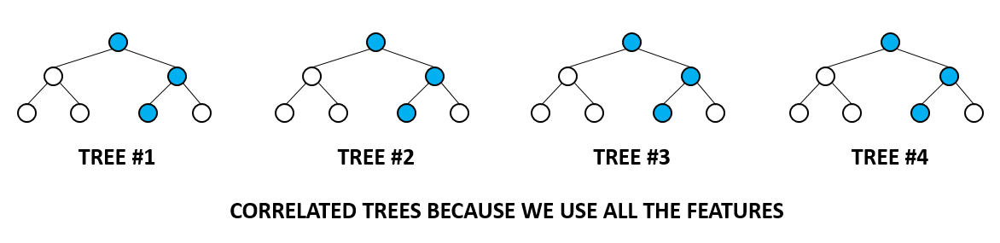

```{r setup, include=FALSE}
knitr::opts_chunk$set(echo = TRUE, cache = TRUE)
```


R code for this demo is available [here](rf2023.R)


# Decision Tree

We are loading the following libraries in order to perform the analysis.
```{r}
library(rpart)          # library to plot a decision tree.
library(randomForest)   # RandomForest library 
library(rfUtilities)    # library to use utility functions on Random forest model to analyse model perfomance and evaluation.
```

Loading the dataset "Iris" from R.
```{r}
data(iris)
head(iris)
```

We are building a decision tree with the Iris


**rpart(formula, data, weights, subset, na.action = na.rpart, method, model = FALSE, x = FALSE, y = TRUE, parms, control, cost, ...)**


- **cp - **is complexity parameter which would be checked for at every node to continue futher growing the tree. It is difference variance.

- **minsplit -** is the parameter controlling the growth by determining no.of observation to be present at each node to proceed with the split.


```{r}
# method is classification for categorical variable species
#control- To control the growth of tree
#  - cp - is complexity parameter which would be checked for at every node to continue futher growing the tree. It is difference variance.
#  - minsplit - is the parameter controlling the growth by determining no.of observation to be present at each node to proceed with the split.

tree <- rpart(Species~.,method = 'class',control = rpart.control(cp=0,minsplit = 1),data = iris)
par(xpd= NA) # setting the plot parameter not to expand(To avoid text being cut out at the corners)
plot(tree)

# adding the text to the tree
# use.n =T to plot the number of obs assosicated with each class at each node.
text(tree,use.n = T) 
```

# Pruned tree:


```{r}
tree <- rpart(Species~.,method = 'class',control = rpart.control(cp=0.05,minsplit = 1),data = iris)
par(xpd= NA)
plot(tree)
# adding the text to the tree
# use.n =T to plot the number of obs assosicated with each class at each node.
text(tree,use.n = T) 
```

# Random Forest Classification

Iris dataset has 150 observations with 5 variables.

1. Species  - factor variable.
2. Sepal.Length.
3. Sepal.Width.
4. Petal.Length.
5. Petal.Width.

**Random Forest:**
The random forest model is an ensemble tree-based learning algorithm; that is, the algorithm averages predictions over many individual trees. The individual trees are built on bootstrap samples rather than on the original sample.This is called bootstrap aggregating or simply bagging, and it reduces overfitting.classification is based on the majority vote of all the members (trees in forest).Many poor learners can collectively be a good learner.



**Boot Strap agreggating or Bagging:**

```{}

for i in 1 to B do
Draw a bootstrap sample of size N from the training data;
  while node size != minimum node size do
  randomly select a subset of m predictor variables from total p;
    for j in 1 to m do
      if jth predictor optimizes splitting criterion then
        split internal node into two child nodes;
        break;
      end
    end
  end
end
return the ensemble tree of all B subtrees generated in the outer for loop;


```


1. **Node Splitting:**
   - During the construction of a decision tree within a Random Forest, the algorithm recursively splits nodes based on certain criteria, such as the Gini impurity or information gain.

2. **Minimum Node Size:**
   - At each node, the algorithm checks whether the number of observations in the node is greater than or equal to a specified minimum node size. If the number of observations falls below this threshold, the node is not split further, and it becomes a terminal node (leaf).

3. **Effect on Tree Complexity:**
   - A smaller minimum node size allows the tree to be more detailed and fit the training data more closely. However, smaller nodes can also lead to overfitting, especially if the tree is capturing noise in the data.

4. **Regularization:**
   - By increasing the minimum node size, you are regularizing the tree. Larger terminal nodes can result in a simpler tree that generalizes better to new, unseen data.


<H3>Now we train a random forest model using Iris data.<H3>

```{r}
set.seed(1234) #setting the intial value for Random number generator
rf <- randomForest(Species ~ .,data = iris,mtry = 4,ntrees = 100,proximity=TRUE,importance= TRUE )
print(rf)
```

# Plotting the Out of Bag(OOB) Error rate 
```{r}
plot(rf) # plotting OOB error rate of all three species based on no.of tree generated by Random Forest
```
In the above Plot:

1. setosa - Red 
2. versicolor - green 
3. virginica - blue

You can see that Setosa has 100% classification accuracy.

# tuneRF: Tune randomForest for the optimal mtry parameter

<H5>We are tuning the rf model by trying different step factor, mtry and ntrees</H5>

**tuneRF(x, y, mtryStart, ntreeTry=50, stepFactor=2, improve=0.05,**
       **trace=TRUE, plot=TRUE, doBest=FALSE, ...)**
       
**Arguments**

- **x -** matrix or data frame of predictor variables.

- **y -**response vector (factor for classification, numeric for regression).

- **mtryStart -** starting value of mtry; default is the same as in randomForest.

- **ntreeTry -** number of trees used at the tuning step.

- **stepFactor -** at each iteration, mtry is inflated (or deflated) by this value. **stepfactor cannot exceed the no.of predictor variables.**

- **improve -** the (relative) improvement in OOB error must be by this much for the search to continue.

- **trace -** whether to print the progress of the search

- **plot -** whether to plot the OOB error as function of mtry 

- **doBest -** whether to run a forest using the optimal mtry found.

  **- If doBest=FALSE (default)**, it returns a matrix whose first column contains the mtry values searched, and the second column the corresponding OOB error.

  **- If doBest=TRUE**, it returns the randomForest object produced with the optimal mtry.

```{r}
set.seed(123)
tuneRF(iris[,c(1:4)],iris$Species,mtryStart = 3,stepFactor = 2,trace = TRUE,plot = TRUE)
```


# rf.crossValidation: Random Forest Classification or Regression Model Cross-validation
Description- Implements a permutation test cross-validation for Random Forests models


Usage

'''rf.crossValidation(x, xdata, ydata = NULL, p = 0.1, n = 99,
  seed = NULL, normalize = FALSE, bootstrap = FALSE, trace = FALSE,...)
'''
<H4>Arguments:</H4>

**x -** random forest object

**xdata -** x data used in model

**ydata -** optional y data used in model, default is to use x$y from model object

**p -** Proportion data withhold (default p=0.10)

**n -** Number of cross validations (default n=99)

**seed -** Sets random seed in R global environment

**normalize -** (FALSE/TRUE) For regression, should rmse, mbe and mae be normalized using (max(y) - min(y))

**bootstrap -** (FALSE/TRUE) Should a bootstrap sampling be applied. If FALSE, an n-th percent withold will be conducted

**trace -** Print iterations


<H3> Interpreting the output:</H4>

<H4> For Classification:</H4>
```{}
cross.validation$cv.users.accuracy  - Class-level users accuracy for the subset cross validation data

cross.validation$cv.producers.accuracy -  Class-level producers accuracy for the subset cross validation data

cross.validation$cv.oob - Global and class-level OOB error for the subset cross validation data

model$model.users.accuracy -  Class-level users accuracy for the model

model$model.producers.accuracy Class-level producers accuracy for the model

model$model.oob  - Global and class-level OOB error for the model

```


<H4> For Regression : </H4>
```{}
fit.var.exp - Percent variance explained from specified fit model

fit.mse - Mean Squared Error from specified fit model

y.rmse - Root Mean Squared Error (observed vs. predicted) from each Bootstrap iteration (cross-validation)

y.mbe - Mean Bias Error from each Bootstrapped model

y.mae - Mean Absolute Error from each Bootstrapped model

D - Test statistic from Kolmogorov-Smirnov distribution Test (y and estimate)

p.val - p-value for Kolmogorov-Smirnov distribution Test (y and estimate)

model.mse - Mean Squared Error from each Bootstrapped model

model.varExp - Percent variance explained from each Bootstrapped model

```


```{r}
# Arguments
# x - random forest object
# xdata - x data used in model
# ydata - optional y data used in model, default is to use x$y from model object
# p - Proportion data withhold (default p=0.10)
# n - Number of cross validations (default n=99)
# seed - Sets random seed in R global environment
# normalize - (FALSE/TRUE) For regression, should rmse, mbe and mae be normalized using (max(y) - min(y))
# bootstrap - (FALSE/TRUE) Should a bootstrap sampling be applied. If FALSE, an n-th percent withold will be conducted
# trace - Print iterations
rf.crossValidation(x= rf, xdata = iris[,c(1:4)],ydata = iris$Species,p = 0.2, n = 99, seed = 123)
```

- A model is trained using k-1 of the folds as training data;

- The resulting model is validated on the remaining part of the data (i.e., it is used as a test set to compute a performance measure such as accuracy).


<H3> For Classification Problems:</H3>

```{r}
print(rf$confusion)
```

1. **Total Observed Accuracy (PCC):**
   - This is the percentage of correctly classified observations out of the total number of observations.
   - The sum of the diagonal of the confusion matrix represents correctly classified observations
   - Formula:$$ \text{PCC} = \frac{\text{Number of Correct Observations}}{\text{Total Number of Observations}} $$

2. **User's Accuracy:**
   - Represents the error of commission(inclusion), i.e., observations erroneously included in a given class i,e False Positive .
   - The commission errors are represented by row sums of the matrix.
   - Formula: $$ \text{User's Accuracy} = \frac{\text{Number of Correct}}{\text{Total Number of Correct and cOmission Errors}} $$

3. **Producer's Accuracy:**
   - Corresponds to the error of omission(exclusion), i.e., observations erroneously excluded from a given class,i,e False Neagitive.
   - The omission errors are represented by column sums of the matrix.
   - Formula: $$ \text{Producer's Accuracy} = \frac{\text{Number of Correct}}{\text{Total Number of Correct and Omission Errors}} $$

4. **Kappa Statistic:**

The Kappa statistic, also known as Cohen's Kappa, is a chance-corrected metric used to assess the level of agreement between the observed and expected classifications in a classification problem. It's particularly useful when dealing with imbalanced datasets or when accuracy alone might be misleading. In the context of cross-validation, Kappa can help account for chance agreement beyond just the observed accuracy.


**Kappa Statistic Calculation:**

1. **Observed Agreement $(O)$:**
   - $(O)$ is the proportion of observed instances that were classified in the same categoryi,e Correctly classified.
   - $$ O = \frac{\text{Sum of Diagonal Elements in Confusion Matrix}}{\text{Total Number of Observations}} $$

2. **Expected Agreement $(E)$:**
   - $(E)$ is the proportion of instances that would be expected to be classified in the same category by chance.
   - $$E = \frac{\text{Sum of Row Totals} \times \text{Sum of Column Totals}}{\text{(Total Number of Observations)}^2} $$

3. **Kappa Statistic ($(\kappa)$):**
   - The Kappa statistic is then calculated using the formula:
   - $$\kappa = \frac{O - E}{1 - E} $$
   - $(\kappa)$ ranges from -1 to 1, where 1 indicates perfect agreement, 0 indicates agreement equivalent to chance, and negative values indicate agreement worse than chance.


Here's how the Kappa statistic is interpreted:

1. **Perfect Agreement (k = 1):** If ?? equals 1, it indicates perfect agreement between the two raters or classifiers. This means that the observed agreement is exactly what would be expected by chance, and there is no disagreement.

2. **No Agreement Beyond Chance (k = 0):** If ?? equals 0, it suggests that the observed agreement is no better than what would be expected by chance alone. In other words, any agreement observed is purely due to random chance, and there is no systematic agreement.

3. **Agreement Below Chance (k < 0):** It's rare to see a Kappa statistic less than zero, but it can happen. It suggests that there is less agreement than would be expected by chance, indicating a systematic disagreement between raters or classifiers.

4. **Substantial Agreement (0.61 <= k <= 0.80):** Generally, a Kappa value between 0.61 and 0.80 is considered to indicate substantial agreement. This suggests that there is agreement beyond what would be expected by chance, though it may not be perfect.

5. **Moderate Agreement (0.41 <= k <= 0.60):** A Kappa value between 0.41 and 0.60 is considered to indicate moderate agreement. This suggests a moderate level of agreement beyond chance.

6. **Fair Agreement (0.21 <= k <= 0.40):** A Kappa value between 0.21 and 0.40 is considered fair agreement. This suggests agreement beyond what would be expected by chance, but it is still relatively modest.

7. **Slight Agreement (0.00 <= k <= 0.20):** A Kappa value between 0.00 and 0.20 is considered slight agreement. This suggests minimal agreement beyond chance.


The Kappa statistic in cross-validation helps assess the model's agreement beyond what would be expected by random chance, providing a more robust measure of classification performance, particularly in situations with imbalanced datasets.


<H3>For Regression Problems:</H3>

A Bootstrap is constructed and the subset models MSE and percent variance explained is reported. Additionally, the RMSE between the withheld response variable (y) and the predicted subset model


1. **Bootstrap:**
   - A resampling technique where subsets of the dataset are sampled with replacement to estimate the variability of a statistic.

2. **MSE (Mean Squared Error):**
   - A measure of the average squared difference between predicted and actual values.
   - Formula: $$ \text{MSE} = \frac{1}{n} \sum_{i=1}^{n} (y_i - \hat{y}_i)^2$$
   - Where $(n)$ is the number of observations, $(y_i)$ is the actual response, and $(\hat{y}_i)$ is the predicted response.

3. **Percent Variance Explained:**
   - Indicates the proportion of the variance in the dependent variable that is predictable from the independent variable(s).

4. **RMSE (Root Mean Squared Error):**
   - The square root of the MSE, providing an average measure of the prediction error.
   - Formula: $$\text{RMSE} = \sqrt{\text{MSE}}$$

# Variable Importance values

<H3>importance(x, type=NULL, class=NULL, scale=TRUE, ...)</H3>

<H4>Arguments</H4>
- **x -** an object of class randomForest
- **type -** either 1 or 2, specifying the type of importance measure (1=mean decrease in accuracy, 2=mean decrease in node impurity).
- **class -** for classification problem, which class-specific measure to return.
- **scale -** For permutation based measures, should the measures be divided their ``standard errors''?
```{r}
importance(rf)
```
<H4>Interpreting the output</H4>

- **MeanDecreaseAccuracy **The first measure is computed from permuting OOB data: For each tree, the prediction error on the out-of-bag portion of the data is recorded (error rate for classification, MSE for regression). Then the same is done after permuting each predictor variable. The difference between the two are then averaged over all trees, and normalized by the standard deviation of the differences. If the standard deviation of the differences is equal to 0 for a variable, the division is not done (but the average is almost always equal to 0 in that case).

- **MeanDecreaseGini - **The second measure is the total decrease in node impurities from splitting on the variable, averaged over all trees. For classification, the node impurity is measured by the Gini index. For regression, it is measured by residual sum of squares.


# Variables Used

<H5>We print the frequency of predictor variables used in the trees.</H5>

<H3>varUsed(x, by.tree=FALSE, count=TRUE)</H3>

<H4>Arguments:</H4>

**x -** An object of class randomForest.
**by.tree	-** Should the list of variables used be broken down by trees in the forest?
**count -** Should the frequencies that variables appear in trees be returned?
```{r}
names(iris)
varUsed(rf, by.tree=FALSE, count=TRUE)

```

# Variable Importance Plot 
```{r}
varImpPlot(rf)
```


# Random Forest probability scaled partial dependency plots (rf.partial.prob)
Produces partial dependency plots with probability distribution based on scaled margin distances.

```{}
rf.partial.prob(x, pred.data, xname, which.class, w, prob = TRUE,
  plot = TRUE, smooth, conf = TRUE, smooth.parm = NULL,
  pts = FALSE, raw.line = FALSE, rug = FALSE, n.pt, xlab, ylab, main,
  ...)
```

<H4>Arguments:</H4>

**x -** Object of class randomForest

**pred.data -** Training data.frame used for constructing the plot,

**xname -** Name of the variable for calculating partial dependence

**which.class -** The class to focus on

**w -** Weights to be used in averaging (if not supplied, mean is not weighted)

**prob -** Scale distances to probabilities

**plot -** (TRUE/FALSE) Plot results

**smooth -** c(spline, loess) Apply spline.smooth or loess to

**conf -** (TRUE/FALSE) Should confidence intervals be calculated for smoothing

**smooth.parm -** An appropriate smoothing parameter passed to loess or smooth.spline

**pts**FALSE/TRUE) Add raw points

**raw.line -** (FALSE/TRUE) Plot raw line (non-smoothed)

**rug -** Draw hash marks on plot representing deciles of x

**n.pt -** Number of points on the grid for evaluating partial dependence.

**xlab -** x-axis plot label

**ylab -** y-axis plot label

**main -** Plot label for main


```{r}
rf.partial.prob(rf, pred.data = iris, xname = 'Petal.Width',which.class = 'setosa', smooth = 'spline' )
```


