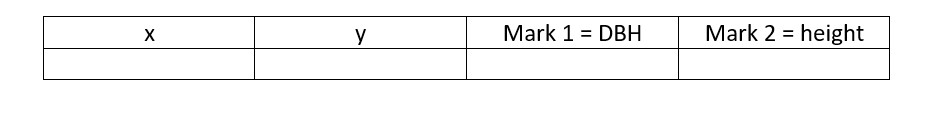
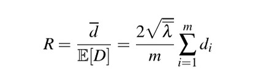
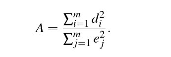
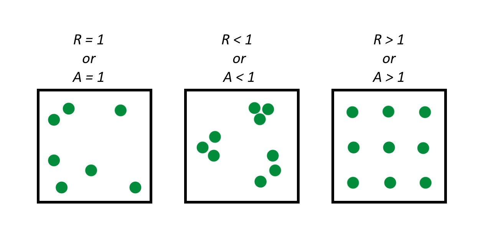
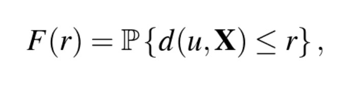
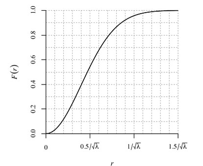
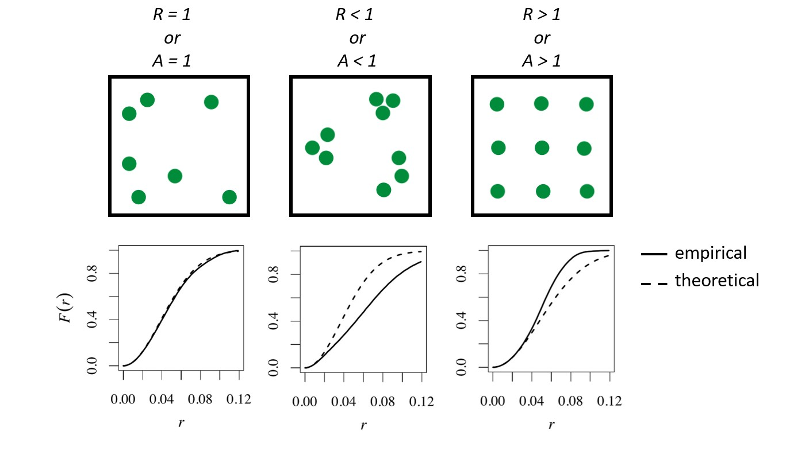

```{r setup, include=FALSE}
knitr::opts_chunk$set(echo = TRUE, cache = TRUE)
```

```{r message=FALSE, warning=FALSE}
# load packages
library(spatstat)
library(tidyverse)
library(raster)
library(rgdal)
library(RColorBrewer) 
library(sp)
library(sf)
library(maptools)
```


Here is the download link for the R script for this lecture: [Spatial point process models](sppm.R)


# Introduction—Spatial Point Process Models

## What is a spatial point pattern?

A spatial point *pattern* is a dataset giving the observed spatial locations of things or events (for example the location of trees in a forest)
    Point patterns can be: random, uniform, clustered (we will expand on this idea below)
    
And a spatial point process *model* focuses on the how these spatial points are arranged in relation to one another

## Example research application

A researcher might be interested in identifying spatial trends in the density of points, in which the spatial arrangement of points is often a surrogate for unobserved spatial variables (e.g., soil fertility) or unrecorded historical events such as (e.g., major disturbance events or geological mineralization history).

## Data format: What form does spatial point data take?

A point pattern dataset contains the spatial coordinates of the points, the marks attached to the points (if any), the window in which the points were observed, and the name of the unit of length for the spatial coordinates.

Auxiliary information attached to each point in the in the point pattern is called a mark and we speak of a marked point pattern
Marks contain the information about a specific point that we might be interested –these are our possible response variables.

Covariates on the other hand are any data we treat as explanatory for example using a dem to show elevation at each point

## Example Dataset

Trees within a forested hectare


**Example Window Size: 10m x 10m**

```{r}
#load demo dataset from sppm package
sppm <- finpines
plot(unmark(sppm), cols = '#756bb1', main = 'spatial point pattern', border = 'red', pch=19)
plot(sppm, cols = '#756bb1', main = 'spatial point pattern with marks', border = 'red')
```

**Possible covariates**

```{r message=FALSE, warning=FALSE}
#load covariate data
  
  #rainfall
  rainfall.raster <- raster("monthly_rainfall.tif")
  col.rain <- colorRampPalette(rev(brewer.pal(5, 'Spectral')))
 
  #dem
  dem <- raster("SJER2013_DSM.tif")
  
  # plot example covariates
  par(mfrow = c(1,2))
  plot(rainfall.raster, main = "Average monthly rainfall (mm)", col = col.rain(255), labels = F)
  plot(dem, main = "Elevation", col = terrain.colors(100), labels = F)
  
```

### How do we analyze spatial point process data?? There's an R package for that!

# Introducing spatstat

**What is spatstat?**

spatstat is an R package for spatial statistics with a major focus on analyzing point patterns. Most of the functionality is for two-dimensional spatial point patterns but there is some support for three-dimensional and space-time. The "spatstat" package is one of the largest contributed packages avialable for R. It is the result of 15 years of development with about 1500 functions and 43 datasets. 

**What kinds of data can spatstat handle?**

spatstat can handle all the major kinds of spatial data: point patterns, regional data, and geostatstical data. The main historical focus of the spatstat package is spatial point patterns in two-dimensional space. The point patterns can be marked by real numbers, categorical values, and logical values. spatstat can also handle spatial regions, pixel images, line segments, and tessellations in two-dimensional space. 

The package supports point pattern datasets in any number of dimensions but only has modest capability with three-dimensional point pattern datasets. This area is under development but the vast majority of functions will still focus on spatial point patterns in two-dimensional space.

**What kind of analysis can spatstat perform?**

spatstat is designed to support a complete statistical analysis of a spatial point pattern dataset. It contains functions for data handing, exploratory data analysis, model-fitting, simulation, spatial sampling, model diagnostics, and formal inference.

## Data handling format

To use spatstat, a spatial point pattern dataset must converts points to an object of class "ppp"(planar point pattern). A point pattern object contains the spatial coordinates of the points, marks attached to the points(if any), the observation window of the points, and the name of the unit of length for the spatial coordinates.


**Example of ppp conversion with finpines dataset in spatstat**

The dataset finpines is a marked point pattern containing the locations of 126 pine saplings in Finland marked by their heights and their diameters.Sapling locations are given in meters; heights are in meters; diameters are in centimeters.

(Dr.Antti Penttinen, Department of Statistics, University of Finland.)

```{r}
fp <- read.table("finpines.txt", header=TRUE)
head(fp)
fin_pines <- as.ppp(fp, owin(c(-5,5), c(-8,2)))
fin_pines
```

# Exploratory Data Analysis

## Summary Statistics -- intensity, correlation & spacing

**Intensity**
Intensity’ is the average density of points (expected number of points per unit area). Intensity
may be constant (‘uniform’) or may vary from location to location (‘non-uniform’ or ‘inhomogeneous’).

If the point process X is homogeneous, then for any sub-region B of two-dimensional space, the
expected number of points in B is proportional to the area of B:
E[N(X ∩ B)] = λ area(B)

 If we know that a point process is homogeneous, then the empirical density of points,
λ =n(x)/area(W)

An example with data:
```{r}
data(bei)
summary(bei)

lamb <- summary(bei)$intensity
lamb
```

*Inhomogenous Intestity*
In general the intensity of a point process will vary from place to place. Assume that the
expected number of points falling in a small region of area du around a location u is equal to
λ(u) du. Then λ(u) is the “intensity function” of the process, satisfying
E[n(X∩B)] = Integral(Bλ(u)d)


**Correlation**

The motivation for analyzing point pattern data is to determine whether the points are independent of each other or whether they have interpoint dependence. A standard tool for measuring dependence is correlation, or more generally covariance. Correlation in this situation means measuring dependence between points in a point pattern. 


Correlation is classified as a second moment quantity. The “first moment” of a random variable X is its mean value and the “second moment” is the mean of X^2. The first and second moments of random variables determine variance, standard deviation, covariance, and correlation. To obtain an accurate measurement of correlation it requires estimation of the mean (first moment). In the point process context, it means to have good knowledge of intensity before we can trust the correlation. The correlation is not a characteristic of dependence or causation but a summary index of statistical association.  With this measure, we cannot discriminate between different possible causes of spatial clustering. 

**Ripley K-function**

A popular technique for analizing spatial correlations in point patterns is the Ripley K-function. The Ripley K-function compares a given point distribution with a random distribution. It is testing against the null hypothesis that the points are distributed randomly and independently (CSR). Using the K-function implicitly assumes that the point process has homogeneous intensity.

**Ripley's K for nests of two species of ants**

These data give the spatial locations of nests of two species of ants, Messor wasmanni and Cataglyphis bicolor, recorded by Professor R.D. Harkness at a site in northern Greece, and described in Harkness \& Isham (1983). The harvester ant M. wasmanni collects seeds for food and builds a nest composed mainly of seed husks. C. bicolor is a heat-tolerant desert foraging ant which eats dead insects and other arthropods. Interest focuses on whether there is evidence in the data for intra-species competition between Messor nests (i.e. competition for resources) and for preferential placement of Cataglyphis nests in the vicinity of Messor nests.

Demo as followed by Brooke McInttyre.

```{r}
data("ants")
summary(ants)
```
```{r}
#Create object to hold density function
ants_dens <- density(ants)
summary(ants_dens)


```
```{r}
# Density plot with contour lines and points showing where the nests of the two species of ants are located.
plot.new()
plot(ants_dens, main ="Density of Ant Nests")
contour(ants_dens,add=T)
points(ants, pch=20)
```

This density plot indicates that ant nests are more dense in the bottom right corner of the polygonial boundary. This is the only location with a density this high, which suggests ant nests are only clumped together in this one location. The rest of the plot points look pretty random. We can investigate these patterns further using Ripley *K* functions.

```{r}
#Ripley's K for ants dataset

n <- 100
ants_ripleyK <- envelope(ants,fun=Kest,nsim=n, verbose=FALSE) 

plot(ants_ripleyK)

```

The observed *K(r)* function is within the envelope, which indicates that the ants  follow CSR (complete spatial randomness) at every distance. If the observed *K* value is larger than the expected *K* value for a particular distance means the distribution is more clustered than a random distribution.

```{r}
#Create subsets of data for each ant species
cataglyphis <- subset(ants, marks=="Cataglyphis", drop=T)
messor <- subset(ants, marks=="Messor", drop=T)

##Density plot for Cataglyphis species with points added
plot(density(cataglyphis), main = "Density of C. bicolor ant nests")
points(cataglyphis, pch=20)
```
```{r}
##Density plot for Messor species with points added
plot(density(messor), main = "Density of M. wasmanni ant nests")
points(messor, pch=20)
```

The density plots indicate that there are more ant nests of both species in the lower right hand corner of study site. There are no Cataglyphis ant nests in the upper right side of the plot but several Messor ant nests.
```{r}
#K function plots for each species of ants
#cataglyphis
plot(envelope(cataglyphis,fun=Kest,nsim=n,verbose=F))

```
```{r}
#Messor
plot(envelope(messor,fun=Kest,nsim=n,verbose=F))
```

The *K*- function plots indicate that within and between ant nests follow a CSR pattern at all distances.

**Spacing**

Correlation overlooks some aspects of dependence. To parse out these dependencies we can use measured spacings or shortest distances to reveal additional information about the point pattern.

***Distances can be measured as:***

Pairwise distances - the distance between all distinct pairs of points *xi* and *xj*

Nearest-neighbor distances – the distance from each point , *xi*, to its nearest neighbour


(or instead of nearest nieghbor we may also consider the 2nd, 3rd, etc. nearest neighbors)

Empty space distance – the distance from a fixed reference location (+) in the window to the nearest data point 


**Note:** nearest-neighbor distances and empty-space distances respond in opposite directions—as nnd become larger, esd becomes smaller.

```{r}
# paired distances
pairdist(finpines)[1:3, 1:5]

#nearest neighbor distances 
nndist(finpines)[1:5]

# empty space distanecs 
Z <- distmap(finpines)
plot(Z)
```

#### Indices

**Clark-Evans Index:**

Takes the average nearest neighbor distances from randomly sampled points in a point pattern, and divides this by the expected value for a random process with the same intensity—to obtain an index of spatial regularity.



We can turn this index into a test of spatial randomness where:
*R* = 1 is completely random; *R*<1 suggests clustering; *R* > 1 suggests regularity

We need to account for edge effects or *R* will be positively biased. Because the true nearest neighbor may lie outside of the actual window. 

We can do this by adding a correction argument to our function, here we added Donnelly correction

```{r}
# clark evans test
clarkevans.test(finpines, correction = "donnelly")
```


**Hopkins-Skellam Index:**

Uses both nearest-neighbor distances and the empty spaced distances and goes off the assumption that if pattern is random, then the prob distribution distance for both metrics should be the same (because remember the less clustering, the less large distances empty spaces).



*A* = 1 random; *A* <1 clustering; *A* > 1 consistent with regularity

** less sensitive to edge effects bias and spatial inhomogeneity than Clark-Evans test



Nearest Neighbor and empty space functions as tools to determine randomness

Instead of just looking at the average nearest neighbor distance or average empty space distance for a spatial point pattern, we can look at these distances as a function over distance *r*. 



Which is defined for all distances *r* >= 0, where u is an arbitrary reference location. *F(r)* is a vector of probability, giving for any fixed reference location (*u*) the chance that there will be a point *X* lying within distance *r* from this location.

If completely random, then *F(r)* will follow a poisson distribution—basically this function gives us a theoretical empty-space function for a homogeneous point process with an intensity of λ



### Summary of spacing 

When the empirical function for empty space distances follows the theoretical function closely the data can be interpreted as nearly spatially random. When the empirical function falls below the theoretical function, the empty spaces are larger than would be expected of randomness (clustering). When the empirical function falls above empty spaces are smaller than expected, indicated regularity. 

Here's an example of the *F(r)* function for the finpines dataset:
```{r}
plot(Fest(finpines))
```

Above we can see the blue dashed line, which is the theoretical function for complete randomness and 3 estimates of the function given the data. Our empirical data is below the theoretical curve for a completely random process--indicating the empty-space distances are larger than would be expected of randomness (aka clustering). This is also consistent with both A and R indices being less than 1.

Again, we could plot 'Gest()' to interpret the nearest-neighbor distance distribution function *G* but we will skip that for the sake of time today.

### Estimating the functions for *K*, *F*, and *G* will have important implications and guide our selection of the appropriate point process model.

# Statistical Inference

## Poisson Point Process Models ##

The simplest theoretical point process model is the homogeneous Poisson process. This process satisfies two conditions. First, the number of events in any region A follows a Poisson distribution with mean λ|A|, where λ is a constant value denoting the intensity and |A| is the area of region A. And second, the number of events in disjoint regions are independent. Thus, if a point pattern arises as a realization of a homogeneous Poisson process, an event is equally likely to occur at any location within the study region, regardless of the locations of other events.


The homogeneous Poisson process of intensity λ > 0 has the properties

(PP1): the number N(X ∩ B) of points falling in any region B is a Poisson random variable;

(PP2): the expected number of points falling in B is E[N(X ∩ B)] = λ · area(B);

(PP3): if B1, B2 are disjoint sets then N(X∩B1) and N(X∩B2) are independent random variables;

(PP4): given that N(X ∩ B) = n, the n points are independent and uniformly distributed in B.

You may have heard this as “Complete Spatial Randomness” (CSR) especially in biological
science. Under CSR, points are independent of each other and have the same propensity to be
found at any location.

Homogeneity: The points have no preference for any spatial location

Independence: Information about the outcome in one region of space has no influence on the outcome in other regions

A realistic model of some physical phenomena such as radioactivity, rare events, or extreme events. It serves as a benchmark or standard reference model for which other patterns can be compared. In many models, the Homogeneous Poisson process serves as the null hypothesis. 

Fitting a Poisson point process in spatstat

A simple homogeneous Poisson Point Process
```{r}
summary(bei)
class(bei)
plot(bei)
plot(quadratcount(bei)) # shows a count of all the data in quadrats
fit <- ppm(bei ~ 1)
fit
class(fit)
```

The result of ppm is a fitted point process model, an object belonging to the class "ppm". There are
many facilities for handling such objects. For instance there is a print method print.ppm, which
produced the output above. This output tells us that the fitted intensity was λ = 0.007208 trees
per square meter. 

```{r}
exp(-4.933)
```

Now for something a little more... Interesting
We will explore the covariates in the bei dataset using the separably supplied "bei.extra" object. 
in bei.extra elevation (elev) and terrain slope (grad) are provided as a list. 

Take a look at the data
```{r}
bei.extra
```

Let's run inhomogeneous (non-stationary as labeled in the output) Poisson model with the intensity of the Beilschmiedia tress as a loglinear function of terrain slope

```{r}
fit2 <- ppm(bei ~ grad, data = bei.extra)
fit2

```

The model above defines intensity as λ(u) = exp(β0 +β1S(u). 
Where S(u) is the terrain slope at location u. The component β1S(u) is called the ‘effect’ of the covariate S.

covariates — any data that we treat as explanatory, rather than as part of the ‘response’.

Note that the outpus of "intercept" and "grad" gives us the maximum likelihood estimates of of β0 and β1, respectively, the coefficients of
the linear predictor; so the fitted model is
λ(u) = exp(−5.391+5.022S(u))

These results tell us that the estimated intensity of Beilschmiedia trees on a level surface (slope
S = 0) is about exp(−5.391) = 0.004559 trees per square meter, or 45.59 trees per hectare, and would increase by a factor of exp(5.022) = 151.7 if the slope increased to 1.0. The largest slope
value in the data is about 0.3, at which stage the predicted intensity has risen by a factor of exp(0.3×
5.022) = 4.511, that is, more than quadrupled from its value on a level surface.

In this simple model, the fitted intensity can also be plotted as a function
of a covariate (in the current example, the covariate grad) using the spatstat utility effetfun,
as shown below. 
```{r}
plot(effectfun(fit2, "grad", se.fit = T))
```

NOTE: the formula bei ~ grad corresponds to the loglinear relationship (9.7), that is, it corresponds to assuming intensity is exponentially increasing or decreasing as a function of terrain slope. 

We can also look at the interaction between the covariates of elev and grad by using an additive model.
using the formula: λ(u) = exp(β0 +β1E(u) +β2S(u)), where β0,β1,β2 are parameters to be estimated, E(u) is the terrain elevation in meters at location u, and S(u) is the terrain slope (a dimensionless gradient). Additive models are specified by joining the relevant model terms together using + (just like almost all additive regressions in R).
```{r}
fit3 <- ppm(bei ~ elev + grad, data=bei.extra)
fit3
```
interpretation of this model is relatively straightforward. Both covariates are continuous variables. On an aspect of terrain where slope = 0 and elevation = 0 (sea level), the intensity of trees would be exp(-8.56355220) or 0.0001918 trees per square meter, and for each additional meter of elevation, intensity would increase by 1.022 trees. And say, for each additional 0.1 degree of slope units the intensity increases by a factor of exp(0.1*5.841) = 1.793 trees. 

Since this model was additive, elevation increases by 1 meter and slope by 0.1 units, the log intensity increases by the elevation effect (1 x 0.02141) PLUS the slope effect (0.1 x 5.841). 

To assess the 'importance' of each covariate, we need to take the range of each variable. 
```{r}
coefs <- fit3$coef

grad = bei.extra$grad
max(grad)
imp.grad <- exp(coefs[3]*max(grad))
imp.grad

elev = bei.extra$elev
dif.elev <- max(elev) - min(elev)
min.elev <- min(elev)
imp.elev <- exp(coefs[2]*dif.elev)
imp.elev
```
Slope is "more important" in magnitude. 

########################################################
########## Using fitted models for Prediction ########## 
########################################################

The value returned by the model-fitting function ppm is an object of class ""ppm"" that represents the fitted model. This is analogous to the fitting of linear models (lm), generalized linear
models (glm), and so on. 

AND because of this, we can use of fitted Poisson Point Process Model to make predictions about the points in our given area. 

For any Poisson model with intensity λ(u) = λθ(u) where θ is a parameter vector, the fitted intensity
or predicted intensity is the function λθb(u) obtained by substituting the fitted parameter estimates
into the intensity formula.
```{r}
fit4 <- ppm(bei ~ polynom(grad, elev, 2), data=bei.extra)
lamhat <- predict(fit4)

lamB <- predict(fit4)
plot(lamB)

```
This yields a contour plot of intensity from predict(fit4) and the second plot is standard error. 
```{r}
plot(predict(fit4, se=TRUE)$se)
```


We can also create a perspective view of rain forest terrain shaded according to intensity of fitted model, with original point pattern superimposed.
```{r}
M <- persp(bei.extra$elev, olin=lamhat, colmap=topo.colors,
  shade=0.4, theta=-55, phi=25, expand=6,
  box=FALSE, apron=TRUE, visible=TRUE, main = "Terrain with Intensity of Fitted Model")
perspPoints(bei, Z=bei.extra$elev, M=M, pch=20, cex=0.1)
```
Pretty cool!

Lastly we can predict the number of points in our region B. Using a Poisson process, the expected number of points in B is the integral of the intensity over B
 E[n(X∩B)] = Integral(Bλ(u)d)

```{r}
#this can be computed by using the predict.ppm() and by setting type = "count" and by specifying B as the window. 
#in this way we can compute the expected number of trees at elevations below 130 meters. 
B <- levelset(bei.extra$elev, 130)
predict(fit4, type="count", window=B)
predict(fit4, B, type="count", se=TRUE)

predict(fit, B, type="count", interval="confidence")


#In this case it is also meaningful to compute a prediction interval for the random number of trees in the specified region:
predict(fit, B, type="count", interval="prediction")

```

**In Summary** 

A 95% prediction interval for the number of points in region B is designed so that, if the experiment were repeated, there is a 95% probability that the random value of n(X ∩B) would lie in the interval.

Here we have looked at both homogenous and inhomogenous Poisson Process models in R.

Key takeaways:

Always assess your data and look for randomness and independence between each point.

In the first case, the constant, intensity, is the average density of the points in the Poisson process located in some region of space. The resulting point process is called a homogeneous or stationary Poisson point process.

In the second case, the point process is called an inhomogeneous or nonhomogeneous Poisson point process, and the average density of points depends on the location of the underlying space of the Poisson point process.

But not all data meet the assumptions of Poisson processes... Let’s look at some other potential models!

## Cox and Cluster Models

Until now we have focused on Poisson process models, in which the points are assumed to be independent of each other. Now we will be introducing models that allow dependence between points. Cox and cluster processes are modifications of the Poisson process to incorporate additional random influences. 

In a cluster process, the additional random influence arises from the unseen parent points which give rise to offspring points which are actually observed. Each observed point’s location depends on its parent’s location, and this influence is shared by other offspring of the same parent. The pattern looks clustered. The California redwood trees seedlings dataset could be modeled as a cluster process. In this model, each of the original parent trees gave rise to a cluster of young trees.


```{r}
#Locations of 62 seedlings and saplings of California redwood trees.
plot(redwood)
```

A Cox process is effectively a Poisson process in which the intensity itself is random. The random variation is often attributable to an unobserved spatial covariate. Spatial variation in the random intensity function can cause points to be more abundant in some areas than in others. This phenomenon can make the point pattern look clustered, if there are high peaks in the random intensity. The Beischmidedia data could be modeled as a Cox process. The model postulates that there is an underlying, spatially varying, intensity function which is random because it depends on unobservable external factor as as well as observable covariates. In this case, it could be attributable to habitat preferences (ex: preference for steep slope, acidic soil. There is positive association between trees, because the presense of Beilschmideia tree implies the habitat is favorable there, which then implies that other Beilschmiedia trees are likely to be found nearby.

```{r}
#A point pattern giving the locations of 3605 trees in a tropical rain forest. Accompanied by covariate data giving the elevation (altitude) and slope of elevation in the study region.
plot(bei)
```

Both Cox processes and cluster processes are “clustered” as measured by the K-function. They combine the variability of the Poisson point process with an additional source of variability, so they are overdispersed (the variance of the number of points falling in a region is greater than the mean). They both are modifications of the Poisson process to incorporate random effects, they just reflect slightly different ways of thinking about the underlying random influences.

It is a strategic choice to decide whether to use a fixed effects model (Poisson process) or a random effects model (Cox or cluster process).

Cluster and cox process models are fitted to data in spatstat using the function kppm. 

## Gibbs Models

Another flexible type of model and work well when there is dependency between points in a point pattern.

The K function measures correlation between points, not causal interaction. To draw inferences about the interactions that may give rise to a particular spatial point pattern, a GIBBS MODEL explicitly postulates that interactions occur between points of the process (such as repulsion or attraction of points).

## A note on model validation

Similar to other modeling methods we have seen, you can explore the residuals and QQ plots

## Potential Limitations

An issue with presence-only data is data quality, and there are a number of potential extensions to take into account data of varying quality. For example, typically there is uncertainty in the spatial location of presence points, and locations are often assigned ‘accuracy’ scores to estimate this which can be accounted for in subsequent modelling.
 
## Strengths

A key strength of point process models is that they operate at what is usually the most ecologically relevant of sampling levels – the level of the individual. This means they can (in principle) incorporate processes operating at the level of the individual, such as interactions between individual organisms, or covariates that vary across individuals.

## Conclusion

Analyzing point pattern data is a major focus of study within spatial statistics. Point pattern data appears in a broad range of disciplines. It allows the researcher to be able to describe why an phenomenon is occurring at random locations and/or times.

Examples:
forestry and plant ecology (positions of trees or plants in general),
epidemiology (home locations of infected patients),
zoology (burrows or nests of animals),
geography (positions of human settlements, towns or cities),
seismology (epicenters of earthquakes),
materials science (positions of defects in industrial materials),
astronomy (locations of stars or galaxies),
computational neuroscience (spikes of neurons)

(Baddeley et al. 2006)

The first question of interest is typically whether the data exhibits complete spatial randomness (realization of spatial Poisson process) as opposed to exhibiting either spatial aggregation (clustering) or spatial inhibition (repulsion/regular).

# Resources

Baddeley, A., Gregori, P., Mateu, J., Stoica, R., and Stoyan, D., editors (2006). Case Studies in Spatial Point Pattern Modelling, Lecture Notes in Statistics No. 185. Springer, New York. ISBN 0-387-28311-0.

Baddeley, A., Rubak, E., and Turner, R. (2015). Spatial Point Patterns Methodology and Applications with R. Chapman and Hall/CRC; 1st edition.

https://cran.r-project.org/web/packages/spatstat/spatstat.pdf

http://spatstat.org/

